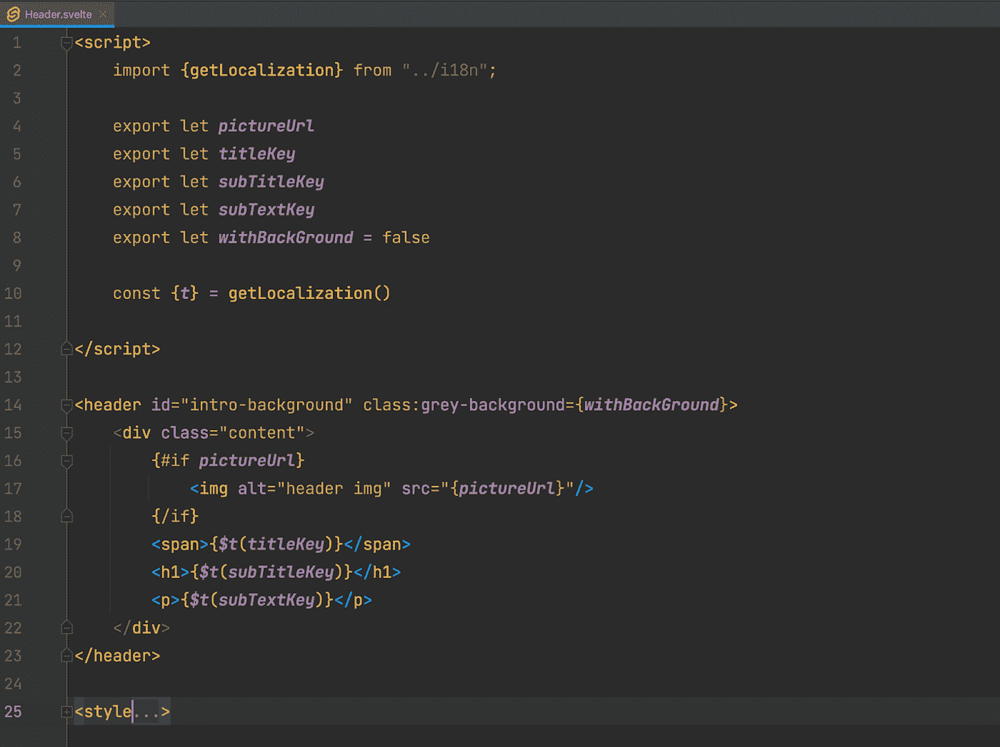
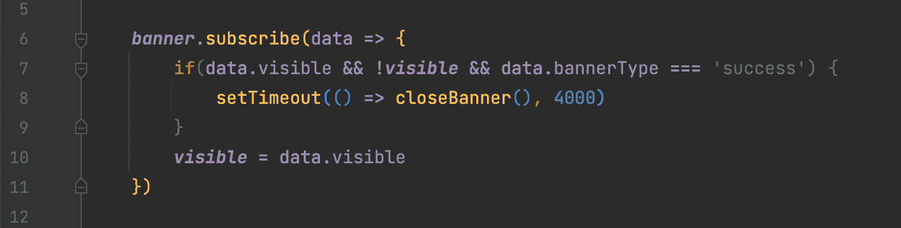

# 苗条:框架的所有优点——没有框架

> 原文：<https://levelup.gitconnected.com/svelte-all-the-nice-things-of-a-framework-without-the-framework-fc910d291067>

## 掌握苗条身材的诀窍；介绍

*作者* [*夏洛特*](mailto:charlotte.huygen@persgroep.net) *，开发者*

**你听说过苗条吗？我也不知道，直到一年前。对它感兴趣吗？继续读！我会告诉你这一切，以及开始苗条时你必须记住的事情。在你完成这篇文章之前，我会让你写得苗条的！好吧，也许不是，但无论如何继续读下去。因为尽管 Svelte 实际上不是一个框架，但它是非常有前途的。**

# 我们是怎么到这里的？

Svelte 第一次经过我的屏幕是我的一个同事说起的时候。他做了一个小应用程序，使用了一个简单的新框架。他给我们看了几行代码，我想:“嗯，我得找个时间看看这个。”。

好吧，苗条在我的清单上。你知道，当你有时间的时候，你会为你想检查的所有东西列一个清单，但是你会忘记它。一年后，我们的团队有机会开发一个新的类似门户的应用程序。由于这是一个闪亮的新工作，整个团队自然非常兴奋。第一个想到的:我们用一个框架吧！！！

老实说，我对任何框架都很满意。但最终，Svelte 从检查清单和待办事项清单中脱颖而出。

# 为什么苗条？

为什么要用 Svelte？嗯，首先，苗条确实是轻量级的。如果你打算做一个小的应用程序，并且不需要像 React 或 Angular 这样的成熟框架，那么 Svelte 是一个不错的选择。Svelte 甚至不是一个框架:它实际上是一个编译器。它将其代码翻译成纯 JavaScript。没有增加额外的代码，使得编译速度更快。快了多少？嗯，据说 Svelte 比其他框架快 30%左右。

同时，Svelte 还提供了你期望从框架中得到的一切:构建块是组件，你可以实现状态，它们有生命周期方法，等等。

**学习曲线:**比 Vue 更容易掌握。是的，真的！组件本身的构建类似于 Vue，在 Vue 中，您基本上只是使用 HTML、JavaScript 和 CSS 的组合来构建您的组件。这对不熟悉框架的人来说很容易。

最后，这个“框架”提供了非常简单的状态管理。我真不敢相信我们开店时完成得这么快。我敢肯定，谈到苗条，还有更多要谈的，但这些只是我想到的头几件事。所以一定要亲自去看看。

# 代码简洁

现在让我们更深入地了解 Svelte 的一些功能，以及我们如何处理它们。

# 纤细的部件

首先是组件。我是框架的忠实粉丝，因为你可以把通用的东西放入一个可重用的组件中，并在你需要的任何地方使用它。我是一个固执的开发人员，试图把你可能再次使用的所有东西都放在一个组件中——正如你应该做的那样！但是我的同事可能会告诉你，这种固执也导致我偶尔浪费一些时间(去你的，表单组件！).

我喜欢 Svelte 的地方在于构建一个组件是多么容易。首先，您只需用。细长伸展和 voilà您已经准备好构建您的组件了。

在图像中，您可以看到我们的头组件。我们的门户将充满标题，所以一个可重用的组件是必要的。我发誓。

总之，一个苗条的组件包含或者可以包含三个不同的 HTML 标签元素。首先，组件中有任何所需 JavaScript 的脚本元素。在这里你可以很容易地声明属性或者调用任何需要的生命周期方法或者…你知道。您想在组件中使用的任何 JavaScript 函数。看到那些导出的变量了吗？通过声明它们，您已经为 Header 组件创建了一个属性。就这么简单。

在 script 标签下，您可以开始声明任何 HTML 元素来开始构建实际的组件。正如您在这里看到的，当我们构建一个标题时，我们使用了一个标题 HTML 标记，并用其他 HTML 元素填充它。瞧，这就是你的组件。或者，更具体地说，这就是您的组件将包含的内容——不需要学习任何其他语法。如果您愿意，也可以通过在组件下插入一个样式标签来实现样式。然后，在内部，您可以像在任何其他样式标签中一样编写您的 CSS。简单吧？没有必要花太多时间去学习如何做，因为你已经掌握了基本的 HTML、JavaScript 和 CSS 技能。

# 状态管理

另一件事是国家管理。如果你问我是什么让我完全迷上了 Vue，那就是这个。安装起来非常容易。与其他框架非常相似，应用程序的状态保存在一个存储中，您可以从任何地方访问它。注意，商店是在一个. js 文件中建立的，而不是在一个. svelte 文件中。

现在 Svelte 的店铺不止一种。有三个:

*   可写存储
*   可读存储器
*   派生存储

在我们的应用程序中，我们只使用了可写存储。可写存储意味着您拥有一个可以从外部组件设置值的存储。它是通过声明一个调用 Svelte 的可写方法的变量来创建的。在这个方法中，您将存储值。这里我们有一个保存状态对象的对象，该对象有三个属性:visible、bannerType 和 bannerText。在可写方法中声明的值是它的默认值。其中的属性也是您能够从组件中读取和设置的属性。

在我们的 store 的 return 对象中，您会发现返回两个 store 方法的两个属性:

show 属性返回 set 方法，hide 属性返回 update 方法。您可以使用 set 方法将存储中的值替换为作为参数传递给 set 方法的值。例如，在上面的代码中，您会看到我们将在调用 show 属性时覆盖 state 对象。

然后是 hide 属性的 update 方法，它将回调函数作为参数。在这个回调函数中，您可以获取一个值的当前状态，并基于该状态的旧值返回一个新状态。

现在，当然，存储的目的是当存储内部发生变化时，您在组件内部使用的状态得到更新，为此，我们有 subscribe 方法。

通过这种方法，您可以订阅某个存储值。在组件中使用这个 subscribe 方法，每当这个值的状态改变时，它就会在组件中自动更新。subscribe 方法返回一个回调函数，该函数将我们从存储中获取的数据作为参数。每当存储中的数据发生变化时，subscribe 函数就会再次被触发。在回调函数中，我们可以对从存储中返回的数据做任何我们想做的事情。

# 重温苗条身材

现在，我可以解释更多关于 Svelte 的内容，以及我们如何在我们的应用程序中使用它，但是你只能在一篇博文中介绍这么多。概括一下:

*   Svelte 是一个轻量级的框架，如果你已经有了一些 HTML、CSS 和 JavaScript 的经验，学习它并不需要太多的努力。
*   对于初学 web 开发的人来说，这是一个完美的框架。
*   想要快速开发一个应用程序，但又拥有实际框架的所有优势吗？苗条才是正道。
*   这家商店的工作方式真是太棒了！

然而，需要记住的是，Svelte 还处于早期阶段。在一些边缘情况下，我们需要更多的努力来实现我们想要的苗条身材。但是，这个框架正在快速普及，并以同样的速度改进。所以，虽然有些事情可能需要一些时间来解决，但不要太快放弃苗条。

也许我已经引起了你们的兴趣，让你们自己去尝试一下。如果是这样的话，一定要查看一下苗条身材的文档或者尝试一下苗条身材:[https://svelte.dev/](https://svelte.dev/)

如果你有任何关于苗条或其他方面的问题，请务必联系我:【charlotte.huygen@persgroep.net