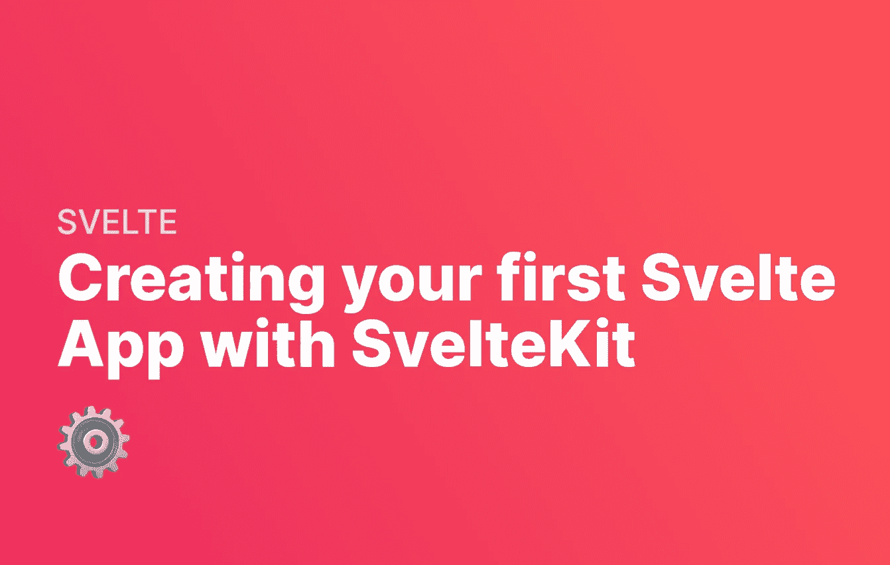
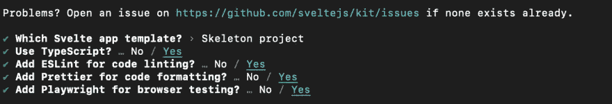
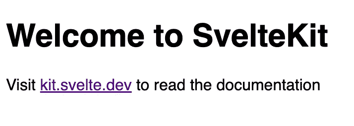

# 用 SvelteKit 创建你的第一个苗条应用

> 原文：<https://levelup.gitconnected.com/svelte-is-a-lightweight-framework-for-building-web-applications-84c9b7642cf9>



Svelte 是用于构建 web 应用程序的轻量级框架。当您使用它时，它看起来和感觉起来很像其他前端框架，如 React 和 Vue，但留下了虚拟 DOM。与其他优化一起，这意味着它在浏览器中做的工作要少得多，优化了用户体验和加载时间。

在本指南中，我们将介绍如何使用 SvelteKit 设置你的第一个应用程序。Svelte 有许多不同的方法来制作应用程序，SvelteKit 是 Svelte 的官方软件包之一。如果你对其他框架感兴趣，你可能会喜欢我们关于[制作你的第一个 Vue 应用](https://fjolt.com/article/vue-create-your-first-app)的类似指南。

# 创建您的第一个苗条的应用程序

首先，打开一个新的终端窗口，使用下面的命令启动你的应用程序。注意如果你没有安装`npm`，你需要安装它。可以通过安装 Node 来安装`npm`。JS，[通过这里的链接](https://nodejs.org/en/download/)。

一旦你有了节点。JS 和 NPM 安装，运行下面的命令。在你这样做之前，确保你使用`cd`移动到你想要创建你的新的苗条应用程序的文件夹。

```
npm init svelte@next my-svelte-app
```

当您运行这个命令时，您将在一个名为 my-svelte-app 的文件夹中自动生成一个 Svelte 模板。Svelte 将引导你通过一些选项。选择您的偏好。下图显示了我选择的一个。出于本指南的目的，我将使用 Skeleton 项目。



最后，运行以下命令，将光盘放入您的 svelte 目录:

```
cd my-svelte-app
```

然后使用下面一行安装所有的依赖项:

```
npm i
```

# 纤细的文件结构

如果你熟悉其他框架，那么 Svelte 会感觉很熟悉。以下是我们刚刚制作的项目的 Svelte 文件结构概述:

```
static                 <-- where we store all of our public assets like favicons, images, and fonts
|- favicon.png         <-- our favicon
tests                  <-- a folder to store our tests
|- test.js             <-- an example test using @playwright
src                    <-- our main Svelte app files
|- routes              <-- a folder to store all of our routes in
|-- index.svelte       <-- our index route file. This will be the file displayed at the route of the site
|- app.d.ts            <-- our core Svelte app file
|- app.html            <-- our main index file where the app will appear
.gitignore             <-- files we wish to ignore for git
.npmrc                 <-- config file for npm
.prettierrc            <-- config file for prettier
.eslintrc.cjs          <-- config file for eslint
package.json           <-- our NPM installed packages
playwright.config.js   <-- config file for playwright
svelte.config.js       <-- config file for svelte itself
tsconfig.json          <-- config file for typescript
```

我们基本的苗条应用程序已经准备好了。如果你想看看它的样子，你可以在你的本地计算机上的 URL[http://localhost:3000](http://localhost:3000/)上运行下面的命令:

```
npm run dev
```

如果您在浏览器中访问 [http://localhost:3000](http://localhost:3000/) ，您应该会看到类似这样的内容:



# 以苗条的方式创建新的页面或路线

要在 Sveltekit 中创建新路线，只需在 routes 文件夹中创建一个新文件。比如你做了一个名为 about.svelte 的文件，那么它就会出现在[**http://localhost:3000/about**](http://localhost:3000/about)。另外一个方法就是新建一个名为 about 的文件夹，把 index.svelte 放在那个文件夹里，[**http://localhost:3000/about**](http://localhost:3000/about)就可以了。

# 你自己试试

在您的/src/routes 文件夹中创建一个名为 about.svelte 的新页面。现在，当您转到 [http://localhost:3000/](http://localhost:3000/) 时，您将能够访问该页面。类似地，您可以尝试创建一个名为 about 的文件夹，并在其中放置一个名为 index.svelte 的文件

# 如何在 Node 上运行你的 SvelteKit 应用程序？射流研究…

在服务器或本地节点上运行您的应用程序。JS 服务器，需要使用适配器。如果您想在节点服务器上运行您的 Svelte 应用程序，请通过下面一行安装@sveltejs/adapter-node@next:

```
npm i @sveltejs/adapter-node@next
```

现在我们必须改变我们的`svelte.config.js`文件。我们需要使用新的适配器，并在配置文件中更改我们的`kit.adapter`对象。您可以用下面的代码替换您的`svelte.config.js`的内容，但是我们只修改了两行——我们的适配器导入，然后在您的配置中添加构建目录:

```
// We have changed the adapter line to use adapter-node@next
import adapter from '@sveltejs/adapter-node@next';
import preprocess from 'svelte-preprocess';/** @type {import('@sveltejs/kit').Config} */
const config = {
    // Consult https://github.com/sveltejs/svelte-preprocess
    // for more information about preprocessors
    preprocess: preprocess(), kit: {
        // We have changed this to point to a build directory
        adapter: adapter({ out: 'build' })
    }
};export default config;
```

# 其他超薄套件适配器

如果你想在 Cloudflare、Netlify 或 Vercel 上运行你的苗条应用，那么你需要使用这些适配器中的一个，你不需要做任何事情。这些都默认包含在 adapter-auto 中——所以如果您不打算使用节点，只需更改 svelte.config.js 文件。JS 服务器。

# 如何为生产构建您的 SvelteKit 应用程序

现在我们已经配置了适配器，让我们构建我们的应用程序。在 SvelteKit 中，很容易让你的应用程序在生产环境中运行。只需运行下面的命令，这将创建一个名为。超薄套件，包含所有生产就绪文件。

```
npm run build
```

现在，如果您想预览您的生产版本，只需运行以下命令:

```
npm run preview
```

**如果您在一个节点上运行应用程序。JS 服务器并更新了您的适配器**，如前一节所示，那么您可以通过在您的 Svelte 目录中运行以下命令来本地运行您的新的 Svelte 应用程序:

```
node build/index.js
```

现在，当您导航到[**http://localhost:3000/**](http://localhost:3000/)时，您的苗条应用程序应该会显示出来，只是这一次它将为生产做好准备。

# 结论

在本指南中，我们已经了解了如何使用 SvelteKit 来创建您的第一个带路线的苗条应用程序。让我们看看我们学到了什么:

1.  如何设置 SvelteKit 并创建您的 Svelte 应用程序的基本结构。
2.  如何在 SvelteKit 中使用路线，这样你的应用程序就可以有多个页面。
3.  如何根据您希望部署应用程序的位置，更新您的配置文件以使用正确的适配器。
4.  如何在节点上本地构建和运行应用程序。JS 服务器。

接下来，您可以尝试使用 Svelte 来开始定制您的应用程序。要了解更多网络内容，别忘了在 Twitter 上关注我。