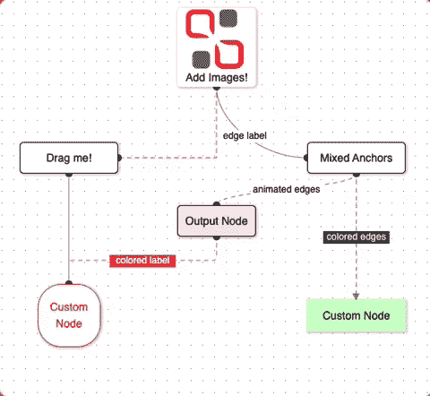
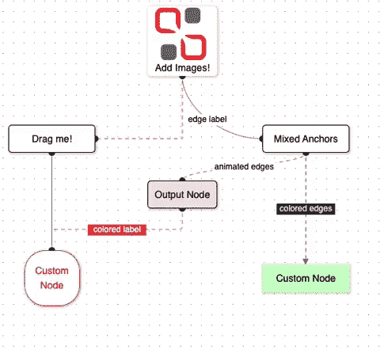
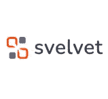

# svelvet 2.0——一个新的用于构建交互式基于节点的图表和用户界面的组件库

> 原文：<https://levelup.gitconnected.com/svelvet-2-0-c6b2059734a6>


Svelte 是一个前端编译器，因为它的易用性和出色的性能而广受欢迎。上个月，Svelvet 1.0 发布，引起了苗条社区的巨大反响。 [Svelvet](http://Svelvet.io) 是一个组件库，它使苗条的开发者能够创建一个交互式的基于节点的 UI。我们很高兴地宣布 Svelvet 2.0 的发布，其中包括许多新功能和修复现有的错误。

**进入 Svelvet 2.0**



Svelvet 是一个开源的 Svelte 组件库，允许开发者创建交互式的基于节点的图表和 UI。这包括渲染自定义节点、边、缩放和平移功能。有了 Svelvet，构思和绘制应用程序功能比以往任何时候都更容易！

**安装**

Svelvet 有 npm 和纱线两种包装。要将 Svelvet 安装到您的应用程序中，您只需输入以下命令之一:

```
npm install svelvet
```

或者

```
yarn add svelvet
```

现在您已经将 Svelvet 安装到了您的 Svelte 应用程序中，您需要将它导入到将要使用它的代码部分中，如下所示:

```
import Svelvet from 'svelvet';
```

**Svelvet 2.0 的新特性**

-边缘的左右锚点
-混合边缘功能(源节点顶部/底部到目标节点左侧/右侧)
-向节点添加图像
-新的边缘类型(步进和平滑步进)
-边缘的定制
-边缘标签的定制
-集成的移动功能
-突出的 GitHub 问题和错误已修复

最新更新的文档( [www.svelvet.io](http://www.svelvet.io) )包括所有更新的信息以及新增的 Svelvet REPL。现在，用户可以直接从 Svelvet 网站制作他们的节点图原型，并从他们的桌面和移动浏览器保存他们的图。

**例子**

Svelvet 组件库由节点和边组成，这些节点和边将根据您在应用程序中分配给它们的值进行渲染。在本例中，我们将使用以下信息渲染节点和边:

一旦您使用刚刚初始化的信息呈现 Svelvet 组件，您将看到下图:



一旦渲染，用户将能够选择和移动节点，放大和平移。

如何投稿 Svelvet 将继续是一项进行中的工作。如果您对该库中构建的功能感兴趣，请随时投稿！

在 GitHub 上查看 Svelvet:[github.com/open-source-labs/Svelvet](https://github.com/open-source-labs/Svelvet)



**最后的想法**

感谢大家的支持，我们将继续增加新功能。如果您喜欢我们的产品，请在 GitHub 上给我们一颗星，并在 LinkedIn 上关注我们的更新。非常感谢您的支持！

在 LinkedIn 上查看 Svelvet:【https://www.linkedin.com/company/Svelvet 

斯维尔维特团队

阿奴夏尔马
领英:[https://www.linkedin.com/in/anu-sharma-6936a686/](https://www.linkedin.com/in/anu-sharma-6936a686/)Github:[https://github.com/anulepau](https://github.com/anulepau)

安德鲁·维德贾亚
领英:[https://www.linkedin.com/in/andrew-widjaja/](https://www.linkedin.com/in/andrew-widjaja/)
Github:[https://github.com/andrew-widjaja](https://github.com/andrew-widjaja)

亚伦·威利特
LinkedIn:【https://www.linkedin.com/in/awillettnyc/】T21Github:[https://github.com/awillettnyc](https://github.com/awillettnyc)

https://www.linkedin.com/in/alexander-z-8b7716b0/
Github:[https://github.com/azambran21](https://github.com/azambran21)

阿里亚当斯
LinkedIn:[https://www.linkedin.com/in/alimadams/](https://www.linkedin.com/in/alimadams/)Github:[https://github.com/AliA12336](https://github.com/AliA12336)

Damian Lim
LinkedIn:[https://www.linkedin.com/in/lim-damian/](https://www.linkedin.com/in/lim-damian/)Github:[https://github.com/limd96](https://github.com/limd96)

Justin Wouters
LinkedIn: [https://www.linkedin.com/in/justinwouters/](https://www.linkedin.com/in/justinwouters/)
Github: [https://github.com/justinwouters](https://github.com/justinwouters)

Von Garcia
LinkedIn: [https://www.linkedin.com/in/](https://www.linkedin.com/in/gerard-von-g-3964bb160/) vongarcia97
Github: [https://github.com/vongarcia97](https://github.com/vongarcia97)

Walter DeVault
LinkedIn: [https://www.linkedin.com/in/walter-devault/](https://www.linkedin.com/in/walter-devault/)
Github: [https://github.com/TensionCoding](https://github.com/TensionCoding)

**文档** [https://www.svelvet.io](https://www.svelvet.io/)