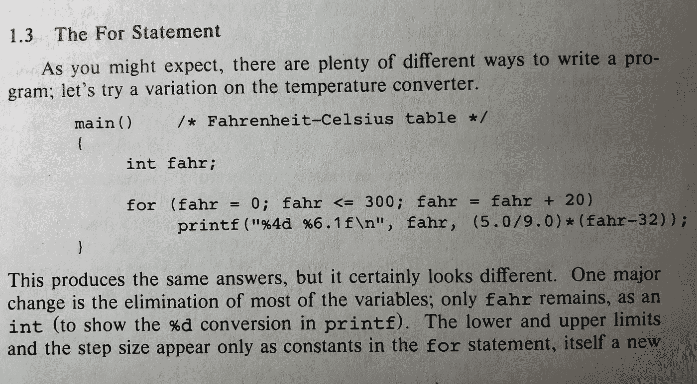
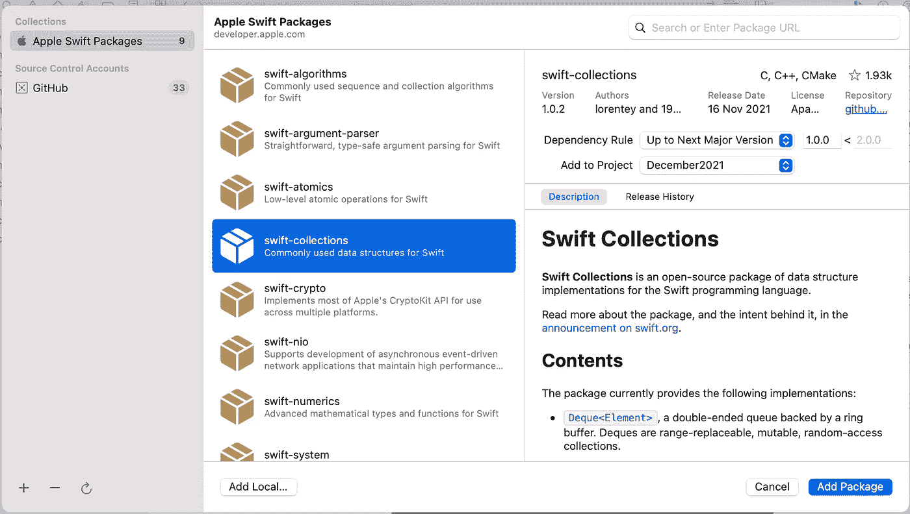
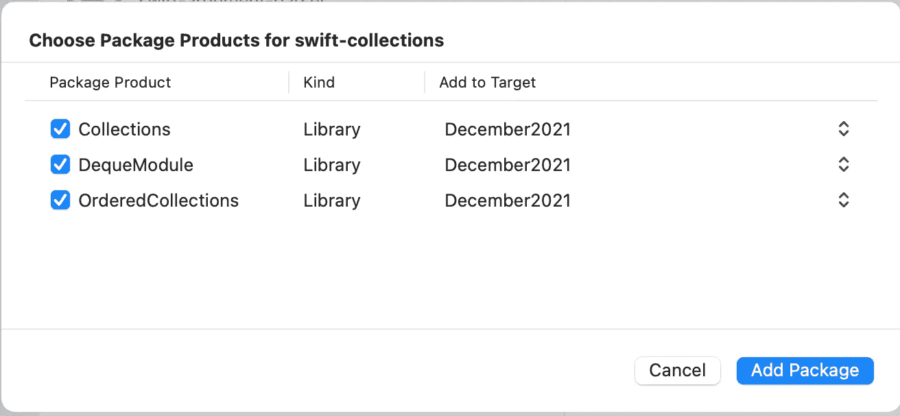

# Swift 系列

> 原文：<https://levelup.gitconnected.com/swift-collections-3ca18e3e8fa7>

## 对数组、Deque 等的实际观察


约书亚·雷德科普在 [Unsplash](https://unsplash.com/s/photos/coding?utm_source=unsplash&utm_medium=referral&utm_content=creditCopyText) 上的照片

当我们来到 2021 年底时，我发现自己在反思这样一个事实，即我从 1982 年 9 月开始学习编码，已经有将近 40 年了。我热爱计算机科学的一个主要原因可能是因为它永远不会静止不动——尽管想到它，我想起了理查德·海明关于领域变化的一句有趣的话。

> 计算机科学家不像物理学家那样站在彼此的肩膀上做出新的发现，他们站在彼此的脚趾上。重新发明新的方法以不同的方式做同样的事情。

可悲的是，这句话至今仍然适用。手头的例子是我在家里得到的一本书的照片，这本书是 K&R 在 1982 年购买的，是关于学习 C 语言编码的。



你看到的是一个循环，一个专家们不断想出新方法来做的编码范例——今天有几十种替代方案，有些似乎直接取自 C，有些不是。

但是我认为随着这个领域在 21 世纪开始成熟，将会有一场巨大的变革。在你能想象到的最令人惊讶的地方之一——苹果——发生了变化。在 WWDC2021 视频“[认识 Swift 算法和集合包](https://developer.apple.com/videos/play/wwdc2021/10256/)”中，您可以看到翻天覆地的变化。

这个视频让我感到惊讶的是，尽管苹果公司的创始人之一沃兹尼亚克非常支持开源，但他的合作伙伴史蒂夫·乔布斯却不赞成。众所周知，SJ 以所有股份结束。然而，这个视频通过开源社区谈论了编程语言 Swift 的开放开发。

## 开放源码

现在，我承认这不是我写的第一篇回避这个话题的文章。我在这里 写过一个类似的 [**。但是这篇文章的不同之处在于，它提倡您编写依赖于更高层次抽象的代码，这些抽象已经被开源社区详尽地尝试和测试过了。更重要的是，他们背后有一家大型商业公司——苹果公司。如果你在为一家大蓝筹股工作，这是一个重要的区别，因为通常开源软件至少会受到大蓝筹股的嘲笑。**](https://betterprogramming.pub/embracing-algorithms-in-your-swiftui-painting-app-652f8b8cd604)

## 更高的抽象

当我学习编码时，我们有一整个系列的讲师在学习排序——不同的排序，插入排序，冒泡排序和快速排序浮现在脑海中。今天，在大多数语言中，你只是使用了一个更高的抽象，排序。

如果你学过计算机科学，你会知道有相当多的其他进程和基本数据结构的更高抽象，我们可以使用，但我们不是在大多数情况下。数据结构中的抽象，如数组、字典和集合。

请和我一起比较一下 WWDC 视频中 13 分钟前提到的一种抽象，即代表双端数组的“Deque”结构。

大多数高级编程语言都有数组。一种通用类型，存储可以通过索引引用的多个值。

但是理解这种数据结构擅长什么，不擅长什么是很重要的。同样重要的是要认识到，随着苹果批准的开源库的出现，你，是的，作为一个专业程序员，你可以使用一个“批准的”开源替代方案，最终可能会更有意义。

数组非常适合于快速存储和访问信息，但是如果您需要开始更改保存在数组中的数据，那么根据数组中项目的位置，修改数据的速度会有很大的不同。以这段代码为例。

如果我运行它。它反复删除我的 50 万个项目数组中的第一个项目，在我的笔记本电脑上花了 16 秒多才完成。而第二个循环中的最后几项需要 0.2 秒。第一个循环花了这么长时间的原因是因为你的标准数组不能有漏洞——每次你删除第一个项，它都需要将所有剩余的值上移一。超级低效的操作。

## Swift 算法和集合包

现在，通过在代码顶部导入集合，将集合包添加到您的项目中[它会抱怨并询问是否应该搜索，说是]。然后，它会找到收藏并显示此窗口，让您确认是否要导入它们。



然后这个窗口…你应该选择所有三个软件包，如图所示。



现在，我将把代码中使用的数组类型改为 Deque 数组，并重新运行相同的测试。您需要注释掉/收取的代码行在两个地方—

```
var items = Deque(1…250_000)`
// var items = Deque(1…250_000)
```

在我的 2014 笔记本电脑上，初始循环的速度快了 60 多倍，结果会有很大不同。

*   从前面移开过去需要 **16 秒**，现在需要 **0.259 秒**。
*   从后面移开花了 **0.2 秒**，现在花了 **0.295 秒**

实践证明，如果你站在开源程序员的肩膀上，利用他们的知识，也许，只是也许你真的可以写出更好的代码。

但是请等一下，因为我还没有说完，因为我想提一下 WWDC 演示中提到的另外两种数据类型。另外两个属于我们下载的有序收藏库。它们并不比它们的同类产品快得多，但提供了所有相同的功能，只是略有不同。

他们提到的第二个是有序集合。顾名思义，设置元素的位置和元素本身一样重要。它们保留了 Swift 中集合的所有功能，并增加了元素顺序的重要性。

最后，他们提到了有序字典。再次如其名所示，尽管我感觉不太直观。使用一个直接的 Swift 类型的字典，你不能保证你的元素的存储顺序与键值相关联。在有序字典中，它们是按顺序保存的。

在这一点上，我将结束这篇文章——尽管我将在不久的将来重新讨论这个主题和苹果的新开源库——和我一起参加 medium.com，以确保你是行动的一部分。