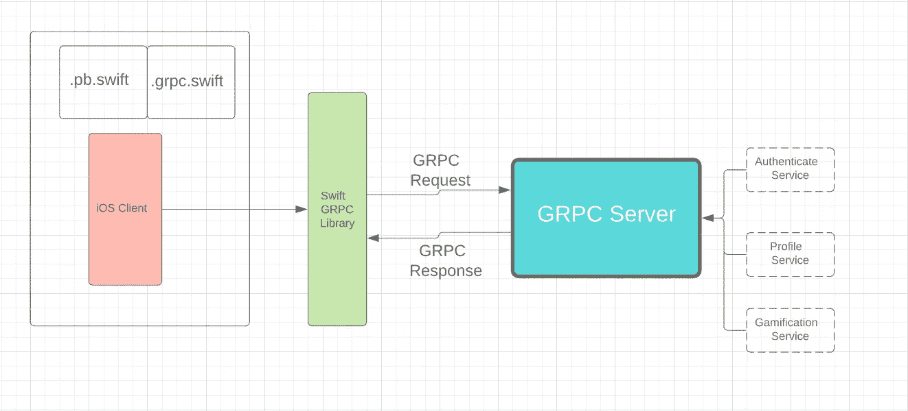
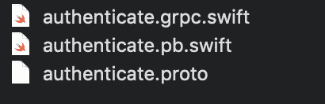

# Swift 和 gRPC 集成指南

> 原文：<https://levelup.gitconnected.com/swift-grpc-577ce1a4d1b7>

## 本文将向您介绍如何将 gRPC 添加到 Swift 项目中，以及如何使用它向您的后端服务发出请求



**gRPC**(**gRPC****远程过程调用**)是 Google 最初开发的开源[远程过程调用](https://en.wikipedia.org/wiki/Remote_procedure_call) (RPC)系统。它使用 [HTTP/2](https://en.wikipedia.org/wiki/HTTP/2) 进行传输，使用[协议缓冲区](https://en.wikipedia.org/wiki/Protocol_Buffers)作为[接口描述语言](https://en.wikipedia.org/wiki/Interface_description_language)。它有助于在[微服务](https://en.wikipedia.org/wiki/Microservices)风格的架构中连接服务，并将移动设备和浏览器客户端连接到后端服务器。它是 HTTP 连接的一种更快、类型更安全的替代方式。

将 gRPC 集成到您的项目中需要两件事情。

1.  您需要一个原型文件(`.proto`)来在 Swift 中创建`.pb`和`.grpc`文件。
2.  将 SwiftGRPC 纳入您的项目，以建立 GRPC 连接。

让我们详细了解这两点:

1.  protofile 是一个通用的定义文件，它包含关于您调用的服务的所有描述、您可以发出的请求(它包含主体中需要包含的所有细节)，以及服务预期的响应模型。

下面是一个示例原型文件(`authenticate.proto`):

```
syntax = “proto3”;option java_package = “authenticate.service”;package authenticate;service authenticate {
 rpc authenticate(AuthenticateRequest) returns (AuthenticateResponse);
}message AuthenticateRequest {
 string username = 4;
 string password = 5;
}message Profile {
 string name = 1;
 string gender = 2;
 string adress = 3;
}message Error {
 int32 code = 1;
 string message = 2;
 string trace = 3;
}message AuthenticateResponse {
 string accesstoken = 2;
 string refreshtoken = 3;
 Profile profile = 4;
 Error error = 7;
}
```

这个原型文件由三部分组成:

1.  SwiftGRPC 客户端将使用的微服务(后端)的详细信息
2.  我们可以发送的请求
3.  我们可以期待从这些请求中得到的回应

一旦有了`.proto`文件，我们需要一个 SwiftGRPC 插件将`.proto`文件转换成`.swift`和`.pb.swift`文件。为了做到这一点，我们需要克隆 [SwiftGRPC 开源项目](https://github.com/grpc/grpc-swift)。按照流程创建插件，并将其放在系统的系统文件夹或`usr/bin`文件夹中，并设置`PATH`，以便它可以用作终端中的任何其他命令。这是最令人困惑的部分，但是请严格按照 GitHub 页面中给出的步骤来完成。

完成后，我们将通过运行以下两个命令来转换我们的`authenticate.proto`文件:

```
protoc --swift_out=. authenticate.proto// 'Running ProtoBuf Compiler to convert .proto schema to Swift'This will create authenticate.pb.swift file . This contains both the request body and response body. 
```

接下来:

```
protoc --swiftgrpc_out=. authenticate.proto
// 'Running ProtoBuf Compiler to convert .proto schema to Swift GRPC'This will create authenticate.grpc.swift . This contains the methods to establish the gRPC connection. We dont need to be worried about this. Its created from the .proto file service details. 
```



这 3 个文件将在文件夹中。

拖放`.grpc`和`.pb.swift`文件，并将它们包含在您的项目中。仔细阅读这些文件，了解它们包含的内容。

2.现在我们需要将 SwiftGRPC 库包含到我们来自 cocoapod 的项目中。像所有其他库一样，将这两个 pod 包含到 podfiles 并运行 pod install。

```
pod 'SwiftGRPC'pod 'SwiftProtobuf'
```

最后，您需要使用 gRPC 进行身份验证调用。因此，创建一个`GRPCServiceManager.swift`文件并添加以下内容:

```
import Foundationimport SwiftGRPCclass GRPCServiceManager: NSObject {var grpc_service : Authenticate_authenticateServiceClient?
public override init()
{
  super.init() 
  preparegRPCService()
}func preparegRPCService() {
  grpc_service Authenticate_authenticateServiceClient(address:'192.168.XYZ.XYZ:8000 , secure: false)
}func authenticate(for username:String , and password:String  onSuccess successCompletionHandler: @escaping (Authenticate_AuthenticateResponse) -> Void ,onFailure  failureCompletionHandler: @escaping (Any) -> Void)     { var requestMessage = Authenticate_AuthenticateRequest()
requestMessage.username = username
requestMessage.password = passworddo {_ = try self.grpc_service?.authenticate(requestMessage, completion: { (response, callresult) inDispatchQueue.main.async {
print (callresult.statusCode)
switch callresult.statusCode {
 case .ok:
   successCompletionHandler(response!)
   print(response)
   break
 case .unauthenticated:
    print("GRPC_UnauthenticateMessage")
    failureCompletionHandler("Sorry!!! Please Try again.")
  break
 default :
   print("GRPC_ServerErrorMessage")
   failureCompletionHandler("Sorry!!! Please Try again.")
  break
   }
  }
 })
} catch {
print("Catch \(error)")
   failureCompletionHandler("Sorry!!! Please Try again.")
  } 
 }
}
```

单击登录按钮，从您的登录页面调用身份验证功能:

```
GRPCServiceManager().authenticate(for: "username@XYZ.com" , and: "password" ,  onSuccess: {[unowned self](response) in {// Do whatever you want to do with the response.
} onFailure: { error in// Show error
})
```

同样，你可以从这个过程中用后端开发团队更新的`.proto`文件创建更多的请求。您不需要创建请求或解析响应。SwiftGRPC 为您做一切！您所需要做的就是为要集成的新服务维护 GRPCManager 类。

我希望这有助于节省一些时间。在以后的文章中，我们将看到对`.proto`文件的高级见解，包括 gRPC 客户端中的证书和设置元数据。

**编码快乐！**


如果有帮助，请少鼓掌


更多高级主题请关注我