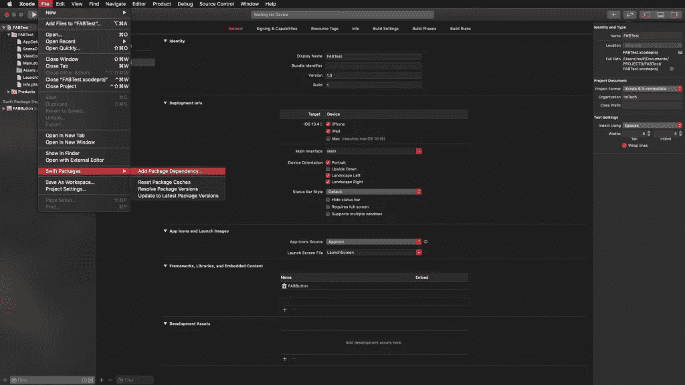

# 使用 Swift 创建 FAB 按钮

> 原文：<https://levelup.gitconnected.com/swift-it-yourself-create-a-fab-button-with-swift-eac0049312f2>

Marcus Dall Col 在 [Unsplash](https://unsplash.com/s/photos/float-flower?utm_source=unsplash&utm_medium=referral&utm_content=creditCopyText) 上的照片

你肯定见过一些应用程序，其中有一个按钮，当按下时，显示一个带有其他按钮的菜单(我们可以称之为*次级*)。主按钮通常称为 **FAB** 或**浮动动作按钮**。在本文中，我们将看到如何用 Swift 创建一个 FAB 按钮，当它被按下时，显示(带有动画)一个菜单。

此外，我们将把这个按钮开发成一个 Swift 包，这样我们就可以共享它，并把它作为一个依赖项包含在不同的应用程序中。我们将通过 *Swift 包管理器*来完成这项工作，正如我们在[上一篇文章](https://www.raulferrergarcia.com/en/how-to-use-swift-package-manager/)中看到的，它是苹果的依赖管理器。

> *这篇文章的代码可以在*[*GitHub*](https://github.com/raulferrerdev/FABButton)*上找到。请记住，与这里描述的相比，存储库代码可能会有一些修改，因为可以添加新功能，可以改进其他功能，可以纠正小错误。*

# 快速创建包

首先，我们创建 Swift 包。为此，从 Xcode 菜单中，我们沿着 *New > Swift Package* 路径，并将其命名为 *FABButton* (记住要激活版本控制，*在我的 Mac 上创建 Git 存储库，以便稍后能够将其上传到网络上的存储库)。*

创建 Swift 包。

我们将这个项目定义为在 iOS10+平台上使用。我们将在 Package.swift 文件中指出这一点(如前一篇文章中所解释的):

# 组件设计

组件设计如下:

主视图由一个 *UIStackView* 组件和另一个 *UIStackView* 组件组成，前者将包含主按钮( *UIButton* 组件)，后者将包含次级按钮，每个次级按钮都将被标记(带有一个 *UILabel* 组件)。使用 *UIStackView* 组件的事实是由于它能够分发它所包含的元素并适应它的内容。

# 主视图开发

主视图在 *Sources/FABButton* 目录下创建，名为 *FABView* 。最初，在这个视图中，我们将定义并放置组成它的组件:主按钮和包含辅助按钮的 *UIStackView* 组件。

在这段代码中，我们完成了以下工作:

*   首先我们实例化一个 *UIButton* 组件和一个 *UIStackView* 组件。
*   然后我们建立一个自定义初始化器来指示主按钮的图像:

与 *FABStackView* 类一样，我们也将这个初始化器声明为 public，以便在我们将其作为依赖项导入时能够访问它。在初始化器中，我们建立按钮的图像并关联它的目标( *mainButtonAction* )。然后我们调用 *configure()* 方法，该方法将配置不同的组件并将它们放置在视图中:

在 UIStackView 组件的配置中，我们已经指出它包含的元素(二级按钮)是垂直排列的，向右对齐(*尾随*)，填充所有空间(当您添加按钮时， *UIStackView* 组件将增长)并且有 16 的间距。

# 主按钮配置

我们创建的主按钮， *mainButton* ，是一个简单的方形按钮，里面有一个图像。为了使它看起来像一个 FAB 按钮，我们必须使它圆和阴影。

为此，我们要做的是创建一个 *UIButton* 的子类，它具有我们想要赋予按钮的特性。我们所做的是:

*   从 Xcode 菜单中，我们创建一个新文件(*文件>新>文件……*)并选择*可可触摸类*。

*   当新文件的选项窗口出现时(*为新文件选择选项:*)，我们指出 *FABMainButton* 文件的名称，它将是 *UIButton* 的子类:

*   默认情况下，出现在该类中的代码是:

*   首先我们将添加初始化器:

在 *init* 方法的末尾，调用 *configure()* 方法，这将是我们定制按钮的地方。

[https://gist . github . com/raulferrerdev/B2B 59 a 52 FD 83 f 92616 aefe 4 b 13 F2 c 7d 9 . js](https://gist.github.com/raulferrerdev/b2b59a52fd83f92616aefe4b13f2c7d9.js)

*   正如你所看到的，我们所做的是给按钮背景一个白色，通过指示圆角半径为 25(按钮大小的一半，即 50)使其变圆，并且，当我们使用*自动布局*时，我们指示*translatesAutoresizingMaskIntoConstraints = false*。
*   在此方法的结尾，将创建按钮阴影的方法被调用:

一旦 *UIButton* 的这个子类被创建，我们转到 *FABView* 类并改变我们安装主按钮的方式，从:

收件人:

# 创建辅助按钮

菜单组件由一个按钮(带有个性化图像)和一个带有按钮标识符的标签组成。为了创建这些组件，我们将使用一个 *UIView* 子类来定义按钮和标签。

*   从 *Xcode* 菜单中，我们创建一个新文件( *File > New > File…* )并选择 *Cocoa Touch Class* (正如我们对 *FABMainButton* 组件所做的那样)。
*   当新文件的选项窗口出现时(*选择新文件的选项:*)，我们指定文件的名称*fabssecondarybutton*，它将是 *UIView* 的子类:

默认情况下，出现在该类中的代码是:

最初我们创建一个 *UIButton* 组件，一个 *UILabel* 组件和一个 *UIView* 组件，我们将在上面放置 *UILabel* 组件(这将允许我们给标签添加阴影效果):

为了使标签适应其内容的宽度，但包括一定的边距，我们没有直接使用 *UILabel* 组件，而是创建了这个组件的子类(我们称之为 *FABInsetLabel* )。在这个子类中，我们所做的是修改标签的宽度，添加我们可以指定的某个值:

因为按下辅助按钮应该产生一个动作，所以我们将建立一个协议来传递动作和类中的一个委托:

此外，我们将创建一个自定义初始化器，允许我们传递按钮的图像、标签的文本和要执行的操作。为了简化所有这些参数，我们将使用 typealias 来统一这些参数，并用以下类型实例化一个变量:

现在我们可以完成已经创建的类，如下所示(我们之前准备的部分已经简化):

# 创建二级按钮菜单

我们将创建二级按钮菜单，正如我们在组件设计中指出的，带有一个 *UIStackView* 组件。为此，我们要做的是创建一个 *UIStackView* 的子类，并赋予它我们想要的特性。我们所做的是:

*   从 *Xcode* 菜单中，我们创建一个新文件(*文件>新>文件……*)并选择 *Cocoa Touch Class* (正如我们对 *FABMAinButton* 组件所做的那样)。
*   当新文件的选项窗口出现时(*为新文件选择选项:*)，我们指出 *FABStackView* 文件的名称，它将是 *UIStackView* 的子类:

默认情况下，出现在该类中的代码是:

首先，我们添加初始化器和 *UIStackView* 组件的配置:

基本上，我们所做的就是说，我们在这个组件中引入的元素将垂直放置，向右对齐，间距为 12。

要添加辅助按钮，我们将添加两个方法:第一个方法将添加一个按钮，第二个方法将在视图中配置它们。我们将把这两个方法放在一个扩展中来构造代码:

因为我们将制作添加和删除按钮的动画，所以我们将保留两个带有这些按钮的列表(*数组*):一个包含添加的按钮并且后来没有被修改(*次级视图*)，另一个包含这些按钮的副本以添加或删除它们。并生成动画(*次级按钮*):

# 二级按钮出现和消失时的动画

为了使二级按钮的显示和隐藏更有吸引力，我们将在显示和隐藏它们时添加动画。

## 按钮的展示

按钮将一个接一个地呈现，并且将在所述外观中寻求反弹效果。为此，我们将在同一按钮上连续连接三个动画:

*   首先，我们用 0.001 的比例变换按钮和标签视图。
*   第一个动画在 0.075 秒内以 1.1 的比例变换它。换句话说，按钮变得比其最终尺寸大 10%。
*   第二个动画在 0.03 秒内将其缩放到 0.9(其最终大小的 90%)。
*   最后，我们在 0.03 秒内将其转换为实际大小。

所有这些加在一起，给按钮的外观带来了反弹效果。此外，当最终的动画完成时，这个方法被递归地调用，这样按钮被一个一个地呈现出来(参见在方法的开始我们如何使用按钮的副本在我们展示的同时提取和删除它们)。

## 隐藏按钮

为了隐藏按钮，我们将做一些与前面提到的演示相似的事情，但现在我们将只使用一个动画，在 0.075 秒内，它从原始大小变为 0.001 的比例，然后从视图中消除按钮:

# 通过 FABSecondaryButtonDelegateprotocol 协议

由于二级按钮通过委托和*fabssecondarybuttondelegate*协议传递它们的动作，我们必须使 *FABStackView* 类采用该协议的方法(我们使用一个扩展来使代码有序):

也就是说，当我们点击一个二级按钮时，这个方法就会被执行。此时采取两个步骤:

*   该动作首先通过一个委托传递给实例化了 *FABStackView* 的类(即主 *FABView* 类)。为此，我们必须在 FABStackView 类的开头添加一个协议委托:

*   第二，我们调用 *dismissButtons* 方法，以便隐藏次级按钮。

简单地说(在方法中)，这个类的代码如下:

最后，我们必须让 *FABView* 类也采用*fabssecondarybuttondelegate*协议，这样它就可以执行通过被选中的右键的动作:

现在我们只需将输入的所有代码上传到一个存储库(在本例中是 [GitHub](https://github.com/raulferrerdev/FABButton) )中，这样它就可以作为任何应用程序的依赖项使用。

# 如何将 FAB 按钮导入到项目中

要导入包含 FAB 按钮的 Swift 包，我们要做的第一件事是在 Xcode 中创建新项目。

创建完成后，我们进入 Xcode 菜单*文件> Swift 包>添加包依赖…*

然后，我们指出 Swift 包的 URL:

并且我们指出我们想要添加的版本或分支:

添加后，在导航菜单中我们可以看到已经导入的包:

现在，在 ViewController 类中，我们只需要导入组件，配置视图并添加按钮。例如，下面的代码显示了一个带有四个辅助按钮的按钮:

如果我们现在运行这个应用程序，我们可以检查 FAB 按钮的操作。

# 结论

在本文中，我们看到了如何创建一个显示二级菜单的 *FAB 按钮*,此外，还将它创建为一个 Swift 包，以便能够将其上传到存储库并与其他项目共享。由于 *Swift 包管理器*已经并入 Xcode 11，这个过程变得容易多了。