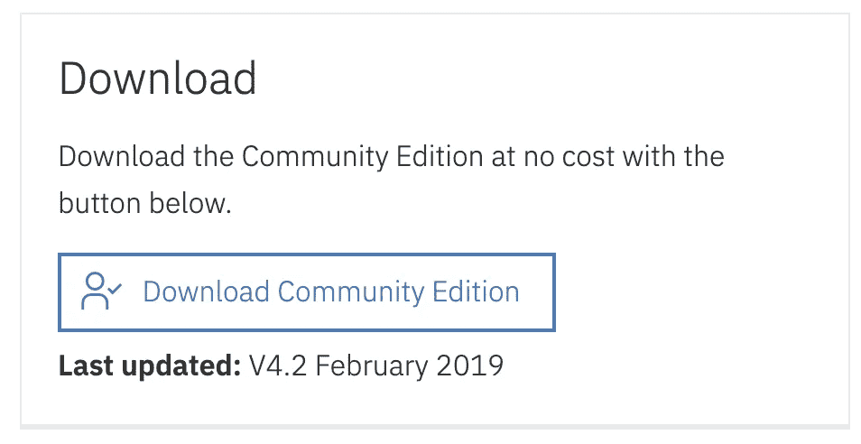
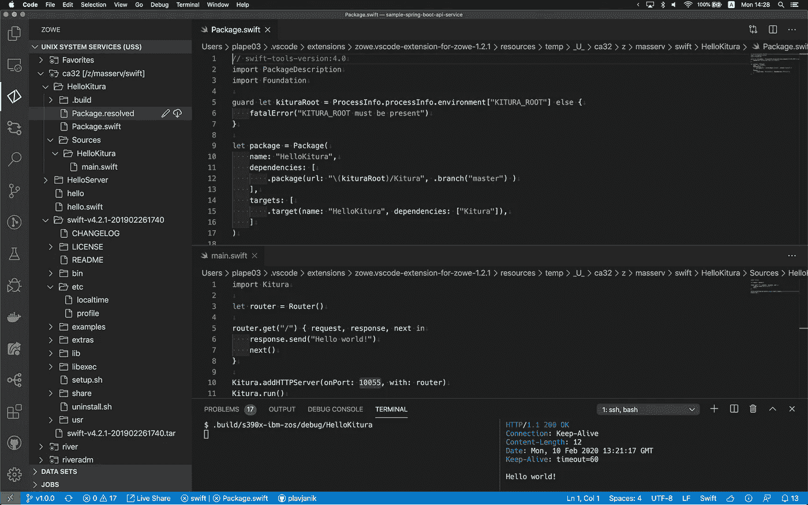

# 大型机上的 swift(z/OS)

> 原文：<https://levelup.gitconnected.com/swift-on-the-mainframe-z-os-77d46139c3df>

*Swift* 是一种强大且易于学习的编程语言，适用于苹果设备和系统、Linux 和 z/OS。编写 Swift 代码是交互式和有趣的，语法简洁而富有表现力，Swift 包括开发人员喜欢的现代功能。Swift 代码从设计上来说是安全的，同时也产生了运行速度快如闪电的软件。


苹果在 2014 年发布了 Swift，在 2015 年发布了开源

2015 年底，Swift 语言、支持库、调试器和包管理器在 [Apache 2.0 许可下发布，运行时库例外](https://swift.org/LICENSE.txt)，而[Swift.org](https://swift.org/)被创建来托管该项目。源代码[托管在 GitHub](http://github.com/apple) 上，任何人都可以很容易地获得代码，自己构建代码，甚至创建 pull 请求将代码贡献给项目。

Swift 不仅在苹果生态系统中开始流行，在服务器端开发中也开始流行。去年，在丹麦举行了一次会议，专门讨论服务器端 Swift。

[](https://www.serversideswift.info/) [## ServerSide.swift

### swift 是一个独立于框架的会议，在这里我们将学习和分享一些不同的相关…

www.serversideswift.info](https://www.serversideswift.info/) 

有几个创建后端服务的框架，包括 [Kitura](https://www.kitura.io/) ，我们将在这个故事中使用它做一个简短的演示。

此外，Swift 可以在机器学习领域变得非常受欢迎，因为它可以与流行的框架 [TensorFlow](https://www.tensorflow.org/swift) 一起使用。

# 获得 z/OS 的 Swift


IBM 在这个网页上提供了 Swift for z/OS:[https://developer . IBM . com/mainframe/products/IBM-toolkit-Swift-z-OS/](https://developer.ibm.com/mainframe/products/ibm-toolkit-swift-z-os/)。

你需要点击**下载**按钮，登录，下载 tar 文件。



这个 tar 文件被命名为`swift-v4.2.1–201902261740.tar`。IBM Toolkit for Swift 的文档可从[https://www . IBM . com/support/knowledge center/en/SSMEGX _ 4 . 2 . 0/com . IBM . Swift . zos . v4 . doc/welcome . html](https://www.ibm.com/support/knowledgecenter/en/SSMEGX_4.2.0/com.ibm.swift.zos.v4.doc/welcome.html)获得。

# 在 z/OS 上安装 Swift

我们将遵循在 z/OS 上安装 IBM Toolkit for Swift 的
[中的说明。以下说明包含了所有必要的细节。](https://www.ibm.com/support/knowledgecenter/en/SSMEGX_4.2.0/com.ibm.swift.zos.v4.doc/install.html)

建议为 Swift 工具包分配一个新的 zFS 文件系统。您可以使用以下作业模板，用您的作业卡替换`${jobcard}`和`${prefix}`变量，用 zFS 文件系统替换数据集的前缀。

在 z/OS 上创建 zFS 文件系统的 JCL

您可以下载这个 JCL，然后使用 Zowe CLI 轻松提交:

```
curl -O [https://gist.githubusercontent.com/plavjanik/fbf4fbf4318a1b7a44ac0381a1a39717/raw/19cc8feabd757549e719bb6c1e49b1dc9f6d9986/create_zfs.jcl](https://gist.githubusercontent.com/plavjanik/fbf4fbf4318a1b7a44ac0381a1a39717/raw/19cc8feabd757549e719bb6c1e49b1dc9f6d9986/create_zfs.jcl)
```

在您喜欢的文本编辑器中编辑文件并替换变量。关于参数的更多细节，参见[定义集群](https://www.ibm.com/support/knowledgecenter/SSLTBW_2.4.0/com.ibm.zos.v2r4.idai200/defclu.htm)。

然后您可以使用 Zowe 提交作业并检查其状态:

```
$ zowe zos-jobs submit local-file create_zfs.jcljobid:   JOB01775
retcode: null
jobname: PLAPE03Z
status:  ACTIVE$ zowe zos-jobs view job-status-by-jobid *JOB01775*jobid: JOB01775
retcode: CC 0000
jobname: PLAPE03Z
status: OUTPUT
```

注意:如果你之前没有使用过 Zowe CLI，我建议从[Zowe CLI 入门](https://medium.com/zowe/getting-started-with-zowe-cli-7a29420c6be7)开始学习。

[](https://medium.com/zowe/getting-started-with-zowe-cli-7a29420c6be7) [## Zowe CLI 入门

### Zowe CLI 用于 z/OS，就像 AWS CLI 用于 AWS 一样。这是一个客户端 CLI，允许访问所有基础架构…

medium.com](https://medium.com/zowe/getting-started-with-zowe-cli-7a29420c6be7) 

0000 返回代码意味着 zFS 已分配，我们需要使用 SSH 或 telnet 登录到 z/OS，然后发出以下命令来挂载 zFS 文件系统:

```
export SWIFT_DIR=***{swift_dir}***
mkdir -p ${SWIFT_DIR}
/usr/sbin/mount -f ***{prefix}***.ZFS -o AGGRGROW ${SWIFT_DIR}
```

我们有一个很大的文件系统，因此我们可以使用 Zowe CLI 上传 Swift for z/OS 软件包(`swift-v4.2.1–201902261740.tar`):

```
zowe zos-files upload file-to-uss --binary swift-v4.2.1-201902261740.tar ***{swift_dir}***/swift-v4.2.1-201902261740.tar
```


tar 文件太大了，以至于你在等待下载完成的时候用这个罐子喂你的宝宝。

tar 文件大约有 700 MB。它不仅包括 Swift，还包括整个工具链，包括 Git 和包含 Kitura 框架及其所有依赖项的示例。

我们现在可以继续 z/OS SSH 会话并提取包:

```
tar -xvfo swift-v*.tar
```

提取`tar`文件的内容后，使用方便的脚本`setup.sh`来设置环境变量，如`LIBPATH`:

```
cd swift-v4.2.1-201902261740
./setup.sh
```

您应该会看到这样的消息:

```
Creating profile *{swift_dir}*/swift-v4.2.1-201902261740/etc/profile ...
Profile successfully created.
Installation complete!To use Swift, source the following profile with the dot command as follows:. *{swift_dir}*/swift-v4.2.1-201902261740/etc/profile
```

建议将以下环境变量添加到为启用 z/OS 增强的 ASCII 支持而创建的配置文件中:

```
export _BPXK_AUTOCVT=ON
export _CEE_RUNOPTS="FILETAG(AUTOCVT,AUTOTAG)"
```

版本信息是:

```
$ swiftc --version5655-SFT V4.2 - IBM Toolkit for Swift on z/OS version 4.2.1-dev (LLVM a3117e1062, Clang a308761bdc, Swift dfc6255cf3)
Build Date: Feb 26 2019 16:19:15
Target: s390x-ibm-zos
```

# 编译简单的程序

您需要为 Swift 激活环境:

```
. *{swift_dir}*/swift-v4.2.1-201902261740/etc/profile
```

让我们创建一个简短的 hello-world 程序。

```
touch hello.swift
chtag -t -c ISO8859-1 hello.swift
vi hello.swift
```

内容将只是:

```
print("Hello, world")
```

构建它:

```
swiftc hello.swift
```

您可以在[编译和运行 Swift 程序](https://www.ibm.com/support/knowledgecenter/en/SSMEGX_4.2.0/com.ibm.swift.zos.v4.doc/environment.htm)中找到有关 Swift 编译器的更多详细信息。

您可以执行生成的二进制文件:

```
./helloHello, world
```

# 构建 HTTP 服务器

我们将使用 Kitura 构建一个简单的 HTTP 服务器。 [Kitura](https://www.kitura.io/) 是用于服务器端 Swift 的开源企业级 web 框架。我们将使用随 z/OS 上的 IBM Swift 工具包一起发布的 Kitura。它是包含所有依赖项的`*{swift_dir}*/swift-v4.2.1–201902261740/examples/kitura`目录。

我们需要通过以下方式将目录路径设置为变量`KITURA_ROOT`:

```
export KITURA_ROOT=*{swift_dir}*/swift-v4.2.1-201902261740/example/kitura
```

我们将创建两个文件。使用一些 IDE 是有用的。我将使用 [VS 代码](https://code.visualstudio.com/)和 [Zowe Explorer](https://marketplace.visualstudio.com/items?itemName=Zowe.vscode-extension-for-zowe) 扩展来编辑 z/OS 和 [Swift Language](https://marketplace.visualstudio.com/items?itemName=Kasik96.swift) 扩展上的文件和目录。



使用 Zowe Explorer 和 Swift 语言扩展的 VS 代码

第一步是为源`HelloKitura`创建一个目录。

第一个文件是`Package.swift`，它定义了项目及其依赖项。在这种情况下，唯一的依赖项是 Kitura，它来自 KITURA_ROOT 目录。

Package.swift

然后我们需要创建一个子目录`Sources/HelloKitura`，并将名为`main.swift`的文件放入其中。

Sources/HelloKitura/main.swift

我们只有 28 行代码，现在我们可以在`main HelloKitura`目录中构建:

```
swift build
```

可执行文件在`.build/s390x-ibm-zos/debug/HelloKitura`中，你可以直接执行它。您也可以使用`swift run`运行它，但是这需要一些时间，因为它会检查项目及其依赖项是否需要重新构建。

当您访问服务器时，您将得到如下响应:


来源可在[https://github.com/plavjanik/HelloKitura](https://github.com/plavjanik/HelloKitura)获得。

# **总结**

Swift Toolkit for z/OS 可以工作，使用提供的 Kitura 库创建 HTTP 服务器很容易。

IBM 为 z/OS 提供了 4.2.1 版本，而为 macOS 和 Ubuntu 提供了 5.1.4 版本。

Swift 是一个年轻的开源项目，它不支持大范围的 Linux 系统，因为我们使用的是其他更成熟的编程语言。希望 IBM 能为 System z (s390x 架构)上的 Linux 贡献一个端口，并更新 z/OS 版本。

Swift 是一种强大的编程语言，功能强大且富于表现力，同时比旧的编程语言更容易编写安全的代码。它可以编译成高效的代码，并且可以与 z/OS 中的本机代码集成。围绕服务器端 Swift 的社区似乎正在获得良好的势头。