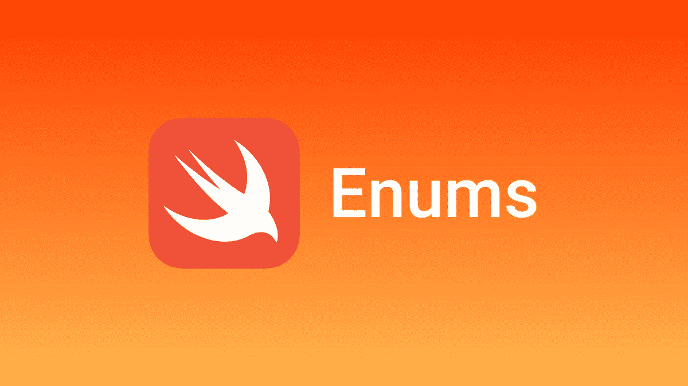

# Swift:五分钟理解递归枚举

> 原文：<https://levelup.gitconnected.com/swift-understand-recursive-enum-in-five-minutes-d4aff8bd50bb>

# 1.什么是*递归枚举*

一个*递归枚举*是一个枚举——简称:一个枚举——它有另一个枚举实例作为关联值。

# 2.如何定义递归枚举情况

你可以通过在它前面写`indirect`来表明一个枚举事例是递归的。例如:

您还可以在枚举的开始之前编写`indirect`,以便为所有具有关联值的枚举案例启用间接寻址:

上面的枚举可以存储三种算术表达式:一个普通数、两个表达式的加法和两个表达式的乘法。`addition`和`multiplication`案例的关联值也是算术表达式

# 3.如何使用递归枚举

要使用 ArithmeticExpression 枚举将举一个简单的算术运算的例子。我们将使用递归枚举计算(5 + 4) * 3 表达式值。

递归函数是处理具有递归结构的数据的一种简单方法。例如，下面是一个计算算术表达式的函数:

# 完整代码:

我相信这很简单。然而，如果你需要任何澄清或问题，请在下面给我留言，我会得到回答。感谢阅读。

*如果你喜欢今天所读的内容，你可以看看我的另一篇* [*文章*](https://medium.com/dev-genius/swift-master-the-enum-in-seven-steps-c9ec0052d3b3) *上的* ***七步解释列举***

感谢阅读。

 [## 编写面试问题

### 一个完整的平台，在这里我会教你找到下一份工作所需的一切，以及…

技术开发](https://skilled.dev)