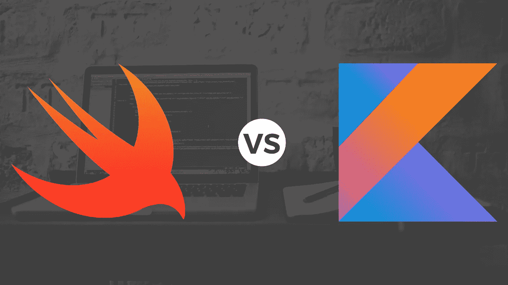

# 斯威夫特和科特林哪个更好？

> 原文：<https://levelup.gitconnected.com/swift-vs-kotlin-which-is-better-696222a49a34>



过去几年我一直使用 Swift，现在使用 Kotlin 也有几个月了。最近在工作时，我发现自己在想，“为什么另一种语言不这样工作？”。这个问题促使我写下这个故事，想清楚到底哪个更好。现在，当我问“哪个更好？”，我不一定要看哪个更快或性能更好。我更多的是在看哪个用起来更舒服。

当然，使用语言的体验是主观的。我很想知道其他人对我所做的比较有什么看法。我还想说，这决不会涵盖与语言有关的一切。这个故事更多的是对我最常用的位的差异和相似之处的快速总结。

# 变量

先说变量。在 Swift 中有`var`和`let`，在 Kotlin 中有`var`和`val`。在这两种语言中，`var`是可变变量的关键字，`let`和`val`是不可变值的关键字。

我想斯威夫特已经打败了科特林。这纯粹是因为当快速阅读代码时，`var`和`val`看起来非常相似。有了`var`和`let`，我可以很容易地看出什么是什么，而不必看得太仔细。

*获胜者:斯威夫特*

# 打印

两种语言都使用`print`函数来输出数据。然而，它们都使用不同的语法来输出变量。

```
// Swift
print("Data: \(myVariable)")
print("Data: \(myObject.data)")// Kotlin
print("Data: $myVariable")
print("Data: ${myObject.data}")
```

我更喜欢这里的 Kotlin 语法，它更容易输入，读起来也更清晰。

*获胜者:科特林*

# 条件式

让我们来看看两个非常基本的 if 语句。

```
// Swift
if nameVar == "Swift" {}// Kotlin
if (nameVar == "Kotlin") {}
```

这两者之间的唯一区别是，在 Swift 中，您不需要括号。您可以在 Swift 中使用括号，但它们不是强制性的。有些人喜欢用括号，有些人不喜欢，我个人对它们不感兴趣。

有时候在编程的时候，你需要一个很好的单行条件来处理一些 if 语句可能有些多余的事情。例如，当给变量赋值时。为此，通常使用三元运算符。Swift 有这个算子，Kotlin 没有。然而，在 Kotlin 中，您可以用一行 if 语句来解决这个问题。

```
// Swift
let swift = hasTernary ? "yes" : "no"// Kotlin
val kotlin = if (hasTernary) "yes" else "no"
```

三元运算符使 Swift 代码更加简洁。

*获胜者:斯威夫特*

# Switch 语句

你可能在想“为什么这不在条件句部分？”。嗯，Swift 和 Kotlin 中的这些声明有很大的不同，所以我认为它应该有自己的一节。

让我们一起来看看这些陈述。

```
// Swift
switch ourNumber {
    case 1:
        print("One")
    case 2, 3:
        print("Maybe Two")
        print("Maybe Three")
    default:
        print("Not One, Two, or Three")
}// Kotlin
when (ourNumber) {
    1 -> print("One")
    2, 3 -> {
        print("Maybe Two")
        print("Maybe Three")
    }
    else -> print("Not One, Two, or Three")
}
```

您可能已经注意到的第一件事是，在 Kotlin 中，switch 语句使用了`when`关键字。我认为 Swift 代码更干净，但是，我更喜欢 Kotlin 语法。我喜欢箭头符号和书写的自然感。我也更喜欢在 Kotlin 中，有表达式的 case 和有块的 case 之间的明显区别。

*获胜者:科特林*

# 环

首先，让我们看看 for in 循环，因为这是我最常用的。

```
// Generic array - not language specific
numbers = [1, 2, 3]// Swift
for number in numbers {
    print(number)
}// Kotlin
for (number in numbers) {
    print(number)
}
```

与 if 语句一样，这里唯一真正的区别是在 Swift 中不需要使用括号。

现在，如果我们也想要数组的索引呢？

```
// Swift
for (number, index) in numbers.enumerated() {
    print("\(number) - \(index)")
}// Kotlin
for ((index, number) in numbers.withIndex()) {
    print("$number - $index")
}
```

同样，这些非常相似。然而，现在我们开始看到强制使用括号是如何使代码更难阅读的。

两种语言在循环 x 次时也非常相似。

```
// Swift
for index in 1...20 {
    print(index)
}// Kotlin
for (index in 1..20) {
    print(index)
}
```

这两个循环都将打印数字 1 到 20。唯一真正的区别是斯威夫特用三个点，而科特林用两个点。

而 loops 也有同样的故事。

```
// Swift
while minute < 60 {}// Kotlin
while (minute < 60) {}
```

如你所见，Swift 和 Kotlin 处理循环的方式非常相似。

*获胜者:平局*

# 数组

数组可以是简单的一维数字列表，也可以是复杂的多维对象组合。让我们看看 Swift 和 Kotlin 是如何处理一些基本数组的。

```
// Swift
let numbersArray = [1, 2, 3]
let keyValueArray = [
    ["key1": "value1", "key2": "value2"],
    ["key1": "value3", "key2": "value4"],
    ["key1": "value5", "key2": "value6"]
]
var emptyNumbersArray = [Int]()
var emptyKeyValueArray = [[String: String]]()print(numbersArray[0]) // 1
print(keyValueArray[0]) // ["key1": "value1", "key2": "value2"]
print(keyValueArray[0]["key1"]) // value1
print(emptyNumbersArray) // []
print(emptyKeyValueArray) // []// Kotlin
val numbersArray = listOf(1, 2, 3)
val keyValueArray = listOf(
    mapOf("key1" to "value1", "key2" to "value 2"),
    mapOf("key1" to "value3", "key2" to "value 4"),
    mapOf("key1" to "value5", "key2" to "value 6")
)
var emptyNumbersArray = listOf<Int>()
var emptyKeyValueArray = listOf<Map<String, String>>()print(numbersArray[0]) // 1
print(keyValueArray[0]) // {key1=value1, key2=value 2}
print(keyValueArray[0]["key1"]) // value1
print(emptyNumbersArray) // []
print(emptyKeyValueArray) // []
```

我更喜欢 Swift 对数组使用的语法。我发现它更干净，尤其是在创建空数组的时候。我也喜欢它不那么罗嗦，我发现这使得打字更快，更容易理解数据类型在数组中对应的位置。

*获胜者:斯威夫特*

# 线

如果您正在使用 Swift 和 Kotlin 进行应用程序开发，那么您可能会发现自己经常在线程之间移动。让我们看看每种语言是如何处理移动到异步线程和在主线程上运行代码的。

```
// Swift
DispatchQueue.global(qos: .userInitiated).async {
    // Run some async task
    DispatchQueue.main.async {
        // Run some task on the main thread
    }
}// Kotlin
val thread = Thread {
    // Run some async task
    Handler(Looper.getMainLooper()).post {
        // Run some task on the main thread
    }
}
thread.start()
```

在这两种语言中，有多种在线程之间移动的方式和其他运行异步代码的方式。上面的例子是我发现的在另一个线程上运行代码和在主线程上运行代码的最简洁的方法。

我更喜欢 Swift 处理这个问题的方式，语法更清晰，更能描述正在发生的事情。

*获胜者:斯威夫特*

# 结论

让我们回顾一下类别以及哪种语言赢得了什么。

变量:Swift

印刷:科特林

条件句:迅捷

Switch 语句:Kotlin

循环:绘制

数组:Swift

线程:Swift

现在我们知道了，Swift 赢得了更多的奖项。这无疑反映了我用两种语言开发的经验。我发现比起 Kotlin 代码，我总是更喜欢写 Swift 代码。Swift 有一个很好的流程，我发现它可以快速地编写、读取和调试。

你可能想知道这种比较有什么意义，尤其是每种语言的大多数用户都在使用它们，因为他们要么是为 iOS 开发，要么是为 Android 开发。然而，不要忘记 Swift 和 Kotlin 都可以用于服务器端编程。

让我知道你喜欢什么，为什么。听听其他人的看法会很有趣。