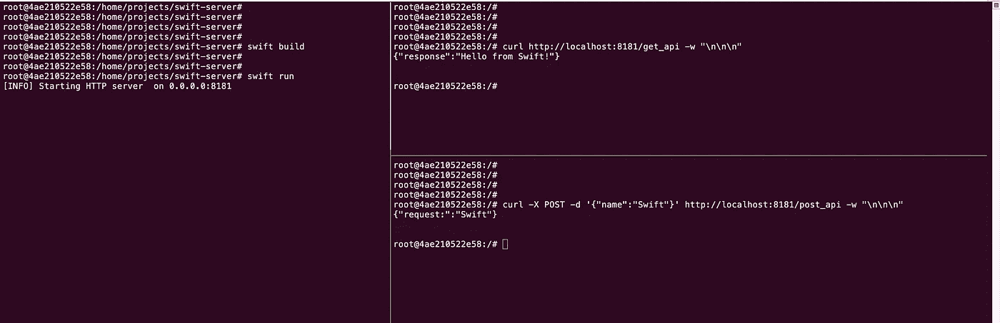
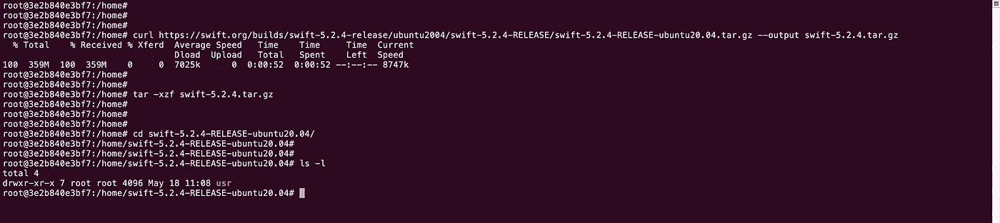
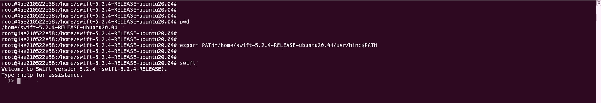
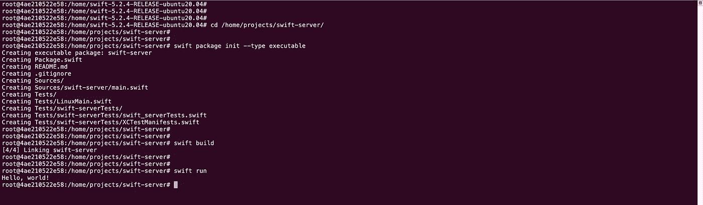

# Swift 网络服务器

> 原文：<https://levelup.gitconnected.com/swift-web-server-f79b9b94d7fc>

## 高级主题

## Ubuntu 上完美的 Swift Web 服务器！



Swift 网络服务器—获取和发布

当谈到不同的编程语言时，大多数人认为 **Swift** 是专为开发苹果产品而设计的。Swift 是一种开源的多用途语言，可用于许多项目，包括 web 服务器，但与 Python 和 Go 等其他语言相比，由于缺乏对此类项目的本机支持，它可能不是高性能和可靠服务器的首选。

# 要求

撰写本文时，最新版本的 Swift (5.2.4)已经可以在 macOS 和一些 Linux 发行版上下载。如果您打算在生产环境中发布您的代码，您最有可能面对的是 Linux 服务器。这就是为什么本文关注于在流行的 Linux 发行版 Ubuntu 20.04 LTS 上制作 web 服务器。

## 迅速发生的

在我们下载 Swift 之前，需要预先安装一些所需的依赖项。要下载，只需将以下命令复制粘贴到您的终端。

```
$ apt-get install binutils git gnupg2 libc6-dev libcurl4 libedit2 libgcc-9-dev libpython2.7 libsqlite3-0 libstdc++-9-dev libxml2 libz3-dev pkg-config tzdata zlib1g-dev curl
```

一旦安装了上述所有依赖项，您就可以开始下载 Swift 了。在 https://swift.org/download/的 Swift 官网上有不同平台的不同版本可供下载。在我们的例子中，我们将为 Ubuntu 20.04 使用版本 5.2.4。

```
# Download Swift
$ curl [https://swift.org/builds/swift-5.2.4-release/ubuntu2004/swift-5.2.4-RELEASE/swift-5.2.4-RELEASE-ubuntu20.04.tar.gz](https://swift.org/builds/swift-5.2.4-release/ubuntu2004/swift-5.2.4-RELEASE/swift-5.2.4-RELEASE-ubuntu20.04.tar.gz) --output swift-5.2.4.tar.gz# Extract downloaded file
$ tar -xzf swift-5.2.4.tar.gz# Go to the extracted directory
$ cd swift-5.2.4-RELEASE-ubuntu20.04/
```



在 LTS Ubuntu 20.04 上的快速安装

下载和解压缩. tar.zip 文件完成后，就该让操作系统知道 Swift 的位置了。根据您提取压缩文件的目录，您需要将 **/usr/bin** 目录导出到 OS 路径。

```
# Tells you the current directory
$ pwd# Use above directory to tell OS the directory of Swift
$ export PATH=/dir_above/usr/bin:$PATH
```



斯威夫特·REPL

恭喜你。现在你有了运行在 Ubuntu 上的斯威夫特·REPL！

*帮助提示:如果您正在使用 docker 学习本教程，请看看这篇文章，看看前面步骤中是否有错误:*[*https://medium.com/@katopz/swift-docker-1eeaf84dcde8*](https://medium.com/@katopz/swift-docker-1eeaf84dcde8)

# 启动项目

在这个阶段，您已经具备了启动 web 服务器项目的所有必要条件。让我们在`/home/projects/`启动一个名为`swift-server`的新的可执行 Swift 包。**请注意，swift 包始终以当前目录的名称命名**

```
$ cd /home/projects/swift-server# Initiate a new swift project
$ swift package init --type executable
```

要测试已启动的项目，您可以简单地构建并运行它以获得“Hello world！”作为输出。

```
$ swift build
$ swift run
```



Swift 包裹启动

# 服务器开发

现在您已经启动了项目，是时候在您的*本地主机*上启动一个简单的服务器了。

## 完美的

[**完美**](https://perfect.org/) 是一个开源库，旨在帮助使用 pure Swift [构建 web 服务器。](https://perfect.org/.)我们服务器开发的第一步是通过编辑`Package.swift`并添加 Perfect 的库，将 Perfect 添加到项目依赖项中。

```
// swift-tools-version:5.2
// The swift-tools-version declares the minimum version of Swift required to build this package.

import PackageDescription

let package = Package(
    name: "swift-server",
    dependencies: [
        .package(name: "PerfectHTTPServer", url: "https://github.com/PerfectlySoft/Perfect-HTTPServer.git", from: "3.0.0")
    ],
    targets: [
        .target(
            name: "swift-server",
            dependencies: ["PerfectHTTPServer"]),
        .testTarget(
            name: "swift-serverTests",
            dependencies: ["swift-server"]),
    ]
)
```

## 启动服务器

现在，让我们打开`main.swift`文件，编写启动函数，在 *localhost:8181 上运行我们的小服务器。*

```
import PerfectLib
import PerfectHTTP
import PerfectHTTPServerfunc startServer(routes: Routes = []) {
    /// Inititiate the server on `[http://localhost:8181`](http://localhost:8181`)
  let server = HTTPServer()
  server.addRoutes(routes)
  server.serverPort = 8181/// Start the serever
  do {
    try server.start()
  } catch {
    print("Network error thrown: \(error)")
  }
}/// Start the server
startServer(routes: Routes())
```

现在，如果您运行上面的代码，您将看到服务器已经启动并在 *0.0.0.0:8181* ***上运行。现在是时候给你的服务器添加一些 API 了。***

## 获取 API

让我们从编写一个简单的 **GET** API 开始。

```
func getAPI(request: HTTPRequest, response: HTTPResponse) {
    response.setHeader(.contentType, value: "application/json")
    _ = try? response.setBody(json: ["response": "Hello from Swift!"])
    response.completed()
}/// Define the GET API and the function that is responsible for it
var routes = Routes()
routes.add(method: .get, uri: "/get_api", handler: getAPI)/// Start the server
startServer(routes: routes)
```

## 发布 API

现在更容易添加更多的 API 路由。

```
func postAPI(request: HTTPRequest, response: HTTPResponse) {
    response.setHeader(.contentType, value: "application/json")
    let body = request.postBodyString
    let json = try? body?.jsonDecode() as? [String:Any]
    let name = json?["name"] as? String ?? "Undefined"

    _ = try? response.setBody(json: ["request:":name])
    response.completed()
}/// Add the new API to the previous routes
routes.add(method: .post, uri: "/post_api", handler: postAPI)/// Start the server
startServer(routes: routes)
```

## 该跑了！

一旦添加了路线，您就可以构建并运行项目了。您可以使用 *curl* 或任何其他客户端应用程序(如 Postman)来测试您的 API。

```
$ swift build
$ swift run# Test GET API
curl [http://localhost:8181/get_api](http://localhost:8181/get_api) -w "\n\n\n"# Test POST API
curl -X POST -d '{"name":"Swift"}' [http://localhost:8181/get_api](http://localhost:8181/get_api) -w "\n\n\n"
```


您的 Swift Web 服务器

最终代码可以在这个 [GitHub 库](https://github.com/Hassaniiii/SwiftWebServer/tree/master)上找到。

[](https://skilled.dev) [## 编写面试问题

### 一个完整的平台，在这里我会教你找到下一份工作所需的一切，以及…

技术开发](https://skilled.dev)