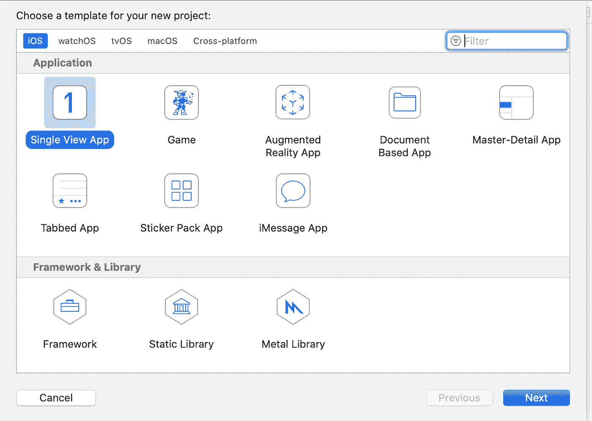

# Swift / Xcode:在视图控制器之间共享数据。

> 原文：<https://levelup.gitconnected.com/swift-xcode-sharing-data-between-view-controllers-8d270e99ca1e>

在视图控制器之间共享数据是作为 iOS 开发人员的一部分，想象一下一个屏幕之间没有交互的应用程序——无聊吧？

我们将创建一个简单的应用程序，允许您在第一个屏幕上输入一些文本，并在按下按钮后，文本显示在第二个屏幕上。

给自己拿杯咖啡，坐下来，跟着做，我将向你展示一种使用故事板、segue 和一点 Swift 实现这一点的方法。

首先在 Xcode 中打开一个新项目，选取 iOS 版单视图应用程序，然后轻按“下一步”。



给应用程序一个产品名称，并确保语言设置为 Swift，用户界面设置为 Storyboard。

屏幕看起来应该与此类似。


我们现在需要添加第二个视图控制器，这是将显示我们的数据的屏幕。为此，请转到对象库:


打开对象库

并选择视图控制器:


双击视图控制器或将其拖到屏幕上——如果它没有与初始视图控制器对齐，只需将其捡起并拖到它旁边。


并排查看控制器

我们现在需要一个. swift 文件来控制新的视图控制器——要添加这个“转到文件”、“新建文件”,然后选择 Cocoa Touch 文件并点击“下一步”。


将该类命名为 SecondViewController，并确保它是 UIViewController 的子类。


将新文件与其他文件一起保存在当前项目文件夹中。swift 文件


现在我们应该重命名初始的 ViewController.swift，为此，在代码中选择左边的 ViewController，然后在右边的窗口中选择 ViewController(见下图)。选择重构和重命名。


将名称更改为 FirstViewController，然后点击右侧的重命名。


现在我们需要将新文件与 SecondViewController 连接起来，为此选择 SecondViewController，并在右侧的 identity inspector 中选择 SecondViewController 类。


选择 SecondViewController 类。

现在要连接视图控制器——在按住 ctrl 键的同时选择第一个 ViewController，然后移动到第二个 view controller——放开并选择 Present Modally。


接下来，我们需要给新创建的 Segue 一个标识符——通过选择 Segue(在两个 ViewControllers 之间)并给标识符一个名称来完成，我们将我们的称为“goToOutput ”,稍后您将需要它。


好的，还在吗？:)接下来，我们要添加用户界面元素，一个 uiLabel、一个 uiTextField、一个 uiButton 和另一个 uiTextField。

从对象库中拖动它们，这样你就有了类似下图的东西。如您所见，我将第一个标签文本改为“输入一些文本”——这是在文本字段下的属性检查器中完成的。


我已经加大了文本的大小，并改变了字体，因此大小为 40 Helvetica 粗体。你不一定要这样做，但这只是让内容更容易阅读。我还将把第一个控制器上的所有东西嵌入到一个堆栈视图中，并使用约束来使视图居中。uiLabel 也是一样，我已经使用约束将其居中。

要将元素嵌入到 stackview 中，只需选择左边的三个元素(使用 shift)，转到编辑器，然后嵌入到 stack view 中。接下来突出显示新创建的堆栈视图


然后选择对齐按钮(见下文)


下一步勾选如下，并按添加 2 个约束


好，现在你的 uiTextField 可能看起来有点小，因为它也需要约束


要解决这个问题，请在左侧菜单中或在视图控制器上选择它，然后选择“添加约束”按钮，如下所示:


我们要给它一些水平约束，并告诉它从堆栈视图边缘 5 点。点击添加 2 个约束。


现在我们需要一些 IBoutlets 和一些 IBactions，这样我们就可以与用户界面对话了。

选择第一个视图控制器，然后在右上角选择助手。


从助手视图中，使用控制键拖动到代码中。


在弹出的名称字段中输入“textEntered ”,确保 type 设置为 UITextField，connection 设置为 Outlet，然后按 connect。


现在对按钮做同样的操作，这次连接类型是 Action，名称是“buttonPressed ”,类型是 UIButton。按连接。


现在我们对第二个视图控制器做同样的操作，这将在右边的面板上显示 SecondViewController.swift。


好了，用户界面都设置好了，我们终于可以开始输入一些代码了:)

在 SecondViewController.swift 中，添加几行代码。

```
var textToSend: String?
```

和

```
output.text = textToSend
```

它会给你这个:


接下来，在 FirstViewController 中，在 buttonPressed 函数的花括号之间添加以下内容。

```
self.performSegue(withIdentifier: “goToOutput”, sender: self)
```

应该是这样的:


这里我们说当按钮被按下时，转到标识符为“goToOutput”的 ViewController。

下一步，在下面输入。

```
**override** **func** prepare(for segue: UIStoryboardSegue, sender: **Any**?) {**if** segue.identifier == “goToOutput” {**let** destinationVC = segue.destination **as**! SecondViewControllerdestinationVC.textToSend = textEntered.text}
```

这里，我们使用一种称为向下转换的技术，强制 destinationVC 了解 SecondViewController 中的值，即 textToSend 值。

该文件应该如下所示:


Xcode 还告诉我们，我们缺少一个花括号，所以在第 35 行添加这个(在我的例子中)

现在我们终于可以运行我们的项目并进行测试了。

如果有些东西不工作或不清楚，请留下评论，让我知道我一定会回复并解决问题。

觉得这篇文章有用？在 Medium 上关注我([乔纳森·滕南特](https://iosdevnewbie.medium.com/))，看看我下面最受欢迎的文章！请👏这篇文章分享一下吧！

[](https://iosdevnewbie.medium.com/swift-real-world-json-api-example-building-a-bike-sharing-app-b51aaa4c5637) [## Swift —真实世界 JSon/API 示例—构建自行车共享应用程序。

### Swift —真实世界 JSon/API 示例—构建自行车共享应用程序。

Swift —真实世界 JSon/API 示例—构建共享 app.iosdevnewbie.medium.com 自行车](https://iosdevnewbie.medium.com/swift-real-world-json-api-example-building-a-bike-sharing-app-b51aaa4c5637) 

[https://iosdevnewbie . medium . com/beginner-IOs-dev-in-app-purchase-IAP-made-simple-with-swiftystorekit-3 add 60 e 9065d](https://iosdevnewbie.medium.com/beginner-ios-dev-in-app-purchase-iap-made-simple-with-swiftystorekit-3add60e9065d)