# SwiftUI 2:快速概述

> 原文：<https://levelup.gitconnected.com/swiftui-2-an-overview-6f5fc68b0b43>

# 标签

标签是一个`Text`和一个`Image`的组合。以前你需要用`Text`和`Image`创建一个`HStack`，但是现在你可以一次完成。

以前

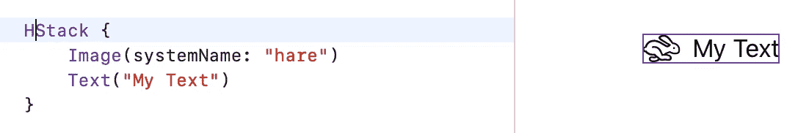

现在

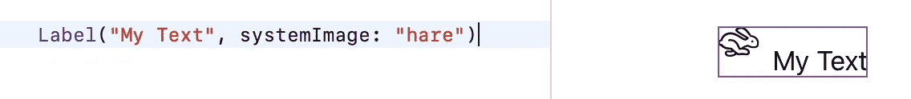

你可以看到对齐还不完美，但它可能会在脱离测试版之前修复。

# 列表大纲

列表轮廓是一个漂亮的新特性。它允许你将*的相同类型*的元素分组来创建一个树形视图。

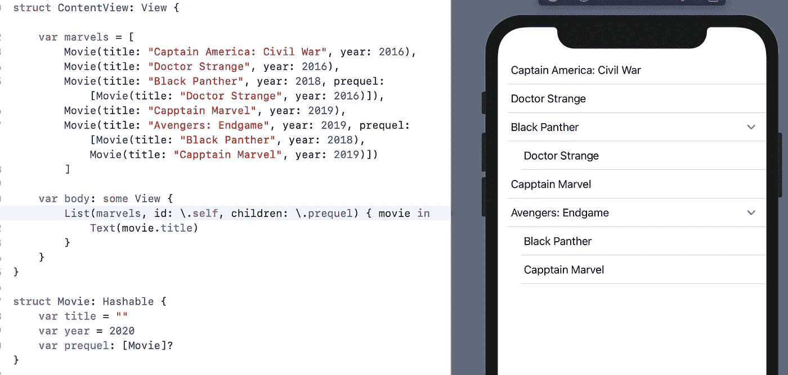

子元素必须是列表中相同类型的元素。例如，您不能使用年份来创建一个部分。

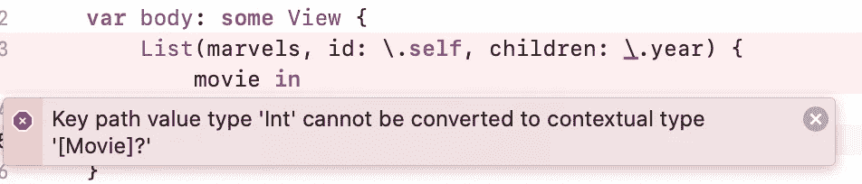

# 惰性堆栈/惰性网格

新的惰性堆栈和惰性网格允许您创建仅在必要时加载的视图。只需替换您的堆栈即可实现这一行为。

以前

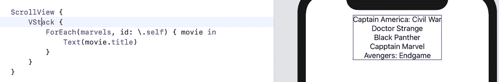

在...之后

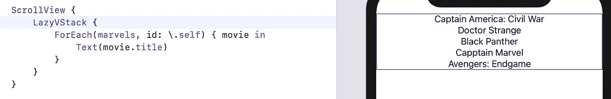

# 环

`Link`让您比以前更快地打开网址。

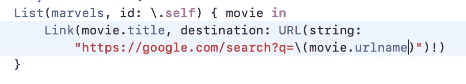

通过链接，当你点击一个单元格时，它会自动打开 Safari 并启动谷歌搜索。在这种情况下，它每次都会打开一个新的 Safari 网页。

# 进度视图

`ProgressView`是一个处理进度的新组件，因此得名。

默认情况下，进度条是显示进度的单行。

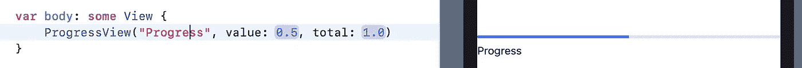

圆形样式显示了无尽的旋转视图。

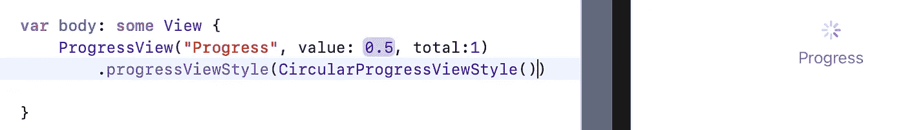

# IF LET / SWITCH

虽然不是 SwiftUI，但是这个会有很大帮助。现在在 SwiftUI 的代码中，可以使用 **if let** 和 **switch** 语句。

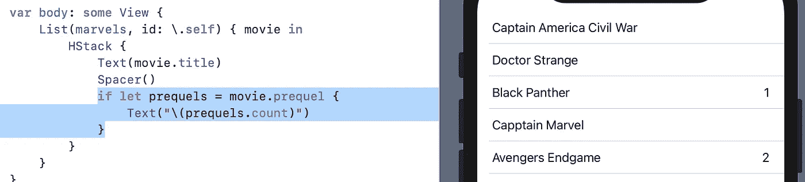

**如果 Let** 的工作方式相同，那么它可以让你以一种非常漂亮和简洁的方式使用选项。同样适用于**开关**语句。

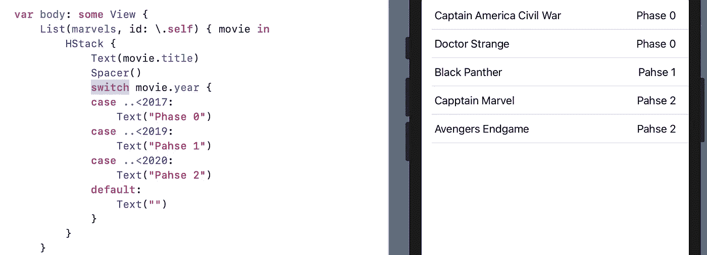

WWDC 的第一天充满了惊喜和重大消息。让我们希望它会继续下去。

你可以看 WWDC 2020 视频:[这里](https://developer.apple.com/videos/play/wwdc2020/10041/)。