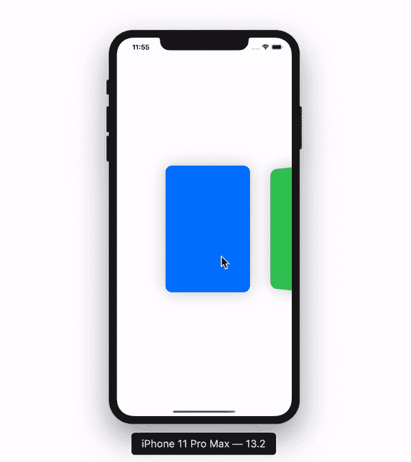

# SwiftUI 3D 滚动效果—教程

> 原文：<https://levelup.gitconnected.com/swiftui-3d-scroll-effect-fa5310665738>

## 让-马克·布里安内


完成 3D 滚动效果

这是我们今天要制作的 3D 滚动效果。在本教程结束时，您将能够在您的应用程序中的任何自定义 SwiftUI 视图中添加此 3D 效果。我们开始吧！

> 在开始之前，请考虑使用这个[链接](https://trailingclosure.com/signup/)订阅，如果你没有在[TrailingClosure.com](https://trailingclosure.com/)上阅读这篇文章，请随时来看看我们！

## 入门指南

首先创建一个新的 SwiftUI 视图。出于示例的目的，我将用不同的颜色显示矩形列表，所以我将视图命名为`ColorList`。

```
import SwiftUI

struct ColorList: View {
    var body: some View {
        Text("Hello, World!")
    }
}

struct ColorList_Previews: PreviewProvider {
    static var previews: some View {
        ColorList()
    }
}
```

## 彩色信号数据

在视图结构的顶部，添加一个用于跟踪颜色的变量。

```
var colors: [Colors]
```

## 列清单

在你的`body`变量中，去掉占位符`Text`。像这样在`ScrollView`里加上一个`HStack`包装。

```
var body: some View {
    ScrollView(.horizontal, showsIndicators: false) {
        HStack(alignment: .center, spacing: 50) {

        }
    }
}
```

## 显示矩形

在您的`HStack`中，我们需要为存储在`colors`中的每种颜色显示一个`Rectangle`。为此我们将使用一个`ForEach`。我已经修改了矩形的框架，使之更符合传统的 UI 卡。

```
var body: some View {
    ScrollView(.horizontal, showsIndicators: false) {
        HStack(alignment: .center, spacing: 20) {
            ForEach(colors, id: \.self) { color in
                Rectangle()
                    .foregroundColor(color)
                    .frame(width: 200, height: 300, alignment: .center)
            }
        }
    }
}
```

如果您继续为预览结构提供一个颜色列表，如下所示:

```
struct ColorList_Previews: PreviewProvider {
    static var previews: some View {
        ColorList(colors: [.blue, .green, .orange, .red, .gray, .pink, .yellow])
    }
}
```

你应该看看这个！


## 添加 3D 效果

从用`GeometryReader`包裹你的`Rectangle`开始。这将允许我们在`Rectangle`在屏幕上移动时获取对其框架的引用。

```
var body: some View {
    ScrollView(.horizontal, showsIndicators: false) {
        HStack(alignment: .center, spacing: 230) {
            ForEach(colors, id: \.self) { color in
                GeometryReader { geometry in
                    Rectangle()
                        .foregroundColor(color)
                        .frame(width: 200, height: 300, alignment: .center)
                }
            }
        }
    }
}
```

由于`GeometryReader`的工作方式，您需要更改上面定义的`HStack`间距。

然后将这一行添加到您的`Rectangle`

```
.rotation3DEffect(Angle(degrees: (Double(geometry.frame(in: .global).minX) - 210) / -20), axis: (x: 0, y: 1.0, z: 0))
```

当`Rectangle`在屏幕上移动时，您传递到函数中的`Angle`会发生变化。请特别注意`.frame(in:)`功能。它允许您抓住`Rectangle`的`CGRect`并使用其`minX`坐标进行角度计算。

`axis`参数是一个元组，它详细说明了使用您刚刚传入的角度来修改哪个轴。在这种情况下，它是 Y 轴。

> rotation3DEffect()的文档可以在苹果官方网站的[这里](https://developer.apple.com/documentation/swiftui/scrollview/3287538-rotation3deffect)找到。

如果你继续运行这个例子，你应该会看到你的`Rectangles`随着它们在屏幕上移动而旋转！

> 我还修改了矩形的圆角半径，并添加了阴影，使它看起来更好一些。



很酷吧！？

## 最终产品

```
struct ColorList: View {

    var colors:[Color]

    var body: some View {
        ScrollView(.horizontal, showsIndicators: false) {
            HStack(alignment: .center, spacing: 230) {
                ForEach(colors, id: \.self) { color in
                    GeometryReader { geometry in
                        Rectangle()
                            .foregroundColor(color)
                            .frame(width: 200, height: 300, alignment: .center)
                            .cornerRadius(16)
                            .shadow(color: Color.black.opacity(0.2), radius: 20, x: 0, y: 0)
                            .rotation3DEffect(Angle(degrees: (Double(geometry.frame(in: .global).minX) - 210) / -20), axis: (x: 0, y: 1.0, z: 0))
                    }
                }
            }.padding(.horizontal, 210)
        }
    }
}
```

## 那都是乡亲们！

如果你喜欢这篇文章，请考虑使用这个[链接](https://trailingclosure.com/signup/)订阅我的网站，如果你没有在[TrailingClosure.com](https://trailingclosure.com/)上阅读这篇文章，请随时来看看我们！