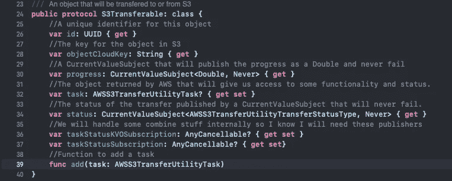
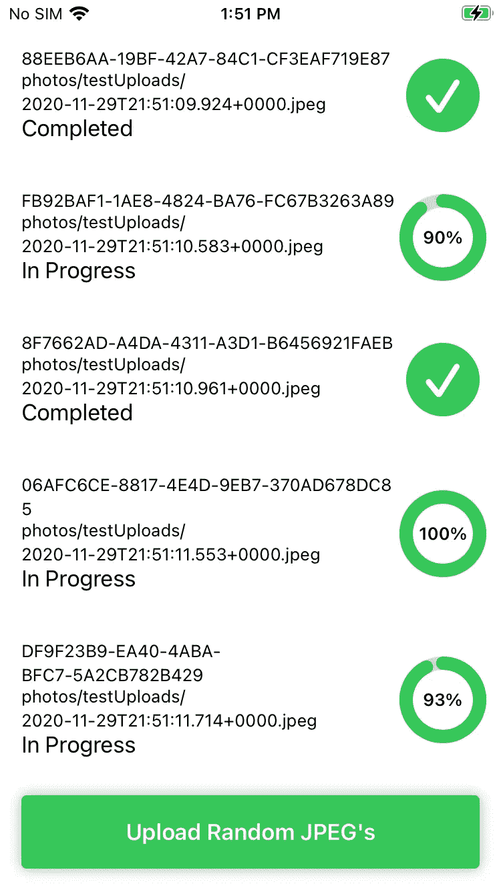
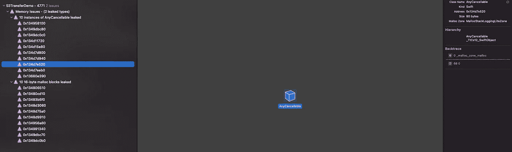

# SwiftUI 和组合使用模式

> 原文：<https://levelup.gitconnected.com/swiftui-and-combine-usage-patterns-299142134af4>

在这篇文章中，我将谈论一些我在学习苹果新的声明性框架时用来维护一些正常代码的不同技术。

[我创建了一个项目](https://github.com/labs-nomad/S3TransferDemo)，它将允许我使用 AWS iOS S3 SDK 将文件上传到 S3 存储桶。我也依靠[这个项目](https://heckj.github.io/swiftui-notes/)的笔记，使用 Combine。

## 传统异步结合未来

我需要做的第一件事就是把一些异步代码变成一个未来的组合发布器。`Future`发布者是“一次性”发布者，与像`PassthroughSubject`这样持续传递价值的发布者形成对比。下面的代码演示了我如何在`Future`中包装异步 S3 上传。现在忽略`S3Uploadable`对象的细节。我接下来会谈到它们。

你可以看到，我能够提供一个函数来获取一组`S3Uploadable`对象，并在它们全部完成后作为一个组返回它们。

## 协议和组合

我喜欢尝试和一般性地思考，所以我想提出一个基本协议，它代表被传输到 S3 的对象的公共部分。

在制定这个协议时，我遇到了两个有趣的问题。首先，我想使用`@Published`属性包装器，这样任何一致的对象都可以作为 SwiftUI 视图的“模型视图”。协议定义中不允许属性包装，所以我决定将 progress 和 status 作为 CurrentValueSubjects。其次，我试图让我的协议符合 SwiftUI `Identifiable`协议，但是“自身或关联类型需求”破坏了其他一些在数组中保存协议定义的代码。不过这也行得通，因为在大多数接受`Identifiable`对象的地方，如果需要的话，可以直接指定`.id`。

## 查看模型

在项目中，我想在列表中显示`S3Transferable`对象，并显示上传进度和状态。这是用户界面最终的样子。

我想让`S3Transferable`对象直接充当“视图模型”。我最初设置了“单元格”视图来使用`.onReceive`视图修饰符，然后我将把它们分配给一个`@State`属性。我觉得这不是一个很好的模式，我观察到一个奇怪的内存泄漏，看起来像这样。

我最后只是做了一个相应的视图模型，我将其标记为`ObservableObject`。然后，我可以使用`.assign(to:)`组合操作符将发布的值从模型转发到`@Published`属性。

感谢阅读！我欢迎对我的方法的任何建议。