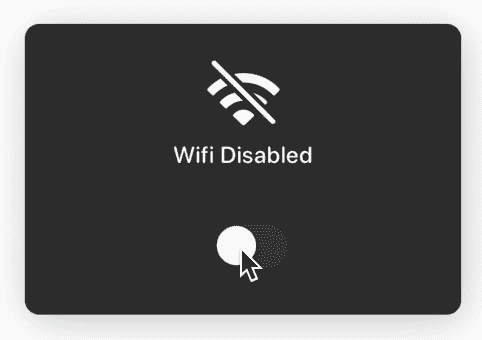
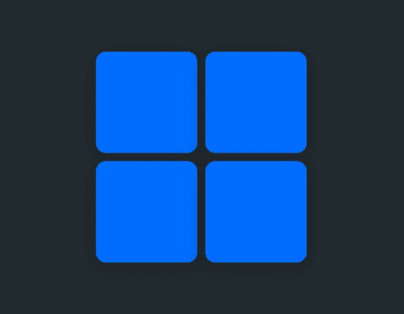
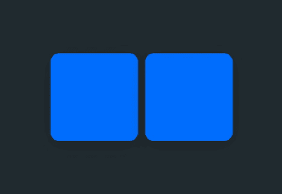
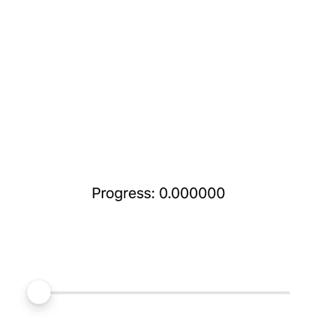
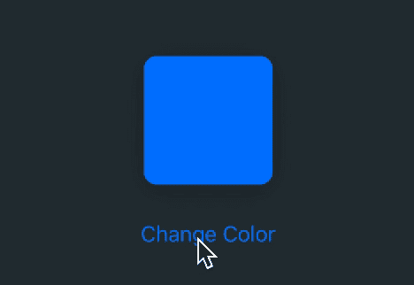
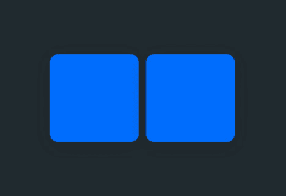
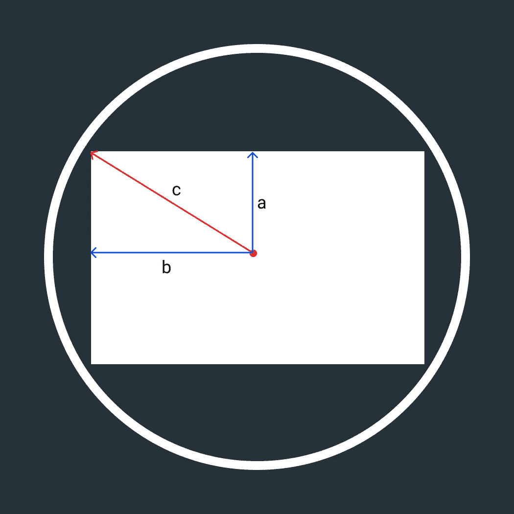
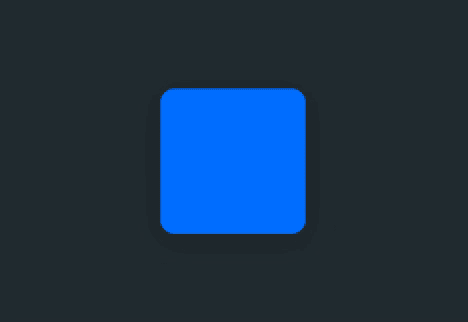
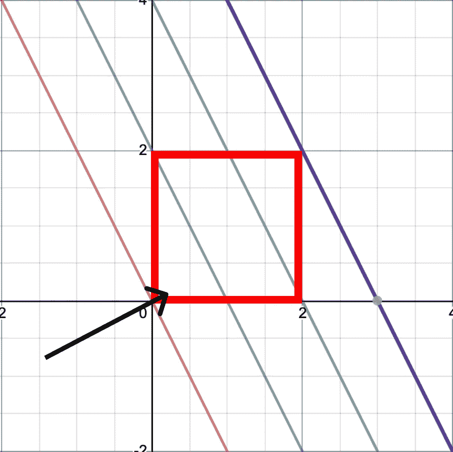
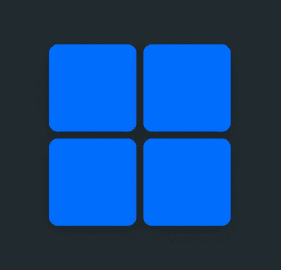

# SwiftUI:动画颜色变化

> 原文：<https://levelup.gitconnected.com/swiftui-animating-color-changes-6a87d237dcea>

## 让-马克·布里安内

是时候改变你的颜色了！您将学习如何使用`Paths`和`AnimatableData`在 SwiftUI 中制作背景颜色变化的动画！



这是什么样的变色疯狂？！

## 入门指南

我们改变背景颜色魔法的关键是创建我们自己的自定义 SwiftUI `Shape`结构。我们就叫它`SplashShape`。`Shape`结构利用函数`path(in rect: CGRect) -> Path`来定义它们看起来像什么。这是我们将用来创建各种动画的函数。

## 创建`SplashShape`结构

继续创建一个名为`SplashStruct`的新`Shape`结构。

```
import SwiftUI

struct SplashShape: Shape {

    func path(in rect: CGRect) -> Path {
        return Path()
    }
}
```

首先，我们将创建两个动画。`leftToRight`和`rightToLeft`如下图所示。



`leftToRight` & `rightToLeft`

## `SplashAnimation`

我们将为自定义动画创建一个名为`SplashAnimation`的`enum`。这将允许我们在未来轻松地添加更多的动画(更多内容请参见结尾！).

```
import SwiftUI

struct SplashShape: Shape {

    public enum SplashAnimation {
        case leftToRight
        case rightToleft
    }

    func path(in rect: CGRect) -> Path {
        return Path()
    }
}
```

在我们的`path()`函数中，我们将打开我们的形状正在使用的动画，并生成动画所需的`Path`。但是首先，我们必须创建变量来保存动画类型以及动画的进度。

```
import SwiftUI

struct SplashShape: Shape {

    public enum SplashAnimation {
        case leftToRight
        case rightToleft
    }

    var progress: CGFloat
    var animationType: SplashAnimation

    func path(in rect: CGRect) -> Path {
        return Path()
    }
}
```

`progress`将是一个介于`0`和`1`之间的值，它将详细说明我们在颜色变化的动画中走了多远。这将在我们编写`path()`函数时派上用场。

## 编写`path()`函数

如前所述，我们需要弄清楚我们使用的是什么类型的动画，以便返回正确的`Path`。首先，使用前面定义的`animationType`在`path()`函数中编写一个`switch`语句。

```
func path(in rect: CGRect) -> Path {
   switch animationType {
       case .leftToRight:
           return Path()
       case .rightToLeft:
           return Path()
   }
}
```

现在，这将返回空路径。我们需要实际创建函数来动画化路径。

## 创建动画功能

在你的`path()`函数下面，为每种类型的动画创建两个名为`leftToRight()`和`rightToLeft()`的新函数。在每个函数中，我们将创建一个矩形的`Path`，它将根据我们的`progress`变量随时间增长。

```
func leftToRight(rect: CGRect) -> Path {
    var path = Path()
    path.move(to: CGPoint(x: 0, y: 0)) // Top Left
    path.addLine(to: CGPoint(x: rect.width * progress, y: 0)) // Top Right
    path.addLine(to: CGPoint(x: rect.width * progress, y: rect.height)) // Bottom Right
    path.addLine(to: CGPoint(x: 0, y: rect.height)) // Bottom Left
    path.closeSubpath() // Close the Path
    return path
}

func rightToLeft(rect: CGRect) -> Path {
    var path = Path()
    path.move(to: CGPoint(x: rect.width, y: 0))
    path.addLine(to: CGPoint(x: rect.width - (rect.width * progress), y: 0))
    path.addLine(to: CGPoint(x: rect.width - (rect.width * progress), y: rect.height))
    path.addLine(to: CGPoint(x: rect.width, y: rect.height))
    path.closeSubpath()
    return path
}
```

然后利用上面`path()`函数中的两个新函数。

```
func path(in rect: CGRect) -> Path {
   switch animationType {
       case .leftToRight:
           return leftToRight(rect: rect)
       case .rightToLeft:
           return rightToLeft(rect: rect)
   }
}
```

## 动画数据

为了确保 Swift 知道如何在`progress`变量改变时激活我们的`Shape`，我们需要指定哪个变量正在激活。就在我们的`progress`和`animationType`变量下面，定义`animatableData`。这是一个基于`[Animatable](https://developer.apple.com/documentation/swiftui/animatable)` [协议](https://developer.apple.com/documentation/swiftui/animatable)的变量，它帮助 SwiftUI 知道当视图改变时如何动画化视图。

```
var progress: CGFloat
var animationType: SplashAnimation

var animatableData: CGFloat {
    get { return progress }
    set { self.progress = newValue}
}
```



`SplashShape`随着`progress`的变化而变化。

## 制作颜色变化的动画

到目前为止，我们已经创建了一个`Shape`，它将随着时间的推移而产生动画效果。接下来，我们需要将这个形状添加到一个视图中，并在视图的颜色改变时自动动画显示它。这就是`SplashView`发挥作用的地方。我们将创建一个`SplashView`来自动更新`SplashShape`的`progress`变量。当`SplashView`接收到新的`Color`时，它触发动画。

从创建`SplashView`结构开始。

```
import SwiftUI

struct SplashView: View {

    var body: some View {
        // SplashShape Here
    }

}
```

记住我们的`SplashShape`将`SplashAnimation`枚举作为参数，所以我们需要将它作为参数添加到我们的`SplashView`中。此外，我们正在制作视图背景颜色变化的动画，所以我们也需要加入一个`Color`。我们的初始化器在下面详述。

`ColorStore`是自定义的 ObservableObject。它用于接收`SplashView`结构中的`Color`更新，这样我们就可以启动`SplashShape`动画，并最终改变背景颜色。我们一会儿将展示它是如何工作的。

```
struct SplashView: View {

    var animationType: SplashShape.SplashAnimation
    @State private var prevColor: Color // Stores background color
    @ObservedObject var colorStore: ColorStore // Send new color updates

    init(animationType: SplashShape.SplashAnimation, color: Color) {
        self.animationType = animationType
        self._prevColor = State<Color>(initialValue: color)
        self.colorStore = ColorStore(color: color)
    }

    var body: some View {
        // SplashShape Here
    }

}

class ColorStore: ObservableObject {
    @Published var color: Color

    init(color: Color) {
        self.color = color
    }
}
```

## 创建`SplashView`机构

在`body`变量中，我们需要返回一个设置为`SplashView`当前颜色的`Rectangle`。然后使用前面定义的`ColorStore`observable 对象，我们可以接收颜色更新来激活我们的视图。

```
var body: some View {
    Rectangle()
        .foregroundColor(self.prevColor) // Current Color
        .onReceive(self.colorStore.$color) { color in
            // Animate Color Update Here
        }
}
```

当改变颜色时，我们需要一些方法来跟踪`SplashView`被改变的颜色，以及进度。为此，我们将定义`layers`变量。

```
@State var layers: [(Color,CGFloat)] = [] // New Color & Progress
```

现在回到我们的`body`变量中，我们需要将新收到的`Colors`添加到`layers`变量中。当我们添加它们时，我们将进度设置为`0`，因为它们是刚刚添加的。然后，在半秒钟的过程中，我们将他们的进度制作成动画`1`。

```
var body: some View {
    Rectangle()
        .foregroundColor(self.prevColor) // Current Color
        .onReceive(self.colorStore.$color) { color in
            // Animate Color Update Here
            self.layers.append((color, 0))

            withAnimation(.easeInOut(duration: 0.5)) {
                self.layers[self.layers.count-1].1 = 1.0
            }
        }
}
```

现在，这将把新的颜色添加到 `layers`变量中，但是它们不会显示在`SplashView`的顶部。要做到这一点，我们需要在变量`body`内的`Rectangle`上将每个层显示为覆盖层。

```
var body: some View {
    Rectangle()
        .foregroundColor(self.prevColor)
        .overlay(
            ZStack {
                ForEach(layers.indices, id: \.self) { x in
                    SplashShape(progress: self.layers[x].1, animationType: self.animationType)
                        .foregroundColor(self.layers[x].0)
                }

            }

            , alignment: .leading)
        .onReceive(self.colorStore.$color) { color in
            // Animate color update here
            self.layers.append((color, 0))

            withAnimation(.easeInOut(duration: 0.5)) {
                self.layers[self.layers.count-1].1 = 1.0
            }
        }
}
```

## 试一试

使用下面的代码，您可以在模拟器中运行它。这样做的目的是，当按下`ContentView`内的按钮时，它会推进用于选择`SplashView`颜色的`index`，从而触发对内部`ColorStore`的更新。这使得`SplashView`添加一个`SplashShape`层，并将其添加到视图中。

```
import SwiftUI

struct ContentView: View {
    var colors: [Color] = [.blue, .red, .green, .orange]
    @State var index: Int = 0

    @State var progress: CGFloat = 0
    var body: some View {
        VStack {

            SplashView(animationType: .leftToRight, color: self.colors[self.index])
                .frame(width: 200, height: 100, alignment: .center)
                .cornerRadius(10)
                .shadow(color: Color.black.opacity(0.2), radius: 10, x: 0, y: 4)

            Button(action: {
                self.index = (self.index + 1) % self.colors.count
            }) {
                Text("Change Color")
            }
            .padding(.top, 20)
        }

    }
}
```



变色的好！

## 还没完成！

我们遗漏了一件事。到目前为止，我们正在不断地给我们的`SplashView`增加一层又一层。我们需要确保在这些层完成动画制作和显示后删除它们。

在`SplashView` struct 的`body`变量内的`onReceive()`函数内，进行以下更改:

```
.onReceive(self.colorStore.$color) { color in
    self.layers.append((color, 0))

    withAnimation(.easeInOut(duration: 0.5)) {
        self.layers[self.layers.count-1].1 = 1.0
        DispatchQueue.main.asyncAfter(deadline: .now() + 0.5) {
            self.prevColor = self.layers[0].0 // Finalizes background color of SplashView
            self.layers.remove(at: 0) // removes itself from layers array
        }
    }
}
```

这确保我们删除了`layers`数组中的旧条目，并且我们的`SplashView`基于最新的更新显示了正确的背景颜色。

## 给我们看看你做了什么！

你完成了我的一个教程吗？给我发一张截图或者给我一个项目链接。[TrailingClosure.com](https://trailingclosure.com)将展示用户的作品！在 Twitter[@ trailing closure](https://twitter.com/TrailingClosure)上找到我们，或者发邮件到[howdy@TrailingClosure.com](mailto:howdy@trailingclosure.com)联系我们


## 发布在 GitHub 上的源代码

在我的 Github 上查看本教程的[源代码](https://github.com/jboullianne/SplashView)！除了显示的例子外，还包括了`SplashShape`和`SplashView`的全部源代码。....但是等等，还有呢！

## 额外学分！

如果你熟悉我以前的教程，你知道我喜欢额外学分😉。我在开始的时候说过会有更多的动画。这是你期待已久的时刻…*滚筒* …

# `SplashAnimation` 🥳

呜呜呜！！还记得这个吗？我告诉过你我们会回来添加更多的动画类型。

```
enum SplashAnimation {
    case leftToRight
    case rightToLeft
    case topToBottom
    case bottomToTop
    case angle(Angle)
    case circle
}

func path(in rect: CGRect) -> Path {

    switch self.animationType {
        case .leftToRight:
            return leftToRight(rect: rect)
        case .rightToLeft:
            return rightToLeft(rect: rect)
        case .topToBottom:
            return topToBottom(rect: rect)
        case .bottomToTop:
            return bottomToTop(rect: rect)
        case .angle(let splashAngle):
            return angle(rect: rect, angle: splashAngle)
        case .circle:
            return circle(rect: rect)
    }

}
```

我知道你在想什么… **“哇，那是很多额外的学分…”**。不要烦恼。通过修改`SplashShape`中的`path()`函数，再创建几个函数，我们就可以像其他人一样制作动画了。

让我们一个动画接一个动画…

## `topToBottom` & `bottomToTop`

与`leftToRight`和`rightToLeft`非常相似，这些函数使用`progress`变量创建一个从形状底部或顶部开始并随时间增长的路径。

```
func topToBottom(rect: CGRect) -> Path {
    var path = Path()
    path.move(to: CGPoint(x: 0, y: 0))
    path.addLine(to: CGPoint(x: rect.width, y: 0))
    path.addLine(to: CGPoint(x: rect.width, y: rect.height * progress))
    path.addLine(to: CGPoint(x: 0, y: rect.height * progress))
    path.closeSubpath()
    return path
}

func bottomToTop(rect: CGRect) -> Path {
    var path = Path()
    path.move(to: CGPoint(x: 0, y: rect.height))
    path.addLine(to: CGPoint(x: rect.width, y: rect.height))
    path.addLine(to: CGPoint(x: rect.width, y: rect.height - (rect.height * progress)))
    path.addLine(to: CGPoint(x: 0, y: rect.height - (rect.height * progress)))
    path.closeSubpath()
    return path
}
```



## `circle`

如果你还记得你小学时的一些几何知识，你就会知道勾股定理。`a^2 + b^2 = c^2`



`c`是我们的路径需要画的最后一个圆的半径

`a`和`b`可以认为是我们矩形的`height`和`width`。这允许我们求解`c`，覆盖整个矩形所需的圆的半径。我们可以在此基础上构建一个循环路径，并使用`progress`变量使其随时间增长。

```
func circle(rect: CGRect) -> Path {
    let a: CGFloat = rect.height / 2.0
    let b: CGFloat = rect.width / 2.0

    let c = pow(pow(a, 2) + pow(b, 2), 0.5) // a^2 + b^2 = c^2  --> Solved for 'c'
    // c = radius of final circle

    let radius = c * progress
    // Build Circle Path
    var path = Path()
    path.addArc(center: CGPoint(x: rect.midX, y: rect.midY), radius: radius, startAngle: Angle(degrees: 0), endAngle: Angle(degrees: 360), clockwise: true)
    return path

}
```



使用圆形路径制作动画

## `angle`

这个有点复杂。你需要用切线来计算角度的斜率。然后用给定的斜率创建一条线。当你移动这条线穿过矩形时，你将把它画成一个直角三角形。见下图。各种颜色的线代表随时间移动以覆盖整个矩形的线。



线条依次从红色、蓝色、绿色、紫色移动。为了覆盖矩形

该功能如下所示:

```
func angle(rect: CGRect, angle: Angle) -> Path {

    var cAngle = Angle(degrees: angle.degrees.truncatingRemainder(dividingBy: 90))

    // Return Path Using Other Animations (topToBottom, leftToRight, etc) if angle is 0, 90, 180, 270
    if angle.degrees == 0 || cAngle.degrees == 0 { return leftToRight(rect: rect)}
    else if angle.degrees == 90 || cAngle.degrees == 90 { return topToBottom(rect: rect)}
    else if angle.degrees == 180 || cAngle.degrees == 180 { return rightToLeft(rect: rect)}
    else if angle.degrees == 270 || cAngle.degrees == 270 { return bottomToTop(rect: rect)}

    // Calculate Slope of Line and inverse slope
    let m = CGFloat(tan(cAngle.radians))
    let m_1 = pow(m, -1) * -1
    let h = rect.height
    let w = rect.width

    // tan (angle) = slope of line
    // y = mx + b ---> b = y - mx   ~ 'b' = y intercept
    let b = h - (m_1 * w) // b = y - (m * x)

    // X and Y coordinate calculation
    var x = b * m * progress
    var y = b * progress

    // Triangle Offset Calculation
    let xOffset = (angle.degrees > 90 && angle.degrees < 270) ? rect.width : 0
    let yOffset = (angle.degrees > 180 && angle.degrees < 360) ? rect.height : 0

    // Modify which side the triangle is drawn from depending on the angle
    if angle.degrees > 90 && angle.degrees < 180 { x *= -1 }
    else if angle.degrees > 180 && angle.degrees < 270 { x *= -1; y *= -1 }
    else if angle.degrees > 270 && angle.degrees < 360 { y *= -1 }

    // Build Triangle Path
    var path = Path()
    path.move(to: CGPoint(x: xOffset, y: yOffset))
    path.addLine(to: CGPoint(x: xOffset + x, y: yOffset))
    path.addLine(to: CGPoint(x: xOffset, y: yOffset + y))
    path.closeSubpath()
    return path

}
```



角度 45，135，225，315

## 支持未来像这样的教程！

请考虑使用此[链接](https://trailingclosure.com/signup/)进行订阅。如果你没有在 TrailingClosure.com 看到这篇文章，请随时来看看我们！