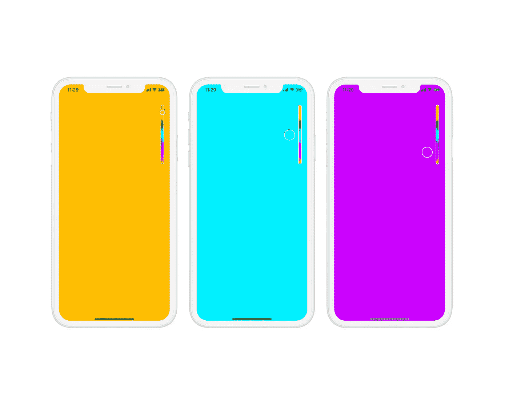
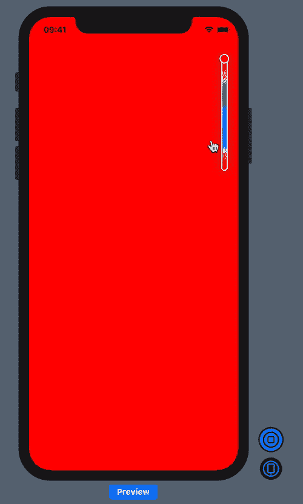
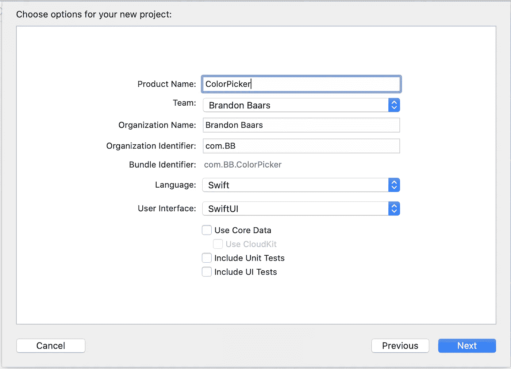
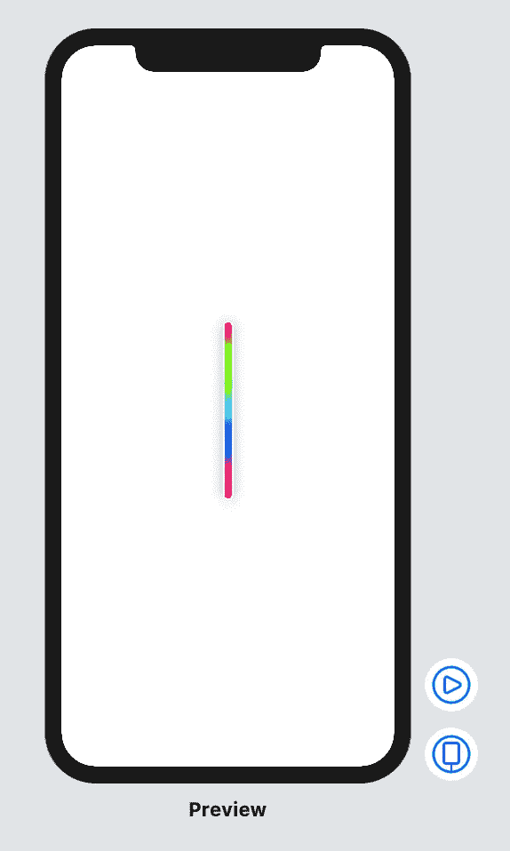
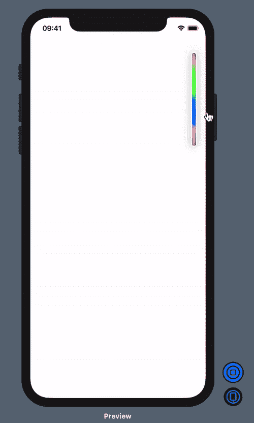

# SwiftUI:创建一个像 Snapchat 一样的自定义渐变颜色选择器

> 原文：<https://levelup.gitconnected.com/swiftui-create-a-custom-gradient-color-picker-like-snapchats-bcf508e69380>

## 在 SwiftUI 中使用 DragGesture()构建渐变颜色选择器



# 以下是我们将在本教程中构建的内容:



我们的颜色选择器将允许用户在颜色视图上拖动他们的手指，它将相应地更新我们的主视图的背景颜色。

拖动手势将被限制在我们的颜色视图的高度内。

# 入门指南

在 Xcode 中创建新的 SwiftUI 项目。确定您运行的是 macOS Catalina，并且安装了 Xcode 11。(允许您使用 SwiftUI)

打开 Xcode →文件→新建→项目

我把我的命名为 **ColorPicker** ，但是你可以随意命名它。

**确保用户界面设置为 SwiftUI。**



# 履行

让我们从创建一个新的 Swift 文件开始。

右键点击你的项目文件夹→新建文件→ Swift 文件，命名为`ColorPickerView.swift`。

添加以下代码来设置我们的 SwiftUI 视图:

```
import SwiftUIstruct ColorPickerView: View {

    var body: some View {
        ZStack {
            Text("Hello World")
        }
    }
}

struct ColorPickerView_Previews: PreviewProvider {
    static var previews: some View {
        ColorPickerView()
    }
}
```

我们所做的就是设置我们新的 SwiftUI 视图，使其有资格在画布中进行实时预览。

此时，它应该只是在右边的画布中显示“Hello World”。

# 我们如何创建渐变视图？

如果是 Swift，我们有能力使用一组`Colors`，或者`UIColors`，如果你正在考虑`UIKit`，来创建渐变。当你构建一个`UIColor`时，你可以选择使用 HSB(色调、饱和度、亮度)。

> *色相*是大多数人联想到*色彩*这个词的维度。色调是红、绿、蓝等基本颜色名称的区别。在色轮中，色调是围绕色轮的圆周来表示的。因此，它由指定轮子上位置的角度来表示。角度可以从 0(红色)到 359(也是红色！).在中间你会发现彩虹的“颜色”——红色、橙色、黄色、绿色、蓝色、靛蓝色和紫色。一般来说，颜色的色调是由光的波长决定的。较短的波长通常呈现蓝色，而较长的波长呈现红色。

以上描述归功于[https://elvers.us/perception/hsv/](https://elvers.us/perception/hsv/)。

利用这些知识，我们可以创建 360 种颜色用于我们的`GradientView`！

让我们试一试，但首先让我们设置好`LinearGradient`。

在`ColorPickerView.swift`中，将这段代码添加到我们的`body`中:

我们有一个`ZStack`,允许我们稍后在我们的渐变视图上叠加另一个视图。

1.  从两种颜色开始创建`LinearGradient`。
2.  我们指定渐变的起点(蓝色)是视图的顶部，终点(粉色)是视图的底部。
3.  我们将自己的`LinearGradient`框架设置为宽度 10px，高度 200px。
4.  添加一个 5px 的圆角半径，这将很好地圆化我们的边，因为我们的宽度是 10px。
5.  添加一个模糊半径为 8px 的漂亮阴影，这样就不会太突出了。
6.  最后，通过添加一个白色边框和 2px 线宽的`RoundedRectangle`叠加来添加一个边框。

## 现在，让我们实现所有的颜色

我们可以构造一个 0 → 360 的数组，然后为数组中的每个索引创建一个色调为`index/360.0`的`Color`，因为色调只接受 0 到 1 之间的颜色。

在我们的`ColorPickerView,`顶部创建一个名为“颜色”的变量

这个变量本质上是一个闭包，它将创建我们的`[Color]`一次。

1.  我们使用给定范围的数组构造函数创建一个数组。这将自动创建我们的数组为[0，1，2，3，4，… 359]。
2.  我们映射数组，对于每次迭代，我们从`UIColor`创建一个`Color`，只改变每个数组的色调。这将创建 0/359、1/359、2/359、3/359 … 359/359。每个值代表一种不同的颜色。

在我们的`LinearGradient`中，替换

```
Gradient(colors: [Color.blue, Color.pink])
```

随着

```
Gradient(colors: colors)
```

我们的视图现在应该是这样的:



接下来，让我们添加我们的`DragGesture`的实现，并将我们选择的颜色传递回我们的父视图，这样他们就可以相应地更新背景视图。

在`ColorPickerView.swift`中，将这些变量添加到我们结构的顶部。

```
@Binding var chosenColor: Color // 1

@State private var startLocation: CGFloat = .zero // 2
@State private var dragOffset: CGSize = .zero // 3// 4
init(chosenColor: Binding<Color>) {
    self._chosenColor = chosenColor
}
```

1.  我们创建了一个`Binding<Color>`变量(用`@Binding`表示),它将允许我们父母更新他们的视图。为此，我们要做的就是在父节点中创建一个`@State`变量，然后每当我们更新这个绑定变量时，它就会更新父节点的状态变量。绑定只是在应用程序中传递状态的一种方式。
2.  我们需要知道手势的起始位置，这样我们就可以用它来计算当前的颜色。用户可以从绿色部分或红色或蓝色部分开始他们的手势，如果不记录在我们的`startLocation`中，我们将无法捕捉该值。
3.  我们当前的拖动将通过`dragOffset`变量更新。这将是一个起点为 0 的值，它将根据他们的手指是向下还是向上拖动而变为负值或正值。
4.  创建一个接受绑定变量的`init`。

确保更新文件底部的`PreviewProvider`来修复错误:

```
ColorPickerView(chosenColor: Binding.constant(Color.white))
```

现在我们已经声明了变量，让我们将手势识别器添加到我们的`LinearGradient`中，并更新我们的`ContentView`。我们之前提到的那个`chosenColor`斯威夫特。

还是在`ColorPickerView.swift`中，添加以下代码作为我们`LinearGradient`的另一个视图修饰符:

1.  使用我们的`normalizeGesture`函数，我们可以计算出我们当前的颜色。我们可以用我们的`ColorPicker`的高度得到一个 0 到 200 之间的值，然后除以 200 得到一个 0 到 1 之间的值。这允许我们创建一个值在 0 和 1 之间的`UIColor`。这对应于我们手指当前所在位置的确切颜色。
2.  我们的函数使用我们的开始位置和我们当前拖动手指的距离。这将给我们一个足够好的估计来得到我们的手指在我们的视野中的位置。例如，如果我们在中心开始拖动，我们的`dragOffset.height`将是 0，但是我们的开始位置将是 100。然后，我们可以说我们距离视图顶部 100 像素。
3.  通过`.onChanged()`增加`DragGesture()` 识别器，当数值不断变化时，更新`dragOffset`、`startLocation`和`chosenColor`。

在这一点上，我们没有对我们的视图做任何更改，如果我们构建并运行，肯定不会发生任何事情。但是现在让我们来解决这个问题。

接下来，打开`ContentView.swift`添加添加以下更改:

1.  正如所承诺的，我们有我们当前的颜色作为状态。
2.  使`ZStack`。`topTrailing`所以我们的视野一直在右上角
3.  我们可以渲染我们当前的颜色，因为在引擎盖下`Color`实际上只是一个`View`。
4.  使用绑定符号$将我们的状态添加到`ColorPickerView`的构造函数中，同时指定一个帧和偏移量。

我们现在应该有这样的东西。



在我们的滑块上添加圆形视图，并在变化时制作动画。

打开备份`ColorPickerView.swift`，让我们添加另一个`View`到我们的`ZStack`，这一次在滑块视图的顶部。

1.  添加另一个状态变量来跟踪用户当前是否在拖动手指。我们将用它来制作我们正在添加的新`Color View` 的动画。
2.  创建一个名为圆形宽度的变量。这将是一个计算变量，意味着每次调用它时，这个计算都会再次运行。所以，当用户拖动时，圆的宽度将是 3px，否则静止时是 15px。
3.  为`ZStack`添加对齐为`.top`，这确保了圆在渐变滑块的顶部(在我看来在那里看起来最好)。
4.  确保将`isDragging`添加到我们的拖动手势处理程序的`.onChanged`中，
5.  确保当用户不再在`.onEnded` 处理程序中拖动变量时，我们更新我们的变量。
6.  在这里，我们创建我们的`Circle`,我们的前景色等于我们当前的颜色。
    —我们还将我们的框架设置为基于变量，该变量将根据我们是否拖动而变大或变小。
    —添加一个阴影和一个有边框的覆盖图，就像我们做`GradientView`
    一样——拖动时偏移我们的圆，使它出现在视图的左侧并变大。
    —将我们的动画速度更新为比默认速度更快。

# 就是这样！

这是我们的成品


查看 GitHub 上的完整源代码

[](https://github.com/bbaars/SwiftUI-Gradient-ColorPicker) [## bbaars/swift ui-渐变-颜色选择器

### 此时您不能执行该操作。您已使用另一个标签页或窗口登录。您已在另一个选项卡中注销，或者…

github.com](https://github.com/bbaars/SwiftUI-Gradient-ColorPicker)