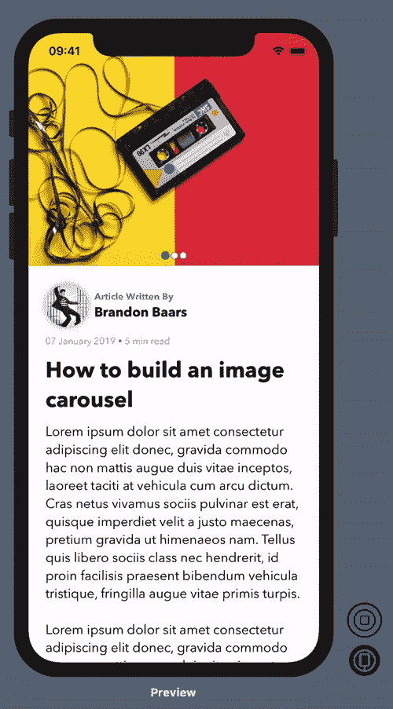
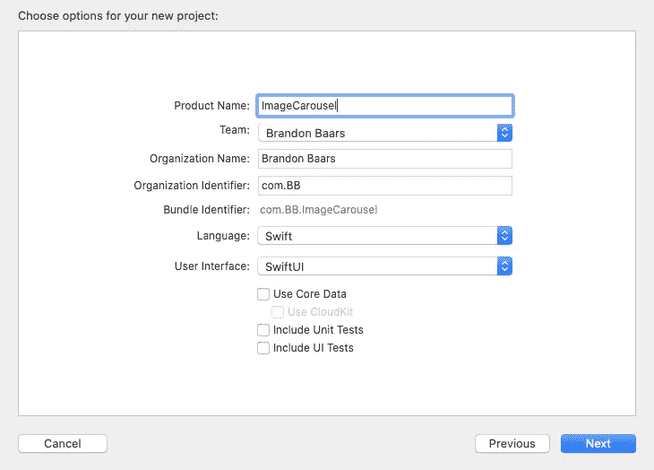
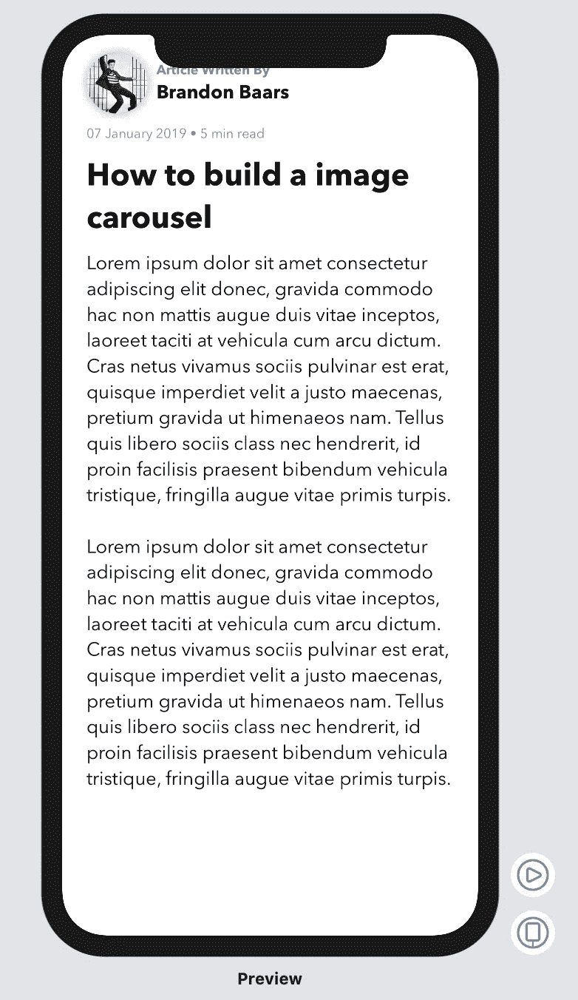
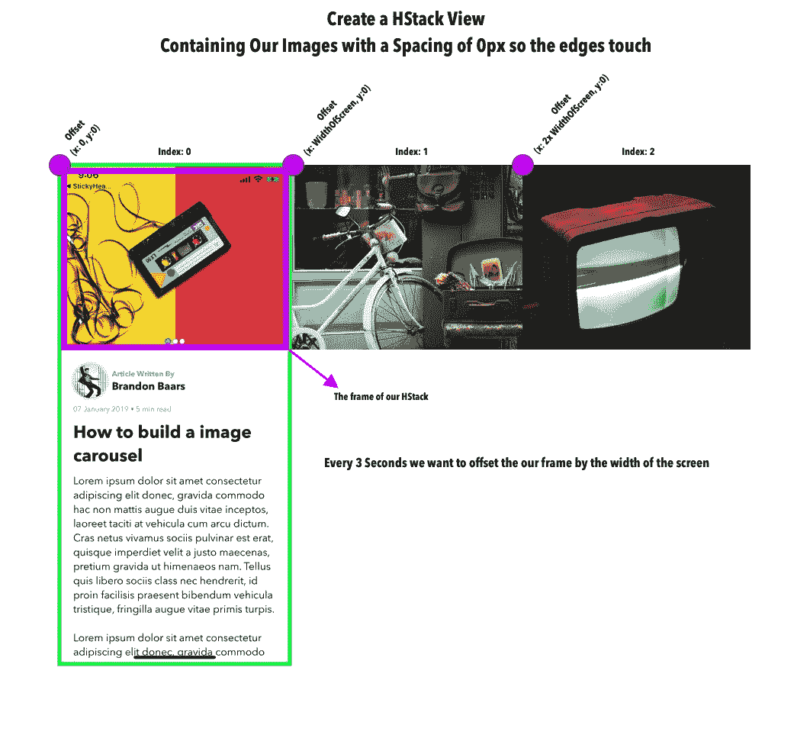
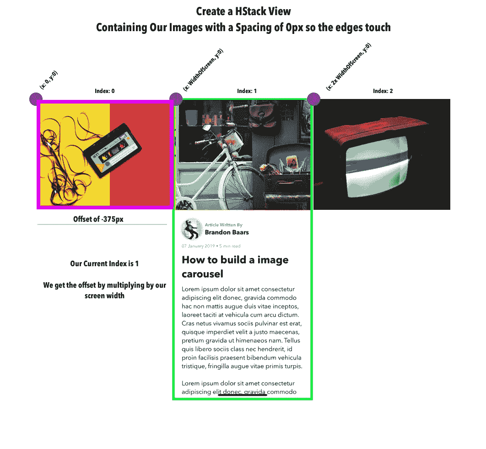
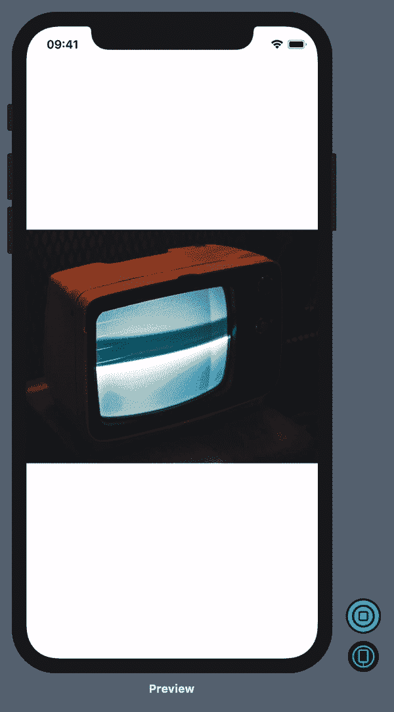
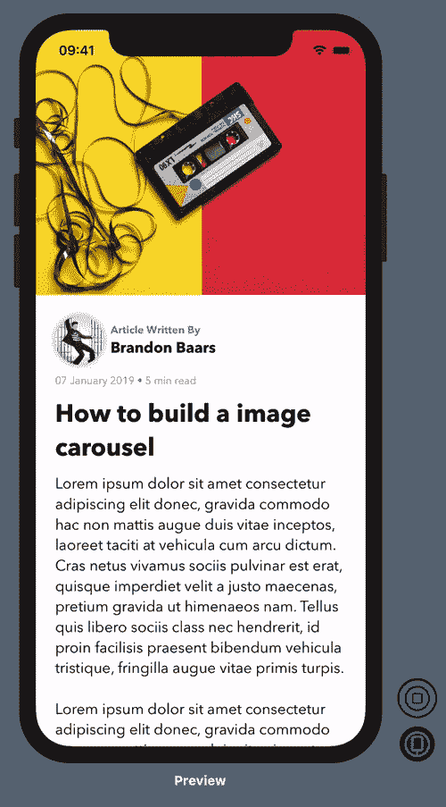

# SwiftUI:使用定时器创建一个图像轮播

> 原文：<https://levelup.gitconnected.com/swiftui-create-an-image-carousel-using-a-timer-ed546aacb389>

## 了解如何在 SwiftUI 中构建一个带有计时器的自动变化图像转盘。


照片由 [Djim Loic](https://unsplash.com/@loic?utm_source=medium&utm_medium=referral) 在 [Unsplash](https://unsplash.com?utm_source=medium&utm_medium=referral) 拍摄

图像传送带是在 iPhone 上以最小的空间向用户显示多张照片的好方法。

**这就是我们在本教程中要完成的任务:**
每三秒钟图像就会切换一次。



# 入门指南

在 Xcode 中创建新的 SwiftUI 项目。确定您运行的是 macOS Catalina，并且安装了 Xcode 11。(允许您使用 SwiftUI)

打开 Xcode →文件→新建→项目

**确保用户界面设置为 SwiftUI**



如果你想看我正在使用的图片，这里有链接:

**///背景**

```
https://www.pexels.com/photo/man-in-bus-247929/
https://www.pexels.com/photo/black-crt-tv-showing-gray-screen-704555/
https://www.pexels.com/photo/black-cassette-tape-on-top-of-red-and-yellow-surface-1626481/
```

**///人**

```
[https://www.pexels.com/photo/adolescent-adult-black-and-white-casual-270968/](https://www.pexels.com/photo/adolescent-adult-black-and-white-casual-270968/)
```

一旦创建了项目，打开`ContentView.swift`并添加下面的代码来创建这个项目的布局框架。

上面的代码会产生这样的结果:



我们需要创建我们的`ImageCarouselView`,它将包含必要的逻辑，以动画显示图像随时间的变化。

# 我们如何做到这一点？



我们的 HStack(粉红色的框架)将有一个当前的索引，显示当前有多少张照片。对于这个例子，我有 3 个图像，我们的开始索引是 0，结束索引是 2。

当我们的 3 秒计时器触发时，我们将获取下一个索引，并将其乘以我们的帧的宽度。这将给我们新的偏移量，这将是下一幅图像的起始`(x:y:)`坐标。

该视图现在看起来类似于:



我们将继续这种模式，直到我们达到我们的最终索引，在这种情况下，下一个索引将从 0 开始。

创建一个新的 Swift 文件并将其命名为`ImageCarouselView.swift`。

将以下代码添加到新创建的 Swift 文件中:

1.  确保导入 SwiftUI 和 Combine，因为下面的代码不起作用。
2.  我们声明了一个名为`ImageCarouselView`的`Struct`，其中包含在名称`Content`中的视图属于视图类型。这基本上允许我们创建一个容器视图，看起来像这样:`ImageCarouselView {`
    `Text("Hello World")`
    `}`
    在这种情况下，我们的`private var content: Content`是对上面声明中的`{ }`之间的所有内容的引用，即
    `Text(“Hello World”)`
3.  我们需要知道将会有多少图像，还需要为将要呈现的内容存储一个变量。如上文第 2 点所述。
4.  保持状态，以我们的变化指数。这将允许我们的视图在这个变量更新时更新。
5.  一个`Time.Publisher`将使用`.main`运行循环选项(因为它正在更新我们的用户界面)和`.common`模式在我们的应用程序中与其他事件一起运行。
    我们还使用`.autoConnect()`来自动化与可连接发布者的连接或断开的过程。
6.  我们的自定义`init()`接受图像的数量并利用`@ViewBuilder`。`ViewBuilder`是一个很棒的工具，它允许我们创建一个定制的视图容器来在这个容器中呈现特定的视图。(修卡)
7.  创建我们的`PreviewProvider`。因为我们已经利用了内容闭包来呈现这个容器中的孩子，所以我们需要传入一个视图。在这种情况下，`Text(“Hello World”)`。

现在应该在屏幕右侧的实时预览中心呈现文本“Hello World”。

接下来，添加以下代码来创建滚动效果:

1.  我们添加一个几何阅读器来获取包含该视图的父视图框架。
2.  创建一个 HStack。这将容纳我们所有的 3 个图像。我们指定间距为 0，这样边缘就对齐了。
3.  我们现在呈现来自`@ViewBuilder`的内容。在我们的`PreviewProvider`中指定的内容将是包含在`HStack`中的彼此相邻的 3 幅图像。
4.  我们将`HStack`的框架指定为父视图的宽度和高度。在我们这里，`(width: UIScreen.main.bounds.width, height: 300)`。这将只在屏幕上显示一个图像，另外两个在它的右边。
5.  我们用当前索引乘以父索引宽度的倒数来得到偏移量。这将提供向左的偏移，因此新图像看起来像是从右边移动过来的。
6.  添加一个`.spring()`的动画。这将为我们自动更新对我们的 `HStack()`的所有更改，并显示一个 spring 动画。
7.  每当我们的出版商改变时，就会调用`.onReceive(self.timer) { _ in }`。在这种情况下，我们的发布者将每 3 秒发布一次更新。这将接收更新，然后在我们的闭包中，我们可以更新当前的索引。我们使用当前的索引，并使用 mod 运算符将范围保持在 0–2 之间。我们的索引顺序如下:0 → 1 → 2 → 0 …等等。

这是您的视图当前应该看起来的样子。



我们现在可以回到`ContentView.swift` 并将
`// Add the ImageCarouselView Here.`替换为

```
GeometryReader { geometry in
 ImageCarouselView(numberOfImages: 3) {
    Image(“image_carousel_1”)
      .resizable()
      .scaledToFill()
      .frame(width: geometry.size.width, height:geometry.size.height)
      .clipped()
     Image(“image_carousel_2”)
     .resizable()
      .scaledToFill()
     .frame(width: geometry.size.width, height:         geometry.size.height)
     .clipped()
    Image(“image_carousel_3”)
     .resizable()
     .scaledToFill()
     .frame(width: geometry.size.width, height: geometry.size.height)
     .clipped()
    }
 }.frame(height: 300, alignment: .center)
```

我们真正做的是向我们的视图容器中添加 3 个子容器，这 3 个子容器都是具有父容器的指定宽度和高度的图像。

我们剪辑图像，使它们不会超出我们给它们的框架，因为它们是`.scaledToFill()`。

这就是我们在`ImageCarouselView.swift PreviewProvider`中所拥有的。

我们目前的应用程序是:



# 底部的当前页面指示器呢？

我们可以为转盘中的每个图像创建一个新的圆形视图。根据当前显示的索引，我们可以将圆形背景图像更新为不同的颜色。

当当前索引改变时，这将“重新渲染”,从而自动更新我们的背景颜色。

将这段代码添加到`ImageCarousel.swift`:

1.  我们将图像的`HStack`和新创建的`HStack`包装在一个`ZStack`中。这将允许我们把我们的页面视图指示点放在我们的图像上面。
2.  增加间距为 3 的`HStack`。这将在每个圆形视图之间放置 3px 的间距。
3.  从`0..<self.numberOfImages`开始循环范围。在这种情况下，我们将从 0 → 2。我们为创建的每个视图分配一个惟一的 id。在这种情况下，它只是我们每次迭代得到的索引。这由`\.self`表示。
4.  根据正在显示的视图是否为活动视图，创建一个宽度和高度均为 8x8 或 10x10 的`Circle()`视图。
    我们还根据它是否是活动视图来改变前景色。
    底部加少量填充，添加动画视图修改器。当图像的索引从我们的`Time.Publisher.`改变时，这将自动显示颜色和帧的变化

# 就是这样！

您已经成功创建了页面视图。这可以通过在`@ViewBuilder`闭包内添加图像并增加图像的数量来扩展到更多的图像。

# 概述

`GeometryReader`非常适合创建基于父视图的视图。

`ViewBuilder`允许我们创建一个与`HStack`、`VStack`和`ZStack`非常相似的容器视图。

在 SwiftUI 中，重新渲染之间的动画非常容易。

点击这里查看完整的源代码。

[](https://github.com/bbaars/SwiftUI-Image-Carousel) [## bbaars/swift ui-图像-旋转木马

### 此时您不能执行该操作。您已使用另一个标签页或窗口登录。您已在另一个选项卡中注销，或者…

github.com](https://github.com/bbaars/SwiftUI-Image-Carousel)