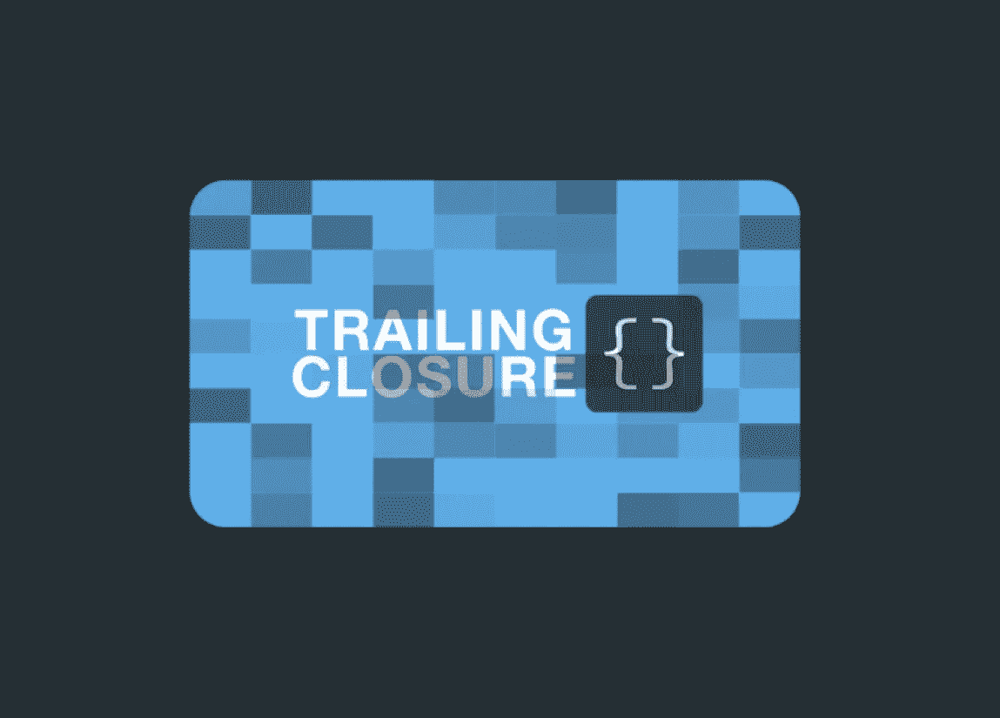
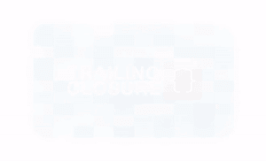
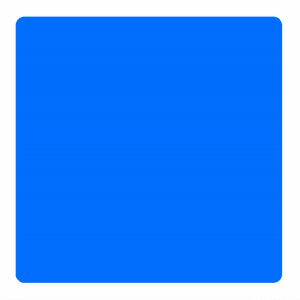
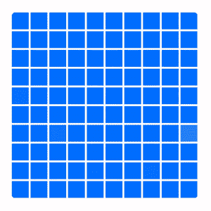
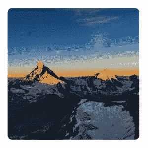

# SwiftUI:溶解效果

> 原文：<https://levelup.gitconnected.com/swiftui-dissolve-effect-7e98a82c07a1>

## 是时候锻炼我们的肌肉了！在本周的教程中，我们将对经典的溶解效果进行一些改变！



使用`Rectangle`的溶解效果

> 在开始之前，请考虑使用这个[链接](https://trailingclosure.com/signup/)订阅，如果你没有在[TrailingClosure.com](https://trailingclosure.com/)上阅读这篇文章，请随时来看看我们！

## 入门指南

在上面的例子中，我展示了当`Rectangle`被用作溶解效果的遮罩时的样子。然而，在本教程中，我们将创建一个`ViewModifier`，它接受任何`View`作为它用来创建溶解效果的形状。敬请关注，看看这种效果到底有多强大！

1.  创建一个名为`ShapeDissolveModifier`的新`ViewModifier`。下面是我们结构的样板文件。定义了两个变量。第一个是我们的`mask`的溶解效果。我们的`Mask`类型在上面被定义为`ShapeDissolveModifier`上的通用类型。第二个是溶解动画的`progress`。随着从`0`到`1`的增加，视图将消失。

```
struct ShapeDissolveModifier<Mask: View>: ViewModifier {

    let mask: Mask
    var progress: Double

    func body(content: Content) -> some View {
        content
    }
}
```

1.  创建一个新功能`buildMask(GeometryProxy, Double) -> some View`。这个函数的工作是获取我们之前定义的蒙版模板`mask`，并创建 100 个不同的`opacity`副本。这些副本结合起来形成一个完整的面具，它会随着时间的推移而溶解。

```
func buildMask(geometry: GeometryProxy, progress: Double) -> some View {
    // Create Dissolve Mask here...
}
```

1.  在该功能中，我们使用`GeometryProxy`来计算掩模板副本的尺寸。

```
func buildMask(geometry: GeometryProxy, progress: Double) -> some View {

    let width = geometry.size.width
    let height = geometry.size.height

    let wUnit = width/10.0
    let hUnit = height/10.0

    // resize the mask to 1/10th of the parent view.
    let maskPiece = mask
        .frame(width: wUnit, height: hUnit, alignment: .center)
}
```

1.  接下来，我们需要创建三个闭包，以允许我们为掩码副本生成`x`、`y`和`opacity`值。

```
func buildMask(geometry: GeometryProxy, progress: Double) -> some View {

    let width = geometry.size.width
    let height = geometry.size.height

    let wUnit = width/10.0
    let hUnit = height/10.0

    // resize the mask to 1/10th of the parent view.
    let maskPiece = mask
        .frame(width: wUnit, height: hUnit, alignment: .center)

    // Calculate X coordinate for a mask copy
    let xCoord = { (x:Int) -> CGFloat in
        wUnit * CGFloat(x)
    }

    // Calculate Y coordinate for a mask copy
    let yCoord = { (y:Int) -> CGFloat in
        hUnit * CGFloat(y)
    }

    // Calculate a random opacity for a mask copy
    let opacity = { () -> Double in
        return Double.random(in: 0...3) * progress + progress
    }

}
```

1.  现在把它们放在一起。我们将使用`ForEach`生成带有适当值的`100` `mask`片段，使用我们刚刚制作的闭包。

```
func buildMask(geometry: GeometryProxy, progress: Double) -> some View {

    let width = geometry.size.width
    let height = geometry.size.height

    let wUnit = width/10.0
    let hUnit = height/10.0

    // resize the mask to 1/10th of the parent view.
    let maskPiece = mask
        .frame(width: wUnit, height: hUnit, alignment: .center)

    // Calculate X Coordinate for a mask copy
    let xCoord = { (x:Int) -> CGFloat in
        wUnit * CGFloat(x)
    }

    // Calculate Y Coordinate for a mask copy
    let yCoord = { (y:Int) -> CGFloat in
        hUnit * CGFloat(y)
    }

    // Calculate Random Opacity for a mask copy
    let opacity = { () -> Double in
        return Double.random(in: 0...3) * progress + progress
    }

    // Combine all of the mask pieces together
    let fullMask = Group {
        ForEach(0..<100) { x in
            maskPiece
                .offset(x: xCoord(x%10), y: yCoord(x/10))
                .opacity(opacity())
        }
    }

    return fullMask
}
```

## 用法举例！

现在有趣的部分来了。我已经收集了一些不同的例子。大多数情况下，我只是在玩它，但是你会看到一些简洁的用法。

这些是基于仅仅改变传递给`ShapeDissolveModifier`的`mask`的不同效果。

```
Rectangle()
    .foregroundColor(.blue)
    .frame(width: 300, height: 300, alignment: .center)
    .cornerRadius(10)
    .modifier(ShapeDissolveModifier(mask:
        Rectangle()
    ,progress: progress))
    .onAppear {
        withAnimation(Animation.easeInOut(duration: 3.0)) {
            self.progress = 1.0
        }
    }
```



`Rectangle`面具

```
Rectangle()
    .scaleEffect(0.9)
```



## 用在图像上

```
Image("mountains")
    .resizable()
    .scaledToFill()
    .foregroundColor(.blue)
    .frame(width: 300, height: 300, alignment: .center)
    .cornerRadius(10)
    .modifier(ShapeDissolveModifier(mask:
        Rectangle()
    ,progress: progress))
    .onAppear {
        withAnimation(Animation.easeInOut(duration: 3.0)) {
            self.progress = 1.0
        }
    }
```



```
Triangle()
    .rotation(Angle(degrees: 90))
    .scaleEffect(3)
```


```
Circle()
    .scaleEffect(1.5)
```


## 支持未来像这样的教程！

请考虑使用此[链接](https://trailingclosure.com/signup/)进行订阅。如果你没有在[TrailingClosure.com](https://trailingclosure.com/)看到这篇文章，请随时来看看我们！

我们想看你的作品！如果你已经用这个教程制作了一些东西，请给我们发图片！在推特 [@TrailingClosure](https://twitter.com/TrailingClosure) 上找到我们，或者发邮件到[howdy@TrailingClosure.com](mailto:howdy@trailingclosure.com)联系我们