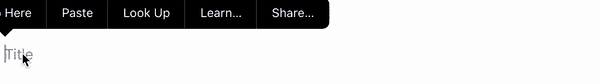

# SwiftUI:浮动标签文本字段

> 原文：<https://levelup.gitconnected.com/swiftui-floating-label-text-field-af04c2eb1a2b>

照片由 [Marija Zaric](https://unsplash.com/@simplicity?utm_source=medium&utm_medium=referral) 在 [Unsplash](https://unsplash.com?utm_source=medium&utm_medium=referral) 上拍摄

虽然`TextField`提供了几个标准特性，但是您可能想要一个浮动标签，如上所示。

你如何用 SwiftUI 做到这一点？

# 步骤 1:创建视图

只是标准业务。我们需要两个值:占位符文本和要显示的文本。

# 步骤 2:添加模型

基于给定的初始值设置模型。

我们需要对它进行一些初始化:

# 步骤 3:构建视图

现在，我们可以使用模型的属性来构建基本视图:

我们在这里做的是:我们覆盖占位符和文本字段的文本，从而将两者分开。这样，我们就可以随心所欲地移动占位符。

# 步骤 4:查看文本字段内容

我们现在增强模型。通过这种方式，我们可以实时查看对文本字段内容的修改:

我们给`@Published`文本属性附加了一个`.sink`。`value`反映输入到`TextField`的当前字符串，用于设置模型的`currentValue`。

# 步骤 5:对内容的变化做出反应

在视图中，我们现在可以检查`currentValue`是否为空，并相应地使用一些过渡和动画做出反应:

就是这样。这是完整的代码: