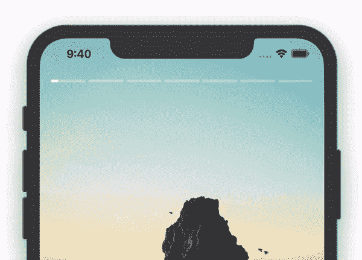
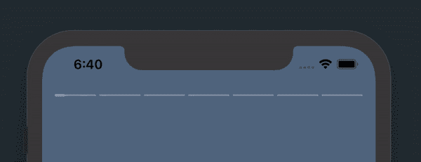
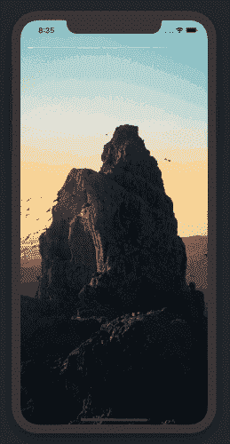

# SwiftUI — Instagram 故事教程

> 原文：<https://levelup.gitconnected.com/swiftui-instagram-story-tutorial-37f80711544>

## 让-马克·布里安内



最终产品

这里是最终产品的外观。很多用过 Instagram 的人都会很熟悉。最棒的是，这并不一定要严格适用于分享社交媒体照片。您可以使用这种类型的视图来展示任何东西。它可以是产品、新闻文章或其他照片。我们开始吧！

> 在开始之前，请考虑使用这个[链接](https://trailingclosure.com/signup/)订阅，如果你没有在[TrailingClosure.com](https://trailingclosure.com/)上阅读这篇文章，请随时来看看我们！

## 入门指南

如果你在 Xcode 中跟随，那么你将需要这个项目的一些照片。我从 Unsplash 的自然版块收集了一些来用于本教程。你可以在这里下载它们

一旦有了这些，启动 Xcode，创建一个新项目，并将照片添加到`Assets.xcassets`文件夹中。

## 创建`LoadingRectangle`视图



每个单独的部分是一个装载矩形

`LoadingRectangle`将用于显示每张照片的时间进程。它由两个`Rectangle`视图组成，一个在另一个之上。顶部的`Rectangle`随着时间的推移增加它的宽度来覆盖另一个。

1.  首先创建一个新的 SwiftUI 视图，名为`LoadingRectangle`。
2.  移除为您生成的`Text`，并用`GeometryReader`替换它。这会给你一个参考，我们马上要用到的框架。
3.  接下来为了堆叠两个矩形，在`GeometryReader`中添加一个`ZStack`，并放置在两个`Rectangle`视图中。确保你给`ZStack`一个`.leading`对齐，这样我们的顶部`Rectangle`将从左手边开始生长。

以下是目前为止您应该有的内容:

```
var body: some View {
    GeometryReader { geometry in
        ZStack(alignment: .leading) {
            Rectangle()
            Rectangle()
        }
    }
}
```

接下来，我们需要修改顶部的`Rectangle`,这样它会随着时间改变大小。为此，您需要声明`progress`变量。

```
var progress: CGFloat
```

然后修改第二个`Rectangle`，使其宽度根据`progress`变量变化。

```
var body: some View {
    GeometryReader { geometry in
        ZStack(alignment: .leading) {
            Rectangle()
            Rectangle()
                .frame(width: geometry.size.width * self.progress, height: nil, alignment: .leading)
        }
    }
}
```

最后，你可以根据自己的喜好设计矩形的样式。我已经修改了他们的圆角半径和颜色。最终的`body`代码如下。

```
var body: some View {
    GeometryReader { geometry in
        ZStack(alignment: .leading) {
            Rectangle()
                .foregroundColor(Color.white.opacity(0.3))
                .cornerRadius(5)

            Rectangle()
                .frame(width: geometry.size.width * self.progress, height: nil, alignment: .leading)
                .foregroundColor(Color.white.opacity(0.9))
                .cornerRadius(5)
        }
    }
}
```

## 组合图像和`LoadingRectangle`

让我们转到`ContentView.swift`。Xcode 在您制作项目时生成了这个文件。

首先在顶部声明一个图像名称数组。这些应该是我们之前添加的照片的名称，并且将是我们在“故事”中显示的图像。

```
var imageNames:[String] = ["image01","image02","image03","image04","image05","image06","image07"]
```

类似于我们在`LoadingRectangle`中所做的，用包裹在`GeometryReader`中的`ZStack`替换`Text`，并将`Image`和水平堆叠的`LoadingRectangle`放入其中。

```
var body: some View {
    GeometryReader { geometry in
        ZStack(alignment: .top) {
            Image(self.imageNames[0])
                .resizable()
                .edgesIgnoringSafeArea(.all)
                .scaledToFill()
                .frame(width: geometry.size.width, height: nil, alignment: .center)
                .animation(.none)
            HStack(alignment: .center, spacing: 4) {
                ForEach(self.imageNames.indices) { x in
                    LoadingRectangle(progress: 1.0)
                        .frame(width: nil, height: 2, alignment: .leading)
                        .animation(.linear)
                }
            }.padding()
        }
    }
}
```

出于时间的原因，我已经添加了一些东西，但是请随意回去试验一些设置来感受一下我所做的(特别是图像的修改器和`LoadingRectangle`的框架)

目前，我们已经在上面的代码中添加了两个占位符。

1.  对于当前显示的图像。`Image(self.imageNames[0])`
2.  查看每个`LoadingRectangle`的进度。`LoadingRectangle(progress: 1.0)`

为了前进，我们需要创建我们的`StoryTimer`，它控制照片间的移动，并将其进度反馈给`LoadingRectangle`。

## 创建`StoryTimer`

我们需要创建的最后一个部分是一个计时器。这将是一个 ObservableObject，它向我们的其余部分发布它的`progress`变量。

```
class StoryTimer: ObservableObject {

    @Published var progress: Double
    private var interval: TimeInterval
    private var max: Int
    private let publisher: Timer.TimerPublisher
    private var cancellable: Cancellable?

    init(items: Int, interval: TimeInterval) {
        self.max = items
        self.progress = 0
        self.interval = interval
        self.publisher = Timer.publish(every: 0.1, on: .main, in: .default)
    }

    func start() {
        self.cancellable = self.publisher.autoconnect().sink(receiveValue: {  _ in
            var newProgress = self.progress + (0.1 / self.interval)
            if Int(newProgress) >= self.max { newProgress = 0 }
            self.progress = newProgress
        })
    }
}
```

看看`StoryTimer`的初始化器。它接受我们的“故事”中的项目数量，以及我们应该显示每个项目多长时间的一个`TimeInterval`。

当我们的`ContentView`出现时，我们将调用`start()`函数，开始从`TimerPublisher`接收值。每次收到一个新值，我们就更新由我们的`StoryTimer`类发布的`progress`变量。这反过来触发我们的`ContentView`用正确的进度更新我们的`LoadingRectangle`,并在屏幕上显示正确的图像。

## 删除`ContentView`中的占位符

首先在`ContentView`的顶部创建一个`StoryTimer`的实例。

```
@ObservedObject var storyTimer: StoryTimer = StoryTimer(items: 7, interval: 3.0)
```

然后用以下代码替换声明`Image`的那一行:

```
Image(self.imageNames[Int(self.storyTimer.progress)])
```

这样做的目的是从`StoryTimer`获取进度，并通过其索引选择相应的图像。

我们需要更新的第二个占位符是关于我们的`LoadingRectangle`进度的占位符。将其实例化替换为以下内容:

```
LoadingRectangle(progress: min( max( (CGFloat(self.storyTimer.progress) - CGFloat(x)), 0.0) , 1.0) )
```

这看起来像是发生了很多事情，但实际上只是一些简单的数学。`self.storyTimer.progress`数值范围从`0`到`N`(要显示的照片数量)。这里`Loadingrectangle`需要一个从`0.0`到`1.0`的进度值。我们正在根据每个`LoadingRectangle`(本例中为`x`)的索引进行转换

**启动定时器**
最后，在`ContentView.swift`中的`ZStack`底部，当视图出现时需要启动`StoryTimer`。

```
var body: some View {
    GeometryReader { geometry in
        ZStack(alignment: .top) {
            /* Image and LoadingRectangles Here */
        }
        .onAppear { self.storyTimer.start() }
        .onDisappear {self.storyTimer.cancel() }

    }
}
```

如果一切顺利，你应该能够点击运行按钮，并得到你所看到的如下。



成品

## 额外学分

如果你想多走一步，你可以在屏幕的每一半实现`TapGesture` s，像在 Instagram 应用程序中一样循环浏览照片。

## 在`ContentView.swift`中增加`TapGesture`

在主`ContentView`体内`ZStack`底部增加以下`HStack`。

```
HStack(alignment: .center, spacing: 0) {
    Rectangle()
        .foregroundColor(.clear)
        .contentShape(Rectangle())
        .onTapGesture {
            self.storyTimer.advance(by: -1)
    }
    Rectangle()
        .foregroundColor(.clear)
        .contentShape(Rectangle())
        .onTapGesture {
            self.storyTimer.advance(by: 1)
    }
}
```

## 修改`StoryTimer`

接下来我们需要给`StoryTimer`类添加一个函数，允许我们增加或减少它的进度。我们想看下一张照片，但不要跳过太远，切入它的放映时间。下面的函数计算当前项目索引，然后推进进度(或者，如果您提供负数，则减去进度)。

```
func advance(by number: Int) {
    let newProgress = max((Int(self.progress) + number) % self.max , 0)
    self.progress = Double(newProgress)
}
```

## 全部完成

再试一次！尝试从屏幕的左侧和右侧轻按，以查看照片的前后移动。最好的部分是，`LoadingRectangle`仍然无缝动画。

## 支持未来的帖子

如果你喜欢这篇文章，请考虑使用这个[链接](https://trailingclosure.com/signup/)订阅我的网站，如果你没有在【TrailingClosure.com】的上阅读这篇文章，请随时来看看我们！