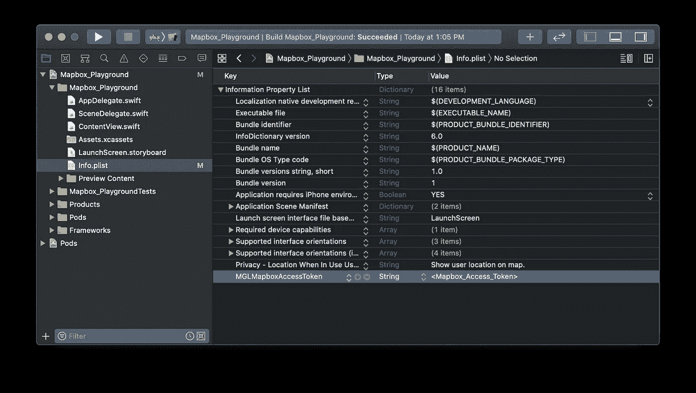

# SwiftUI:集成 Mapbox SDK

> 原文：<https://levelup.gitconnected.com/swiftui-integrating-the-mapbox-sdk-5a8098708b3c>

## 让-马克·布里安内


使用 SwiftUI 的 Mapbox 地图

**MapBox** 是一个面向移动和网络应用的位置数据平台。它们提供构建模块，将地图、搜索和导航等定位功能添加到您创建的任何应用程序中。对于这个应用程序，我们将使用他们的 iOS SDK，以便在他们的地图上显示基本的点注释。

## 安装 Mapbox SDK

首先，我们将把 Mapbox SDK 添加到我们的项目中。将 SDK 添加到应用程序的最佳方式是通过 [CocoaPods](https://guides.cocoapods.org/using/getting-started.html) 。

> 如果您的机器上还没有安装 **CocoaPods** ，那么打开一个终端并运行下面的命令。
> `sudo gem install cocoapods`

打开终端并导航到您的项目目录。您希望在存放您的`<project_name>.xcodeproj`的文件夹中。然后运行下面的命令，用您的项目初始化 **Cocoapods** 。

```
pod init
```

一旦完成，应该有一个名为`Podfile`的目录下创建的新文件。这是我们将编辑的文件，以将 **Mapbox SDK** Cocoapod 添加到我们的应用程序中。打开该文件，并在注释`# Pods for <project_name>`下添加下面一行。记得在编辑后保存文件。

```
pod 'Mapbox-iOS-SDK', '~> 5.9'
```

现在回到您的终端，运行下面的命令来安装 Pod。将 SDK 下载并安装到您的项目中可能需要几分钟时间。

```
pod install
```

完成后，关闭 Xcode 项目并重新打开它。不是打开`<project_name>.xcodeproj`，而是打开`<project_name>.xcworkspace`文件。这是我们将从现在开始用来编辑我们的项目的文件。它完成了将 **Mapbox SDK** 包含在我们项目中的所有工作。

## 设置 API 令牌和权限

为了在你的应用中使用 Mapbox SDK，你需要一个 api 令牌。幸运的是这是免费的。

1.  在 Mapbox.com 的[上创建账户](https://mapbox.com)
2.  导航到您的帐户主页
3.  滚动到底部，显示**“访问令牌”**。它将显示您可以用于此应用程序的默认公共令牌。


在 Mapbox 上创建您的访问令牌

1.  接下来，我们需要将令牌复制到您的`Info.plist`文件中。用键`MGLMapboxAccessToken`创建一行，其值应该是您的访问令牌。
2.  用关键字`NSLocationWhenInUseUsageDescription`和值`Show user location on map.`在`Info.plist`文件中创建另一行



修改`Info.plist`以包括访问令牌和使用描述

## 添加地图

为了在我们的应用程序中使用 Mapbox 的`MGLMapView`，我们需要创建一个`UIViewRepresentable` ( [苹果的文档](https://developer.apple.com/documentation/swiftui/uiviewrepresentable))。

## `MapboxMap`

```
import SwiftUI
import Mapbox

struct MapboxMap: UIViewRepresentable {

    private let mapView: MGLMapView = MGLMapView(frame: .zero, styleURL: MGLStyle.lightStyleURL)

    func makeUIView(context: Context) -> MGLMapView {
        mapView.autoresizingMask = [.flexibleWidth, .flexibleHeight]
        mapView.setCenter(CLLocationCoordinate2D(latitude: 59.31, longitude: 18.06), zoomLevel: 9, animated: false)
        mapView.delegate = context.coordinator
        return mapView
    }

    func updateUIView(_ uiView: MGLMapView, context: Context) {}
}
```

然后导航到您的`ContentView.swift`文件，将`Text`占位符替换为`MapboxMap`，如下所示:

```
struct ContentView: View {
    var body: some View {
        MapboxMap()
    }
}
```


使用`MapboxMap`运行我们的应用

## 添加注释

让我们继续开发我们的`MapboxMap`结构。我们将添加一个协调器，以允许我们与 MGLMapVieDelegate 进行交互。这将允许我们做一些事情，比如在地图上标注。

## 创建一个协调员

在你的`MapboxMap`结构中定义从`NSObject`继承并实现`MGLMapViewDelegate`的类`Coordinator`。

```
class Coordinator: NSObject, MGLMapViewDelegate {

}
```

接下来我们需要实现允许我们添加注释的`MGLMapViewDelegate`函数。

```
class Coordinator: NSObject, MGLMapViewDelegate {

    func mapView(_ mapView: MGLMapView, viewFor annotation: MGLAnnotation) -> MGLAnnotationView? {
        return nil
    }

    func mapView(_ mapView: MGLMapView, annotationCanShowCallout annotation: MGLAnnotation) -> Bool {
        return true
    }

}
```

## 执行`makeCoordinator`

在你的`MapboxMap`结构中，我们需要实现`makeCoordinator()`函数，并告诉它使用我们新的协调器。SwiftUI 在`makeUIView(context:)`之前调用这个`makeCoordinator()`方法，以便在配置视图时可以访问协调器对象。

> 您可以使用这个协调器来实现常见的 Cocoa 模式，比如代理、数据源，以及通过目标动作来响应用户事件。

```
func makeCoordinator() -> MapboxMap.Coordinator {
    return Coordinator()
}
```

然后更新`makeUIView(context:)`函数，将我们的`mapView`代表设置为协调者。

```
func makeUIView(context: Context) -> MGLMapView {
    mapView.autoresizingMask = [.flexibleWidth, .flexibleHeight]
    mapView.setCenter(CLLocationCoordinate2D(latitude: 59.31, longitude: 18.06), zoomLevel: 9, animated: false)
    mapView.delegate = context.coordinator
    return mapView
}
```

## 存储注释的坐标

在你的`MapboxMap`结构的顶部，我们需要创建一个变量来保存注释的坐标。

```
@Binding var locations:[CLLocationCoordinate2D]
```

现在让我们创建一个函数，将这些坐标作为注释添加到地图中。下面的函数采用地图上的当前注释，并根据当前存储在我们的`locations`变量中的位置构建一个新的点注释数组。

```
private func updateAnnotations() {
    if let currentAnnotations = mapView.annotations {
        mapView.removeAnnotations(currentAnnotations)
    }
    mapView.addAnnotations(locations.map({ (coord) -> MGLPointAnnotation in
        let annotation = MGLPointAnnotation()
        annotation.coordinate = coord
        return annotation
    }))
}
```

现在我们需要做的就是调用我们的`updateUIView(uiview:,context:)`函数。

```
func updateUIView(_ uiView: MGLMapView, context: Context) {
    updateAnnotations()
}
```

## 运行示例

回到`ContentView.swift`，试着用下面的代码运行。

```
struct ContentView: View {

    @State var locations:[CLLocationCoordinate2D] = [CLLocationCoordinate2D(latitude: 59.3293, longitude: 18.0686)]

    var body: some View {
        MapboxMap(locations: $locations)
            .edgesIgnoringSafeArea(.vertical)
    }
}
```


使用 SwiftUI 在 Mapbox 地图上注记

## 支持以后的教程！

请考虑使用此[链接](https://trailingclosure.com/signup)进行订阅。如果你没有在[TrailingClosure.com](https://trailingclosure.com/)看到这篇文章，请随时来看看我们！

如果你已经用这个教程制作了一些东西，请给我们发图片！在推特 [@TrailingClosure](https://twitter.com/TrailingClosure) 上找到我们，或者发邮件到[howdy@TrailingClosure.com](mailto:howdy@trailingclosure.com)联系我们