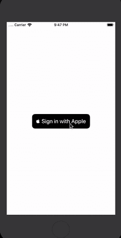
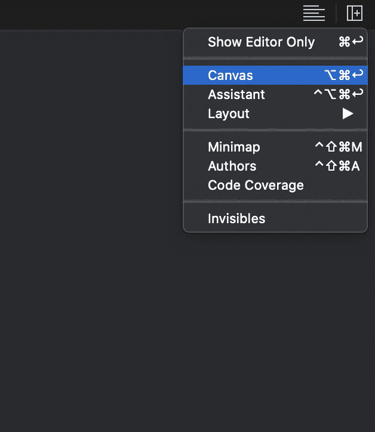
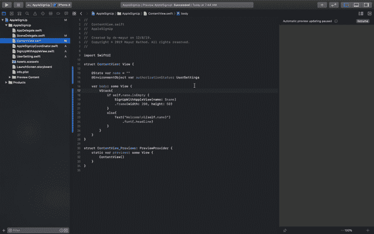
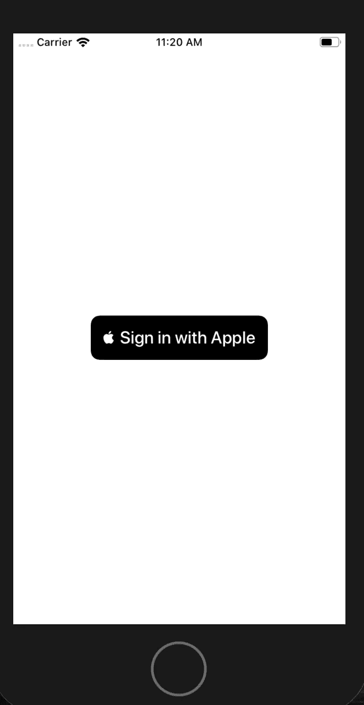

# SwiftUI 登录或登录 Apple

> 原文：<https://levelup.gitconnected.com/swiftui-login-or-sign-in-with-apple-b540f9ded52f>

苹果发布了 SwiftUI，用于在所有苹果平台上构建用户界面。在 2019 年 WWDC 大会上，苹果推出了苹果登录功能，使用该功能，您可以登录这些应用程序。

# 如何隐藏你的电子邮件地址

使用“登录苹果”的主要优势之一是能够隐藏您的真实电子邮件地址，并提供由苹果分配的特殊隐藏电子邮件地址。这个隐藏的地址会将收到的信件转发到你真实的电子邮件地址。

当您使用“登录 Apple”创建帐户时，您可以选取“隐藏我的电子邮件”选项，并输入所有相关电子邮件的转发地址。



# 步骤 1:如何创建您的 SwiftUI 项目

在 XCode 中，进入文件→新建→项目→单视图应用程序→下一步→选择用户界面→ SwiftUI →下一步→选择您想要的项目位置→完成

# 步骤 2: ContentView.swift

默认的`SwiftUI(ContentView)` 文件会出现以下代码:

```
**import** SwiftUI**struct** ContentView: View {**var** body: **some** View {
    Text(”Hello World!”)
  }
}**struct** ContentView_Previews: PreviewProvider { **static** **var** previews: **some** View {
     ContentView()
   }
}
```

在右边，您可以看到 UI 的预览。

如果您看不到预览，请前往调整编辑器选项并选择画布，或者按 option+command+enter ***。*** 之后，确保画布正在显示 UI 预览。



# 步骤 3:使用 Apple 功能添加登录

首先，我们需要从目标→签名&功能→添加功能→登录苹果添加苹果功能



当您添加具有 Apple 功能的登录时，它将创建一个权利文件。为此，您将需要一个苹果开发者帐户，然后只有我们可以创建一个权利。

# 步骤 4:创建用户界面

苹果没有提供用 Apple 按钮登录的 SwiftUI `View`，需要自己包装一个。创建一个`UIViewRepresentable`子类，在 UIView 中用苹果按钮包装一个登录

```
**struct** SignUpWithAppleView: UIViewRepresentable {}
```

现在，我们必须实现协议方法，它们是`updateUIViewController`、`makeCoordinator`和`makeUIViewController`。在`makeUIViewController`中，我们将创建一个苹果登录按钮。我们可以设置按钮类型为`continue`、`default`、`signIn`，样式为`white`、`black`或`whiteOutline`。

```
**import** SwiftUI
**import** AuthenticationServices**struct** SignUpWithAppleView: UIViewRepresentable {**func** makeCoordinator() { 
   }**func** makeUIView(context: Context) -> ASAuthorizationAppleIDButton  {
   //Creating the apple sign in button
   **let** button = ASAuthorizationAppleIDButton(authorizationButtonType: .signIn,
   authorizationButtonStyle: .black)
   button.cornerRadius = 10

   **return** button
   }**func** updateUIView(**_** uiView: ASAuthorizationAppleIDButton, context: Context) {}
}
```

要访问`ASAuthorizationAppleIDButton`，我们需要导入 AuthenticationService 框架。现在让我们创建一个协调器，它将实现`ASAuthorizationAppleIDButton`的委托方法。

# 步骤 5:创建 AppleSignUpCoordinator

现在我们必须创建一个协调器，它可以在`UIViewControllerRepresentable`和`ASAuthorizationController`委托方法之间进行通信。

我们将创建一个新的类`AppleSIgnUpCoordinator`，它将实现协议`ASAuthorizationControllerDelegate`和`ASAuthorizationControllerPresentationContextProviding`，并将实现这些协议所需的方法。

`AppleSignUpCordinator`看起来会像这样:

```
**import** SwiftUI
**import** AuthenticationServices**class** AppleSignUpCoordinator: NSObject, ASAuthorizationControllerDelegate, ASAuthorizationControllerPresentationContextProviding {**var** parent: SignUpWithAppleView?**init**(**_** parent: SignUpWithAppleView) {
      **self**.parent = parent
      **super**.init()
   }**func** presentationAnchor(for controller: ASAuthorizationController) -> ASPresentationAnchor {}**func** authorizationController(controller: ASAuthorizationController,didCompleteWithAuthorization authorization: ASAuthorization)
   {}**func** authorizationController(controller: ASAuthorizationController, didCompleteWithError error: Error) 
   {
      //If there is any error will get it here
   }}
```

在`presentationAnchor`里面，我们必须提供一个窗口，苹果登录的弹出窗口将会出现。因此，方法实现看起来会像这样:

```
**func** presentationAnchor(for controller: ASAuthorizationController) -> ASPresentationAnchor {**let** vc = UIApplication.shared.windows.last?.rootViewController
   **return** (vc?.view.window!)!
}
```

`ASAuthorizationControllerDelegate`方法将告诉我们使用 apple 登录的请求是成功完成还是面临任何错误。这两种方法的实现看起来都像这样:

```
//If authorization is successfull then this method will get triggered
**func** authorizationController(controller: ASAuthorizationController,
didCompleteWithAuthorization authorization: ASAuthorization)
{
   **guard** **let** credentials = authorization.credential **as**?ASAuthorizationAppleIDCredential **else** 
   {
      print(“credentials not found….”)
      **return** }

   //Storing the credential in user default for demo purpose only    ideally we should have store the credential in Keychain**let** defaults = UserDefaults.standard
   defaults.set(credentials.user, forKey: “userId”)
   parent?.name = “\(credentials.fullName?.givenName ?? “”)”
}//If authorization faced any issue then this method will get triggered
**func** authorizationController(controller: ASAuthorizationController, didCompleteWithError error: Error) {
   //If there is any error will get it here
}
```

授权完成后，我们将检查凭证是否存在。如果存在，它将获取名称并存储到 UserDefault 中。

> **注意**:理想情况下，我们应该只将凭证存储到钥匙串中，但是出于演示的目的，我们将它存储到用户默认值中

现在让我们创建一个方法`didTapButton`，当用户点击苹果登录按钮时，这个方法将被触发。

> 请求 Apple 登录 Popover 的步骤

1.  创建 ASAuthorizationAppleIDProvider 的对象
2.  创建请求
3.  定义请求的范围
4.  提出请求

```
**@objc** **func** didTapButton() {//Create an object of the ASAuthorizationAppleIDProvider
   **let** appleIDProvider = ASAuthorizationAppleIDProvider()
   //Create a request
   **let** request = appleIDProvider.createRequest()
   //Define the scope of the request
   request.requestedScopes = [.fullName, .email]
   //Make the request
   **let** authorizationController =
ASAuthorizationController(authorizationRequests: [request])authorizationController.presentationContextProvider = **self** authorizationController.delegate = **self** authorizationController.performRequests()}
```

现在我们的协调器已经准备好进行通信，让我们对`UIViewControllerRepresentable` `makeCoordinator()`函数进行修改。

```
**func** makeCoordinator() -> AppleSignUpCoordinator {
   **return** AppleSignUpCoordinator(**self**)
}
```

让我们在`UIViewControllerRepresentable`文件的`makeUIView`函数中添加苹果按钮动作签到。所以`makeUIView`函数看起来像这样

```
**func** makeUIView(context: Context) -> ASAuthorizationAppleIDButton {

   //Creating the apple sign in button
   **let** button = ASAuthorizationAppleIDButton(authorizationButtonType: .signIn,
   authorizationButtonStyle: .black)
   button.cornerRadius = 10

   //Adding the tap action on the apple sign in button
   button.addTarget(context.coordinator,action: **#selector**(AppleSignUpCoordinator.didTapButton),for: .touchUpInside)

   **return** button}
```

# 步骤 6:设置内容视图

在内容视图中，让我们调用`UIViewControllerRepresentable`,这样内容视图的代码就会像这样

```
**import** SwiftUI**struct** ContentView: View {
   **var** body: **some** View {SignUpWithAppleView()
         .frame(width: 200, height: 50)
   }}**struct** ContentView_Previews: PreviewProvider {
   **static** **var** previews: **some** View {
      ContentView()
   }
}
```

上面代码的输出会是这样的



现在让我们定义包含用户名值的`@State`变量。

```
**import** SwiftUI**struct** ContentView: View {@State **var** name = ""**var** body: **some** View {SignUpWithAppleView()
         .frame(width: 200, height: 50)
   }}**struct** ContentView_Previews: PreviewProvider {
   **static** **var** previews: **some** View {
      ContentView()
   }
}
```

在`UIViewControllerRepresentable`中，让我们创建@Binding 变量作为“名称”。

## 最终代码:SignUpWithAppleView

```
**import** SwiftUI
**import** AuthenticationServices**struct** SignUpWithAppleView: UIViewRepresentable {
   @Binding **var** name : String

   **func** makeCoordinator() -> AppleSignUpCoordinator {
      **return** AppleSignUpCoordinator(**self**)
   }**func** makeUIView(context: Context) -> ASAuthorizationAppleIDButton    {
   //Creating the apple sign in button**let** button = ASAuthorizationAppleIDButton(authorizationButtonType: .signIn,
   authorizationButtonStyle: .black)
   button.cornerRadius = 10//Adding the tap action on the apple sign in button
   button.addTarget(context.coordinator, action: **#selector**(AppleSignUpCoordinator.didTapButton),for: .touchUpInside)**return** button}**func** updateUIView(**_** uiView: ASAuthorizationAppleIDButton, context: Context) {}}
```

现在在 AppleSignUpCoordinator 中获取用户名，并将其分配给`UIViewControllerRepresentable`绑定变量名。

## 最终代码:AppleSignUpCoordinator

```
**import** SwiftUI
**import** AuthenticationServices**class** AppleSignUpCoordinator: NSObject, ASAuthorizationControllerDelegate, ASAuthorizationControllerPresentationContextProviding {**var** parent: SignUpWithAppleView?**init**(**_** parent: SignUpWithAppleView) {
      **self**.parent = parent
      **super**.init()
   }**@objc** **func** didTapButton() {
      //Create an object of the ASAuthorizationAppleIDProvider
      **let** appleIDProvider = ASAuthorizationAppleIDProvider()

      //Create a request
      **let** request = appleIDProvider.createRequest()

      //Define the scope of the request
      request.requestedScopes = [.fullName, .email]

      //Make the request
      **let** authorizationController = ASAuthorizationController(authorizationRequests: [request])

      //Assingnig the delegates
      authorizationController.presentationContextProvider = **self** authorizationController.delegate = **self** authorizationController.performRequests()
   }**func** presentationAnchor(for controller: ASAuthorizationController) -> ASPresentationAnchor {
    **let** vc = UIApplication.shared.windows.last?.rootViewController
    **return** (vc?.view.window!)!
   }//If authorization is successfull then this method will get triggered
   **func** authorizationController(controller: ASAuthorizationController,didCompleteWithAuthorization authorization: ASAuthorization)
 {
   **guard** **let** credentials = authorization.credential **as**? ASAuthorizationAppleIDCredential **else** {
     print(“credentials not found….”)
     **return** }//Storing the credential in user default for demo purpose only deally we should have store the credential in Keychain
     **let** defaults = UserDefaults.standard
     defaults.set(credentials.user, forKey: “userId”)
     parent?.name = “\(credentials.fullName?.givenName ?? “”)”
 }//If authorization faced any issue then this method will get triggered
  **func** authorizationController(controller: ASAuthorizationController, didCompleteWithError error: Error) {//If there is any error will get it here
   print(“Error In Credential”)
  }
}
```

现在，让我们将条件放在内容视图中，比如如果名称不为空，那么将隐藏使用苹果按钮登录，并将显示用户名，否则将显示使用苹果按钮登录

## 最终代码:内容视图

```
**import** SwiftUI**struct** ContentView: View {
   @State **var** name = “”

   **var** body: **some** View {
      VStack{
        **if** **self**.name.isEmpty {
          SignUpWithAppleView(name: $name)
             .frame(width: 200, height: 50)
        }
    **else**{
        Text(“Welcome\n\(**self**.name)”)
            .font(.headline)
      }
    }
  }
}**struct** ContentView_Previews: PreviewProvider {
   **static** **var** previews: **some** View {
      ContentView()
   }
}
```

# 最终代码:

在 [GitHub](https://github.com/rathodmayur93/SwiftUISignInWithApple) 上找到这个项目。

[](https://skilled.dev) [## 编写面试问题

### 一个完整的平台，在这里我会教你找到下一份工作所需的一切，以及…

技术开发](https://skilled.dev)