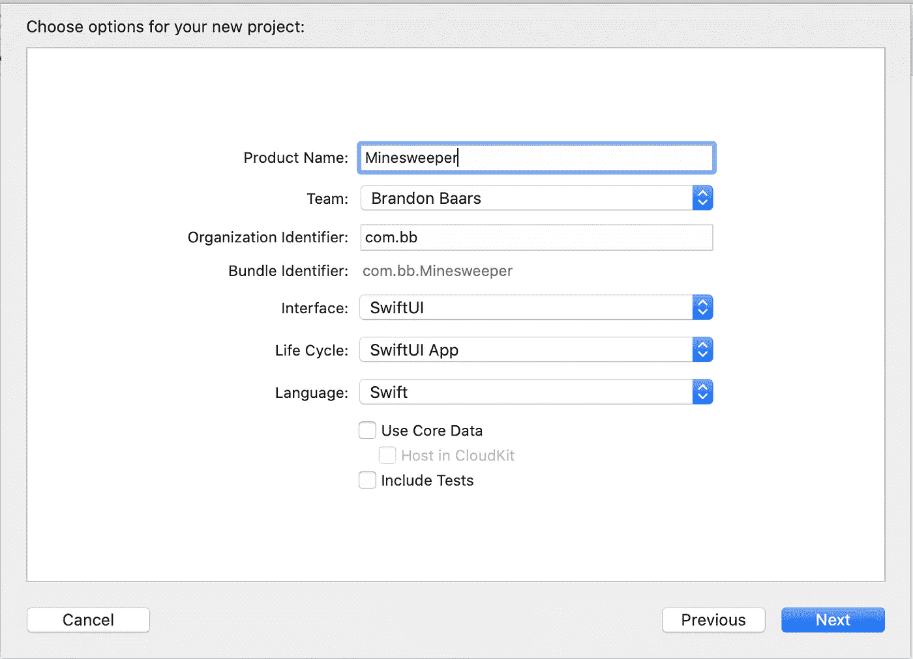
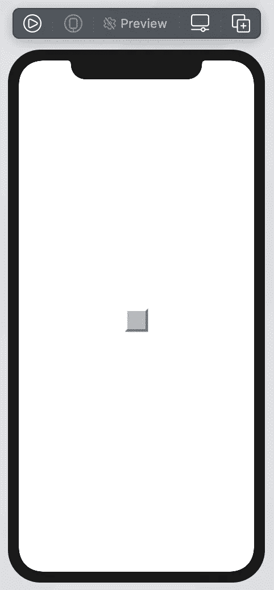
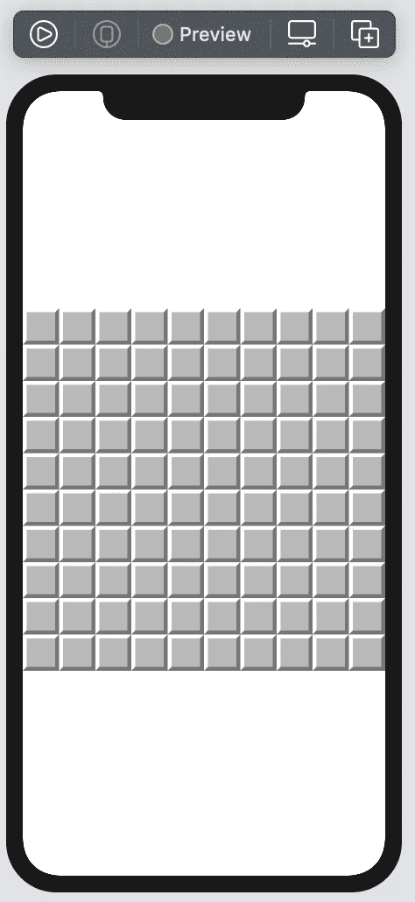
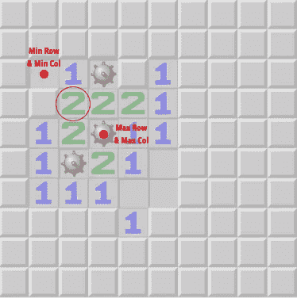
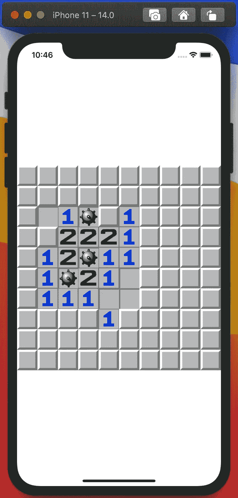

# SwiftUI:扫雷

> 原文：<https://levelup.gitconnected.com/swiftui-minesweeper-cd145f888343>

创建一个没有人知道怎么玩的游戏的超级基本实现


洛伦佐·埃雷拉在 [Unsplash](https://unsplash.com?utm_source=medium&utm_medium=referral) 上的照片

这是我们将在本教程中创建的内容

# 入门指南

在 Xcode 中创建新的 SwiftUI 项目。请确定您正在运行 macOS Catalina(或更高版本)并安装了 Xcode 11(或更高版本)。(这允许您使用 SwiftUI。)

打开 Xcode →文件→新建→项目

我把我的叫做扫雷舰，但是随便你怎么叫。

确保将用户界面设置为 SwiftUI。



# 履行

至于图片，它们都来自 commons.wikimedia.org。这些图片也可以在我的 github repo 中找到。

让我们从定义游戏如何运行的要求开始。

我们想说明我们的网格有多大，炸弹的数量，然后根据这些信息和用户设备的大小计算每个单元的大小。

右键点击顶层文件夹(扫雷)→ **新建组**，命名为‘模型’。

右键单击新创建的模型文件夹，创建一个新的 Swift 文件，并将其命名为`GameSettings.swift`

这个文件将包含上面提到的游戏设置。It ***可以用于通过 UI 设置该信息，但是为了本教程的缘故，我们将把它保留为默认值。***

上面的代码记录了我们应用程序的所有设置。

这里没有使用`@Published`的真正原因。如果我们想将这些设置添加到 UI 中，并让它自动更新 UI，那么它是必需的。(我把它留在这里，以防有人想对此进行扩展)。

我们的下一个设计决定是创建一个`Game.swift`类。这个类将保存我们所有的游戏逻辑。

让我们现在创建该文件。右键单击模型，创建一个新的 Swift 文件，并将其命名为`Game.swift`。

将以下代码添加到新创建的文件中。

到目前为止，我们所做的只是添加了一个继承自`ObservableObject`的游戏类。这将允许这个类本质上“发布”UI 可以“监听”并自动更新的更改。

## 清注意

在撰写本文时，SwiftUI 不处理带有`@Published`的嵌套对象。你可能会想，如果`GameSettings`类中的某些东西发生了变化，它会发布更新，然后这个类 Game 会观察并发布这些变化。*不幸的是，情况并非如此，我将在后面谈到这一点。。*

棋盘中的每个方格本质上都是它的一个单元格，并且会有一个相应的单元格视图。

让我们从创建 Cell 类开始，然后继续到 CellView。

在模型文件夹中创建一个新的 Swift 文件，命名为`Cell.swift`。

非常简单，我们的`Cell`将知道它在其他单元格的网格中的位置，保持一个`Status`，它是否被打开(触摸)以及用户是否标记了该单元格。

下面是我放在它自己的名为`Cell+Status.swift`的文件中的状态代码

“状态”仅仅是它是否是空的，是否暴露在接触的炸弹中(用`case exposed(Int)`表示)，或者是一个炸弹单元。

让我们转到`CellView.swift`文件。这将是一个新的视图文件，并将包含我们的单元格。

创建新的 SwiftUI 视图，并将其命名为`CellView.swift`

我们的单元格视图将可以访问游戏的`EnvironmentObject`,并且有一个单元格将被传入。

这只是一个基础水平的图像，将基于用户屏幕的宽度和我们游戏中的列数。

接下来，返回到`Cell.swift`并添加这个属性，根据单元格状态计算我们的图像。

我们根据单元的不同状态和标志来计算图像。

这是 SwiftUI 画布现在的样子



现在让我们实际创建我们的董事会！

在我们的 Views 文件夹下创建一个新的 SwiftUI 视图，并将其命名为`BoardView.swift`。

我们只需循环我们的`numberOfRows`和`numberOfColumns`并创建一个`VStack`和`HStack`来获得类似网格的视图。

您的画布现在应该看起来像这样



我们需要构建我们的板，并用我们的板替换我们刚刚添加的内容，而不是在我们的嵌套循环中构建一个新的单元格。

该板将被制作并存在于我们的游戏类中。用户界面将根据该板进行更新。

回到`Game.swift`并添加以下代码来生成我们的电路板并随机放置炸弹。

在这里，我们正在构建我们的电路板，并根据在`GameSettings`中声明的炸弹数量随机放置炸弹

现在，回到`BoardView.swift`，我们想要显示我们游戏文件中的棋盘，而不是我们在 UI 中构建的。

进行以下更改:

我们将 ForEach 替换为 board size，并将 boards 单元格传入 CellView。

在这一点上，UI 没有太大的变化。然而，一些细胞现在是“下面”的炸弹。

让我们实现点击行和切换状态。

打开`Game.swift`，添加如下公共函数:

我们检查牢房是不是炸弹，如果是，我们就打开它。否则，我们打开它并将暴露的计数设置为 0。(这个案子我们以后再处理)。

我们必须使用`self.objectWillChange.send()`，因为我们正在更新一个*嵌套的*对象。我们希望我们的 UI 基于那些发布的更改进行更新，所以我们通知我们的类已经更改。

回到`CellView.swift`,在单元格中添加下面的点击手势。

```
.onTapGesture {
    game.click(on: cell)
}
```

这将使用提供的单元格调用我们的`Game.swift` 中的 click 函数。

此时，您可能无法运行您的程序，因为我们还没有更新项目中的`@main`。

打开`MinesweeperApp.swift`并进行以下更改

```
@main
struct MinesweeperApp: App {
    var gameSettings = GameSettings() // our game settings

    var body: some Scene {
        WindowGroup {
            BoardView() // our new ContentView
                .environmentObject(Game(from: gameSettings))
        }
    }
}
```

这将在我们启动应用程序时更新我们的视图。

继续构建并运行，您现在应该会看到如下所示的内容:

太好了！现在，让我们来揭示所有的空单元格，以及找到暴露的计数(又名，接触给定单元格的炸弹数量)。

回到`Game.swift`，让我们添加另一个私有函数，它将计算有多少炸弹接触到我们刚刚点击的单元格。

添加以下代码:

不要改变现在使用我们的`getExposedCount`功能的点击功能。

在这里，我们简单地从单元格的左上角开始，向下到右下角，循环遍历以确定有多少炸弹在它的附近。



红圈是点击。我们从左上角开始，遍历到右下角

当你点击相邻炸弹的单元格时，应该会看到这样的内容:



我们现在要做的最后一件事是，当点击的单元格本身为空时，显示所有的空单元格。

添加显示功能，并再次更新`click`功能。

我们使用递归来访问相邻的单元格，直到这些单元格的暴露计数大于 1，它被标记，已经打开，或者是一个炸弹。

构建并运行，你应该看到当你找到一个空的单元格时，所有相邻的空单元格都打开了！

我们要做的最后一件事就是标记一个单元格。

仍然在`Game.swift`中，添加以下功能来切换标志状态

```
func toggleFlag(on cell: Cell) {
    guard !cell.isOpened else {
        return
    }

    cell.isFlagged = !cell.isFlagged

    self.objectWillChange.send()
}
```

在这里，我们更新单元格标记状态，并通知 UI 我们想要发布这些更改(同样，因为单元格是嵌套的可观察对象，即使单元格已经更改，我们的 UI 也不会更新)。

回到`CellView.swift`，在我们的`tapGesture`下面添加这个`onLongPressGesture`

```
.onLongPressGesture {
    game.toggleFlag(on: cell)
}
```

建立和运行，并尝试长时间按下一个细胞？该标志应该显示为刚刚标记的单元格！

# 就是这样！

希望你喜欢学习 SwiftUI，用最少的代码构建 UI 并随着`@ObservableObject`的变化自动更新是多么容易！

以下是完整的源代码:

[](https://github.com/bbaars/SwiftUI-Minesweeper) [## bbaars/swift ui-扫雷舰

### SwiftUI 中扫雷的超级基本实现 dissolve GitHub 是超过 5000 万开发者的家园…

github.com](https://github.com/bbaars/SwiftUI-Minesweeper)