# Xcode 12 上的 swift ui:ARKit+scene kit+Lott emotion =？

> 原文：<https://levelup.gitconnected.com/swiftui-on-xcode-12-arkit-scenekit-lottiemotion-f214e52d8bdf>

## 最近，我读了一篇名为“如何在 ARKit 和 SceneKit 应用程序中使用 SwiftUI 视图”的好文章，这启发了我重新思考增强现实(AR)和现实世界之间我们可以实现什么。

[](https://medium.com/better-programming/how-to-use-a-swiftui-view-in-anarkit-scenekit-app-d6504d7b92d2) [## 如何在 ARKit 和 SceneKit 应用程序中使用 SwiftUI 视图

### 将 SwiftUI 引入 AR

medium.com](https://medium.com/better-programming/how-to-use-a-swiftui-view-in-anarkit-scenekit-app-d6504d7b92d2) 

在这里，我将使用 ARKit、SceneKit 和 LottieMotion 构建一个简单的应用程序。快速浏览(视频):

# 环境

*   操作系统:macOS 11 Big Sur & iOS 14 beta 6
*   Xcode SDK 版本:12 beta 6
*   荚果([椰子果](https://guides.cocoapods.org/using/the-podfile.html)

# 步骤(适用于 Xcode 12 或更高版本)

## AR 跟踪

步骤主要参考[萨朗四月份写的教程](https://medium.com/better-programming/how-to-use-a-swiftui-view-in-anarkit-scenekit-app-d6504d7b92d2)。但是在最新的 Xcode 12 上有一些变化，因此我只提到变化的部分，其余的保持不变。

1.  打开一个新项目>选择“iOS”作为目标
2.  选择“增强现实应用”，然后点击“下一步”

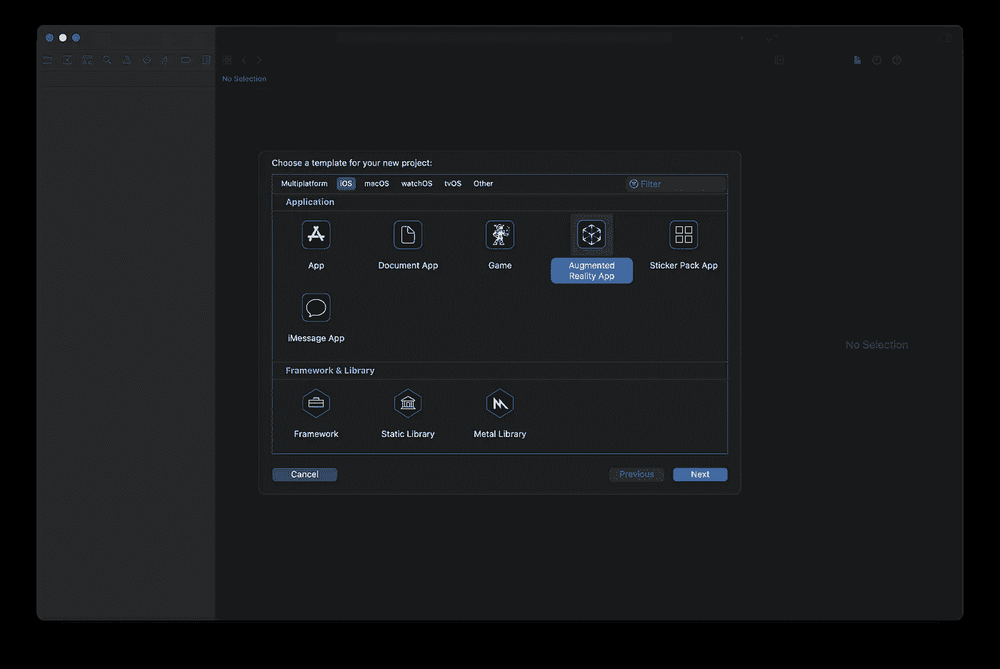

3.在“产品名称”中键入一些东西，然后在“团队”中选择您的 iOS 开发者帐户。组织标识符可以是您网站的反向域；内容技术选择“scene kit”；界面选择故事板(默认)；当然，语言是迅捷的；将“包括测试”选项留空即可。

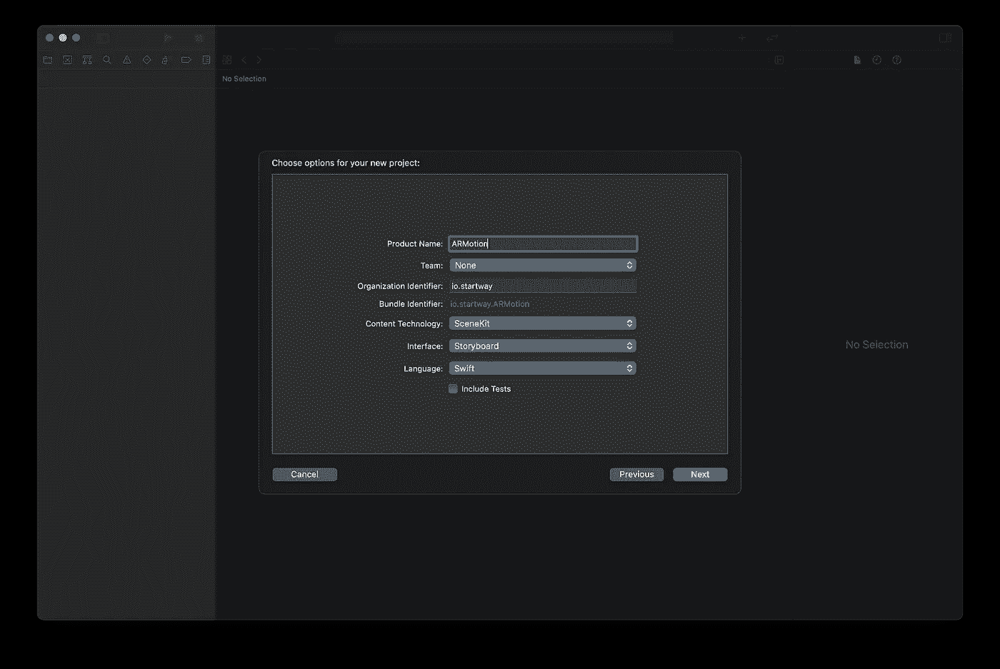

4.完成并保存。

5.移除 Xcode 项目中所有不需要的材料。

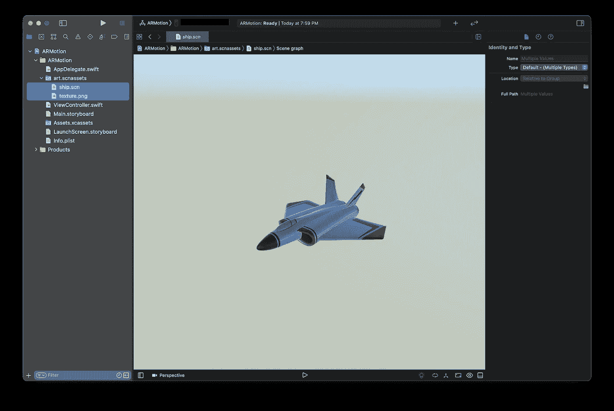

CMD +🔙

6.复制并粘贴下面的代码，或者你可能想深入了解一下[代码解释](https://medium.com/better-programming/how-to-use-a-swiftui-view-in-anarkit-scenekit-app-d6504d7b92d2)。

## 洛蒂运动

7.在 Assets 文件夹中添加一个新的 AR 资源组。

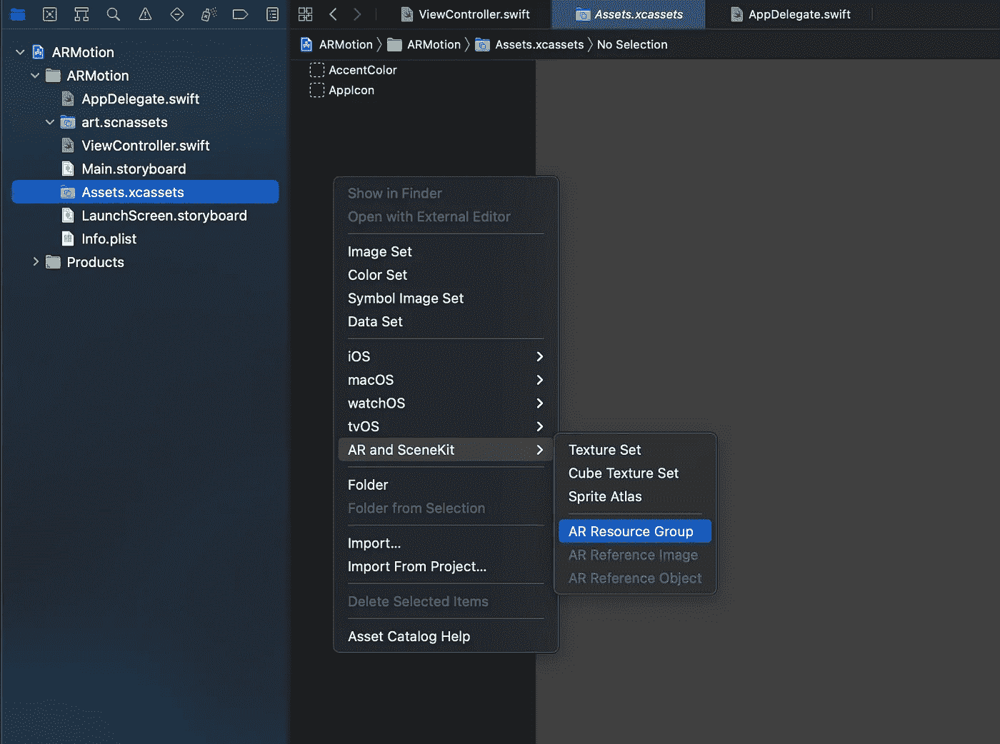

8.拖放图像作为增强现实跟踪目标。

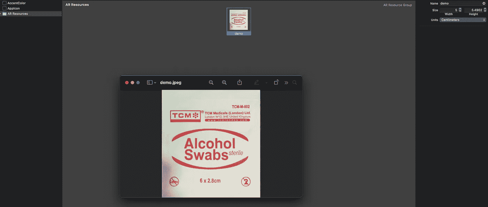

9.通过 LottieFiles 下载 JSON】新冠肺炎:[https://lottiefiles.com/coronavirus-animations](https://lottiefiles.com/coronavirus-animations)
热门:[https://lottiefiles.com/popular](https://lottiefiles.com/popular)

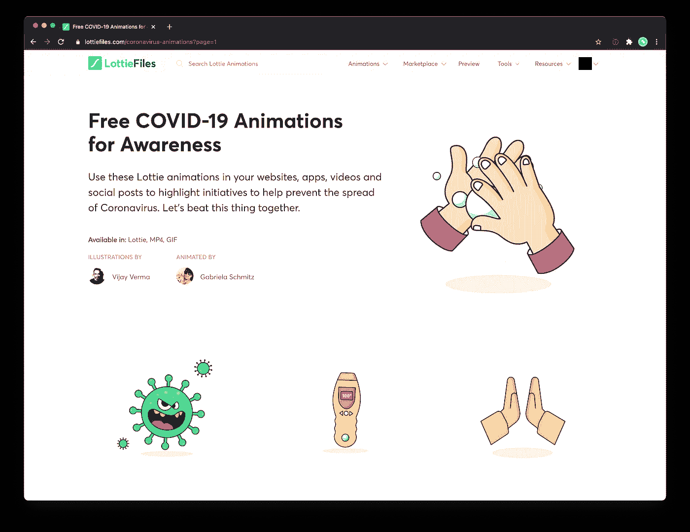

我用下面这个例子。


Vijay 和 Gabriela 的洗手动画

10.将 JSON 文件放在“ARMotion”文件夹中。
文件名:17896…

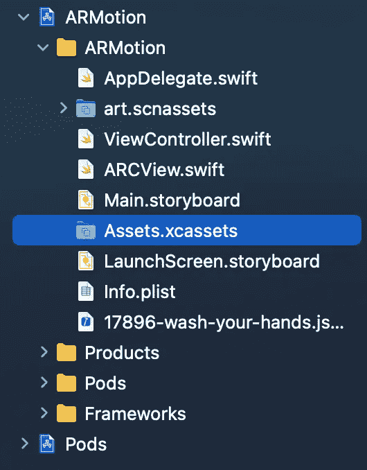

11.现在，我们需要添加一个新的 SwiftUI 视图，并将其与 Airbnb-Lottie-iOS-SDK 集成。

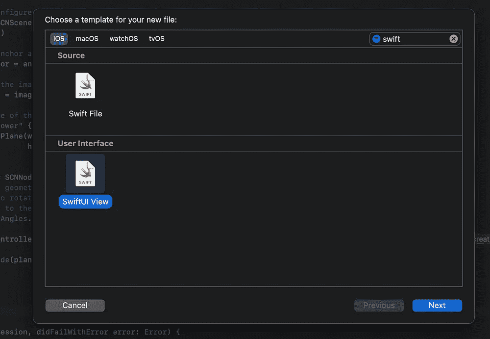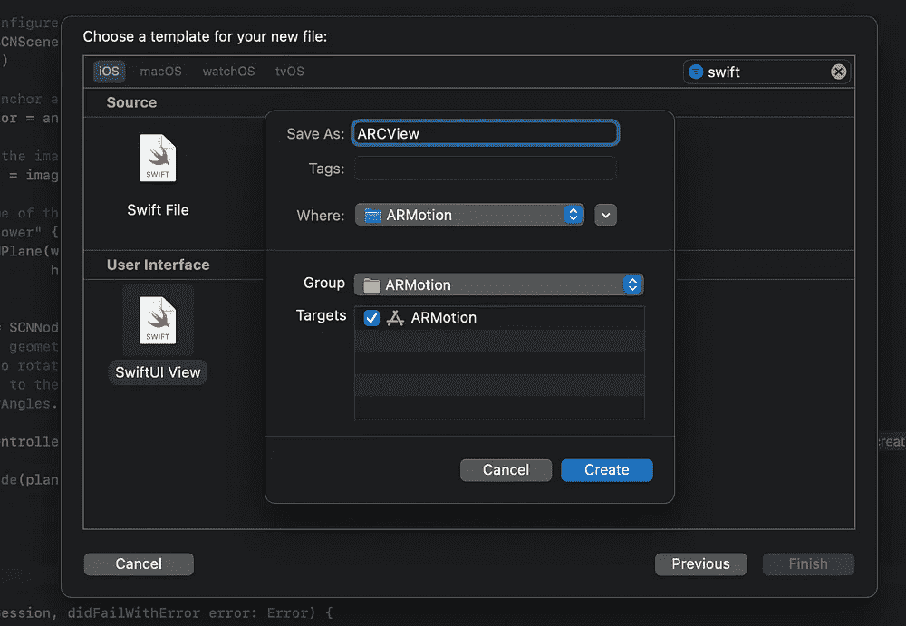[](https://github.com/airbnb/lottie-ios) [## Airbnb/洛蒂 ios

### Lottie 是一个 Android 和 iOS 的移动库，它可以实时渲染基于矢量的动画和艺术…

github.com](https://github.com/airbnb/lottie-ios) 

12.关闭 Xcode。

13.打开 Terminal.app，键入以下命令

```
$ cd <Xcode Folder>
$ pod init
$ open podfile
```

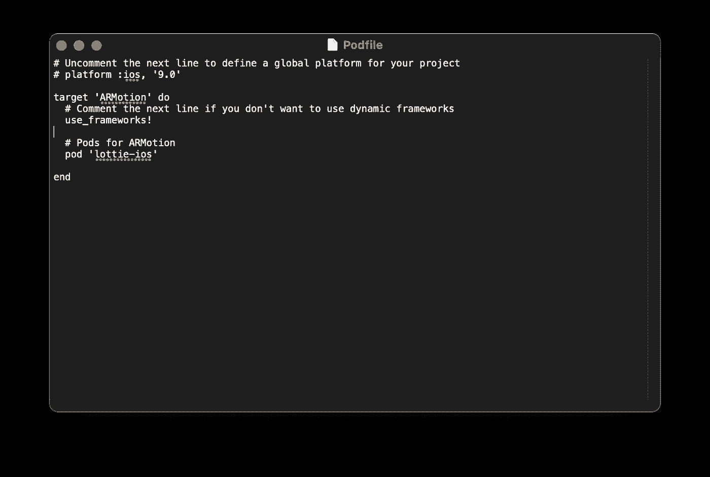

```
$ pod install
```

14.检查您最新的项目文件夹。

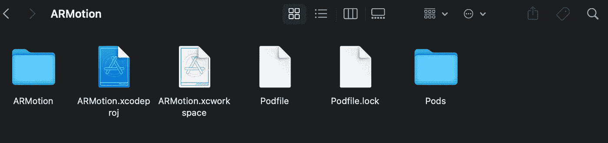

15.双击。xcworkspace 文件。16。转到 ARCView.swift
17。复制&粘贴以下代码。如果你想了解更多关于 Lottie Motion SDK 的信息，请访问 Airbnb 的 Github Repo 了解更多详情。

# 感谢阅读:)👏👏👏

完整项目@ [GitHub](https://medium.com/u/8df3bf3c40ae?source=post_page-----f214e52d8bdf--------------------------------) :

[](https://github.com/1998code/ARKit-LottieMotion) [## 1998 代码/ARKit-Lott emotion

### 此时您不能执行该操作。您已使用另一个标签页或窗口登录。您已在另一个选项卡中注销，或者…

github.com](https://github.com/1998code/ARKit-LottieMotion) 

信用:
如何在 ARKit 和 SceneKit 应用程序中使用 SwiftUI 视图——Sarang Borude
免费的新冠肺炎意识动画——LottieFiles