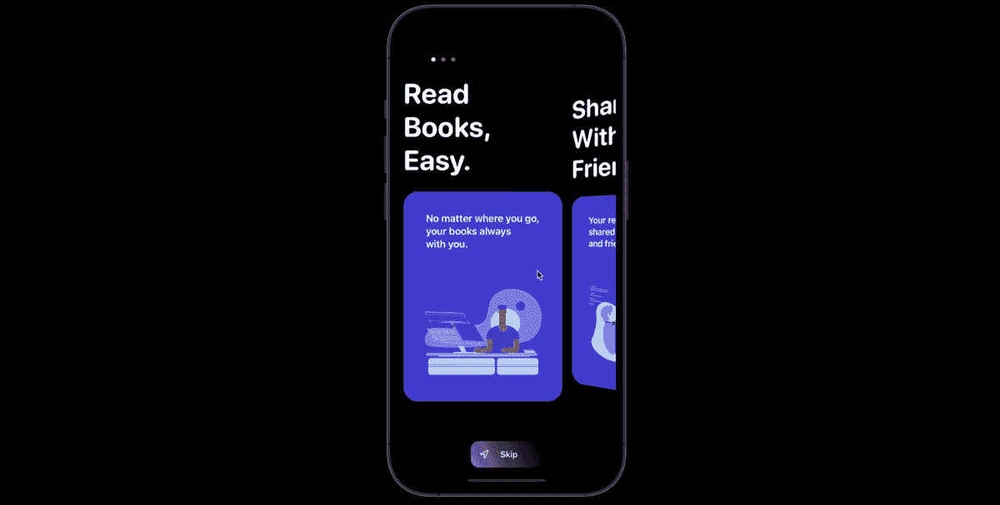
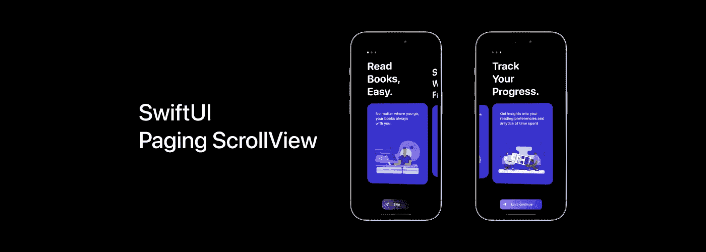

# SwiftUI 分页滚动视图

> 原文：<https://levelup.gitconnected.com/swiftui-paging-scrollview-189aa8902e3a>

## 页面控制，难以置信的 3d 动画，和一个可怕的开始按钮:]

**我们将这样做:**
-我将在滚动视图中描述动画卡片的主要部分，并显示下面的代码
-其他步骤-支持项目的功能

# 主要部分

## 步骤 01 —创建基础

首先，让我们创建一个 AdaptivePagingScrollView 结构，并添加实现所需的字段。

## 步骤 2 —准备计数函数

第一步，我们需要计算将解决相反任务的函数。

**所以我们在统计:**
//**01**&&**02**—抵销为指标，对方指标为抵销。
//**03**&&**04**—目标和逻辑滚动视图偏移。第一项的逻辑偏移量从 0 开始，这使得计算页面索引更加容易

## 第 3 步——完成工作

让我们继续我们的观点。

// **01** —我们将使用几何阅读器进行基础视图中心偏移，并在 HStack 中添加我们的视图。

// **02** —在视图出现时，我们将计算基础起始偏移，并在稍后用设置它。抵消

// **03** —在最后一步，我们将使用手势容器同时手势。

//**04**—让我们开始描述我们的拖动手势。每次更改时，我们都需要计算当前的滚动偏移量，对于下面的逻辑，我们需要保存当前的拖动偏移量。

// **05** —在拖动会话结束时，我们需要知道速度的净偏移量，以计算我们随后的页面索引。

// **06** —有了统计出来的点，我们就可以预测下一页，并创建一个动画来展示这个过渡。

# 其他步骤

## 第一步—数据

首先，让我们用卡片数据创建一个 JSON。为了在应用程序中使用它，我们需要一个 ObservableObject，它将把所有反序列化的对象存储在卡中，并在初始化期间序列化它们。为了在一行中获得 JSON 文件中的所有内容，我们将为这个包编写一个小的扩展。我相信它将来会对你有所帮助。

如您所见，该方法对于任何可解码的数据类型都是通用的，并带有两个必需的参数:您想要解码的内容和您的包中 JSON 文件的名称。还有两个参数具有合理的默认值，但是如果需要的话，允许您自定义日期和键。

接下来，它试图在 app bundle 中找到 JSON 的路径，并将其加载到数据实例中。如果其中任何一个失败，代码将使用 fatalError()强制应用程序崩溃，这可能看起来很糟糕，但请记住:这是您手工创建的 JSON 文件，并直接添加到您的应用程序包中——如果您忘记了 JSON 或它无法加载，这是您的基本逻辑错误，应该予以纠正。

文件加载后，代码会创建一个 JSONDecoder，并尝试将文件内容解码为您所要求的类型。然后，它有一系列 catch 块来处理所有可能的错误，每个错误都会触发一个崩溃，告诉您发生了什么错误。

同样，在这里触发崩溃是完全没问题的:这都是你直接添加到应用程序中的静态硬编码 JSON，所以如果它意外地改变了格式，那么你的程序就不应该运行。事实上，我通常会添加测试，专门尝试加载我的应用程序包中包含的所有 JSON，以确保它们不会意外更改。

编译、构建、运行……完成！

仅此而已，最美好的祝愿，没有 bug 编码[-。-]

链接到项目 [GitHub](https://github.com/borisdipner/paging-srollview-swiftui) 和[我的博客](https://borisdipner.com/swiftui-paging-scrollview.html)