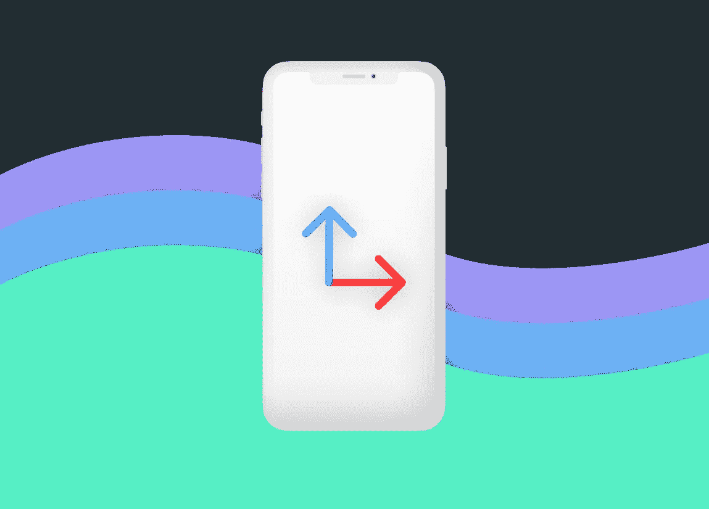

# SwiftUI 视差运动效果

> 原文：<https://levelup.gitconnected.com/swiftui-parallax-motion-effect-565af67c7894>

## 创建 SwiftUI 效果，根据设备的姿态(滚动、俯仰、偏航)来激活视图。



在本教程中，我们将看看一个有趣的 SwiftUI 运动效果，并讨论如何通过创建我们自己的自定义`ViewModifier`结构来轻松地将它应用到我们的视图中。

此效果通过调整其应用的视图的偏移来响应设备姿态(滚动、效果和偏航)。当用户移动他们的设备时，它会产生这种疯狂的视差效果。请看下面的视频中的例子。

> 在开始之前，请考虑使用这个[链接](https://trailingclosure.com/signup/)订阅，如果你没有在 TrailingClosure.com 的[上阅读这篇文章，请随时来看看我们！](https://trailingclosure.com/)

## 构建`ParallaxMotionModifier`结构

这个`ParallaxMotionModifier`结构将保存我们的`MotionManager`类。`MotionManager`类将是一个`ObservableObject`类，发布设备姿态的更新(俯仰、滚动、偏航)。

下面是`ParallaxMotionModifier`结构的样板代码。

```
import SwiftUI
import CoreMotion

struct ParallaxMotionModifier: ViewModifier {

    func body(content: Content) -> some View {
        content
    }

    class MotionManager: ObservableObject {

        init() {

        }
    }

}
```

## 设置和接收动作更新

1.首先，我们需要将`@Published`变量添加到`MotionManager`类中，用于俯仰和滚动。我们不需要设备的偏航来达到这个效果。

```
class MotionManager: ObservableObject {

    @Published var pitch: Double = 0.0
    @Published var roll: Double = 0.0

    init() {

    }
}
```

2.接下来，我们创建一个`CMMotionManager`类的实例，从我们类中的设备接收动作更新。此外，我们将更新间隔设置为每秒`60`次。

```
class MotionManager: ObservableObject {

    @Published var pitch: Double = 0.0
    @Published var roll: Double = 0.0

    private var motionManager: CMMotionManager

    init() {
        self.motionManager = CMMotionManager()
        self.motionManager.deviceMotionUpdateInterval = 1/60

    }
}
```

3.最后，我们需要订阅运动更新，然后将新的运动值设置为我们的`pitch`和`roll`变量。`MotionManager`班到此为止。

```
class MotionManager: ObservableObject {

    @Published var pitch: Double = 0.0
    @Published var roll: Double = 0.0

    private var motionManager: CMMotionManager

    init() {
        self.motionManager = CMMotionManager()
        self.motionManager.deviceMotionUpdateInterval = 1/60
        self.motionManager.startDeviceMotionUpdates(to: .main) { (motionData, error) in
            guard error == nil else {
                print(error!)
                return
            }

            if let motionData = motionData {
                self.pitch = motionData.attitude.pitch
                self.roll = motionData.attitude.roll
            }
        }

    }
}
```

## 将动作更新应用于查看内容

让我们回到`ParallaxMotionModifier`结构。

1.首先在`ParallaxMotionModifier`的顶部创建一个我们刚刚完成构建的`MotionManager`类的实例。这将是一个`@ObservedObject`，以便`ParallaxMotionModifier`结构自动将设备的动作更新应用到我们的内容。

```
struct ParallaxMotionModifier: ViewModifier {

    @ObservedObject private var motion: MotionManager = MotionManager()

    func body(content: Content) -> some View {
        content
    }

    class MotionManager: ObservableObject {
        // Motion Manager Definition Here...
    }

}
```

2.在`body(content:)`函数中，使用来自`motionManager`实例的数据对内容进行偏移更改。

```
struct ParallaxMotionModifier: ViewModifier {

    @ObservedObject private var motion: MotionManager = MotionManager()

    func body(content: Content) -> some View {
        content
            .offset(x: CGFloat(motion.roll), y: CGFloat(motion.pitch))
    }

    class MotionManager: ObservableObject {
        // Motion Manager Definition Here...
    }

}
```

3.如果你现在尝试使用这个修改器，你不会看到太多。应用它的视图只会移动很小的量。这就是为什么我们需要创建一个名为`magnitude`的新变量。当应用我们的偏移来改变视图相对于设备运动的移动量时，我们将使用它。

```
var magnitude: Double
```

然后将其应用到我们的偏移计算中:

```
func body(content: Content) -> some View {
    content
        .offset(x: CGFloat(motion.roll * magnitude), y: CGFloat(motion.pitch * magnitude))
}
```

## `ParallaxMotionModifier`的完整代码

```
import SwiftUI
import CoreMotion

struct ParallaxMotionModifier: ViewModifier {

    var magnitude: Double

    @ObservedObject private var motion: MotionManager = MotionManager()

    func body(content: Content) -> some View {
        content
            .offset(x: CGFloat(motion.roll * magnitude), y: CGFloat(motion.pitch * magnitude))
    }

    class MotionManager: ObservableObject {

        @Published var pitch: Double = 0.0
        @Published var roll: Double = 0.0

        private var motionManager: CMMotionManager

        init() {
            self.motionManager = CMMotionManager()
            self.motionManager.deviceMotionUpdateInterval = 1/60
            self.motionManager.startDeviceMotionUpdates(to: .main) { (motionData, error) in
                guard error == nil else {
                    print(error!)
                    return
                }

                if let motionData = motionData {
                    self.pitch = motionData.attitude.pitch
                    self.roll = motionData.attitude.roll
                }
            }

        }
    }

}
```

## 给我们看看你做了什么！

我们想看看你用这个教程做了什么！给我们发照片！在推特 [@TrailingClosure](https://twitter.com/TrailingClosure) 、Instagram 上找到我们，或者发邮件到 howdy@TrailingClosure.com联系我们

## 例子

```
import SwiftUI

struct ParallaxMotionTestView: View {
    var body: some View {
        ZStack (alignment: .center) {
            Color.red
                .frame(width: 200, height: 200, alignment: .center)
                .cornerRadius(5)
                .shadow(color: Color.black.opacity(0.2), radius: 10, x: 0, y: 0)
                .modifier(ParallaxMotionModifier(magnitude: 20))
            Color.blue
                .frame(width: 150, height: 150, alignment: .center)
                .cornerRadius(5)
                .shadow(color: Color.black.opacity(0.2), radius: 10, x: 0, y: 0)
                .modifier(ParallaxMotionModifier(magnitude: 30))
            Color.green
                .frame(width: 100, height: 100, alignment: .center)
                .cornerRadius(5)
                .shadow(color: Color.black.opacity(0.2), radius: 10, x: 0, y: 0)
                .modifier(ParallaxMotionModifier(magnitude: 40))
            Color.orange
                .frame(width: 50, height: 50, alignment: .center)
                .cornerRadius(5)
                .shadow(color: Color.black.opacity(0.2), radius: 10, x: 0, y: 0)
                .modifier(ParallaxMotionModifier(magnitude: 50))
        }
    }
}
```