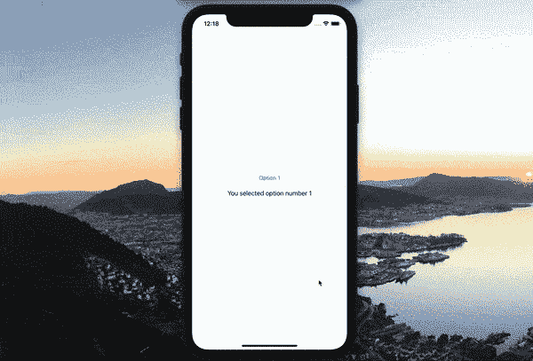
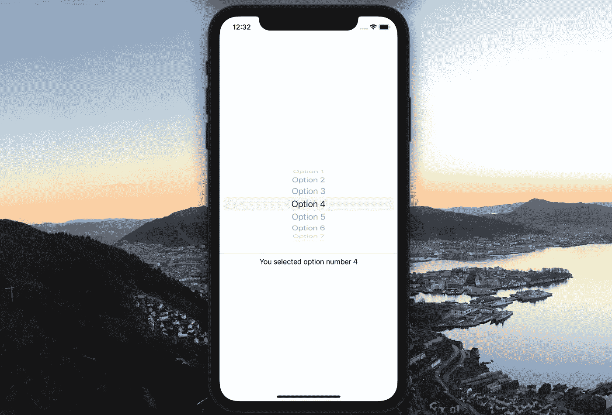
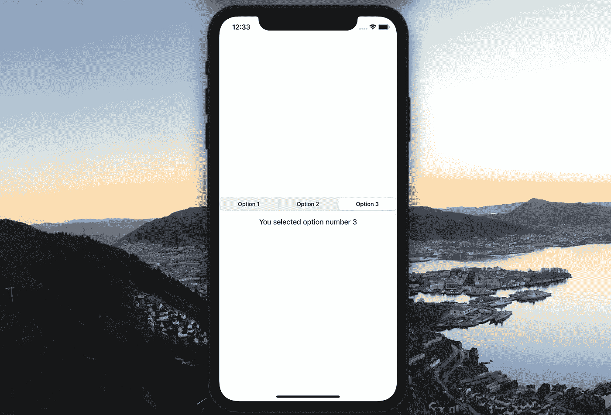

# SwiftUI:掌握选取器和选取器样式

> 原文：<https://levelup.gitconnected.com/swiftui-using-picker-and-pickerstyles-123993faf623>

## 了解如何创建多项选择菜单并收集用户输入


威尔·埃萨延科在 [Unsplash](https://unsplash.com?utm_source=medium&utm_medium=referral) 拍摄的照片

在 SwiftUI 中，选择器可以被认为是一个菜单。当您希望允许用户在多个选项之间进行选择时，可以使用这个元素。这是一个非常强大的工具，可以快速接收用户输入并进一步开发您的应用程序。

在这篇文章中，我们将看看如何实现 Picker 元素，以及如何使用 PickerStyle 修饰符来更改其样式以适应您的具体应用。

> **注**:要跳过完整的解释，只看最终产品和源代码的视频演示，请向前滚动到“将所有内容组合在一起”部分

# 设置选取器

Picker 元素接受两个参数，第一个是标题，第二个是指向存储用户选择的变量的链接。在我们链接到变量之前，我们当然需要创建一个变量。

要创建变量，请在 SwiftView 中视图体的外部添加一行代码。变量需要可修改，因此它需要应用“@State”属性包装。

```
@State var option = 1
```

一旦创建了这个变量，就声明 Picker 元素，并将第一个参数设置为定义所选内容的字符串，然后对第二个变量使用“option:”描述符，并将其设置为新创建的变量。然后打开一些花括号，定义选择器内容的代码将放在那里:

```
Picker("Option Picker", selection: $option) {    //code   }
```

在代码中，我们需要定义将要显示的各种选项。通常，这将通过一系列文本元素来完成。例如:

```
{   Text("Option 1")
    Text("Option 2")
    Text("Option 3")  }
```

然而，即使这将使列表正确显示，它也没有给软件任何关于如何处理用户选择的指示。为了处理用户选择并更新我们创建的用于存储数据的变量，我们需要添加另一个修饰符。

放在的括号之间的输入。标记修饰符将是变量值更新到的内容。因此，确保它与您创建的变量类型相同非常重要。在我们的例子中，这是一个整数，然而，它也可以是一个字符串，如果这就是你最初设置变量的方式的话。标签修改器的应用如下:

```
Text("Option 1").tag(1)
```

有了标签，我们的变量将在每次选择改变时更新。因此，访问视图中其他地方的变量将显示当前的用户选择。例如，您可以添加:

```
Text("You selected option number \(option)")
```

# 把所有的放在一起

如果您遵循上面的所有步骤，您将得到如下所示的代码:

```
@State var option = 1
var body: some View {
    Picker("Option Picker", selection: $option) {
        Text("Option 1").tag(1)
        Text("Option 2").tag(2)
        Text("Option 3").tag(3)
    }.pickerStyle(MenuPickerStyle())
    Divider()
    Text("You selected option number \(option)")
}
```

在模拟器中运行该程序将在应用程序中提供如下下拉功能:



# 尝试选取器样式

使用`.pickerStyle(_:)`修改器很容易改变列表的外观。(注意:如果没有列出该修饰符，程序将应用默认样式)

有许多显示选项可供选择，但我们将在此介绍三个主要选项:

## 菜单

MenuPickerStyle 选项是上面第一个示例中使用的选项，它提供了一个选择器，当单击它时，可以显示整个选项列表。要应用此修饰符，请使用:`.pickerStyle(MenuPickerStyle())`


正在使用的菜单选取器样式示例

## 车轮

这将在可滚动的滚轮上显示选项。要实现这一点，请将修改量更新为:`.pickerStyle(WheelPickerStyle())`



正在使用的轮式选取器样式示例

## 分段的

这将在屏幕上以条形显示选项，并让用户从列表中选择一个活动选项。要实现这种风格的拾取器，请将修改器更新为`.pickerStyle(SegmentedPickerStyle())`



正在使用的分段选取器样式示例

我真的希望这能帮助你理解如何将 Picker 功能添加到你的 iOS 应用中。有许多不同的风格，很容易修改，所以你可以更新你的选择，很容易找到适合你的设计。如果你有任何问题，请在评论中告诉我！

> **感谢阅读！如果你喜欢这篇文章并想阅读更多，请务必查看我的个人资料或订阅类似的文章。**
> 
> **订阅 Medium，无限获取所有可用的内容和想法。如果你通过这个链接加入 Medium，我会从你的费用中收取很少的一部分——而且不会花你任何额外的费用！**