# SwiftUI2:将苹果登录整合到 CloudKit (2020 年)

> 原文：<https://levelup.gitconnected.com/swiftui2-integrate-sign-in-with-apple-to-cloudkit-2020-265506e202e4>

## 专为希望使用 CloudKit 并在 Xcode 12 (iOS 14 SDK)和 SwiftUI 2 (2020)上登录苹果的苹果开发者编写

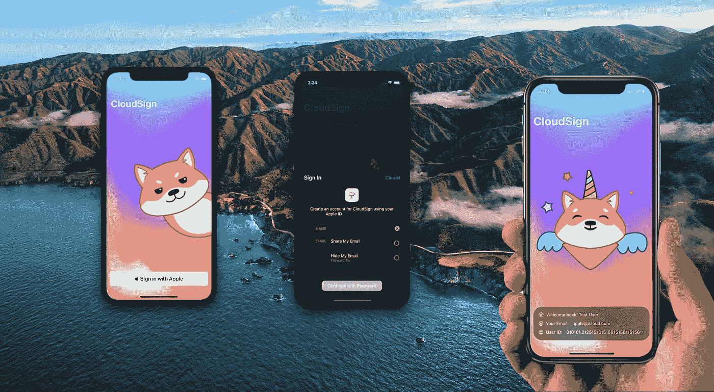

WWDC20 之后，越来越多的开发者尝试用 SwiftUI 开发他们的第一个应用。然而，与 UIKit 应用委托相比， **SwiftUI 应用生命周期**缺乏资源和样本代码，尤其是“登录苹果”(一键登录)和 CloudKit(iCloud)。在这里，我将向你展示最简单的方法，让你的用户**登录苹果**和**存储用户的数据到 iCloud** 。

**最终产品:**

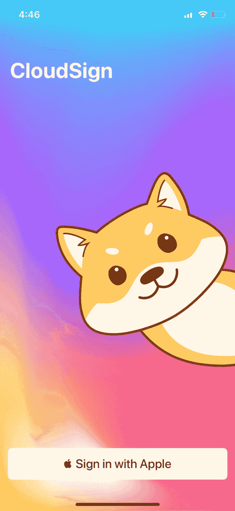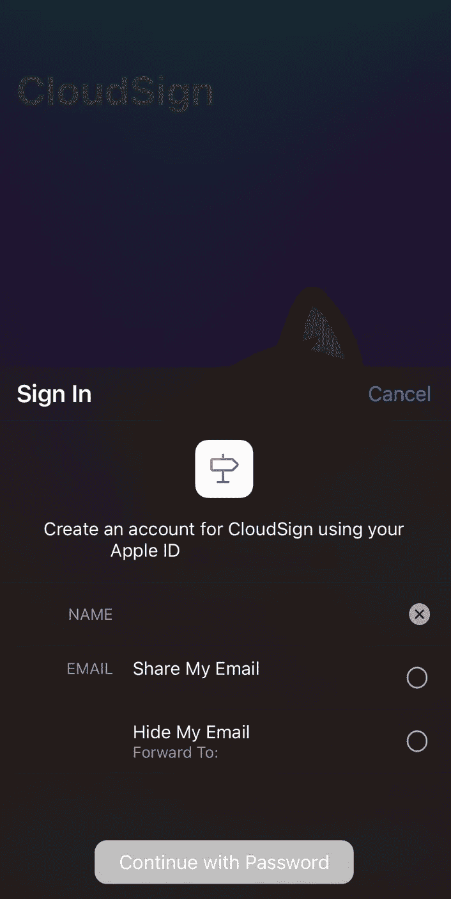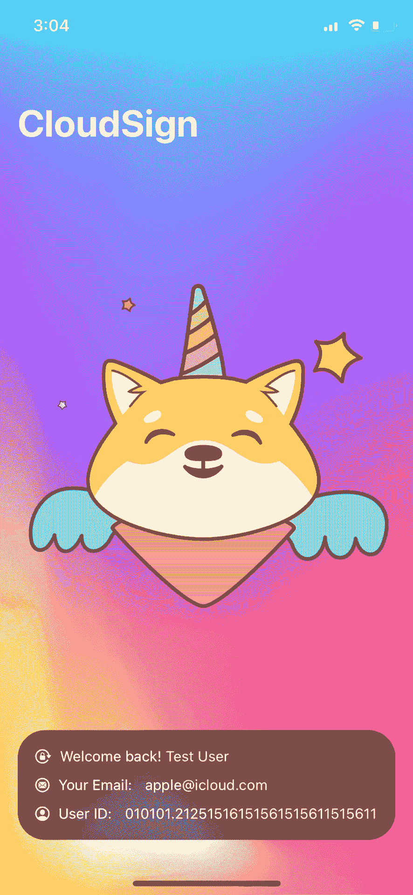

# 环境

macOS 版本:11 大苏尔 beta 6 (20A5364e)
iOS 版本:14 beta 7 (18A5369b)
Xcode 版本:12 beta 6 (12A8189n)
App 生命周期:SwiftUI App (2020)

您需要有效的 Apple 开发者帐户才能使用 CloudKit Dashboard。如果您没有，请阅读这篇文章:

[](https://medium.com/macoclock/how-to-register-an-apple-developer-account-2020-183221496022) [## 如何:注册 Apple 开发者帐户(2020)

### 2020 年苹果开发者计划注册指南。

medium.com](https://medium.com/macoclock/how-to-register-an-apple-developer-account-2020-183221496022) 

# 步伐

## 新 Xcode 项目

1.  打开 Xcode 12 (Xcode-beta.app)
2.  新项目> iOS >应用程序>“下一个”

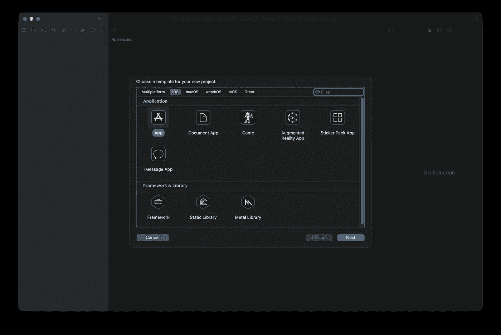

3.您需要输入产品名称和组织 ID。
选择你的团队，选择 SwiftUI 界面，SwiftUI App 生命周期，Swift as 语言。

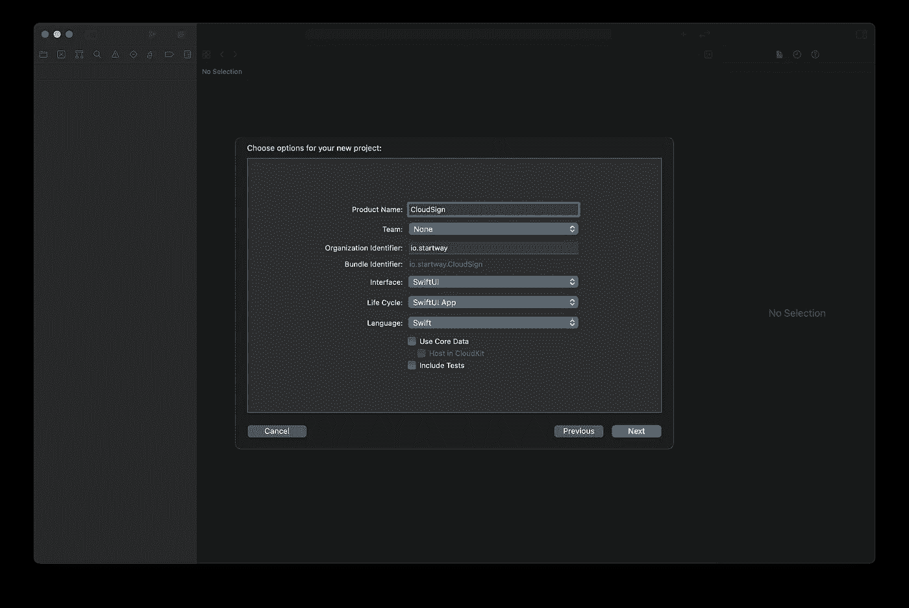

演示截图

很好！这是 Xcode 接口和新的 canva。

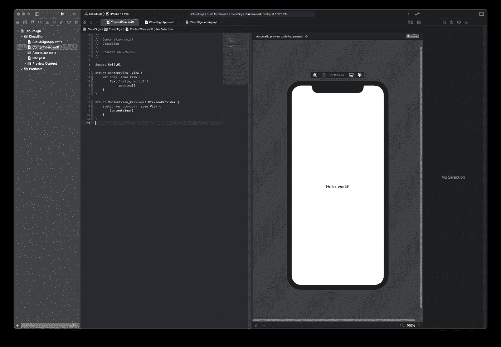

4.转到目标并选择签名和功能

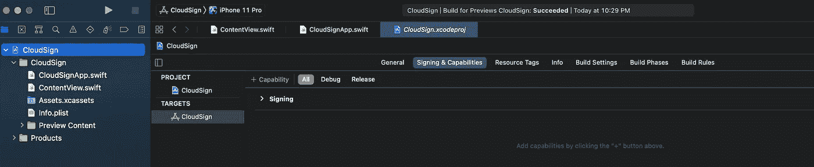

5.点击+能力
用苹果和应用签到；

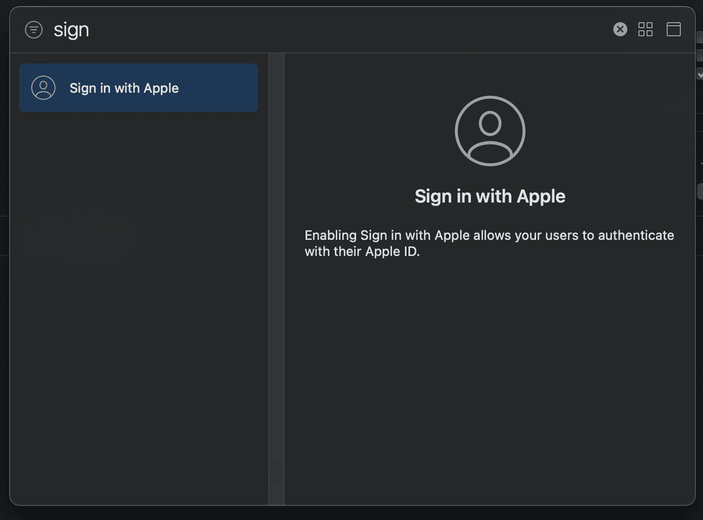

iCloud 储存 API。

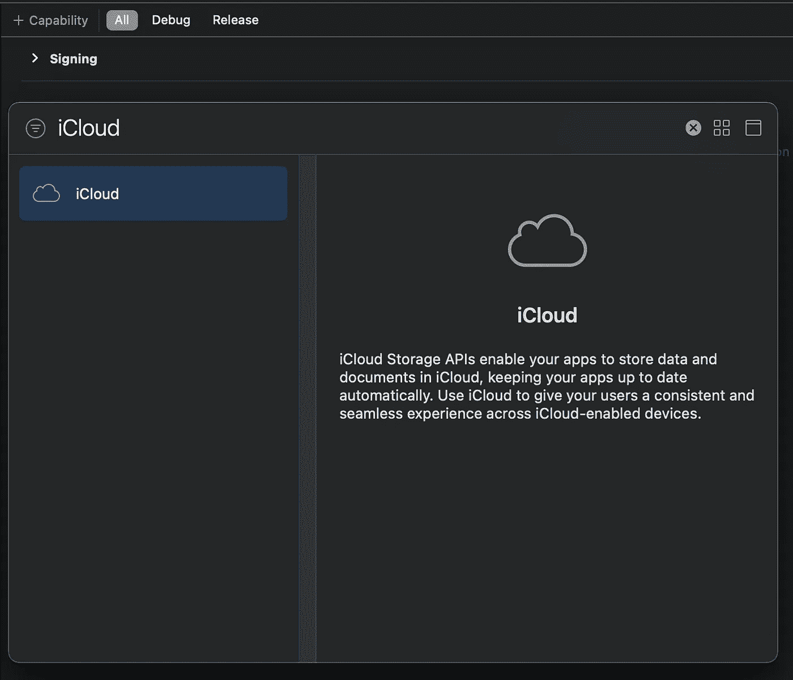

6.若要使用 iCloud，请在 iCloud 部分启用 CloudKit。

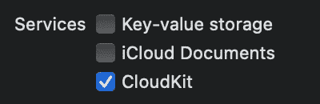

7.+为 iCloud 服务添加新容器

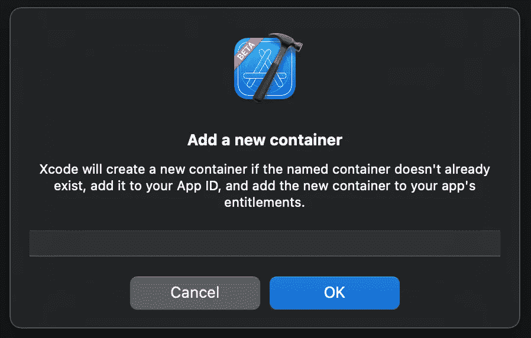

8.启用 iCloud 容器。


9.访问 CloudKit 仪表板。


10.进入 CloudKit 仪表盘后，选择 Schema。
(如果您看不到此页面，请重新加载或重新登录。)

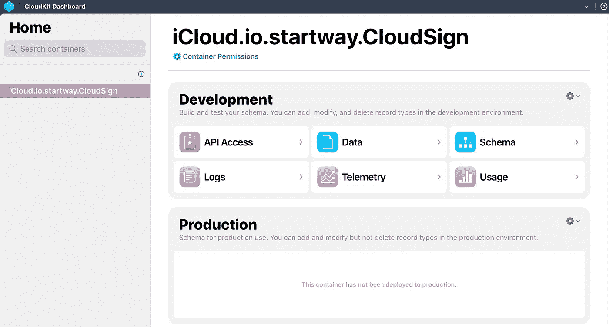

11.添加一个新类型，姑且称之为‘users data’。

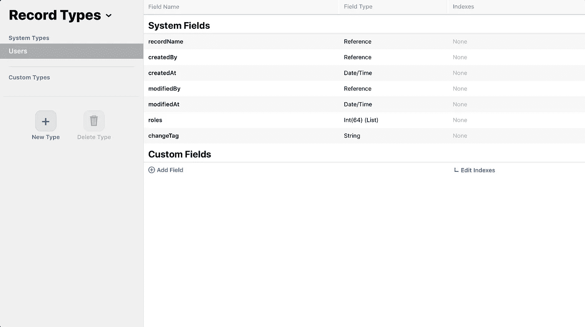

12.添加字段(电子邮件，名字，姓氏)并使它们可查询(不要忘记“记录名称”)。

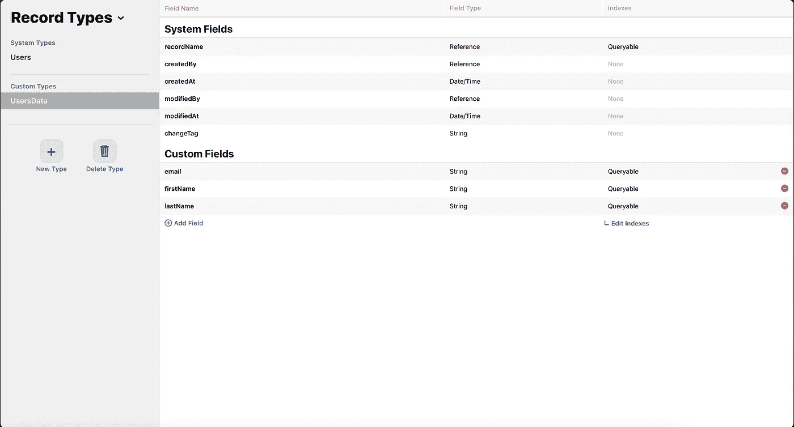

13.离开模式，转到数据(记录)，单击“查询记录”。
确保没有任何错误信息。如果数据不可查询，您需要在步骤 12 中再次检查。

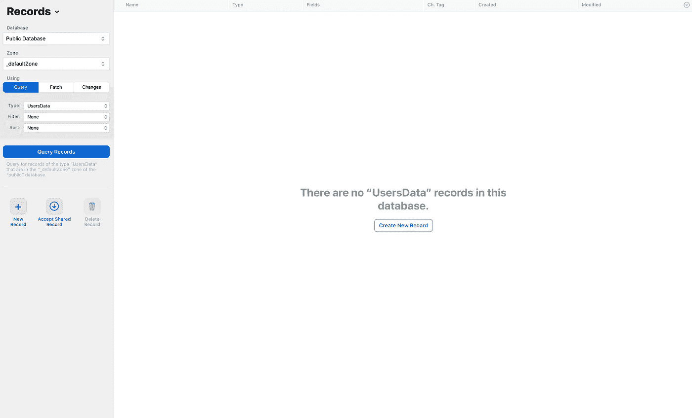

14.返回 Xcode

## 使用 Apple 和 iCloud 公共数据库登录

SwiftUI 为我们提供了一个用苹果按钮添加签到的简单方法。

15.转到 ContentView /我将其命名为 LoginView。
打开库或使用快捷键“CMD”+“shift”+“L”。
用苹果按钮应用**签到。**

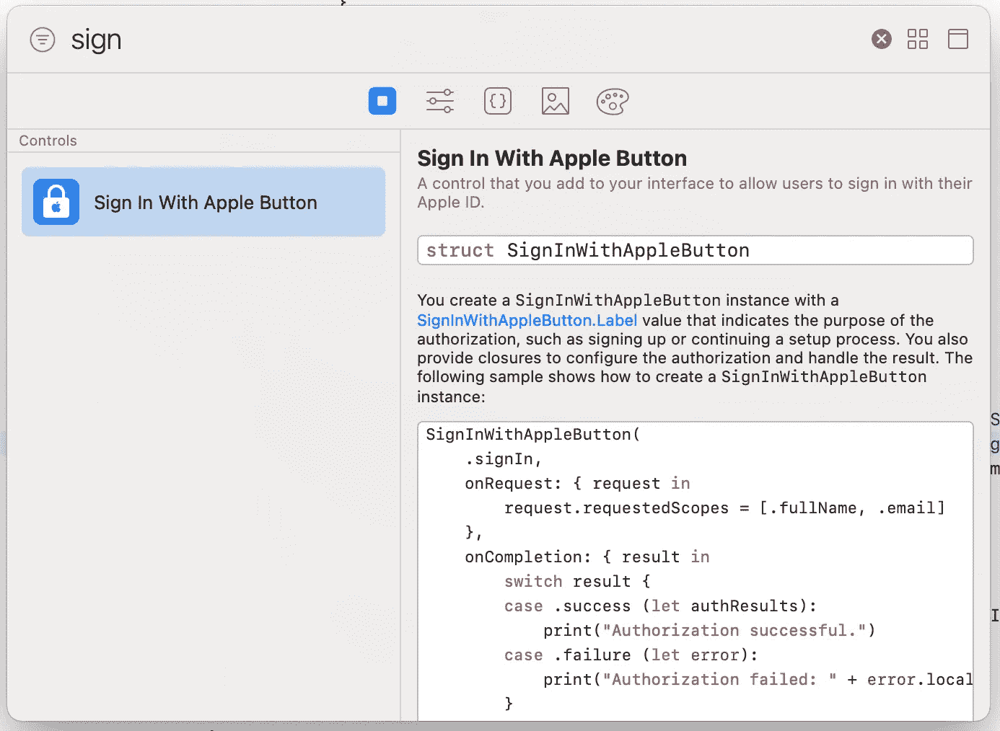

16.替换为以下代码。
有关用法和解释，请查看代码注释。
提示:使用公共数据库，不要使用私有数据库，否则无法查看用户详细信息。默认的用户类型可能很难查询，添加自定义类型如“UsersData”会好得多。

17.添加登录**状态**

```
@AppStorage("login") **private** **var** login = **false**
```

18.假设用户标识是之前保存在本地的用户标识。

```
**let** userID = UserDefaults.standard.object(forKey: “userID”) **as**? String
```

19.使用 **if 语句**确定用户的视图

```
**if** (!login && (userID == **nil**)){
...
}else{
...
}
```

20.(可选)我还添加了一些 LottieFile 的有趣动画。

21.酷！让我们试试 iPhone 上的版本。
预览:

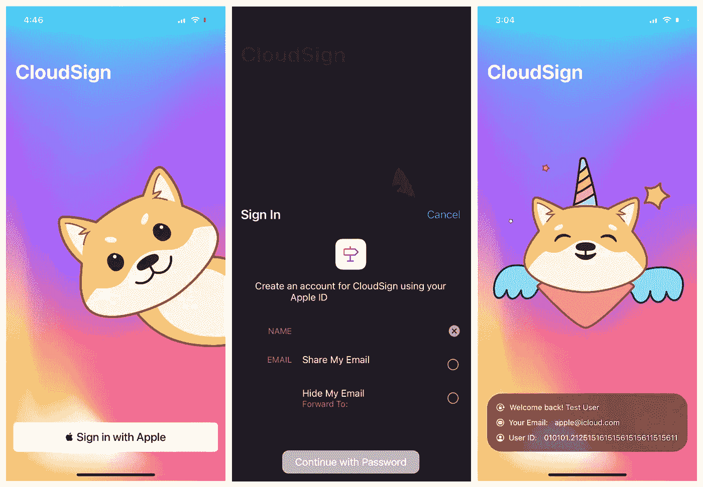

看起来不错！

干得好！
23。回到 CloudKit Dashboard，再次点击“查询记录”。
以下是用户数据:

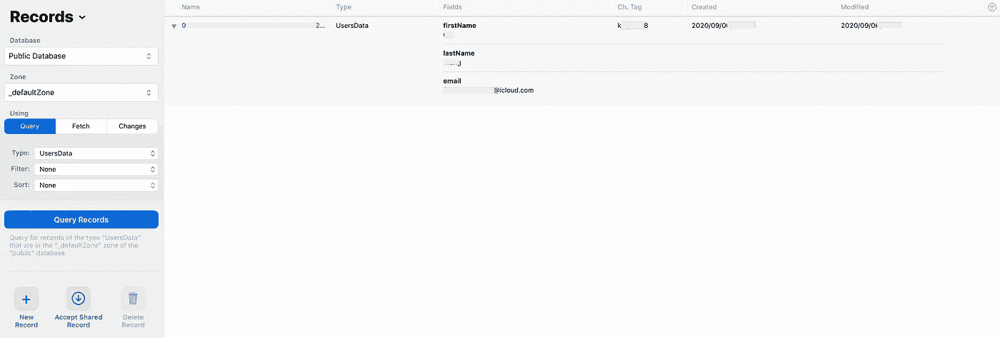

演示记录

# 感谢阅读👏👏👏👏👏

如果需要源代码，请访问 Github @1998design:

[](https://github.com/1998code/SwiftUI2-CloudKit-SignInWithApple) [## 1998 code/swiftui 2-cloud kit-sign in with apple

### 此时您不能执行该操作。您已使用另一个标签页或窗口登录。您已在另一个选项卡中注销，或者…

github.com](https://github.com/1998code/SwiftUI2-CloudKit-SignInWithApple) 

*LottieFiles 上创作者的动画积分。*