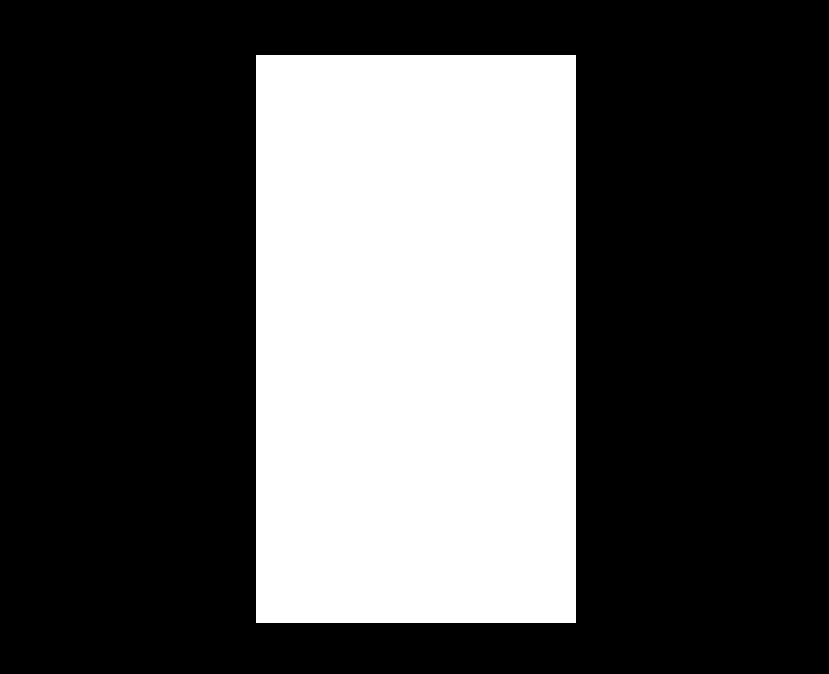
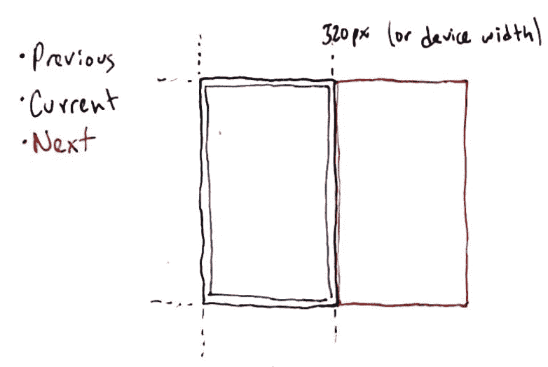
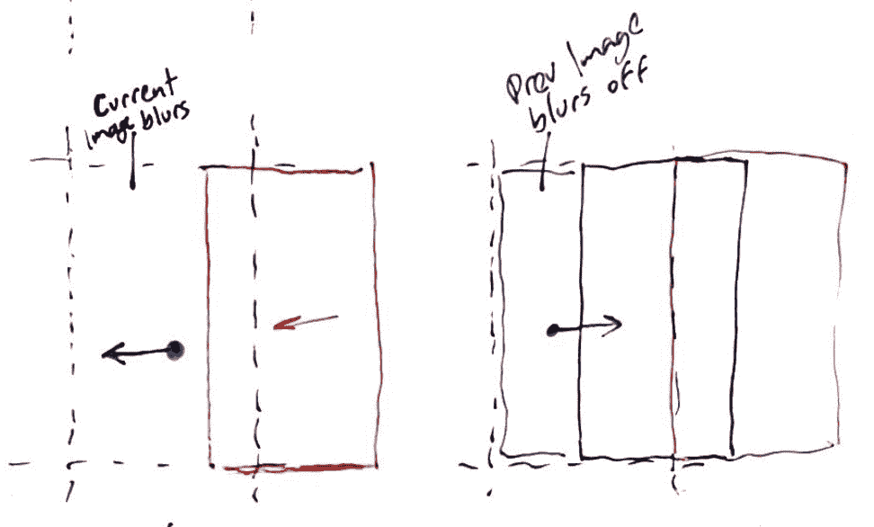
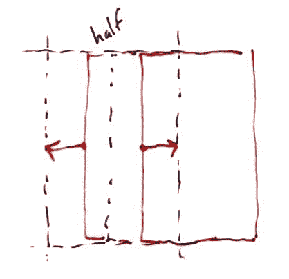

# 使用 Vue.js 和 Tailwind 推送图库— WotW

> 原文：<https://levelup.gitconnected.com/swipe-gallery-using-vue-js-tailwind-wotw-7819f8a1e4fb>

欢迎来到“每周小部件”系列，在这里我拍摄了令人敬畏的 UI/UX 组件的 gif 或视频，并用代码将它们赋予生命。

今天，我们将创建一个滑动画廊，既可以使用触摸控制，也可以使用鼠标控制。灵感来自[荣宇](https://dribbble.com/CHEN-RONGYU)创作的[投稿](https://dribbble.com/shots/5911272-UI-design)，看起来是这样的:

本教程面向希望提升技能的前端开发人员。建议你先有一些 HTML，CSS，JS 的知识。我将使用 [Vue.js](https://vuejs.org/) 来制作这个小部件，如果你不熟悉这个框架，这些精彩的帖子可以帮助你快速上手:

对于今天的小部件，我们将使用 [Vue.js](https://vuejs.org/) ，对于一些动画，我们将使用 [TweenMax](https://greensock.com/tweenmax) 。另外，我将使用新发布的 [TailwindCSS v1.0.1](https://tailwindcss.com/) 。如果你想继续，你可以派生这个已经有依赖关系的 [codepen 模板](https://codepen.io/ederdiaz/pen/gJgrxB)。

首先，我想做的是约束我们的小部件容器的区域，以匹配移动设备的大小。为此，我将首先编写一些 CSS 规则:

> 这将是我们整个小部件需要的唯一 CSS 类…没错，剩下的样式将使用 TailwindCSS 来完成。

现在，要看到它的工作，我们需要添加一些标记到我们的小部件，让我们开始制作我们的应用程序容器:

这些是一堆 TailwindCSS 类，如果你习惯于编写 CSS 规则，它们中的大多数都是不言自明的。从左到右，它们匹配以下 CSS 规则:

正如你所看到的，我们写了更少的代码，而且我们能够做任何改变，而不必在 CSS 文件和 HTML 文件之间跳转。

> 在本教程的剩余部分，我不会“翻译”每个 TailwindCSS 类，但我肯定会强调最重要的那些。其余的你可以访问 [*TailwindCSS 文档*](https://tailwindcss.com/) *。*

现在让我们利用我们创建的`.mobile-container`类:

我们正在使容器`relative`能够相对于它移动图库图像，并且`overflow-hidden`应该帮助我们隐藏容器框外的任何内容。

现在我们应该有这样的东西:

要开始制作我们的图库，我们需要几张图片，你可以使用我为这个小部件托管的下列图片:

和本系列中的往常一样，我们需要设置 Vue.js 来将我们的`js`数据绑定到 HTML 模板，并使我们的小部件具有交互性:

现在没发生什么事情，我只是在我的数据对象中声明了一个属性，它保存了图库中当前项目的索引。

在继续之前，我需要给你看几张图，这应该有助于解释画廊的真实行为。

我们的图库应该遍历数组中的所有图像，但我们只需要同时拥有 3 张图像，而不是创建所有的图像:`Previous`、`Current`和`Next`

每当我们浏览图片时，我们最多只能看到这三张图片，所以我们将对它们做一些“魔术”，让它们看起来像是无限的。

当滑动时有两种结果，您向右拖动当前图像并显示前一个`or`拖动下一个图像到当前图像之上:

将拖动的图像释放到任一侧后，我们需要决定图像是停留在中心，还是离开视口:

为此，我们将采取图像位置，如果它的一半以上是在视口内，它停留，如果不是，它离开。此外，为了继续使用相同的三个图像，我们应该相应地交换它们。

我们现在知道将要渲染三个图像，我们已经有了`currentImageIndex`，但是我们还需要前一个和下一个。此外，如果图像 URL 可以存储在一个变量中，或者更好地存储在计算属性中，那就太棒了:

> *计算属性不是使用方法，而是帮助我们简化组件并提高其性能，* [*计算属性基于它们的反应依赖关系进行缓存*](https://vuejs.org/v2/guide/computed.html) *。*

我们已经有了开始渲染图像的一切，所以让我们回到 HTML 部分:

所有三个图像都需要堆叠在前一个之上，这就是为什么我们使用`z-0`、`z-10`、`z-20`和`absolute`位置。`h-full`类确保图像垂直填充容器的空间。

我们有一个小问题，第一张图中所示的`nextImage`应该在视口之外(右侧)。我们最终还将制作动画，所以我将把样式属性绑定到一个名为`nextImageStyle`的计算属性。

然后我们需要创建那个计算的属性，但是它需要一个引用设备宽度的常量:

> *对于这个小部件来说，它是一个硬编码的常量，但是在现实场景中，我们应该能够获得设备宽度并相应地设置这个常量。*

我们为样式创建了几个计算属性，这看起来有点夸张，但是它们在制作图像动画时会很有用。在这之后，你应该会看到第一个图像，瀑布，而不是一些绿叶。

用户将通过触摸或点击当前图像与我们的图库进行交互，然后它将开始移动光标或手指，之后，他们应该会释放图像。

这是我们需要倾听的三个事件:

start 事件总是由当前图像触发，但是其他两个事件可以发生在图像内部或图库容器外部。下一步是监听这些事件，并使其能够在移动和桌面设备上工作，我们不仅需要监听触摸事件，还需要监听鼠标事件:

> 注意 `*prevent*` *修饰符，这有助于防止浏览器添加到图像中的常规拖放行为。*

我们有三个不同的方法需要在 Vue 实例中声明，但是首先，让我们创建一个助手函数来提取鼠标或手指触摸屏幕的位置:

我们应该能够使用这个函数来相应地更新光标移动，但我们还需要跟踪初始的点击位置，如果用户当前正在拖动图像:

要查看所有这些是否正常工作，您可以添加这个小部件来查看属性是如何变化的:

有趣的部分来了，在接下来的步骤中，我们将首先声明一些我们将使用的常数:

> *完成后，您可以使用这些值来观察事情的变化。*

就像我上面提到的，拖动图像有两种情况，要么是向左拖动，要么是向右拖动。让我们为此创建几个计算道具:

> *基本上，我们正在获取用户开始拖动的位置和光标当前位置之间的差异。如果差值大于* `*0*` *则意味着用户向左拖动图像。*

在深入移动图像之前，我将创建另一个助手函数，它可以帮助我们将图像保存在容器中

现在我们可以用这个新的道具替换`nextImagePosition`计算道具:

试试吧！

按下并向左拖动时，`nextImage`应该会出来。

每当用户没有拖动或者用户向右滑动时，我们希望下一个图像在视窗外的同一个位置。在另一种情况下，根据拖动速度，图像应该更靠近容器的中心。

同样的，我们可以对`currentImage`做类似的事情，当用户向右滑动时，首先绑定样式属性:

然后为其创建计算方法:

在参考中，当当前图像被下一个图像覆盖时，它会逐渐模糊，从而产生一种被发送到底部的效果。让我们创建最后一个助手函数:

> *根据图像的位置，该函数应该给出一个介于 0 和* `*MAX_BLUR*` *之间的值。当图像越靠近视口外部，模糊越少，当图像越靠近中心时，模糊值越大。*

我们之前的图像也需要一个样式属性:

`previousImage`模糊取决于`currentImage`位置，而`currentImage`模糊取决于`nextImage`位置:

到目前为止，一切顺利。图像会相应地移动和模糊，但在我们发布之后，它们又会恢复原状。我们需要一种方法让他们在我们刷卡后去我们想去的地方。

就像我们之前说过的，根据图像的一半是显示还是隐藏，我们将使其动画化。

让我们添加一些我们将为此需要的数据道具:

属性会让我们知道什么时候移动图像，并阻止任何其他动作。`currentImageAnimatedX`和`nextImageAnimatedX`将保持相应图像动画时的位置。

为了使这两个属性正确工作，我们需要更新两个图像定位计算属性:

然后我们需要改变`stopDrag`方法来触发动画:

> *我们使用* `*TweenLite*` *来补间 Vue 实例数据，这将反应性地更新图像样式计算属性。*

你可能已经注意到，我们需要定义`createReleaseAnimation`，这是一个方法，它将保持逻辑以知道图像在发布后应该去哪里。这是某种决策树，所以我将通过行内注释来解释它:

我们正在定义四种情况中的每一种:

*   向左滑动，但图像应该回到屏幕外
*   向左滑动，图像应该到达容器的中心
*   向右滑动，图像应该回到中间
*   向右滑动，先前的图像应该成为新的当前图像

对于每一种情况，我们都定义了一个对象，TweenLite 将使用该对象将相应的`animatedX`属性更改为目标。

而现在最后的结果！

我留下了一个`<pre>`标签，显示所有更新的属性，但如果您只是想查看没有它的图库，请随意移除它。

这就是本周的**小部件。**

如果你想知道更多，你可以去看看其他的 WotW:

*   [极简导航菜单](/minimalistic-nav-menu-wit-vue-js-and-gsap-wotw-5cf9833bbdb5)
*   [密码验证器](/making-an-interactive-password-validator-wotw-77b677548b75)
*   [动画滑块](/making-an-animated-slider-wotw-a98f71438b33)

*最初发布于*[*ederdiaz . dev*](https://ederdiaz.dev)*。*