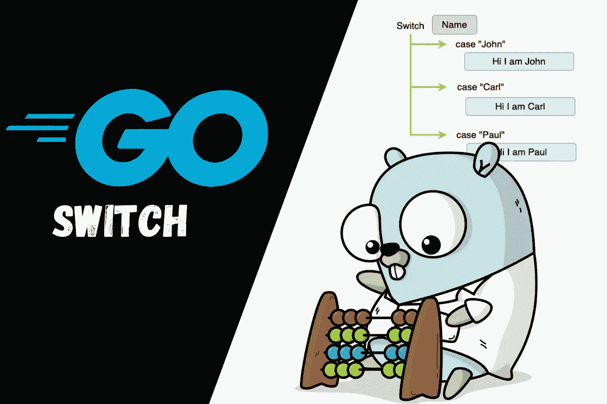
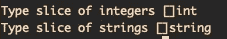

# Golang 中的 Switch 语句解释

> 原文：<https://levelup.gitconnected.com/switch-statement-in-golang-explained-9cd3a85aa19d>

## 有了实际例子



Golang 像大多数编程语言一样有一个 switch 语句。开关允许你在多种情况下评估一个变量或表达式，它通常在编写大量的`if-else`语句使代码看起来丑陋和重复时使用。

让我们通过一个例子来开始了解`switch`语句在 Go 中的不同用法。

```
func variableEvaluation() {
 name := "John"
 switch name {
 case "John":
  fmt.Println("Hi it is John")
 case "Carl":
  fmt.Println("Hi it is Carl")
 case "Paul":
  fmt.Println("Hi it is Paul")
 default:
  fmt.Println("Unkown name")
 }
}
```

对于第一个例子，交换机评估`name`变量，根据这个值它将打印一个不同的消息。注意开关中的每个 case 并没有一个`break`关键字，这是因为 Golang 默认情况下会在 case 匹配时中断开关。此外，还有一个`default`选项，以防变量与开关中的任何情况都不匹配。

开关还允许您将多个值放入一个案例中。当您想要在不同的情况下执行相同的操作时，这很有用。

```
func statusEvaluation() {
 status := "active"
 switch status {
 case "active", "inactive":
  fmt.Println("Update user")
 case "deleted":
  fmt.Println("Hard Delete user")
 }
}
```

我们还可以在 switch 语句中使用表达式。让我们看一个例子:

```
func expressionEvaluation() {
 num := 10
 switch {
 case num > 10 && num < 20:
  num /= 2
 case num >= 20:
  num *= 2
 case num <= 10 && num > 0:
  num += 100
 default:
  fmt.Println("Invalid number")
 }
 fmt.Println("Num: ", num)
}
```

在上面的例子中，switch 语句没有计算任何变量，而是每个 case 都有一个表达式，如果表达式与变量值匹配，那么 case 将被执行。

我们还可以在 switch 语句中使用另一个函数的结果。

```
func functionEvaluation() {
 num := 12
 switch b := isEven(num); {
 case false:
  fmt.Printf("Num is odd %v %t\n", num, b)
 case true && num < 5:
  fmt.Printf("Num is even %v %t\n", num, b)
 case true && num > 10:
  fmt.Printf("Num is even %v, and greater than 10\n", num)
 }
}func isEven(n int) bool {
 if n%2 == 0 {
  return true
 } return false
}
```

在上面的例子中，switch 正在评估`isEven`函数的结果，注意我们是如何在 switch 语句中定义变量`b`的，这在我们需要 case 中函数的结果时很有用。

我们也可以使用开关来知道变量的类型。当我们有类型为`interface{}`的变量时，这很有用。让我们看看这是什么样子。

```
func typeSwitch(elements interface{}) {
 switch t := elements.(type) {
 case int:
  fmt.Printf("Type integer %T\n", t)
 case bool:
  fmt.Printf("Type boolean %T\n", t)
 case []int:
  fmt.Printf("Type slice of integers %T\n", t)
 case []string:
  fmt.Printf("Type slice of strings %T\n", t)
 default:
  fmt.Println("Unkown type")
 }
}
```

从前面的代码中可以看出，使用开关检查变量类型的语法与使用关键字`type`进行类型断言的语法相同。如果我们想要执行相同的操作，我们也可以将多个类型放在一个案例中。

让我们运行这个例子，看看输出:

```
typeSwitch([]int{1, 2, 3, 4, 5})
typeSwitch([]string{"name", "lastName"})
```



类型开关输出

假设我们有一个函数，它将一部分字节作为参数，我们想要调用这个函数，但是我们拥有的数据是类型`interface{}`，所以在将这些数据传递给函数之前，我们需要将其转换为正确的类型。我们可以使用类型开关来解决这个问题。

```
func transformVariableToConcreateType(data interface{}) {
 bytes := []byte{} switch d := data.(type) {
 case []byte:
  bytes = d
 case string:
  bytes = []byte(d)
 } processData(bytes)
}func processData(data []byte) {
 fmt.Println("Processing data: ", data)
}
```

在本例中，类型开关有两种情况，一种是字节片，另一种是字符串。如果数据是一个字节片，它只将`d`赋给变量`bytes`，如果数据是字符串类型，它在将数据赋给`bytes`变量之前将其转换为一个字节片。在 switch 语句将数据转换成正确的类型后，现在可以将它传递给`processData`函数。

假设我们有一个接受模型的函数，这个函数负责调用正确的函数来更新基于模型的模型。但是由于更新函数只接受指针，所以交换机需要处理这个问题，如果模型不是指针，就把它作为指针传递。我们还可以使用类型开关来获取模型的类型，并调用正确的函数。

```
func updateModel(model interface{}) {
 switch t := model.(type) {
 case *User:
  updateUser(t)
 case User:
  updateUser(&t)
 case *Post:
  updatePost(t)
 case Post:
  updatePost(&t)
 case *Chat:
  updateChat(t)
 case Chat:
  updateChat(&t)
 }
}func updateUser(user *User) {
 fmt.Printf("Updating user %v\n", user.Name)
}func updatePost(post *Post) {
 fmt.Printf("Updating post %v\n", post.Title)
}func updateChat(chat *Chat) {
 fmt.Printf("Updating chat %v\n", chat.Participants)
}
```

这是一个包含了我们所涉及的所有例子的文件。

## 结论

Golang 中的`switch`语句非常灵活，允许我们做几件事情，并将其用于不同的用例。在本文中，我们介绍了以下内容:

*   开关变量评估
*   开关表达式求值
*   开关功能评估
*   类型开关

我希望你觉得这篇文章有用，并学到了新的东西！感谢您的阅读！

**附加阅读**

[](/concurrency-in-golang-goroutines-and-channels-explained-55ddb5e1881) [## Golang、Goroutines 和 Channels 中的并发性解释

### Go 中的主并发

levelup.gitconnected.com](/concurrency-in-golang-goroutines-and-channels-explained-55ddb5e1881) [](https://betterprogramming.pub/go-api-design-with-protocol-buffers-and-grpc-991838e4852b) [## 使用协议缓冲区和 gRPC 的 Go API 设计

### 基于社交媒体应用的分步指南

better 编程. pub](https://betterprogramming.pub/go-api-design-with-protocol-buffers-and-grpc-991838e4852b) [](https://betterprogramming.pub/implementing-interfaces-with-golang-51a3b7f527b4) [## 用 Golang 实现接口

### 了解如何利用接口的力量

better 编程. pub](https://betterprogramming.pub/implementing-interfaces-with-golang-51a3b7f527b4)