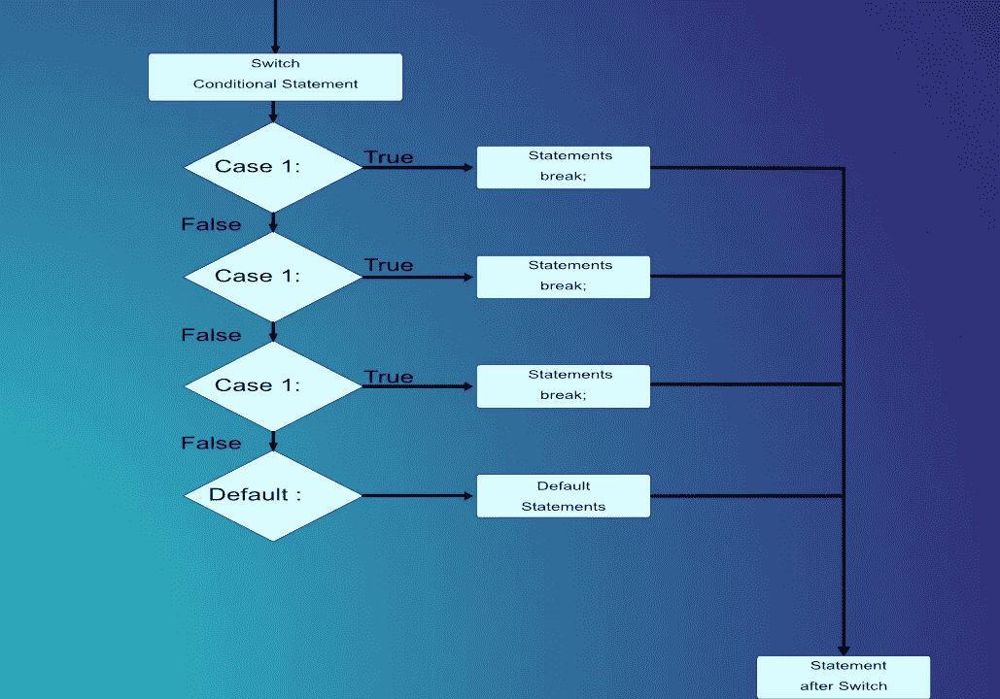
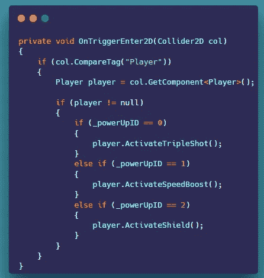
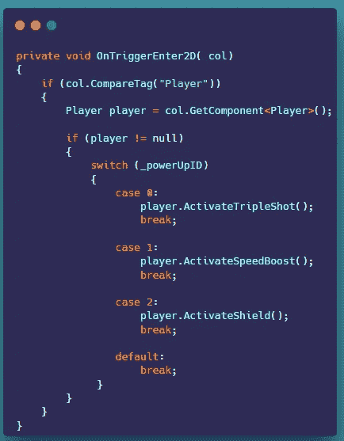

# Unity 中的开关语句

> 原文：<https://levelup.gitconnected.com/switch-statements-in-unity-5093ba25c6ed>

**概述:**

今天我们将讨论 switch 语句以及如何使用它们。让我们开始吧。

**If 语句:**

*   一个 **if 语句**用于指示哪个语句将根据给定的 bool 表达式的值执行。当 bool 表达式的值为 True 时，if 语句将执行给定的 then 语句，否则将控制返回到 if 语句后的下一条语句。

在这里，下面我们使用一个 if 语句来检查加电对象的 id 是否等于 0(对于三连拍)、1(对于速度提升)和 2(对于盾牌)。

虽然这确实有效，但是如果我们有，比方说，二十个电源呢？事情会变得非常混乱，最终，拥有大量的 if 和 if else 语句并不是好的做法。幸运的是，我们可以使用 switch 语句来清理这些东西。它不仅更干净，而且效率也更高。尤其是当你有很多检查需要做的时候。让我们看看如何用下面的 switch 语句来清理这些东西。

**切换语句:**

*   在 C#中，一个 **Switch 语句**允许一个变量与一列值进行比较，以确定是否相等。每个值称为一种情况，变量被打开，检查每个开关的情况。

这里我们做了同样的事情，但是使用了 switch 语句。您可以看到，与一堆 if 和 if else 语句相比，这看起来要干净得多。我希望您能看到在执行多重检查时 switch 语句的效率有多高。

这就是 Switch 语句。
感谢您的时间和关注。