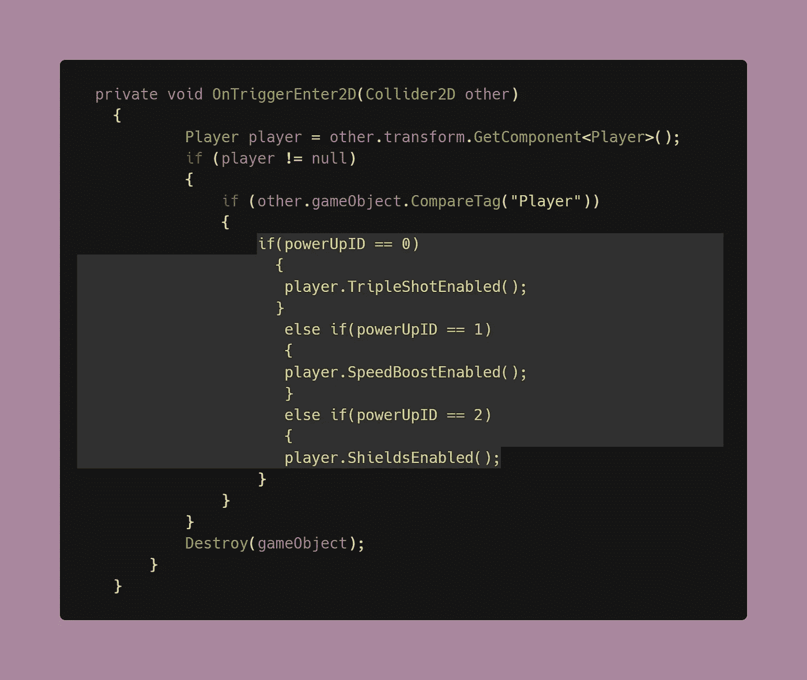

# 把陈述转换成救援！

> 原文：<https://levelup.gitconnected.com/switch-statements-to-the-rescue-277cb924c312>

在上一篇文章中，我们回顾了创建一个[**模块化加电系统**](/creating-modular-power-up-systems-bcf349e0020?source=your_stories_page-------------------------------------) 的过程，其中我们使用 if-else 语句来检测加电，然后相应地执行它们的效果。即使使用 if-else 语句来完成这个逻辑会产生一个功能代码，但是如果有多个 if-else，最好还是使用一个 [**switch 语句**](https://docs.microsoft.com/en-us/dotnet/csharp/language-reference/keywords/switch) 。它使你的代码更简洁，更容易理解。此外，如果您有更多的电源，实施将更优化，更容易实现这种方式。

# 如何以及何时使用它们

要记住的一条经验法则是，如果您的代码需要两个以上的 if-else 语句，请始终使用 Switch 语句。Switch 语句允许我们检查各种不同的**情况**，然后在一个简洁的代码块中执行所有必要的操作。

*   **条件:**可以是整数(int)、枚举或字符类型表达式的表达式。
*   **case:** 每个 case 后面都跟有一个与表达式进行比较的值。然后，不使用分号(；)，冒号(:)用于确定下一行代码是可执行的操作。
*   **中断:**表示您已经完成，在这种特定情况下不需要进一步的操作。

Switch 语句中可以有任意数量的事例。当条件表达式中的值等于给定案例中的比较值时，执行案例。

# 如何将 if-else 语句转换为 Switch 语句

让我们来看看上一篇文章中的 M [模块加电系统](/creating-modular-power-up-systems-bcf349e0020)代码:

该代码利用多个 if-else 语句来激活不同的加电，这可以通过将其转换为 switch 语句来清理和优化。

1.  您仍然需要创建一个全局 int 变量来跟踪当前的加电 ID。这将是 Switch 语句中的**表达式**。

2.我使用检查器为我的加电对象设置各自的值，这是代码稍后区分它们的方式。

3.以前，我们为每次加电分配了一组 int 变量，这对于 Switch 语句是不必要的。仅凭表达式，就可以直接开始比较。由于表达式的类型也是 int，因此事例可以被赋予任意 int 值。我决定使用升序值，但是这些数字可以有任何顺序，只要它们保持与表达式相同的类型。您的加电行为代码应该放在 switch 语句中的 case 下——这相当于说**“万一发生这种情况，就这样做”**

> **注意:**检查器中分配给通电对象的数字必须与代码中的数字一致。

> **注意**:你可能会注意到，当你写一个 Switch 语句时，你的代码下面会出现一个错误或者一条不祥的红色卷线，这是因为编译器正在等待你添加*断点。*

现在，您拥有了一个功能齐全且经过优化的模块化加电系统！在我的下一篇文章中，我们将看看在 Unity 中构建 UI 元素[！](/ease-of-building-ui-elements-in-unity-4f501c7e7c5e)