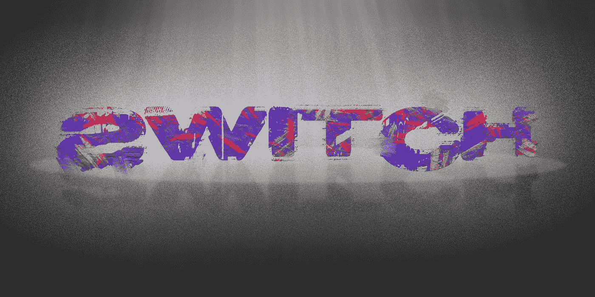
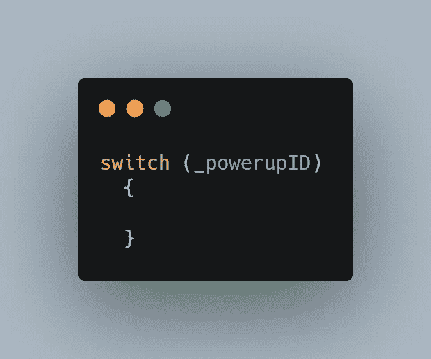
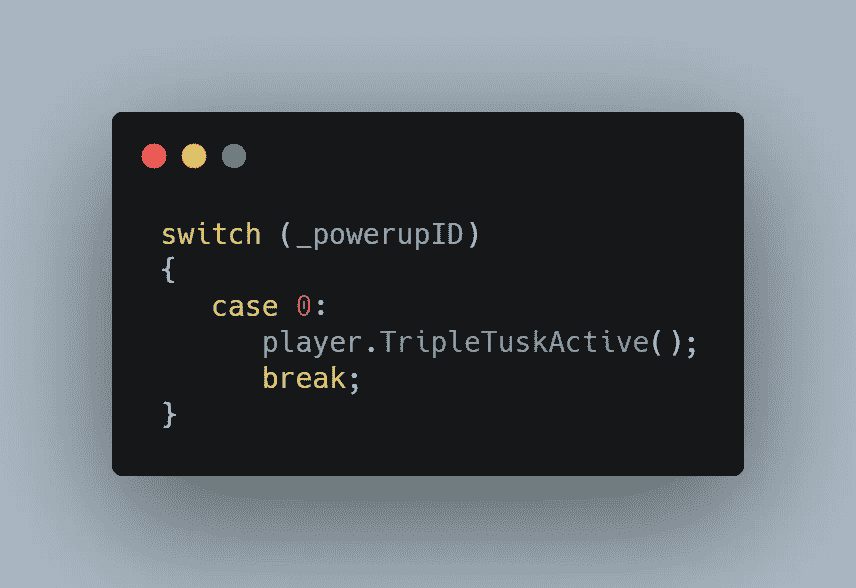
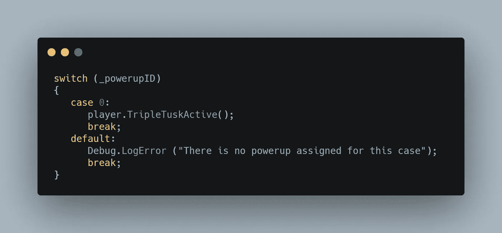
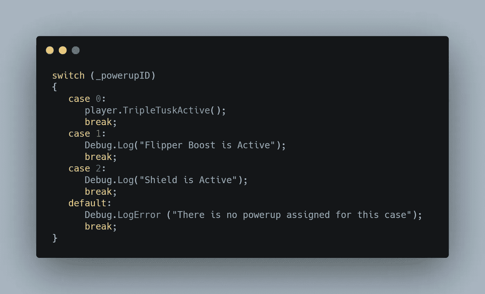
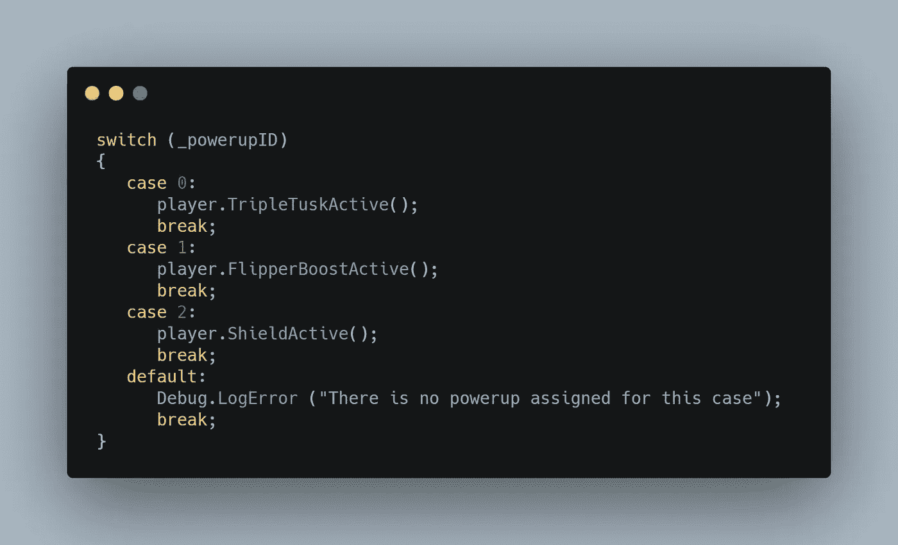

# 用 Switch 语句清理代码

> 原文：<https://levelup.gitconnected.com/switch-statements-to-the-rescue-ea5002146968>

在我的上一篇文章中，我做了一个**模块化的**加电系统，这样我所有的加电系统可以共享**一个**脚本。我通过给每个加电分配一个 **ID** 号来完成这个任务，然后运行一系列 **if-else** 语句来检查发生**冲突**时加电的 ID 号。当其各自的加电被玩家收集**时，每个不同的 ID 号将向玩家脚本发送**不同的**消息。这是我停下来的地方。**

通电 ID 变量

这发生在我的加电脚本中的 OnTriggerEnter2D 方法中

只加几次电，这真的不算太坏。你能想象如果我有五十次通电，这一系列 if-else 检查会是什么样子吗？这听起来像一个冗长的混乱。

将这些 **if-else** 语句转换成一个 **switch** 语句将真正清理我的脚本，并使得在开发阶段后期添加新的加电更加容易。我首先打开一个基本的**开关**语句，引用**加电 ID** 变量。

在 switch 语句中，你使用一个叫做 **case** 的东西，case 之间需要关键字 **break** 。这个案例还需要一个数字来**引用**它所代表的**加电**，所以我从**零**开始我的三连拍。**在**我的 case 和 break 关键字之间，我可以向**玩家**发送消息，让**激活**三击，就像在 **if-else** 语句中一样。

Switch 语句还采用了**默认**的情况，如果玩家收到 ID **在指定范围**之外的加电，就会触发该情况。在这种情况下，这将是一个**错误**，所以我选择发送一个**调试。LogError** 向控制台发送消息，让我知道在加电碰撞时触发了一些**意外的**。

我现在可以在**中增加一个**和**两个**用于我的速度提升和屏蔽**加电**。我还没有在我的播放器脚本中设置这些消息的方法，但是我仍然可以通过发送一些**调试**消息来**测试**连接。

我在我的玩家脚本中实现了一些速度和护盾增强的逻辑，我将在接下来的两篇文章中介绍。为了继续讨论 switch 语句的主题，我将直接跳回到下面的 powerup 脚本。

现在我的播放器脚本已经为来自加电脚本的**输入**做好了准备，我可以在我的加电脚本中修改我的**开关**语句中的调试行来激活正确的方法。

一切基本上和以前一样工作，只是有了更清晰的设计和更流畅的设计，这将帮助我在游戏中加入更多的能量。