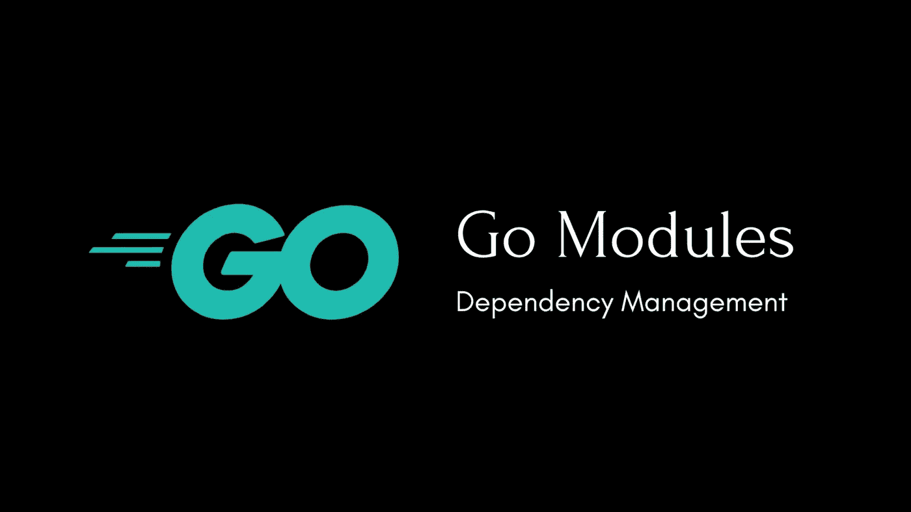

# 从 Go Dep 切换到 Go 模块

> 原文：<https://levelup.gitconnected.com/switch-to-go-modules-from-go-dep-fcdd4aa41bd5>



## [安息吧](/go-restful-series-a7addbfef5b1) — #7

在我的[上一篇文章](/manage-go-dependencies-with-dep-within-docker-and-vscode-remote-containers-cc0fedd627f2?source=friends_link&sk=33fe8a746c1a413624f2b7c9a5cfd506)中，我使用`go-dep`作为一个 Go 项目的依赖管理工具。然而， [Go 模块](https://github.com/golang/go/wiki/Modules)最近已经发布并宣布为官方的 Go 依赖管理工具。许多 Go 第三库正在被迁移以使用 Go 模块，并要求依赖项目也使用 Go 模块。因此，Go Dep 很快就会被弃用。我们将在之前启动的项目中用 Dep 替换 Go 模块。


# Go 模块简介

Go Modules 是官方的 Go 依赖管理工具，它被直接实现到 Go 工具链中(通过`go` CLI 使用)。

## 特征

*   允许并推荐项目位于`$GOPATH`之外。
*   依赖项被放在一个`vendor`目录中(与`go-dep`相同)，这样不同的项目可以依赖于相同包的不同版本。
*   自动检测导入语句，然后更新依赖关系图，锁定、下载和安装适当版本的软件包。
*   当`build`、`run`或`test`时，自动检查依赖性。
*   允许指定、降级和升级包的版本。
*   自动生成依赖锁，以确保可重现的构建。
*   语义版本化机制。
*   官方推荐的依赖项，并应用于 Go 生态系统。

## 使用

Go 模块在 Go 项目中引入了两个新文件:

*   `go.mod`指定模块名、依赖项及其最小版本。
*   `go.sum`是自动生成的依赖锁文件。
*   这两个文件都位于项目的根级别。

像`go build`或`go test`这样的标准命令将根据需要自动添加新的依赖项以满足导入(更新`go.mod`并下载新的依赖项)。因此，我们完全不用担心更新依赖关系。只要执行我们的代码，依赖关系图就会自动更新。

当需要时，可以使用命令选择更具体的依赖版本，例如`go get foo@v1.2.3`、`go get foo@master` ( `foo@tip`和 mercurial)、`go get foo@e3702bed2`，或者直接编辑`go.mod`。

# 从 Go Dep 切换到 Go 模块

## 将项目移到$GOPATH 之外

尽管 Go 模块允许项目位于`$GOPATH`内，但这样做不再是一个好的做法。让我们将它移动到一个通用的工作区目录`root/project`。

有 2 个地方需要更新(基于我们之前创建的项目)。

*   首次更新`scripts/start-devcontainer.sh`。

*   然后更新`.devcontainer.json`。

## 初始化 go.mod 和 go.sum

Go 模块执行一个命令来启动 Go 模块的使用。此外，该工具足够智能，可以自动读取`Gopkg.toml`和`Gopkg.lock`并将其转换为`go.mod`和`go.sum`。

在项目目录(根级别)，发出:

```
go mod init github.com/the-evengers/go-restful
```

然后，我用预定义的依赖项创建了一个`go.mod`。

## 删除 go-dep 的内容

现在让我们去掉`go-dep`多余的东西。

*   首先删除`Gopkg.toml`和`Gopkg.lock`。
*   然后更新`Dockerfile`，从预装 Go 工具列表中删除`go-dep`。

此外，我设置了环境变量`GO111MODULE=on`，这样我就可以在全局范围内使用 Go 模块的特性，例如安装 VS 代码推荐的最新版本的`gopls` (Go 语言服务器)。

注意，因为我们去掉了`go-dep`，所以`.devcontainer.json`中的`postCreateCommand: "dep ensure"`已经过时，也应该去掉。

## 重建开发容器

最后一步是重新构建开发容器。

*   打开 VS 代码，执行 Command(*F1*或*Command/Ctrl*+*Shift*+*P*)*Remote-Containers:Rebuild Container*)。
*   或者使用 Docker 命令直接删除以前的容器和图像，然后在 VS 代码容器模式下重新打开项目。

# 我们更新了！


耶！现在我升级了这个项目，以应用新的官方 Go 依赖管理工具。

通过简单地运行`go build`或`go run main.go`或者使用 VS 代码的*启动*特性，所有项目的依赖项将被自动下载和安装。

这篇文章的全部源代码发表在[这里](https://github.com/the-evengers/go-restful/tree/1d3590c6a2c9de694be24702b51fd46e81aab086)。下一篇文章再见！