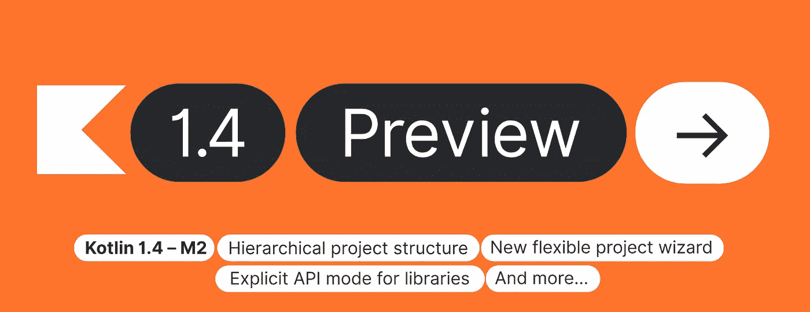
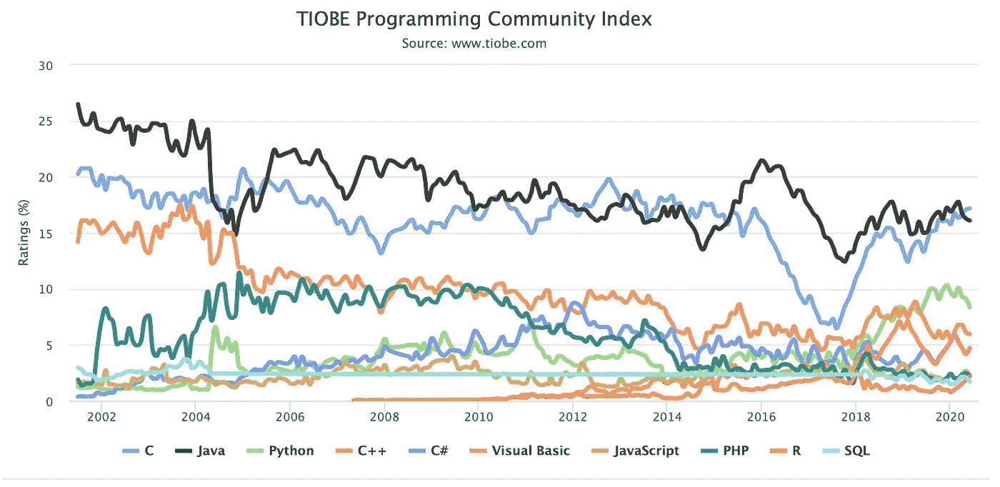

# Java 开发人员转向 Kotlin

> 原文：<https://levelup.gitconnected.com/switching-to-kotlin-for-java-developers-1ce67aa08094>

## 简洁、安全、可互操作且工具友好



来自科特林的最新消息(截止到 2020 年 6 月 23 日)

Java 是最古老和最流行的编程语言之一。它已经被组织用于软件开发很多年了。然而，在现代软件开发场景中，这种突出的语言是滞后的。



# 科特林是什么？

2011 年，JetBrains 宣布开发 Kotlin 编程语言，这是一种替代用 Java 或 Scala 等语言编写代码以在 Java 虚拟机上运行的语言。六年后，谷歌宣布 Kotlin 将成为 Android 操作系统的官方支持开发路径。

# 我们为什么要爱科特林？

使用 Kotlin 开发程序的开发人员不仅喜欢这种语言，而且热爱它😍。原因是什么？

Kotlin 是少数几种可用于服务器端、前端开发和移动应用的语言之一。源代码可以编译成 Java 字节码，也可以转换成 JavaScript。它还支持包括 iOS、macOS、Linux、windows 在内的目标平台将源代码编译成本地二进制文件。因此，我们可以使用 Kotlin 进行全栈开发。

Kotlin，更好的 Java。Kotlin 在 Java 上提供了很多功能，但没有带走任何东西。

Kotlin 从第一天起就有出色的 IDE 支持 Kotlin 来自 JetBrains，他们还开发了一个著名的 Java 集成开发环境(IDE): IntelliJ IDEA。JetBrains 的开发人员确保 Kotlin 在 IDEA 中有一流的支持。

# 从 Java 切换到 Kotlin

有经验的 Java 开发人员在学习 Kotlin 的细微差别时，不得不放弃一些 Java 实践。

## 你会少打字

***分号在 Kotlin 中是可选的。*** 编译器可以计算出该行的结束位置。事实上，如果您在行尾放置分号，您会得到一个编译器警告。

以下示例是 Kotlin 中的有效语法，可以独立编写。

```
println(“Hello, world!”)
```

不仅 Kotlin，Python 也不需要分号。

***可变类型规格在 Kotlin 中是可选的。在 Java 中，你用一个类型开始一个变量声明。这对 Kotlin 不起作用，因为它允许您从许多变量声明中省略类型。我们可以在不指定类型的情况下定义一个变量，然后像下面这样请求该变量的类型。***

```
val​ greet = ​"hello"println(greet)​ // hello
println(greet::​class​)​ // class kotlin.String**​**
println(greet.javaClass) // class java.lang.String
```

Kotlin 具有 smarts 类型推理，可以根据上下文确定变量的类型。但是如果您愿意，也可以显式指定类型。

```
val greet: String = “hello”
```

***在 Kotlin 中，类和函数是可选的。*** 与 Java 之类的语言不同，Kotlin 不要求一个语句或表达式属于一个方法，一个方法属于一个类，至少在我们写的源代码中是这样。

在下面的源代码中，函数不属于某个类，函数下面的代码是独立的，不属于任何函数。

```
fun hello(name: String) {
    println("hello $name")
}
```

***在 Kotlin 中，Try-catch 是可选的。Kotlin 不强迫你捕捉任何检查过或未检查过的异常。如果您没有在函数调用周围放置一个 try-catch，并且如果该函数失败，异常会自动传播到您的函数或代码的调用方。如果一个异常没有被处理，它将导致你的程序致命的终止。***

例如，在 Java 中，`Thread class`的`sleep()`方法抛出一个检查过的异常，编译器强迫我们处理它。但是在科特林，我们可以这样写。

```
Thread.sleep(500)
```

以上。代码没有任何 try 和 catch 关键字。

## Kotlin 编译器在给出警告时是明智的

例如，如果在函数或方法中收到的参数没有被使用，那么编译器会给出警告。

```
fun​ ​compute​(n: Int) = 0​ ​ 
println(compute(4))
```

当您运行这个脚本时，除了显示结果之外，Kotlin 还会报告任何关于未使用参数的警告。

```
0​ 
unused.kts:1:13: warning: parameter ’n’ is never used​ 
fun compute(n: Int) = 0​ 
      ^
```

## **更喜欢 val 而不是 var**

要定义一个不可变的变量，也就是常量或值，使用`val`关键字。

```
val​ pi = 3.14
```

`pi`的值可以修改，`val`关键字就像 Java 中的`final`关键字。

如果你想改变一个变量的值呢？让我们使用 var 关键字。就像下面的例子，我们创建一个可变变量，然后修改它的值。

```
var​ length = 10
println(length) ​//10​**​   ​** length = 15println(length) ​//15
```

多变性使得代码难以推理。具有可变性的代码也有更高的出错几率。具有可变性的代码更难并行化。一般情况下，尽量使用`val`而不是`var`。在 Kotlin 中，默认为 val 和不变性。

使用`val`，它只使变量或引用成为常量，而不是被引用的对象。所以`val`只保证引用的不变性，并不阻止对象的改变。

```
val​ message = StringBuilder(​"hello"​)​ ​ ​
//message = StringBuilder("another") // ERROR​​ ​ 
message.append(​"there")
```

简而言之，`val`只关注手头的变量或引用，而不关注它所引用的内容。然而，尽可能选择`val`而不是`var`。

## 改进的相等检查

就像 Java 一样，在 Kotlin 中有两种类型的等式。

*   结构相等(Java 中的`equals()`方法，或者 Kotlin 中的`==`操作符)，是值的比较。
*   引用相等(Java 中的`==`操作符，或者 Kotlin 中的`===`)是引用的比较。

但是 Kotlin 中的结构等式运算符`==`比 Java 中的`equals()` 方法多。比如你表演`a.equals(b)`；在 Java 中，如果引用`a`是`null`，你可能会遇到一个`NullPointerException`。当你在 Kotlin 中使用`==`时就不是这样了。按照惯例，Kotlin 中类似`a == b`的表达式被翻译成。

```
a?.equals(b) ?: (b === null)
```

如果`a`不为`null`，则调用`equals(Any?)`函数，否则(即`a`为`null`)检查`b`是否等于`null`。

## 科特林的弦乐

和 Java 一样，Kotlin 中的字符串是不可变的。这意味着一旦字符串被创建，我们就没有办法改变它的单个字符。

```
var myString = "Hello"
myString[0] = 'h' // ERROR
```

然而，我们可以从一个给定的字符串导出另一个字符串。Kotlin 用额外的功能丰富了 Java String 类。例如，方法`padEnd()`允许我们格式化一个字符串，以便表达式。

```
"Hello".padEnd(10, '!') // “Hello!!!!!”
```

或者我们可以重新分配一个字符串变量，如果你使用关键字`var`声明变量的话。

```
var myString = "Hey!" // Hey!
myString = "Hello!" // Hello!
```

## 字符串模板

Kotlin 有一个很棒的特性叫做字符串模板，它允许字符串包含模板表达式。字符串模板表达式以美元符号`$`开始。

```
val myInt = 5
val myString = "myInt = $myInt"
println(myString) //myInt = 5
```

字符串模板中可以使用任何有效的 Kotlin 表达式。

```
val n = 5
val message = "n + 1 = ${n + 1}" // n + 1 = 6
```

## 原始字符串

此外，在 Kotlin 中，我们有三重引用的原始字符串，可以包含特殊字符，而不需要对它们进行转义。

```
val​ raw = ​”””My friend asked, “How are you today, $name?””””​
```

我们可以使用这种符号来创建多行字符串。

```
val receipt = """Item 1: $1.00
Item 2: $0.50"""
```

## 多表达，少陈述

像 Java、C#和 JavaScript 这样的语言，语句比表达式多(if 语句、for 语句、try 等等)。另一方面，像 Ruby、F#、Groovy、Haskell 和许多其他语言的表达式比语句多。

让我们编写一段 Kotlin 代码，就像在 Java 等语言中一样。

```
fun canVote​(name: String, age: Int): String {
    ​
    var ​ status: String
    if​ (age > 17) {
        status = ​"yes, please vote"​
    } else​ {
        status = ​"nope, please come back"​
    }
    return​ ​"$name, $status"​
}
```

让我们重新编写前面的代码，使用 if 作为表达式而不是语句。

```
val​ status = ​if​ (age > 17) ​”yes, please vote”​ ​else​ ​”nope, please come back”​​ ​ 
​return​ ​”$name, $status”​
```

# 结论

在本文中，我们考虑了 Java 中没有的 Kotlin 语言的一个特性。

很简单，对吧？

# 参考

[1][https://blog . jetbrains . com/kot Lin/2011/08/why-jetbrains-needs-kot Lin/](https://blog.jetbrains.com/kotlin/2011/08/why-jetbrains-needs-kotlin/)

[2][https://blog . jetbrains . com/kot Lin/2017/05/kot Lin-on-Android-now-official/](https://blog.jetbrains.com/kotlin/2017/05/kotlin-on-android-now-official/)