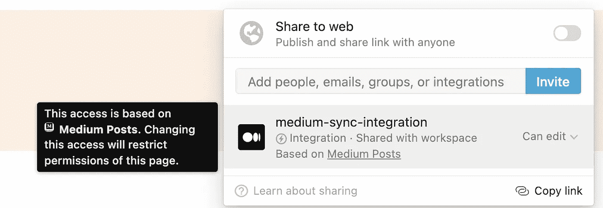
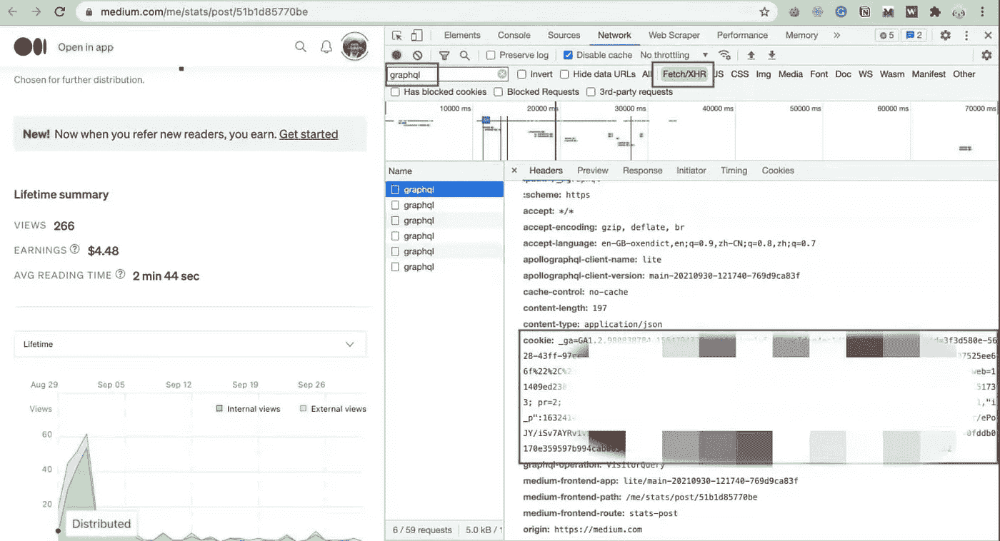

# 将您的媒体发布收入数据同步到概念数据库中

> 原文：<https://levelup.gitconnected.com/sync-your-medium-post-revenue-data-into-notion-database-9619bf8c644c>

## 同步后收入数据从媒体到概念数据库真的对每个作家都很有帮助

[**中**](https://medium.com/) 和 [**观念**](https://www.notion.so/) 是高效作家的两个绝佳平台。前者是一个流行的在线发布平台。而另一个是流行的笔记工具。它还提供数据库、维基、日历和提醒。


中等邮政收入数据

作为一个媒介写作者，你想知道以下几个问题吗？

*   昨天哪个帖子贡献的收入最多？
*   一生中哪个岗位贡献的收入最多？
*   哪个帖子收到的阅读量最多？
*   你一共发了多少帖子？
*   总字数和总阅读时间是多少？

如果你对以上问题感兴趣，这篇文章就是为你准备的！我将给出一步一步的程序来建立一个工具，从媒体到概念做数据同步

在开始之前，让我们看一下最终的概念数据库结果。

# 概念的最终结果


中等发布状态数据

在这个概念数据库中，我们有一些收入数据列，这些数据有 30 天、60 天、90 天，甚至是最后一天。我们还有其他有用的指标，如字数、总浏览量和阅读时间。

在这个数据库的帮助下，我们可以很容易地回答上述问题。

现在，让我们开始建造它吧！

## 步骤 1:创建一个概念集成令牌


概念集成页面

*   转到[https://www.notion.com/my-integrations](https://www.notion.com/my-integrations)。
*   点击“**+新整合**”按钮。
*   给你的集成起个名字——我选择了“*中等同步集成*”。
*   选择要安装此集成的工作区。
*   点击**提交**创建集成。
*   复制下一页的“**内部集成令牌**”并保存以备将来使用。

## 步骤 2:创建一个概念数据库

*   去你的观念工作区:[https://www.notion.com](https://www.notion.com)
*   从新页面开始，通过键入`/table`并选择一个整页表来插入一个新数据库。
*   给它一个标题——我选择“*中等岗位状态*”。
*   删除旧的列/属性，并插入新的列/属性，如下所示

```
|  Properties     |              Description            |
|-----------------| ------------------------------------|
|  Title          |    title of a medium post           |
|  Total View     |    total view of a medium post      |  
|  Total Earning  |    total lifetime earning           |                      
|  Earning 1d     |    earning of the past 1 day        |                         
|  Earning 30d    |    earning of the past 30 days      |
|  Earning 60d    |    earning of the past 60 days      |
|  Earning 90d    |    earning of the past 90 days      |
|  Word Count     |    how many words                   |
|  Reading Time   |    how many minutes to read         |
```

*   从地址栏的链接中提取数据库 id。格式看起来像是“https://www . opinion . com/{ {*database _ id*} }？…."，保存它以备将来使用。

## 步骤 3:共享概念数据库



与您的集成令牌共享概念数据库

点击`Share`按钮，使用选择器通过名称找到您的集成，然后点击`Invite`

## 步骤 4:获取中型登录 Cookie

*   转到 https://medium.com/me/partner/dashboard[页面](https://medium.com/me/partner/dashboard)
*   点击列表中任一帖子的**查看统计**
*   右击空白区域，点击“**检查**
*   如图，选择“**网络页签**”，按“ **graphql** ”关键字过滤，选择“ **fetch/xhr** ”按钮



获取中等 cookie 数据

*   通过键盘快捷键**命令+R** 刷新页面
*   现在，登录 cookie 数据如下所示，让我们复制它以供将来使用

## 步骤 5:运行代码

我们有以下两个脚本。

*   为了从介质中获取 post 数据并进行一些计算，下面是[代码](https://gist.github.com/jerryan999/b595049841e1c16ea6671bf647ffb9a8)
*   为了将数据和计算出的指标同步到概念数据库中，下面是代码[和](https://gist.github.com/jerryan999/94f40c3c61cf0fb04933a8790ae3b433)

请注意，在运行之前应该提供以下三个变量值。

```
NOTION_TOKEN = "YOUR KEY" 
DATABASE_ID_MEADIUM_STATS = "YOURE DATABASE ID"
MEDIUM_COOKIES = "YOUR COOKIES"
```

现在我们可以每天在电脑上运行上述代码。但是最好的解决方案是部署在服务器上，并安排它们定期运行。也许我会再发一个帖子来展示如何去做。

如果你对以上内容感兴趣，请给一些意见，我很乐意给更多的解释。