# 同步和异步的例子

> 原文：<https://levelup.gitconnected.com/synchronous-vs-asynchronous-by-example-36b7b87711e7>

## 探索微服务通信模式

实施微服务架构的一个主要障碍是处理服务间的通信。在传统的单片系统中，各种模块和层之间的通信是在内存中处理的。然而，当一个应用程序被分割成独立的服务并且信息必须通过网络交换时，必须使用不同的方法来应对增加的**延迟**。

本文探讨了服务间通信的同步和异步方法。我们将使用预定的服务和用例作为例子。除了更好地掌握整个系统，我们还将看到分析各种方法如何产生更有效的和**内聚模型**。

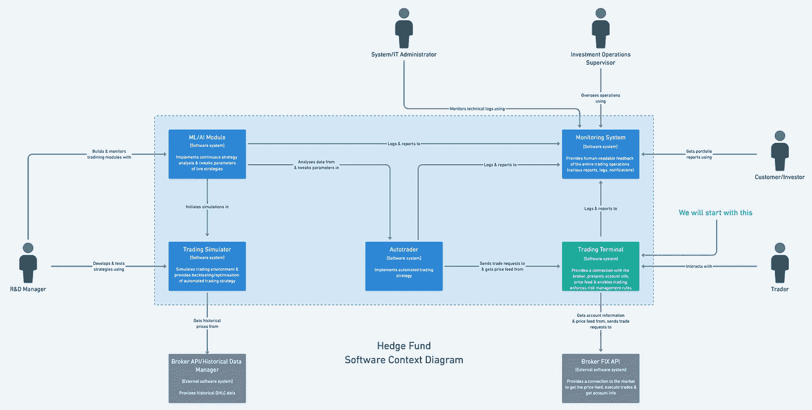

在[第 1 部分](https://medium.com/@robertmaidla/designing-hedge-fund-microservices-from-scratch-c370e2fda4c8)中确定的项目范围

*这是我从零开始为概念对冲基金构建软件系统系列的第 3 部分。在* [*第二部分*](/modelling-a-trading-terminal-3761a70f8c64) *中，我使用了职责、用例以及有界上下文来实现交易终端的特定服务。*

*当前图表在概念层面上描述了信息流。这一部分着重于更具体地分析各种沟通方式的利弊。*

服务间通信可分为**同步**和**异步**，单接收器和多接收器模式。这些将以交易终端为例进行演示。下图显示了哪种信息流需要编排。

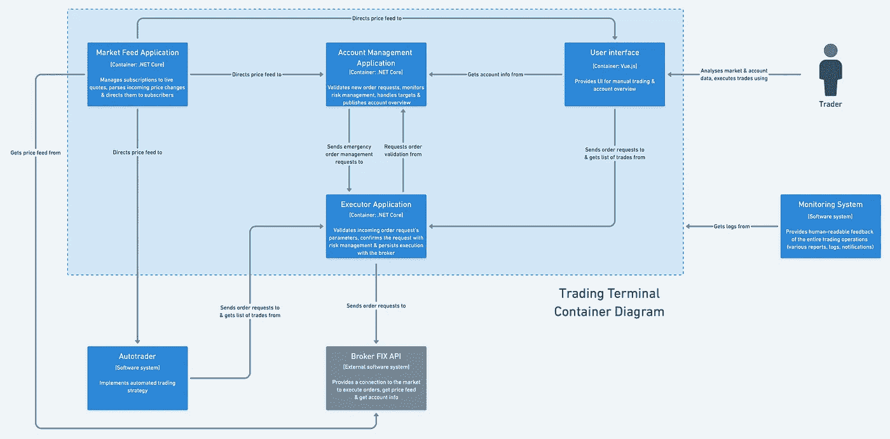

交易终端概述(在[第二部分](/modelling-a-trading-terminal-3761a70f8c64)中完成)

*图表的造型沿袭了*[*C4 模式*](https://c4model.com) *。这以一种有组织和统一的方式解释了不同层次的解决方案。我们目前正在做第二层——容器图。这些图表是使用一个名为* [*异想天开*](https://whimsical.com/) *的直观数字工作空间工具构建的。*

# 同步通信

这是一种更直接的方法，由 REST APIs 表示。它本质上涉及到进行 HTTP 调用，为了完成信息交换，对方必须处理请求并向请求者返回相应的响应。

*如果对休息不熟悉，可以在这里* *了解一下基础* [*。*](https://medium.com/extend/what-is-rest-a-simple-explanation-for-beginners-part-1-introduction-b4a072f8740f)

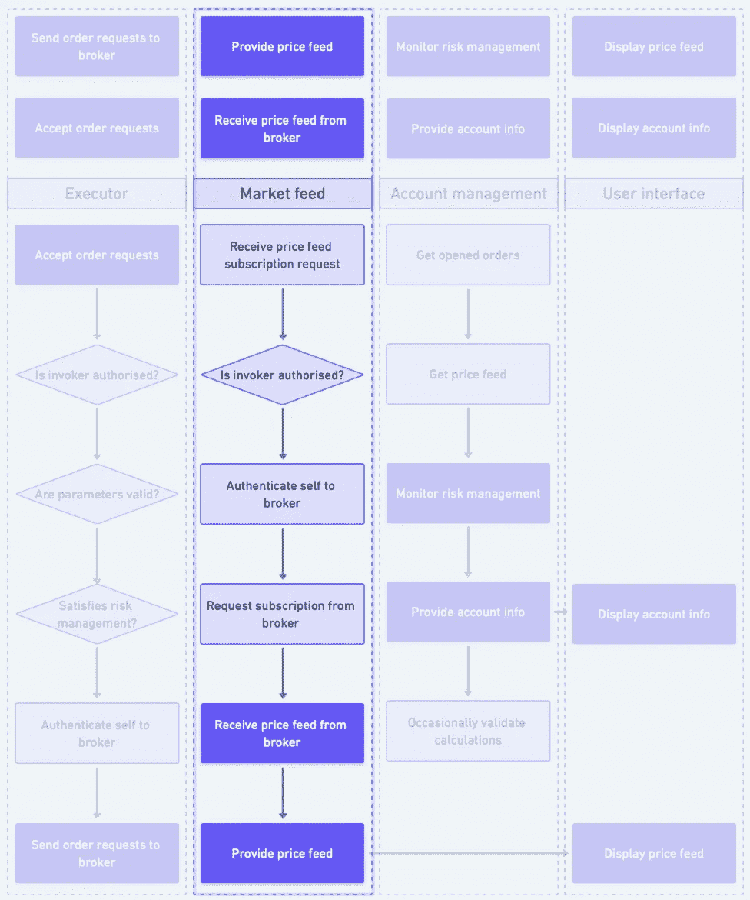

交易终端的职责(上)和使用案例(下)—关注**市场反馈**

在[第二部分](/modelling-a-trading-terminal-3761a70f8c64)中，我们开发了**用例**，它们首先导致有界上下文，然后导致服务。让我们利用更多的用例来说明同步和异步通信模式。

我们将探讨交易终端的两个主要职责:**接收&分发报价**和**处理订单请求** *(分别由市场反馈和执行者服务表示)。*首先，假设我们正在处理纯粹的**同步**通信，这将通过我们的服务之间的 API 调用来保持。

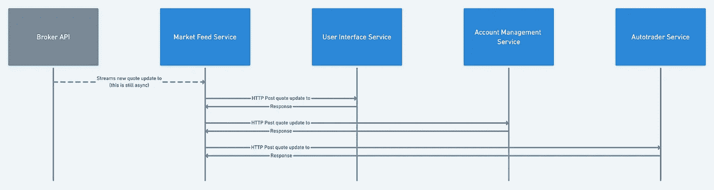

**同步接收&分发报价**(横线代表正在进行的沟通)

这可以归类为一对多通信，其中相同的信息必须在多个接收者之间分发。

报价分发生命周期从 market feed 服务从代理 API 接收价格更新开始。为了将这些信息同步传输到必要的服务，market feed 应用程序需要向这些 API 中的每一个发送信息。

这是这种方法的第一个味道——市场反馈服务需要知道其他 API 并直接调用它们。这将使**依赖于**其他服务。换句话说，我们将把**耦合**引入我们的系统。

> "如果改变程序中的一个模块需要改变另一个模块，那么就存在耦合."马丁·福勒

此外，在前一个服务处理完请求并做出响应之前，信息不会到达后面的服务。在高频流量中，如各种工具的价格变化，应尽可能降低延迟。我们可以对调用的顺序进行优先级排序，最有可能选择从账户管理服务开始其关键任务操作，但是这里更好的方法是在发出请求时使用**回调**。

*HTTP 请求可以同步处理(线程被阻塞)，也可以异步处理(线程不被阻塞，响应最终会到达回调)。然而，不管客户端代码执行如何，通信仍然使用同步协议(意味着每个请求都需要一个响应)。*

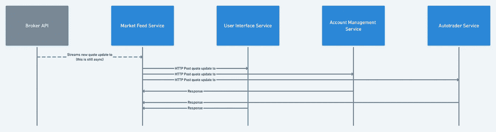

**接收&分销报价**(通过回调执行)

这样，我们可以注册异步任务，一次发送所有请求，然后等待响应，而不是在发送新请求之前等待响应。这种方法会使系统更加健壮。

如前所述，在我们能够从 HTTP 调用获得响应之前，接收服务需要**处理**请求。这可能意味着直接处理报价变化，并基于它进行必要的计算。为了提高效率，接收方可以在内部发布报价更改事件，让另一个线程处理繁重的计算。

然而，无论我们以哪种方式处理信息，当所有相应的服务完成处理并返回响应时，初始请求者仍然会被阻塞。在我们的示例中，market feed 服务必须等待 3 个不同的 HTTP 调用以及中间的处理，然后才能继续下一个报价。

考虑一下应用程序的环境——在活跃的交易时段，一个单一的流动性工具平均每秒会产生多次价格变化。终端应该能够无缝地同时订阅整个索引的符号，这意味着每秒钟可以处理数百个(如果不是数千个的话)单独的报价。

由于大量的网络调用以及在分发报价时对其他服务的依赖，市场反馈服务将很快变成我们系统中的一个瓶颈。由于接收价格变化也是我们系统工作流程的逻辑入口点，我们将对我们的能力设置重大限制。

**简而言之**，通过接收&分销报价，同步模式向我们介绍了以下潜在问题:

*   由于依赖于其他服务，请求可能会被搁置很长时间；
*   这将很快把我们系统的一个核心特性变成一个瓶颈，包括延迟和大量的请求处理；
*   我们的服务将紧密耦合*(失去 DDD 和微服务架构的一个关键优势)；*
*   依赖于通信的服务接收请求时会有轻微的偏移，这意味着我们必须确定信息分发的优先级。

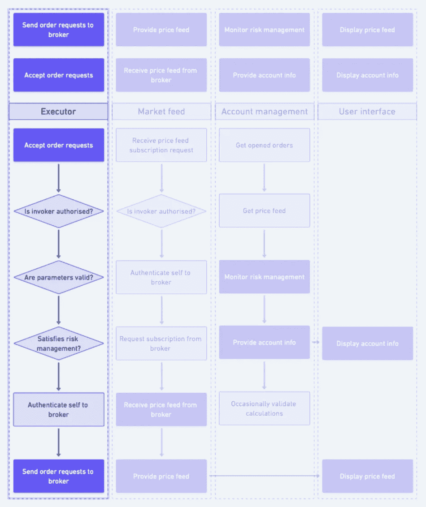

交易终端的职责(上)和用例(下)—关注**执行者**

继续到**处理订单请求**，该请求由 executor 服务处理。由于不直接处理报价，此用例不会像此解决方案中的其他服务那样频繁地请求负载。尽管大部分时间是空闲的，但它需要是系统中操作更迅速的动作之一。

当分发报价处理单个请求和响应周期时，执行订单需要几个服务的协作。这将在同步处理时创建一系列连续的 HTTP 调用。

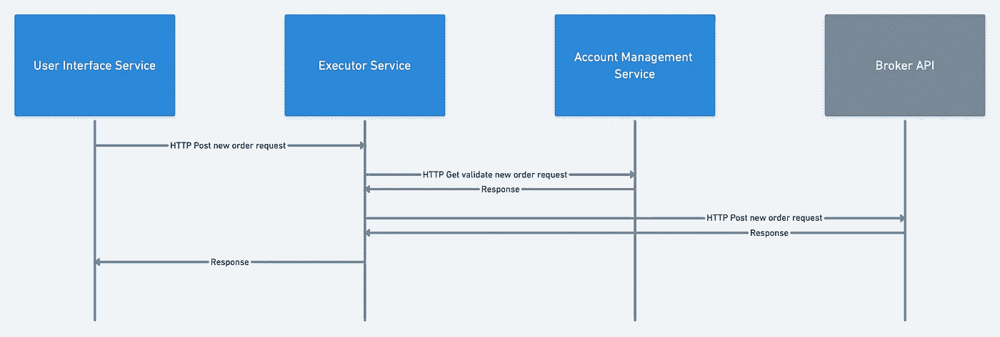

**同步处理订单请求**

*这可以归类为一对一的沟通，其中信息被传递给单个提供商。*

*到目前为止，在建模过程中，我假设与代理的连接将通过 FIX API 保持。为了简单起见，让我们假设通信将通过 REST API 进行。*

执行动作生命周期从 executor 服务接收新订单请求开始，在本例中，该请求来自用户界面。根据之前确定的用例，executor 服务将需要通过首先验证其参数来处理请求*(现在让我们跳过安全层)。*

参数验证后，执行者需要确保订单符合风险管理规则。为此，将通过另一个 HTTP 调用联系帐户管理服务。一旦相应的计算完成，响应被发送回执行程序*(假设到目前为止所有的验证都已通过)*，下一个请求将涉及代理 API。

在用户界面服务完成请求生命周期之前，执行者还需要将订单请求定向到代理*(附加处理)*，需要执行一个交易，下面的响应应该返回给执行者服务。换句话说，这意味着依赖一系列连续的 HTTP 调用来完成三个服务。

简而言之，除了紧耦合之外，这种解决方案不可避免地会由于**阻塞**而导致低性能。即使单个服务不会经常失败*(它们会失败)*，通过 HTTP 调用链接它们也会影响整个系统的性能和可伸缩性。

当链中的任何一个服务失败时，整个链将*(如果处理不当)*。微服务系统应该能够承受部分故障，在这种情况下，这将通过重试逻辑和[断路器](https://martinfowler.com/bliki/CircuitBreaker.html)来实现。然而，由于 HTTP 链的复杂性，失败逻辑很快就会变得相对复杂。

本例中的最后一点*味道*是，executor 服务通过在其工作中包含许多其他服务，将类似于**中央协调器**。虽然这种方法在 [SOA](https://medium.com/@SoftwareDevelopmentCommunity/what-is-service-oriented-architecture-fa894d11a7ec) *(微服务从其中派生出来)*中使用，但它被认为是微服务架构中的一种反模式。

**总而言之，**同步处理通信会导致高耦合，因为服务需要相互了解才能发出必要的请求。此外，由于微服务架构中的分布式职责，一个完整的操作通常涉及两个以上的相互通信的服务。创建一个 HTTP 调用链，当所有内部请求完成时，最初的请求者被阻塞，这是低效的，并且容易失败。

此外，以这种方式进行通信非常类似于一个整体架构，其中使用 HTTP 而不是进程内通信。换句话说，我们将创建一个**分布式整体**，它合并了两种模式*(整体&微服务)*的负面影响。

此外，向同步链添加新的服务或依赖关系是相对痛苦的。从执行角度来看，这显然会进一步延长请求。从开发的角度来看，由于高度耦合，这将需要交互中涉及的两个服务的显著增强，而不是主要关注新的组件。

*高效的基础设施和精心制作的领域模型，与代码相匹配，支持重构和添加新功能。修改和添加应该变得更加容易，而不是相反。*

# 异步通信

异步模式解决了同步通信的缺点，它将通信双方解耦，使它们能够同时工作，彼此独立。如果需要发送信息，只要消息被传递，提供者就会放心，而不必等待消费者处理它。

在微服务架构中，我们可以通过中间人服务来实现这一点，中间人服务的唯一任务是接收信息并将其传递给相应方。服务只需要知道接受和分发信息的中间人。此外，消息生产者线程将在传递消息后被释放，而不需要等待另一端的处理。

让我们使用相同的两个交易终端的活动*(分发报价和处理订单请求)*，这次使用 AMQP 协议和一个**消息代理**来传递信息。

> “消息被发布到*交易所*，这通常被比作邮局或邮箱。然后，交换机使用称为*绑定*的规则将消息副本分发到*队列*。然后，代理或者将消息传递给订阅队列的消费者，或者消费者根据需要从队列中提取/拉出消息。”— **AMQP 协议**由 [RabbitMQ](https://www.rabbitmq.com/tutorials/amqp-concepts.html) 解释

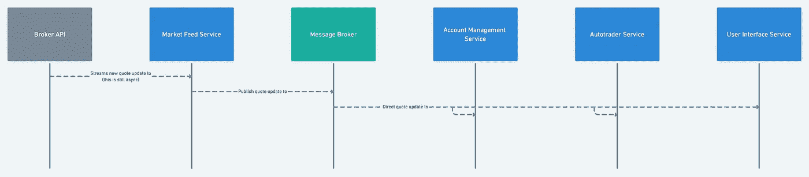

**异步接收和分发报价**

当 market feed 服务收到来自代理的报价更新时，它会将该信息发布给消息代理。一旦完成，market feed 服务就可以自由地接受新的报价，而不必等待不相关的流程处理。

此外，由于消息代理管理与接收方的通信，市场反馈服务不需要直接与其他服务交互。这为我们提供了一个松散耦合的架构。

消息代理知道通过对特定队列或事件的订阅将信息定向到哪里。在本例中，帐户管理、autotrader 和 UI 服务都订阅了一个市场提要队列。我们可以根据需要让尽可能多的用户加入一个队列。这是一对多关系的示例。

*这本质上类似于 webhooks 的工作方式，其中异步通信是通过将一个服务器连接到另一个服务器发布的事件来建立的。通过这种方式，不需要请求信息，而是在必要时“推送”或发布信息。*

在事件驱动的通信中，正在交换的消息被称为**事件**。这些可以代表在应用程序的生命周期中发生的各种各样的动作和变化。在我们的示例中，我们将引发 *PriceChangedEvents* ，它将保存交易对手了解*所需的数据(即符号、新价格、交易量)*。

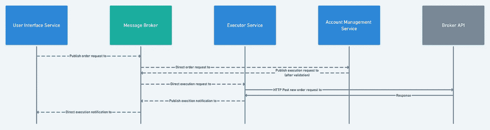

**异步处理订单请求**

请注意，在处理订单请求时没有阻塞调用。所有系统都是独立的，对它们需要关注的事件做出反应，并处理它们自己的业务——微服务的定义。这就是为什么异步通信最适合微服务架构，并且是推荐使用的模式。

*这里有几个注意事项:*

*   *在这个例子中，执行器和代理 API 之间的实际执行请求是同步的。这是一个不阻塞任何其他服务的 HTTP 请求。因为代理 API 不是我们内部系统的一部分，所以即使我们想，我们也不能将它订阅到我们的消息代理。*
*   *我们可以用一个固定的 API(这是我想要实现的)来实现完全异步的通信。然而，对于这些例子，代理端的 REST API 可能更容易统一管理，因为我们还没有讨论 FIX 通信的细节(我们将在接下来的文章中讨论)。*

和大多数解决方案一样，硬币有两面。使用中间人处理信息增加了信息在网络上交换的次数。此外，这种通过中介的来回、间接的消息传递给我们的系统增加了另一层复杂性。

我还意识到，如果我们将 executor 和帐户管理服务合并，通信模式可以变得更直接，更少闲聊。虽然在第 2 部分中确定的有界上下文在服务边界之间做出了相对*干净的划分，并且很好地分离了责任，但是这种潜在的重构值得进一步探索。*

使用当前的架构，执行者不需要处理报价。它需要快速且独立于报价处理可能产生的繁重负载。如果我们将它与帐户管理服务合并，它可能不会一直响应。

但是，executor 服务高度依赖于帐户管理服务。交易应用程序中的一个重要业务规则是，在评估执行对整个投资组合的影响之前，不应该执行任何操作。因此，基本上唯一有权直接请求订单执行的是帐户管理服务。这种紧密耦合暗示我们应该考虑合并这两个服务。

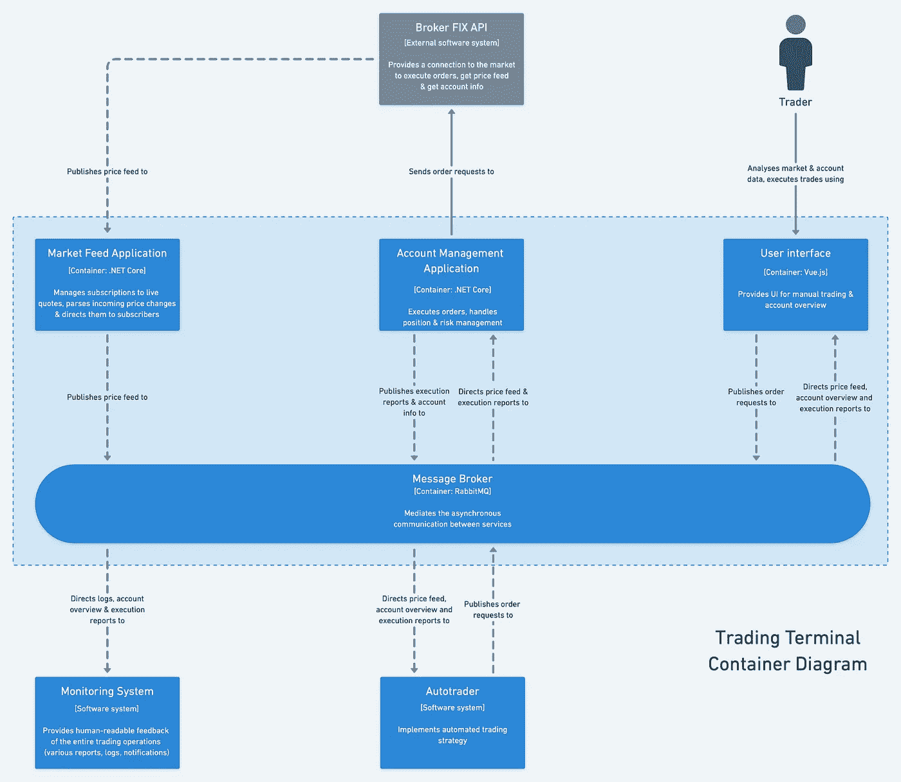

交易终端容器图(重构)

我已经**将**executor 服务与账户管理合并，并添加了**消息代理**。与我们开始使用的交易终端模型相比，这个解决方案*(通过消息代理和合并的执行器和账户管理服务进行异步通信)*具有以下优势:

*   交易终端解决方案是松耦合的*(服务只需要知道各自的职责，并对某些事件做出响应)*；
*   更强的凝聚力*(密切相关的执行和账户管理职责更紧密地结合在一起)。*
*   解决方案的核心职责*(分发报价&处理订单请求)*需要不同服务之间更少的通信*(降低网络可靠性)。*

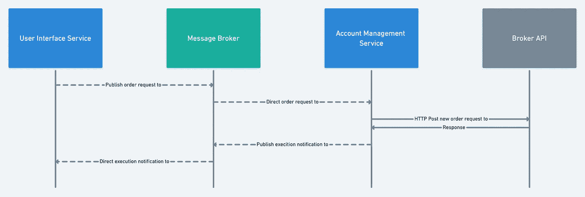

**异步处理订单请求**(重构)

在深入研究消息代理*(对特定队列和事件建模)*的机制之前，我们应该弄清楚一个更重要的方面— **数据管理**。这将是更高层次上的最后一块拼图，因为它要求我们确定在系统中的何处以及如何保存数据。异步通信使我们能够使用诸如**最终一致性**或**事件源**之类的模式。

*注意:异步通信不仅仅包括消息代理和事件。仅举几个例子，Webhooks、Websockets 和轮询也是这一类别的一部分。然而，为了让文章专注于手头的事情，这次没有探究这些例子。*

# 摘要

同步管理微服务解决方案将是直接且容易理解的，但会很快将服务与服务结合起来，使系统看起来像一个分布式的整体。

带有事件驱动通信的异步模式消除了这些问题，并使解决方案更具可伸缩性。然而，这并不是没有代价的，因为消息中介给通信带来了额外的一层，随之而来的是更多的复杂性。

分析服务间的交流揭示了信息交流在哪里可能变得过于闲聊，表明需要更大的凝聚力。这种模式必然会根据新的信息改变*(或者说* ***进化*** *)* 。重构不应该被避免，只要它导致更深层次的模型，就应该受到欢迎。

我们的蓝图解决了另一个难题。有很多有趣的话题要讨论，比如自治、弹性和数据一致性。在下一部分中，我们将弄清楚如何在交易终端中管理**数据**，之后我们将对交易终端的功能有一个清晰的了解。这使我们能够更深入地研究我们的模型和设计服务组件。那里见！