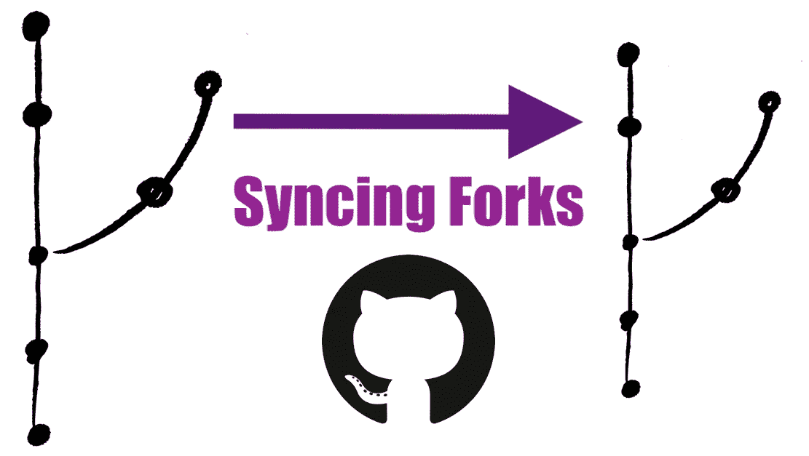
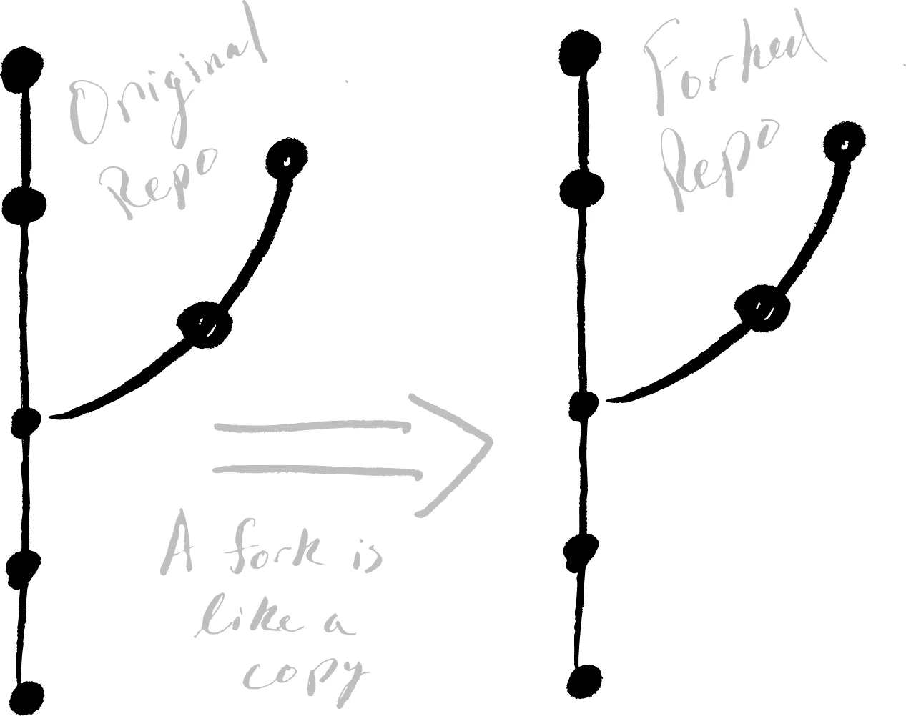
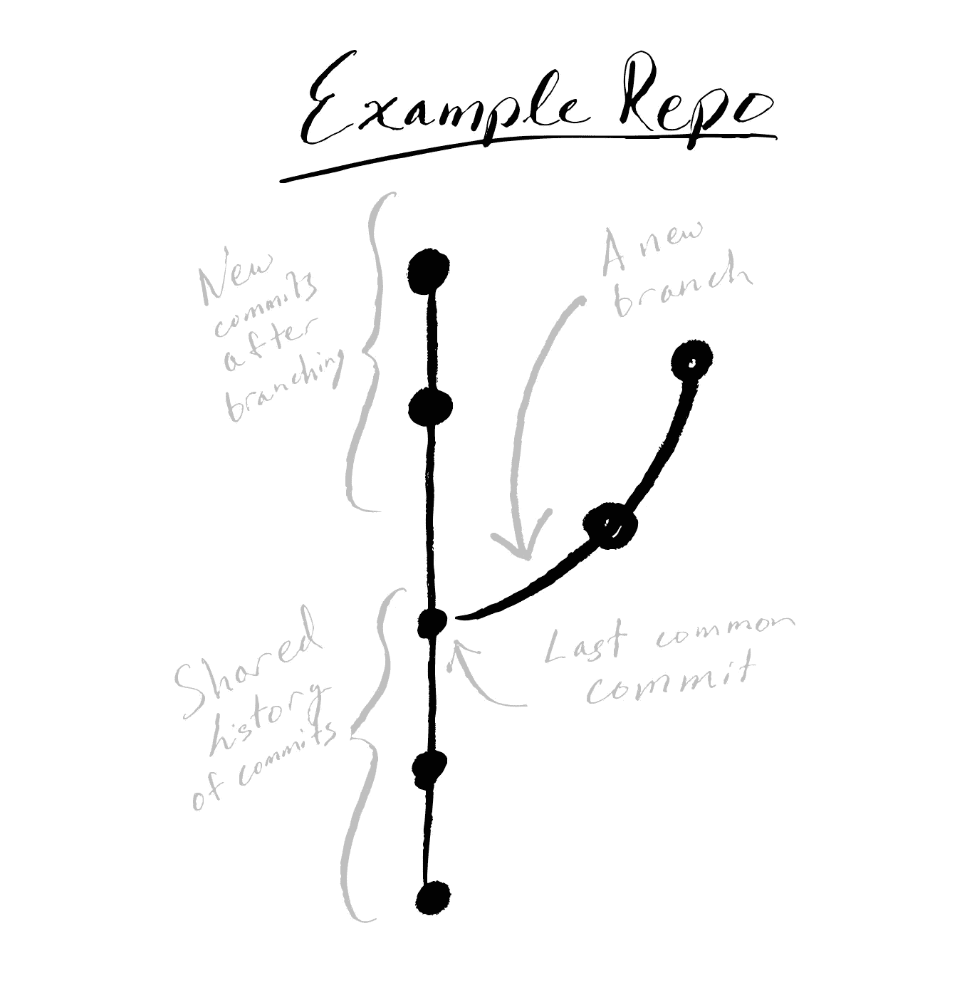
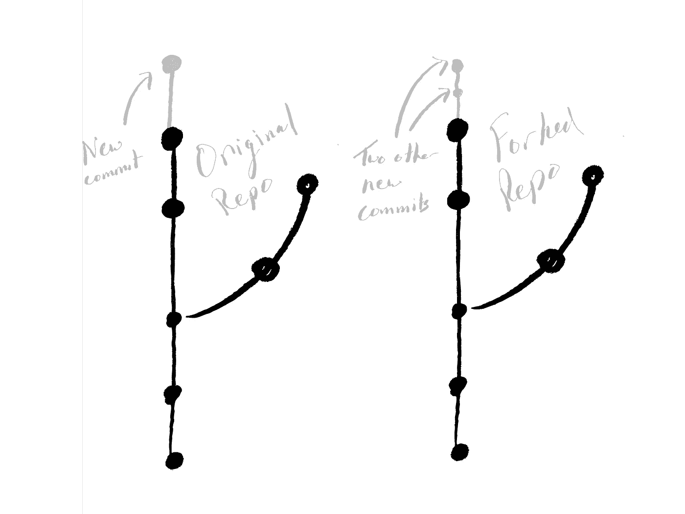

# 同步 GitHub 分叉

> 原文：<https://levelup.gitconnected.com/syncing-github-forks-42306190bf91>



PS:查看我的相关视频来演示这篇文章所描述的内容(同步 GitHub forks)☝🏼

所以你已经听说了这个 *GitHub* 的东西对于协作来说是非常好的。

您发现有人在 GitHub 上启动了一个很棒的项目，并遵循了一些关于派生这个、克隆那个等方面的教程。您做了一些额外的工作，并对您的版本进行了一些提交。一切看起来都很好。

然后你会发现，当你摆弄你的项目版本时，原作者加入了一个非常酷的特性。你想把它包含在你的版本中，但是你不确定怎么做。你可以试着开始复制和粘贴代码。或者干脆放弃你自己的工作，重新开发新版本。

但你知道你能做得更好！你真是个坏蛋，想学什么就学什么。你认为其他人在从事新项目时也遇到了同样的问题。所以肯定有更好的方法。

还有*是*更好的办法！进入 GitHub **forks** ！然而，有一个警告。几乎所有的解决方案都会带来额外的复杂性。我们特别需要讨论同步你的叉子。如果您不确定 fork 到底是什么，下一节将给您一个简要的概述。如果您对分叉概念足够熟悉，可以跳过下一节。

# 什么叉子？

在我们进入任何关于处理 GitHub 分叉的具体细节之前，回顾一下什么是分叉可能会有所帮助。当探索新的主题时，正式文档通常是一个好的起点。GitHub 做了一个很棒的[介绍](https://help.github.com/en/github/collaborating-with-issues-and-pull-requests/about-forks)，值得一看。但大概还是值得总结一点。

fork 实际上不是 git 版本控制系统的一部分，像 GitHub GitHub GitHub git lab git lab git lab git lab git。fork 只是一个带有一些漂亮的额外特性的存储库，可以使在 GitHub 这样的平台上的协作更加容易。您“派生”了一个项目的存储库，或 *repo* ，这将创建一个具有相同提交、分支和当然文件的存储库的副本。

当您派生一个回购协议时，您将在该时间点从原始回购协议创建一个新的回购协议。然后，您可以从原始的历史开始修改您的新分叉。同样好的是，你可以保留一点记录，将你的叉子绑在原始回购上。

我喜欢把 forks 看作原始存储库的一种“超级分支”。当您创建一个分支时，您有一个共享的提交历史和一个共享的公共提交祖先。现在这两个分支都可以独立于另一个进行更改。同样，原始回购和分叉都有一个相同的共享时间点。然后，随着新提交的增加，可以独立地处理它们。

我们可以创建一个新的分支，进行一些新的提交，然后合并它们。这样，两个分支都包括彼此过去的提交历史。合并分支是一个强大的工具，如果我们能用 forks 做到这一点就好了…



“fork”实际上只是原始回购协议的副本，包含所有分支机构的历史记录！

嗯，我们可以！这就是为什么叉子对于协作如此重要；您可以采用某人的工作，进行一些更改，然后将存储库合并在一起。(从技术上讲，它们位于每个回购的两个分支之间。)GitHub 调用这些 [*拉请求*](https://help.github.com/en/github/collaborating-with-issues-and-pull-requests/creating-a-pull-request-from-a-fork) 。我们不会在这里详细讨论(也许下次)。相反，我们将讨论在我们分叉并且原始项目领先于您的分叉之后我们做什么。

# 与平行宇宙一起工作



回购的典型抽象表示。

分支经常被比作*“平行宇宙”*，因为当一个分支被创建时，它与一个分支共享一个共同的(提交)历史。此后，每个分支都可以继续自己的历史。如果您稍后想要将某个分支的一些变更合并到另一个分支中，我们可以在该分支上进行[合并](https://git-scm.com/docs/git-merge)。

> *声明一下，Atlassian 有一个关于*[*git merge*](https://www.atlassian.com/git/tutorials/using-branches/git-merge)*的很棒的教程。*

叉子和树枝很相似。因此，我们基本上可以使用相同的合并工作流，包括 fork 和原始回购。这确实有点棘手，因为它真的不是一个分支。但是你可能会发现按照下一节中的步骤做并没有那么糟糕。

让我们回忆一下当时的情况:

> *您已经进行了回购。也许你甚至在这个分叉的回购协议中加入了你的香料，并做出了一些承诺。然后你看原来的回购做了一些改动。您希望将新的历史记录合并到分叉回购中，而不必完全重新开始。*



情况是:原始回购上的新提交和分叉回购上的新提交。

# 解决方案是同步:整合从原始回购到分叉回购的变化

## 步骤 1:向原始回购添加一个遥控器

我们首先需要配置一个指向原始回购协议的遥控器。这将使您的回购知道在哪里寻找原始回购的更新历史。

为此，我们在电脑上打开一个终端，导航到我们的(分叉)回购。接下来，我们添加一个名为`upstream`的新远程存储库，它将指向原始回购:

```
git remote add upstream [https://github.com/ORIGINAL_OWNER/ORIGINAL_REPOSITORY.git](https://github.com/ORIGINAL_OWNER/ORIGINAL_REPOSITORY.git)
```

在上面的命令中，`https://github.com/ORIGINAL_OWNER/ORIGINAL_REPOSITORY.git`应该是原始回购的链接(不是你分叉的那个)。这告诉你的回购原始回购的位置。

为了确保一切顺利，我们可以用`git remote -v`检查我们的遥控器。您应该会看到一个指向分叉回购的链接(通常我们使用名称`origin`)和一个指向名为`upstream`的原始回购的链接。输出应该如下所示:

```
$ git remote -v 
> origin https://github.com/YOUR_USERNAME/YOUR_FORK.git (fetch) 
> origin https://github.com/YOUR_USERNAME/YOUR_FORK.git (push) 
> upstream https://github.com/ORIGINAL_OWNER/ORIGINAL_REPOSITORY.git (fetch) 
> upstream https://github.com/ORIGINAL_OWNER/ORIGINAL_REPOSITORY.git (push)
```

> *注意，我们把这个新的遥控器叫做* `*upstream*` *，但是你也可以很容易地把它命名为其他的东西，比如* `*original_repo*` *。但是我们这样做是因为上面的命名方案是常见的做法。*

您可以查看 GitHub 文档中关于[“为 fork 配置遥控器”](https://docs.github.com/en/free-pro-team@latest/github/collaborating-with-issues-and-pull-requests/configuring-a-remote-for-a-fork)的步骤总结

## 第 2 步:从原始文件中获取变更

好了，现在我们已经配置了遥控器，我们必须从原始回购中获取当前历史记录。

我们可以使用以下命令来实现这一点:

```
git fetch upstream
```

> *注意如果你用了一个不同于* `*upstream*` *的名字，你必须使用那个名字。*

这将*获取所有分支的最新历史记录*(类似于单个分支的`git pull`)。完成后，我们将能够将原始回购分支的变更合并到我们自己的回购中。

## 步骤 3:将变更合并到您的回购工作分支中

这将我们引向期待已久的时刻；将变更合并到我们自己的回购中！🎉

真正酷的事情是，如果你对合并感到舒服，这是相同的过程！

首先，确保您在分叉回购中的正确分支上，您希望更改包含在其中。你可能需要像`git checkout main`一样做一个*检验*。

一旦您确定您在正确的分支上，我们可以合并来自原始 repo ( `upstream`)分支的变更。根据分支名称的不同，该命令类似于以下内容:

```
git merge upstream/main
```

> *注意，这里我们从原始回购的* `*main*` *分支进行合并。如果分支的名称不同，您应该更改该分支的名称。*

就是这样！如果一切正常，输出应该如下所示:

```
$ git merge upstream/main 
> Updating q3f2742..4f55dbc 
> Fast-forward 
> TEMP | 5 ----- 
> README.md | 3 +++ 
> 2 files changed, 3 insertions(+), 5 deletions(-) 
> delete mode 100644 TEMP 
> create mode 100644 README.md
```

> *注意，在这一步你可能会遇到*合并冲突*。您可以遵循与合并两个分支时相同的步骤。*

# 所有设置和同步！


同步后，分叉回购将包括原始分支的历史！

我们完事了。回顾一下，我们为原始回购添加了一个遥控器，获取了历史记录，最后检查了我们分叉的回购分支，并将原始回购的分支合并到我们的分支中！我们可以像下面的命令集那样做:

```
git remote add upstream https://github.com/ORIGINAL_OWNER/ORIGINAL_REPOSITORY.git git fetch upstream git checkout main git merge upstream/main
```

> *如果你想深入了解更多细节，你可能想看看 GitHub 的这组* [*fork 教程*](https://docs.github.com/en/free-pro-team@latest/github/collaborating-with-issues-and-pull-requests/working-with-forks) *。*

此外，请随意查看我关于同步 GitHub forks 的附带视频[！](https://youtu.be/q2fQMD1gLPI)

*原载于*【https://blog.mrgeislinger.com/syncing-github-forks/】