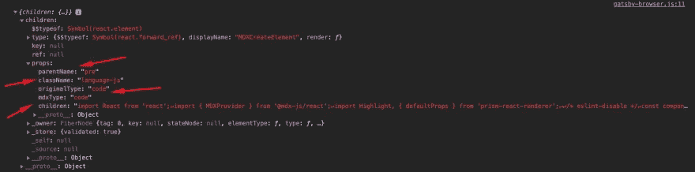

# Gatsby MDX 中的语法高亮

> 原文：<https://levelup.gitconnected.com/syntax-highlighting-in-gatsby-mdx-f0187ce51f4f>


照片由[埃斯特扬森斯](https://unsplash.com/@esteejanssens)拍摄

在本帖中，我们将探讨如何使用 [prism-react-renderer](https://github.com/FormidableLabs/prism-react-renderer) 为 Gatsby MDX 文件启用语法高亮显示。

首先，我们需要安装几个模块

```
npm i prism-react-renderer @mdx-js/react
```

然后，我们创建将在`<MDXProvider/>`中使用的组件，它将为我们的应用程序提供包装器替换。

```
const component = {
  pre: props => {
    const className = props.children.props.className || '';
    const matches = className.match(/language-(?<lang>.*)/);
    return (
      <Highlight
        {...defaultProps}
        code={props.children.props.children}
        language={
          matches && matches.groups && matches.groups.lang
            ? matches.groups.lang
            : ''
        }
      >
        {({ className, style, tokens, getLineProps, getTokenProps }) => (
          <pre className={className} style={style}>
            {tokens.map((line, i) => (
              <div {...getLineProps({ line, key: i })}>
                {line.map((token, key) => (
                  <span {...getTokenProps({ token, key })} />
                ))}
              </div>
            ))}
          </pre>
        )}
      </Highlight>
    );
  },
};
```

为了呈现我们在 MDX 文件中添加的代码块以显示在页面上，我们将访问`<pre/>`组件的子组件的 props，因为 markdown 代码块被编译成包装代码组件的`<pre/>`组件。
我们可以通过使用`props.children.props.children`更深入地获取代码，正如你从下面的截图中看到的。



为了获得代码块的语言属性，而不是硬编码值，我们查看 MDX 代码块，因为它是一个类名，看起来像 language-className(例如 language-javascript)。

为了获得 MDX 文件中代码组件中定义的语言，我们将在`props.children.props.className`处向下钻取，如果没有类名，那么我们可能没有在代码块中放置语言，在这种情况下，我们将默认为空字符串。
然后我们在 regex 中使用一个名为 lang 的名称捕获组来获取 language-className 的语言。如果有匹配的

```
const matches = className.match(/language-(?<lang>.*)/);
```

通过在下面的`gatsby-browser.js`中添加以下代码片段，在 MDX 文件中启用语法高亮显示

```
import React from 'react';
import { MDXProvider } from '@mdx-js/react';
import Highlight, { defaultProps } from 'prism-react-renderer';/* eslint-disable */
const component = {
  pre: props => {
    const className = props.children.props.className || '';
    const matches = className.match(/language-(?<lang>.*)/);
    return (
      <Highlight
        {...defaultProps}
        code={props.children.props.children}
        language={
          matches && matches.groups && matches.groups.lang
            ? matches.groups.lang
            : ''
        }
      >
        {({ className, style, tokens, getLineProps, getTokenProps }) => (
          <pre className={className} style={style}>
            {tokens.map((line, i) => (
              <div {...getLineProps({ line, key: i })}>
                {line.map((token, key) => (
                  <span {...getTokenProps({ token, key })} />
                ))}
              </div>
            ))}
          </pre>
        )}
      </Highlight>
    );
  },
};export const wrapRootElement = ({ element }) => {
  return <MDXProvider components={component}>{element}</MDXProvider>;
};
```

**在这篇文章之后，你可以在这里** **找到一个 starter repo** [**，它显示了 MDX 页面的用法和语法高亮显示**](https://github.com/gabroun/gatsby-mdx-starter)

# 如果你觉得这篇文章有帮助

如果你想进一步了解《盖茨比》中的 MDX，请阅读以下内容:

[](/how-to-create-pages-dynamically-in-gatsby-using-mdx-66faa175944e) [## 如何使用 MDX 在 Gatsby 中动态创建页面

### 在本帖中，我们将探讨如何在 Gatsby 中使用 MDX 以编程方式创建页面。

levelup.gitconnected.com](/how-to-create-pages-dynamically-in-gatsby-using-mdx-66faa175944e)