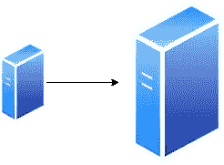

# 系统设计基础:分布式系统

> 原文：<https://levelup.gitconnected.com/system-design-basics-distributed-systems-9aac8a11177c>

*分布式系统*是一种系统，其中组件位于不同的网络服务器上，并通过在彼此之间传递数据来协调它们的动作。

# 分布式系统的关键特征

这些是您可能希望系统具备的特征。根据所做的设计决策，其中一些可能会被另一个特性所取代。

## 可量测性

可伸缩性与系统处理增长或增加的需求的能力有关。能够适应和增长以支持数据量或交易量增长而不影响性能的系统被认为是可扩展的。

有两种方法可以扩展系统:

**垂直扩展**:我们可以增加单个服务器的大小(增加更多的功率)，以便能够处理更多的工作。

垂直缩放

垂直扩展受限于服务器必须增加功率的容量。此外，扩展同一台机器会使系统面临单点故障的风险。如果服务器瘫痪，一切都会瘫痪。

**水平扩展**:我们可以向网络中添加更多的服务器，并在它们之间分配负载，以便处理更多的工作。

水平缩放

水平扩展可以提供无限的扩展。您可以根据需要向网络中添加更多的服务器。此外，它不会像垂直扩展的服务器那样遭受单点故障，因为负载是分布式的。如果一台服务器出现故障，系统的其他部分仍在运行。

## 可靠性

可靠性是一个系统在给定的时间内，在正常条件下执行其预期功能而不发生故障的概率。一个可靠的系统即使遇到一次或多次故障，仍能提供服务。

可靠性可以通过软件和硬件组件的冗余来实现，因此，如果某个组件出现故障，备用组件可以随时接替它的位置。 [***冗余***](https://en.wikipedia.org/wiki/Redundancy_(engineering)) 是对系统的关键组件或功能进行复制，目的是增加系统的可靠性，通常是以备份或自动防故障的形式，或提高实际系统性能。

## 有效性

可用性是在正常条件下，系统在给定时间点运行的概率，或系统对故障的抵抗能力。这通常被描述为系统的 ***容错*** 。

如果一个系统一年有 3/4 的时间在运行，那么该系统有 75%的可用性。

如果一个系统是可靠的，它就是可用的。可用的系统不一定可靠。为了实现这一点，系统应该在各种条件下都可用。如果系统仅在特定条件下可用，当遇到意外的大容量时，它将需要停机时间，从而变得不可靠。

一个例子是一个销售粉丝商品的网站，在正常情况下，客户总是可以访问和购买商品。如果网站发布了一个非常受欢迎的项目，并且收到的流量远远超过了系统设置处理的流量，那么系统将会关闭，客户将无法使用该系统。

可用性通常用[***九***的数量来表示。9 指的是服务正常运行时间的百分比。《出埃及记》4 个 9 意味着 99.99%的正常运行时间。5 个 9 是 99.999%的正常运行时间。拥有 5 个 9 或更多个 9 的系统被视为 ***高可用性*** 系统。](https://en.wikipedia.org/wiki/High_availability)

## 延迟和吞吐量

延迟和吞吐量是衡量系统性能的两个指标。

**延迟**:数据通过一个系统需要多长时间。数据从系统中的 A 点到 b 点需要多长时间。

**吞吐量**:单位时间内系统可以处理的操作数量。吞吐量通常可以用每秒事务数(TPS)或每秒请求数(RPS)来衡量。

## 可维护性

在规定的时间内，系统或系统元件在规定的环境中可以修复的概率。可维护性的提高意味着维修时间的缩短。这包括当发生故障时，恢复到完全运行是多么简单和快速。如果修复系统的时间越短，系统的可用性越高。

# 参考

 [## 分布式操作系统的特点

### 要构建一个值得努力的分布式系统，必须满足各种重要的目标。分布式系统…

www.geeksforgeeks.org](https://www.geeksforgeeks.org/features-of-distributed-operating-system/)  [## 分布式计算-维基百科

### 分布式计算是计算机科学中研究分布式系统的一个领域。分布式系统是一个系统…

en.wikipedia.org](https://en.wikipedia.org/wiki/Distributed_computing)