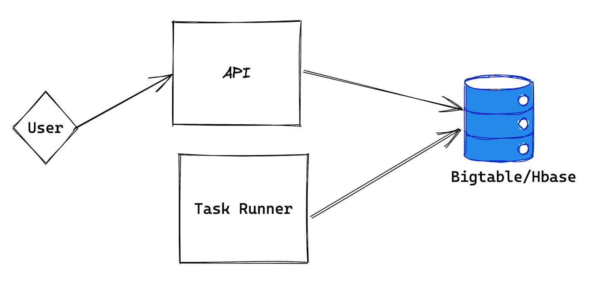
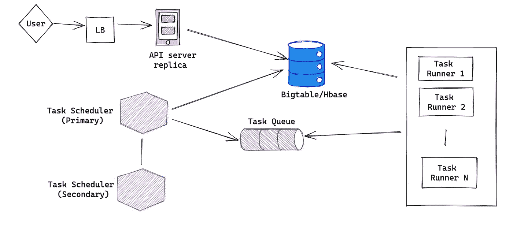
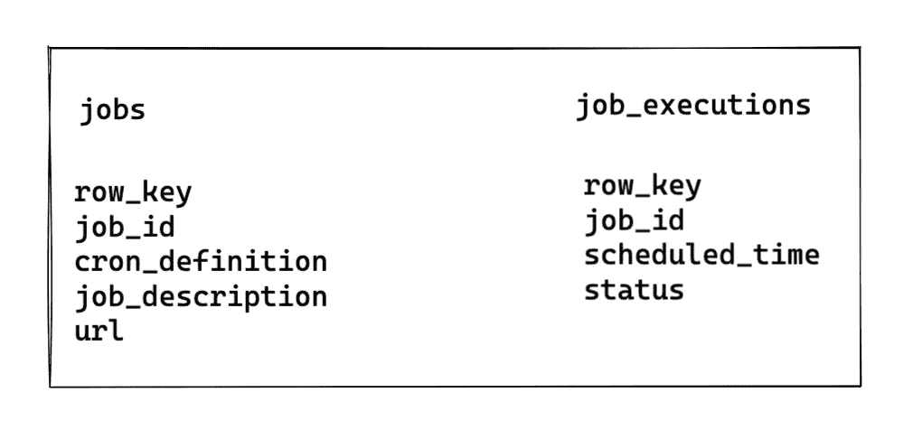

# 系统设计:设计分布式作业调度程序

> 原文：<https://levelup.gitconnected.com/system-design-designing-a-distributed-job-scheduler-6d3b6d714fdb>

你曾经使用过谷歌云的[云调度器](https://cloud.google.com/scheduler)或者类似的服务吗？

它是一个分布式作业调度程序，您可以在其中定义要在特定时间调度的作业，该作业可以是一次性的，也可以是重复的。

比方说，如果你被要求为你的公司设计一个类似的系统，或者在面试中，你会如何设计？

设计分布式作业调度器有很多方法，没有正确或错误的答案。这完全取决于我们的设计对于用例或我们试图解决的问题是否足够。

这就是为什么我们要先写下需求。

# 功能需求

1.  这将是一项服务，客户可以按需安排工作。
2.  客户将提供一个 cron 定义和一个调度作业的任务
3.  最初，任务很简单，客户将提供一个 URL，系统需要在预定的时间内点击该 URL。
4.  同样的任务可以重复。
5.  客户可以定义最短 1 分钟、最长 30 天的作业。

# 非功能性需求

1.  每天执行一亿个任务。(平均每秒 1000 个任务)
2.  从任务开始到预定时间的延迟应该最小
3.  高可用性
4.  监控和警报
5.  如果没有到期，同一任务不应运行多次；因此需要很强的一致性。

# 初始设计思想

首先从单台机器或最简单的设计开始，然后尝试扩展或优化解决方案，这总是一个好主意。这是我最初的想法

作业调度程序的简单设计概述

这里我们有三个组件:

1.  **API 服务器**:HTTP 网络服务器，用户可以直接点击添加工作。
2.  **Bigtable/HBase** :这是我们存储工作相关信息的数据库。为什么是 Bigtable 或 Hbase？这是因为我们的系统需要很强的一致性，我们的写入量会很大，Bigtable/Hbase 比其他解决方案更适合这种情况。看起来我们并不需要 ACID 属性，所以 Bigtable/Hbase 非常适合我们的需求，而且高度可伸缩。根据 CAP 定理，Bigtable/Hbase 是 CP(一致性，分区容差)系统，所以感觉会失去可用性。然而，在现实生活中，它有 99.9%的可用性，所以它也是一个高度可用的系统。
3.  任务运行器:它是一个后台运行的守护进程。它每分钟都会在数据库上运行一次查询，找出应该执行的作业，并尽可能同时运行它们。

# 这种设计的问题

存在多个单点故障。最关键的组件是任务运行器，它需要找出适当的作业并运行任务。一台机器不可能同时运行 1000 个任务。我们需要更多的机器来处理这项任务。另一个问题是，我们需要在 DB 表上运行一个查询，以获得每一分钟应有的作业。我们肯定需要索引来减少查询负载。那么我们能把设计做得更好吗？

# 更好的设计

# 深潜

## API 服务器

在设计分布式系统时，单台机器不是一个好主意，因为它会成为单点故障。我们需要 API 服务器的多个副本；在所有的 API 服务器前面，我们需要一个负载平衡器。负载平衡器可以使用循环算法来分发请求。

## 任务调度程序

以前的设计将任务运行器和调度器合并到同一个组件中。我们应该拆分组件，以便每个元素都有一个单独职责。此外，这将有助于单独扩展每个服务/组件。我们可以将组件分成两个服务/组件

1.  任务调度程序
2.  任务运行程序

任务调度程序将在数据库中运行一个查询，以获取在特定时间到期的作业。然后，所有到期的作业或任务将被排入分布式消息队列，如 SQS 或 RabbitMQ。先进先出(FIFO)队列是最好的。

我们应该为任务调度器提供一个主从配置，以消除单点故障。如果主服务器出现故障，辅助服务器将接管。

# 任务运行程序

任务运行器服务将从消息队列中获取消息。每条消息将包含作业 id 和要点击的 URL。任务运行程序可以点击 URL，然后更新数据库中的作业状态。如果作业重复出现，Task runner 还会将其添加回数据库。如果我们想进一步拆分服务，另一个服务可以完成这个重调度部分。

我们应该有多个任务运行器来处理每秒 1000 个任务。如果一台服务器每秒可以处理四个任务，则需要 250 个任务运行程序来减少计划时间和任务开始时间之间的操作时间。

# 数据库设计

我还没有谈到如何存储数据库。根据设计，我们选择了 Google Bigtable 或 Hbase(它们在技术上类似)主要是为了强一致性。

该表将是这样的:

为了找出到期的任务，我们将使用`job_executions`表。

现在请注意，大表没有二级索引特性。只能在`row_key`列上进行索引。延伸阅读:【https://cloud.google.com/bigtable/docs/schema-design】T2

我们的查询将获取一个时间范围内的作业，所以`row_key`应该有计划时间的信息，否则，查询将变成一个全表扫描，这将是缓慢和 CPU 密集型的。

那么`row_key`的格式是什么呢为了更快地得到结果，我的建议是:

`job_execution:${job_id}:${scheduled_time}`

因此，行键将如下所示:

`job_execution:abcpqr:1643473065` `job_execution:abcpqr:1643493065 job_execution:pqrsrww:1643373075`

如果我们以这种方式存储数据，我们可以对具有开始时间戳和结束时间戳的行键运行基于正则表达式的查询(它将使用索引而不是全扫描),以获得应该在某个时间范围内运行的作业。延伸阅读:[https://cloud . Google . com/bigtable/docs/using-filters # row-key-regex](https://cloud.google.com/bigtable/docs/using-filters#row-key-regex)

设计行键非常重要，因为它将有助于在多个节点中有效地分布数据，并且平衡读写。在这里了解更多信息:[https://cloud . Google . com/bigtable/docs/performance # distributing-data](https://cloud.google.com/bigtable/docs/performance#distributing-data)

# 我们能把设计做得更好吗？

尽管我们描述的当前设计可行且可扩展，但我们还可以进一步优化。如果您仔细观察，就会发现我们每分钟都在查询数据库以获取到期的作业，这会给数据库带来巨大的负载。我们可以添加一个缓存层吗？

## 缓存层

我们可以有一个缓存服务器来找出在该时间范围内到期的作业。每天只有 1440 分钟。我们可以在缓存层使用内存缓存或 Redis。缓存键将是一天中的每一分钟，其值将是此时应该运行的 job_id 的列表。如果我们需要更多服务器(缓存集群)来保存缓存，我们将按 job_id 进行分区，并可以使用一致性哈希。

我们需要一个守护进程来更新缓存。该守护程序将每五分钟甚至每小时填充一次缓存(取决于 SLA)，这将大大降低数据库的负载，因为我们降低了查询的频率。

# 结论

我之前说过，答案没有对错。但是当你在面试或与工程师的讨论中谈论设计时，你需要确信你的设计是可行的和可扩展的。我希望你喜欢我的文章。请提供您的反馈，以便我改进自己。

## 其他资源

1.  [https://medium . com/Airbnb-engineering/dynein-building-a-distributed-delayed-job-queueing-system-93 ab 10 f 05 f 99](https://medium.com/airbnb-engineering/dynein-building-a-distributed-delayed-job-queueing-system-93ab10f05f99)
2.  [https://airflow.apache.org/](https://airflow.apache.org/)
3.  [https://docs . celery project . org/en/stable/getting-started/introduction . html](https://docs.celeryproject.org/en/stable/getting-started/introduction.html)

在 [Linkedin](https://www.linkedin.com/in/faiyaz26/) 上关注我，获取更多类似的内容，如果你有任何问题，请在这里发表评论。如果你有兴趣参加我的模拟面试，请点击这个[链接](https://techmockinterview.com/interviewer/78344406-8d50-444b-a57b-138fc4c0fd3f?ref=VWgLKJXP)。