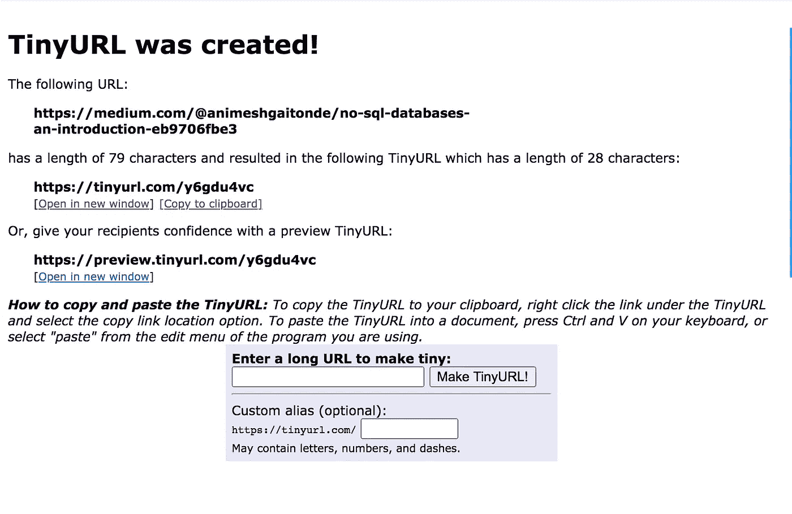
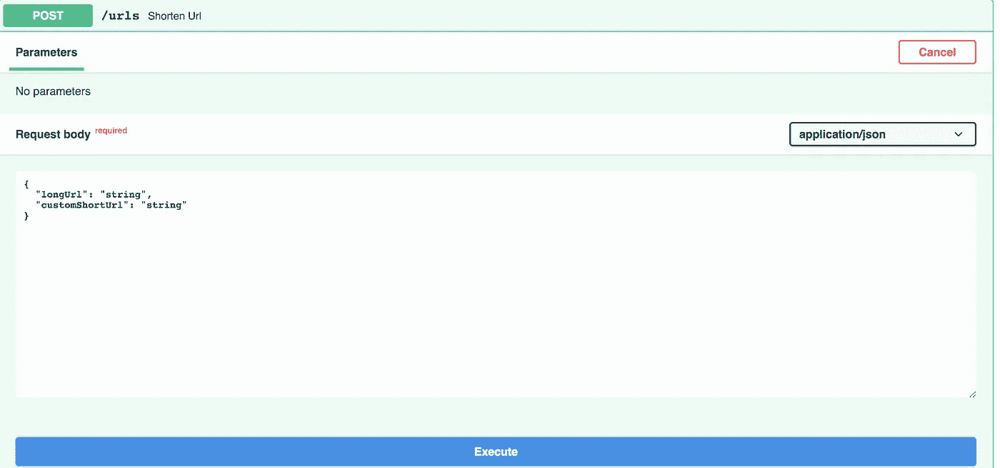
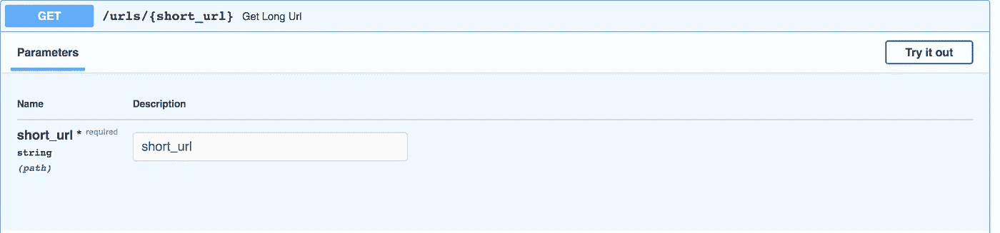
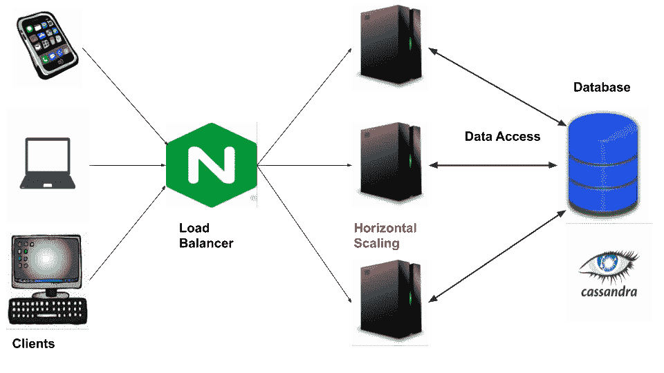
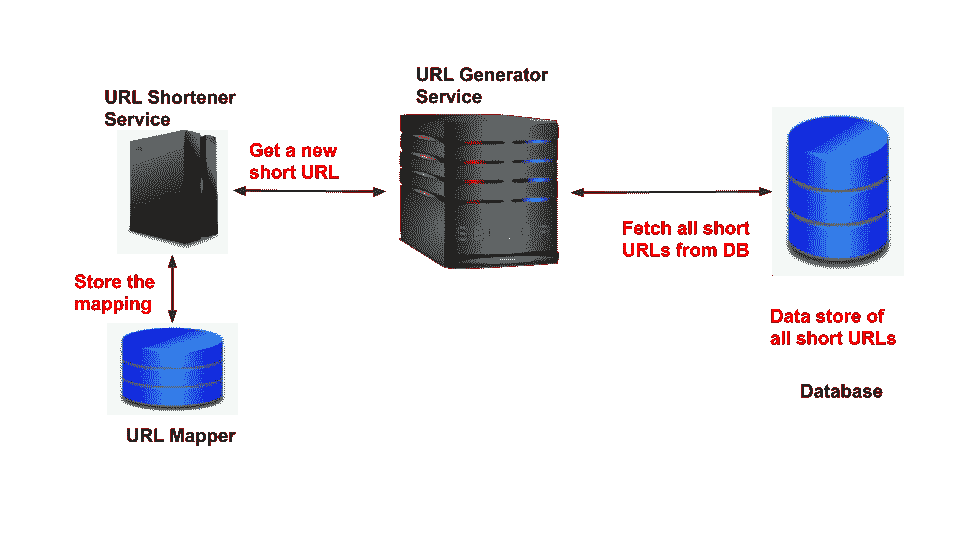
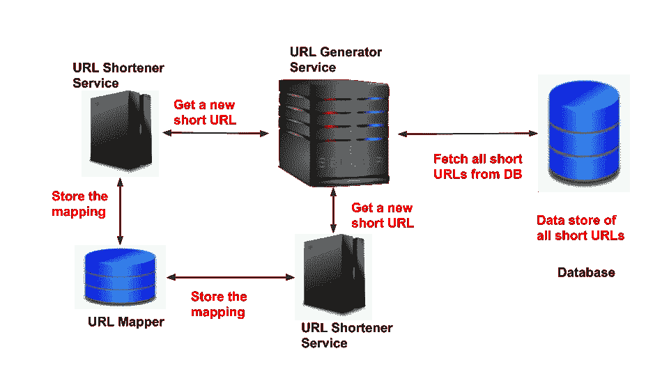
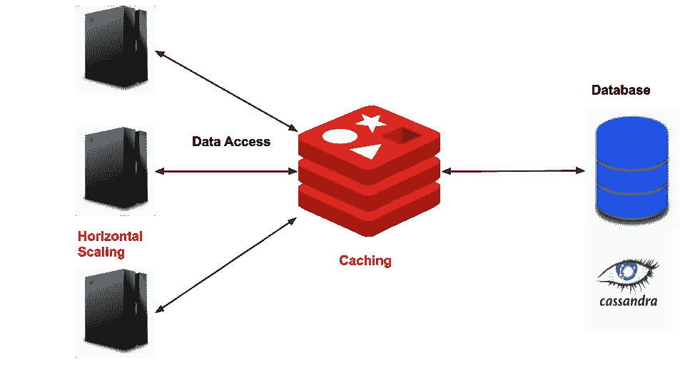
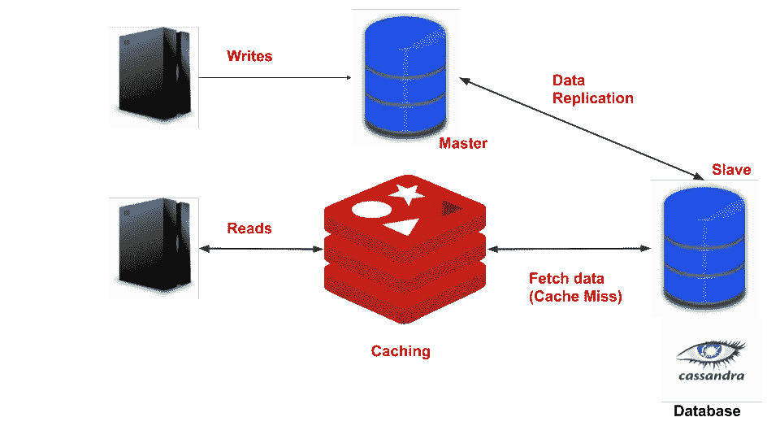

# 系统设计:设计一个可扩展的、高可用性的 URL 缩短器

> 原文：<https://levelup.gitconnected.com/system-design-designing-a-scalable-highly-available-url-shortener-eef5a5698d50>

URL 缩写程序的高级设计

**微小网址系统设计**

# 介绍

系统设计面试问题是有意开放式的。这给了面试官一个评估设计技巧和技术概念深度的机会。日常的工程工作包括设计许多可伸缩的系统。这次面试提供了一个平台来评估候选人解决问题和沟通的能力。

没有充分的准备和实践，很难完成系统设计。此外，对于没有分布式系统背景的候选人来说，这也是一种威胁。有时，如果不遵循结构化的方法，受访者似乎会失去注意力&偏离主题。

在解决问题之前，对系统设计概念有一个清晰的概念是很重要的。在本文中，我选择了一个设计 URL 缩短服务的简单问题。这对任何初学者来说都是一个容易的问题。系统设计问题没有具体的正确或错误答案。然而，候选人必须证明在解决问题时所做的设计选择是正确的。

我们将着眼于如何系统地解决一个设计问题。在这个过程中，我还将涉及分布式系统基础、API、数据库模式设计和设计权衡。让我们开始吧。

**让我们开始设计**

# 了解问题/产品

这里的问题陈述是“【tinyurl.com】设计一个类似于的 URL Shortner”。如果你不知道或从未听说过 TinyUrl.com，请暂停一下，访问这个网站。在开始讨论之前，我们需要了解产品的行为。

**微小的网址**

使用过该产品后，您会了解客户是如何与之交互的。此外，问面试官几个澄清性的问题总是好的

*   谁是该系统的用户— *企业用户或一般的任何用户*
*   他们将如何使用它— *网络浏览器还是移动设备*
*   应用程序的目标— *缩短互联网上的任何 URL 或组织的内部 URL*
*   客户可以提供自定义的短网址吗？
*   数据存储—临时短 URL 或永久短 URL

对上述问题的回答将有助于人们对问题的理解。问问题也表明一个人不会马上解决问题。它有助于消除任何疑问，并以足够的清晰度进行设计。

# 要求

让我们将需求分为功能性和非功能性需求。

以下是功能要求:-

1.  系统应该将长 URL 转换成短 URL
2.  在浏览器中键入短 URL 时，用户必须被重定向到长 URL 链接
3.  用户应该有能力为给定的长 URL 提供一个自定义的短 URL
4.  系统应该存储一年的网址&以后清除所有旧的条目

以下是非功能性要求:-

1.  服务必须具有高可用性和可伸缩性
2.  它应该以最小的延迟处理高吞吐量
3.  应用程序应该是持久的和容错的

当我们清楚需要设计什么的时候，我们就可以进行下一步的设计了。

# CP vs AP 系统

我们需要决定这个系统是 CP 系统还是 AP 系统。

对于 URL shortener，我们可以在可用性上牺牲一致性吗？这是需要和面试官讨论的事情。

在这种情况下，让我们假设如果创建了一个新的 URL，它可能不会立即可用。例如:-一个新创建的网址可以在几毫秒的延迟后可用。在此之前，系统将抛出一个错误，指示未找到 URL。该系统将高度可用，并继续响应用户的查询。

因为我们选择设计 AP 系统，所以每个读取请求可能不会跟在最近的写入之后。但是，系统最终会保持一致。

# 容量估计

## 交通计算

在设计大规模系统时，我们需要知道有多少用户会使用该系统。什么是数据访问模式？需要多少应用和数据服务器。

guestimation 中上述问题的答案。候选人应该粗略估计有多少用户会使用这项服务？

假设我们有 2 亿用户。在 200Mn 用户中，有 2 Mn 用户可以主动缩短 URL。假设每天平均收到 10 个请求(读+写)。

因此，我们每天创造 2000 万个这样的记录。剩下的 2000 万用户将从短 URL 中获得长 URL。假设每个用户发出 10 个请求，我们总共有 200 个请求。结果是每秒 2300 个请求。

**流量？**

## 存储计算

每天产生 2000 万个 URL。假设系统被设计为处理未来五年的请求。

要存储的 URL 总数= 20 Mn * 30(天)* 12 * 5 =*360 亿*

我们将在数据存储中存储长 URL、短 URL、创建和修改的字段。每条记录将消耗 *0.5 Kb* 的内存。因此，所需的总存储将为**360 亿* 0.5 Kb** = *18 TB*

# 蜜蜂

按照要求中的约定，我们将拥有以下 APIs

*   **缩短长网址**

**缩短长网址**

请求主体将把 *customShortUrl* 作为可选参数。如果不存在，它将假定为空。

后端服务器将对长 URL 的长度进行验证。因此，它将返回以下响应代码:-

▹ 400-错误的请求

▹ 201-已创建。添加了 Url 映射条目

▹ 200-好的。重复请求的幂等响应

*   **从短 Url 获取长 URL**

**从短网址到长网址**

如果系统找到对应于短 URL 的长 URL，用户将被重定向。HTTP 响应代码将是 302。

如果缺少短 URL，服务将抛出 404(未找到)。它将对输入执行长度检查。如果长度超过阈值，将抛出 400(错误请求)。

# 构建块和 URL 缩短算法

## 关键组件

以下是 URL 缩短应用程序中的关键组件:-

1.  客户端-网络浏览器/移动应用程序。它将通过 HTTP 协议与后端服务器通信
2.  负载平衡器——在后端服务器之间平均分配负载
3.  Web 服务器——将部署多个 web 服务器实例进行水平扩展
4.  数据库——它将用于存储长 URL 到短 URL 的映射

下面是组件及其相互作用的概要

**系统的高层设计**

## 缩短算法

我们估计该系统需要存储 360 亿个网址。短 URL 可以由小写(*‘A’—‘Z’*)、大写(*‘A’—‘Z’*)&数字(*0–9*)组成。要支持 360 亿个 URL，短 URL 必须至少有 6 个字符长。

⁶⁶= 568 亿英镑。

将长 URL 转换成短 URL 的最简单的方法之一是使用散列法。将长 URL 传递给哈希函数以获得固定长度的字符串(例如:- 32 字节的字符串)。然后提取前 6 个字符得到短网址。

然而，使用上述方法有两个缺点

1.  两个不同的 URL 可以映射到同一个短 URL。这是碰撞的结果。使用统一的散列函数可以减少冲突的机会。此外，伪随机数可用于散列
2.  如果一个用户多次尝试缩短同一个长 URL，他每次都会得到不同的结果。在这种情况下，由于冲突，长 URL 返回相同短 URL 的可能性很高

## URL 生成器服务

我们需要保证每个被缩短的长 URL 的唯一性。为此，我们可以预先生成一组短 URL，并将其保存在数据库中。可以引入一个新的层来管理这些短 URL。我们称这个服务层为 *URL 生成器服务。*

该服务将作为所有短 URL 的来源。URL Shortener 服务将从此服务获取一个新的短 URL。随后，它将存储长 URL 和短 URL 之间的映射。下图说明了这一过程

**URL 生成器服务的角色**

上述过程将确保为每个请求分配一个唯一的短 URL。上述方法存在一些挑战。我们考虑了单个服务请求一个微小 URL 的情况。如果多个 URL Shortener 服务同时运行会怎样？

## 并发问题

扩展上述系统可能会导致并发问题。如果处理不当，同一个 URL 可能会被分配给两个不同的服务。

**扩展网址缩写服务**

为了解决这个问题，我们可以将状态关联到一个微小的 URL。这个微小的 URL 可以有两种状态——*活动*，和*非活动*。默认情况下，所有 URL 都将处于*非活动*状态。一旦它被分配给客户端，它必须被标记为*活动*。只有*活动的*URL 可以分配给客户端。

为了改善延迟， *URL 生成器服务*可以从数据存储中预取所有微小的 URL。这将避免每个新请求都调用数据库。此外，它现在可以使用锁定数据结构来同步多个客户端应用程序的访问。

# 数据库模式

我们需要一个表来存储长 URL 和短 URL 之间的映射。可以使用以下模式:-

**URL 映射模式**

因为 *short_url* 列是主键，所以它的索引和查找将会很快。包含了两个时间戳字段*创建于*和*修改于*。这些字段将有助于清除表中的所有旧条目。

为了在 RDBMS 和非 SQL 数据库系统之间做出选择，让我们重新考虑一下我们的存储估计。我们希望存储至少 18 TB 的数据。此外，我们希望以最小的延迟来满足请求。

最好将数据分布在不同的机器上。这将防止单点故障。因此，在这种情况下，数据分片是必要的。

此外，我们没有关系的数据模型。这里对连接没有要求。此外，我们预计我们的数据会逐渐增长。此外，我们的系统被认为是一个 AP 系统。

考虑到以上几点，NoSQL 似乎是这里的明显赢家。NoSQL 数据库有内置的分片，更容易扩展。

# 权衡和瓶颈

## 如何扩展读取

*   **缓存**——通过引入缓存，我们可以扩展读取查询。如果收到多个具有相同短 URL 的查询，服务可以从缓存中返回长 URL。我们可以使用 LRU(最近最少使用)作为缓存回收策略。

**缓存**

*   数据复制- 我们可以把读查询和写查询分开。可以在主机上执行写操作，并将数据复制到从机。从属可用于执行读取查询。

**数据复制**

## 如何分割数据

在单个数据库服务器上存储数据会导致瓶颈。可能会有单点故障。随着流量的增长，数据库的读/写压力也会增加。因此，最好将数据分布在不同的数据库服务器上。

我们有以下三种数据分片策略

1.  **基于范围的分区**——在这个策略中，以“ *a-h* 开头的 URL 可以分配给服务器 1，以“ *i-o* 开头的 URL 分配给服务器 2，依此类推。使用这种方法，可能会出现不均匀的数据分布。这可能导致一个碎片中的数据是另一个碎片的两倍或三倍
2.  **基于散列的分区**——这种方法消除了数据分布不均匀的可能性。然而，当引入新的服务器或移除现有的服务器时，它不能很好地扩展。
3.  **一致散列**——这种分区策略克服了上述两种策略的局限性。数据分布是均匀的，添加或删除新服务器会影响最少数量的记录。

## URL 的清理

需要安排一个异步作业来删除所有过期的缩短 URL。此作业将过滤所有过期的 URL，并将它们返回到数据存储以备将来使用。一旦 URL 被清除，微小 URL 的状态将变为*非活动*。该服务将继续正常运行，并将其中一个*非活动的*URL 分配给新的客户端请求。

# 参考

*   [吉菲](https://giphy.com/)
*   [系统设计面试](https://www.educative.io/courses/grokking-the-system-design-interview)
*   [设计一个短一点的网址](https://www.interviewbit.com/problems/design-url-shortener/)
*   [微小网址系统设计](https://www.youtube.com/watch?v=fMZMm_0ZhK4&t=1s)

# 分级编码

感谢您成为我们社区的一员！ [**订阅我们的 YouTube 频道**](https://www.youtube.com/channel/UC3v9kBR_ab4UHXXdknz8Fbg?sub_confirmation=1) 或者加入 [**Skilled.dev 编码面试课程**](https://skilled.dev/) 。

 [## 编写面试问题

### 掌握编码面试的过程

技术开发](https://skilled.dev)