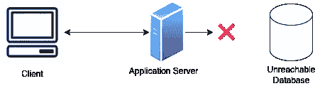
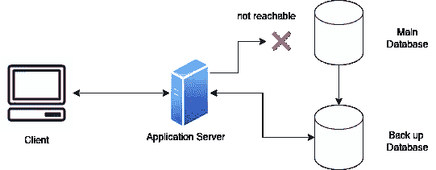
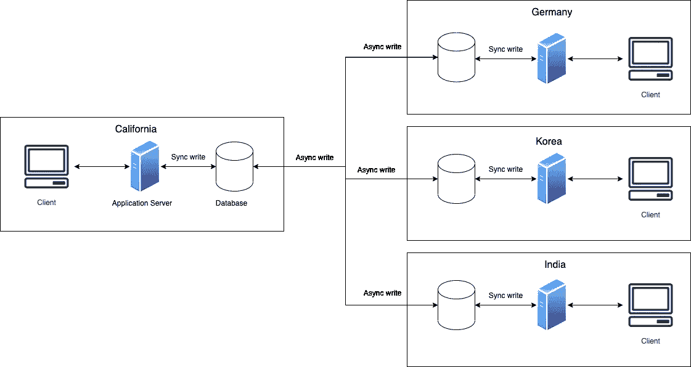
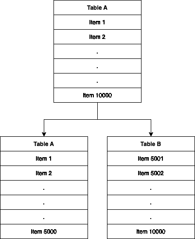
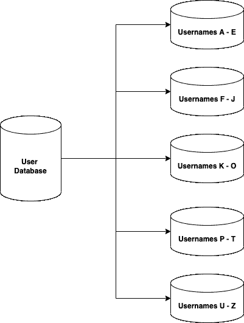
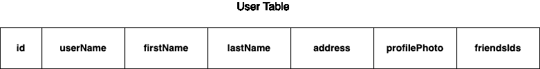
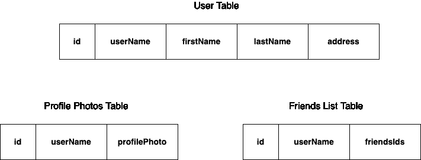

# 系统设计基础:数据复制和分区

> 原文：<https://levelup.gitconnected.com/system-design-fundamentals-data-replication-and-partitioning-ab109a46b633>

[粘土银行](https://unsplash.com/@claybanks?utm_source=medium&utm_medium=referral)在 [Unsplash](https://unsplash.com?utm_source=medium&utm_medium=referral) 拍摄的照片

这篇文章是我的系统设计系列的一部分。您可以在此找到其他主题:

1.  [分布式系统](/system-design-basics-distributed-systems-9aac8a11177c)
2.  [负载平衡器](/system-design-fundamentals-load-balancers-e608d30afa65)

系统的性能通常取决于其数据库的性能。如果一个系统的数据库停机，整个系统很可能不可用。类似地，如果系统的数据库具有高延迟，那么系统本身也将具有高延迟。

为了提高数据库的可用性和可靠性，我们可以使用 ***数据复制*** 和 ***数据分区*** 。

# 什么是数据复制？

假设您有一个只有一个主数据库的系统，而这个数据库已经关闭了。如果发生这种情况，您将无法再向数据库中读取或写入数据。所有的数据都会丢失。

图 1:只有一个数据库关闭的系统。

复制使我们能够解决这个问题，方法是让数据库的备份副本处于备用状态，以备出现此类问题时使用。

主数据库处理来自应用服务器的读写请求，并将写入备份数据库以保持最新。如果主数据库关闭，应用服务器将切换到备份数据库，以保持系统可用。然后，备份将成为主数据库，当另一个数据库再次运行时，它会将其所有数据复制到主数据库。

图 2:具有用于更好可用性的复制数据库的系统

另一个术语是冗余。[冗余](https://en.wikipedia.org/wiki/Redundancy_(engineering))是系统关键组件或功能的复制，目的是增加系统的可靠性，通常以备份或故障安全的形式，或提高实际系统性能。

## 副本数据库如何保持最新？

主数据库被写入，然后被传递到副本数据库。每个副本都会输出一条消息，声明它已成功接收到更新。

如果您希望数据库在主数据库出现故障时接管主数据库，那么数据库之间的数据必须始终完全同步。当写入主数据库时，它应该同步更新备份数据库，并且只有当所有副本都返回成功响应时才完成写入请求。

如果让所有数据库中的所有数据完全同步并不重要，您可以使用异步写入。

这方面的一个例子是用户在 Instagram 上发布照片。Instagram 可能有不同地区的数据库。如果加利福尼亚州的用户发布了一张照片，它将首先被写入地区数据库，但是等待它写入所有其他地区数据库可能会增加太多的延迟。此外，想要访问该帖子的其他用户很可能位于同一地区。一种解决方案是异步更新其他区域。通过这种方式，加利福尼亚的其他用户可以立即访问该帖子，而一旦该帖子复制到其他地区，韩国的其他用户也可以访问该帖子。

图 3:为了最终的一致性而异步更新数据库

这种类型的异步更新称为[最终一致性](https://www.scylladb.com/glossary/eventual-consistency/#:~:text=Eventual%20Consistency%20is%20a%20guarantee,time%20the%20data%20is%20queried.)。

# 什么是数据分区？

数据分区是一种将大型数据库分割成许多较小部分的方法。当您有一个读写请求过载的数据库，并且您想要通过[扩展](https://medium.com/gitconnected/system-design-basics-distributed-systems-9aac8a11177c)来提高吞吐量时，这是非常有用的。

数据被分割到多个数据库中，以提高应用程序的可管理性、性能、可用性和负载平衡。

## 水平分割

水平分区，也称为 ***数据分片*** ，将一个数据库按行分割成单独的数据库。

图 4:表 A 被水平分成两个表。表 A 包含项目 1–5000，表 B 包含项目 5001–10000

在图 4 中，假设我们有一个只有一个表的数据库，表 A，它有 10000 行。我们可以通过在两个表(也称为碎片)之间分割数据来水平分割这个表。一个表包含前 1–5000 个项目，第二个表包含 5001–10000 个项目。

水平分区的一个问题是，如果没有仔细选择分区策略，您可能会得到不平衡的数据库(例如，一个数据库保存的数据比其他数据库多得多)。一个例子是，如果我们想根据用户名将一个数据库划分成多个碎片，如下图 5 所示。

图 5:按用户名划分的用户数据库

如果用户名以这些字母开头的用户较少，那么最终存储用户名 U-Z 的数据库可能会比其他碎片少很多。

我们可以使用哪些分区策略？

1.  **基于键或散列的分区**:我们可以使用散列函数来决定哪块数据去哪个碎片。通过使用[一致散列](https://en.wikipedia.org/wiki/Consistent_hashing)，我们可以确保数据均匀分布，并且能够根据需要轻松添加额外的碎片。
2.  **列表分区**:每个分区被分配一个值列表。当我们想要插入一个新记录时，我们根据它属于哪个列表来确定哪个分区。图 5 中的例子使用了列表分区。
3.  **混合散列和列表分区**:您可以同时应用这两种策略来对数据库进行分区。《出埃及记》散列数据，然后使用散列范围作为列表分区。

## 垂直分割

使用这种方法，数据是按列而不是按行拆分的。例如，如果我们有一个在用户表中存储用户信息的数据库，如图 6 所示:

图 6:一个用户表

我们可以通过建立一个单独的数据库来保存个人资料照片，另一个用于保存朋友列表，从而对这个表进行分区。

图 7:用户数据已经被划分到不同的表中

使用垂直分区，如果一个分区变得太大，您还可以对该分区应用水平分区来进一步扩展。

我希望您喜欢阅读这篇文章，并且现在知道如何在分布式系统中分发数据。

# 参考

 [## 了解数据库分片|数字海洋

### 任何有显著增长的应用程序或网站最终都需要扩展以适应增长…

www.digitalocean.com](https://www.digitalocean.com/community/tutorials/understanding-database-sharding)