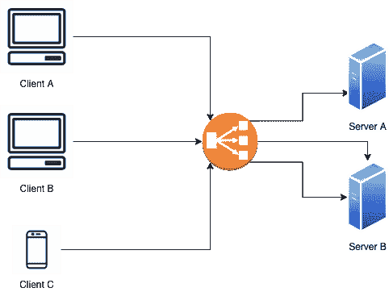
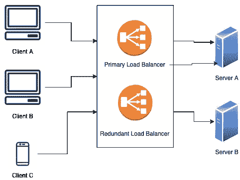

# 系统设计基础:负载平衡器

> 原文：<https://levelup.gitconnected.com/system-design-fundamentals-load-balancers-e608d30afa65>

勒内·迪安达在 [Unsplash](https://unsplash.com?utm_source=medium&utm_medium=referral) 上的照片

负载平衡是在多台服务器之间分配网络流量的过程。

它们是大规模系统中的关键组件。当我们想要扩展系统以处理增加的需求时，负载平衡器通过将负载平衡器放置在客户端和服务器之间来帮助确定和分配应该在不同服务器之间转发流量的位置。

负载平衡器将流量分配给两台服务器

当客户端发出请求时，它会转到负载均衡器。然后，负载平衡器将其路由到下一个可用的服务器，以分配负载。这样，就不会有单个服务器因请求而过载，这有助于避免故障或增加系统延迟。

负载平衡器还可以在服务器上执行健康检查。如果服务器关闭，负载平衡器将停止向其发送请求，而是将请求分发到其他服务器。这可以防止服务器成为单点故障，从而提高整个系统的可用性和响应能力。

我们还可以在系统的其他地方添加负载平衡器:

*   在服务器和数据库之间。
*   在 web 服务器和应用服务器之间。
*   在 DNS 层(单个域名获得多个 IP 地址，当进行 DNS 查询以获得 IP 时，以负载平衡的方式返回 IP 地址)。

# 负载平衡器如何分配负载？

负载平衡器使用服务器选择策略来选择将流量分配给哪个服务器。一些常用的策略是:

## 随机位

负载平衡器可以配置为以完全随机的顺序向服务器分发流量。这可能会导致问题，因为如果随机选择某个服务器的频率高于其他服务器，该服务器仍可能会过载。

## 一系列

该方法按顺序遍历所有服务器，并将每个新请求发送到下一个服务器。一旦到达列表的末尾，下一个请求将被路由回顶部，并再次沿列表向下重复。这样，所有的请求在服务器之间平均分配。

## 加权循环赛

类似于循环调度，除了您可以为某些服务器指定一个权重，以指示应该将更多的负载分配给它们(例如因为它们可以处理更多量)。这样，请求仍然会按顺序分布，但是当轮到一个加权服务器时，在负载平衡器移动到下一个服务器之前，会有更多的请求到达它那里。

## 基于 IP 的策略

客户端的 IP 地址经过哈希处理，根据哈希值，负载平衡器将重定向到相应的服务器。这在服务器兑现响应时非常有用。如果服务器 A 缓存了特定请求的响应，IP 哈希可以确保如果同一客户端再次发出相同的请求，它们可以从服务器 A 获得缓存的响应，从而缩短响应时间并提高缓存命中率。如果该请求被路由到另一个服务器，即服务器 B，那么将响应保存在服务器 A 的缓存中并不能改善系统。

## **最小响应时间法**

负载平衡器将选择具有最少活动连接和最低平均响应时间的服务器。

## **最小带宽法**

负载平衡器将选择当前服务最少流量的服务器。

# 负载平衡器作为单点故障

如果负载平衡器出现故障，会发生什么情况？如果我们只有一个负载均衡器，那么我们所有的服务器扩展都是无用的，因为请求不再到达它们。

引入冗余负载平衡器有助于避免这种情况，因为它可以在负载平衡器本身过载或出现故障时保持备用状态。两个负载平衡器相互监控对方的健康状况，并在对方出现故障时接管对方。

使用冗余负载平衡器来避免单点故障

# 参考

 [## 负载平衡(计算)-维基百科

### 在计算中，负载平衡指的是在一组资源上分配一组任务的过程(计算…

en.wikipedia.org](https://en.wikipedia.org/wiki/Load_balancing_%28computing%29)