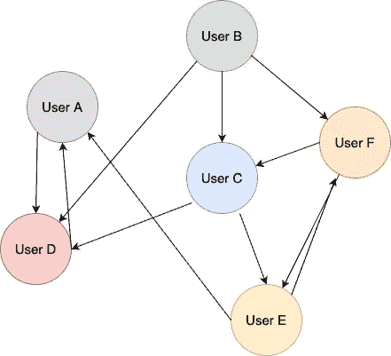

# 系统设计基础:NoSQL 数据库

> 原文：<https://levelup.gitconnected.com/system-design-fundamentals-nosql-databases-8390ef50cc32>

NoSQL 数据库是非关系数据库。他们不像他们的名字暗示的那样使用 SQL，也不遵守关系数据库强加的严格的结构要求。

当缩放和快速开发对系统很重要时，NoSQL 数据库是有用的。NoSQL 依赖于基于云的存储，并要求数据可以轻松地跨多个服务器扩展。如果您的数据结构经常变化，与关系数据库相比，NoSQL 数据库可以用最少的停机时间来处理这种情况。

# NoSQL 数据库的类型

有 4 种主要类型的 NoSQL 数据库:

1.  键值存储
2.  文档存储
3.  面向列(宽列)的存储
4.  图形数据库

# 键值存储

键值存储是最简单的 NoSQL 数据库类型。它们以键值对的形式存储数据，即从键(通常是字符串)到任意值的映射。你可以把它想象成一个字典或者哈希表数据结构。键表示被存储的属性的名称，并且对于每个键，都有一个分配给它的值。

图 1:键值存储

键值存储的一个用例是缓存网络请求和响应。通常使用某种键来访问缓存的数据；前任。获取该用户的兑现网络请求和响应的用户名。因为访问缓存数据的机制是一个键和它的成对数据，所以键值存储是实现这一点的好方法。

一些受欢迎的键值存储包括 [Redis](https://aws.amazon.com/redis/) 和 [Memcached](https://en.wikipedia.org/wiki/Memcached) 。

## **使用键值存储的好处**

1.  简单灵活的数据模型:您可以随意处理数据。实体之间没有关系，这允许很大的灵活性。
2.  可伸缩性:键值存储依赖于基于云的存储。他们可以轻松地在多台服务器之间传播数据，这些服务器可以根据系统需求快速扩展。
3.  高可用性:由于简单的键查找模型，访问数据很快。

## **键值存储的缺点**

1.  无关系:由于数据之间缺乏关系，复杂查询受到严重限制。
2.  不适合存储复杂数据:根据您选择的键值存储，数据类型及其存储方式可能会有限制。

# 文档存储

顾名思义，文档存储以半结构化的方式(如 JSON 或 XML)在独立的文档中以面向文档的模型存储数据。这些是目前使用的最流行的 NoSQL 数据库类型。一些流行的包括 [MongoDB](https://www.mongodb.com/cloud/atlas/efficiency?utm_source=google&utm_campaign=gs_emea_united_kingdom_search_core_brand_atlas_desktop&utm_term=mongodb&utm_medium=cpc_paid_search&utm_ad=e&utm_ad_campaign_id=12212624581&adgroup=115749705343&gclid=Cj0KCQjw08aYBhDlARIsAA_gb0fqvagd7C1P1wisUMChf4hlTUCadi0aLeOpjoOw13tbEzRaSNfonUwaAoppEALw_wcB) 、 [Google Cloud Datastore](https://cloud.google.com/datastore) 和 [Amazon DocumentDB](https://aws.amazon.com/documentdb/) 。

您可以在一个文档中对数据进行建模，该文档可以直接映射到应用程序代码中的模型，因此很容易存储和查询数据。

文档数据库没有模式，所以需要时可以很容易地改变数据结构。与键值存储类似，文档存储没有关系。每个文档都是独立的，彼此没有关联。

它们可以水平扩展，并迎合 [CRUD](https://en.wikipedia.org/wiki/Create,_read,_update_and_delete) (创建、读取、更新、销毁)操作。

图 2:文档存储

## **文档库的优势**

1.  比键值存储更强大的查询能力:文档存储，不仅限于通过键进行查询。您也可以查询文档中的属性。
2.  处理大量数据:由于其结构，文档存储可以处理大量数据。
3.  可伸缩性和高可用性:键值存储的可伸缩性和高可用性优势同样适用于文档存储。
4.  快速开发:如果在建立数据库时不确定数据库模式，并且需要能够根据需要快速、灵活地改变的东西，那么文档存储非常适合这种情况。

## **文档库的缺点**

1.  无关系:不适合关系数据。
2.  查询:虽然比键-值更强大，但远不及关系数据库的潜在查询能力。

# 面向列(宽列)的商店

面向列的存储是键值存储和关系数据库的混合体。它们基于表，但是没有关系数据库的严格的列格式。它们用于处理大量数据，或大数据。面向列的数据库将记录存储在动态数量的列中。一条记录可以包含数十亿列，并且不是每一列都必须包含一个值。您可以将一行中的一列视为一个键值存储(映射或关联数组)，这导致面向列的数据库是多维的。

流行的数据库有 [Cassandra](https://cassandra.apache.org/_/index.html) ( [亚马逊 keyspace](https://aws.amazon.com/keyspaces/))[谷歌 BigTable](https://cloud.google.com/bigtable) 和 [HBase](https://hbase.apache.org/) 。

它们用于分析用例，具有很高的性能和可扩展性。关于网飞如何在他们的分析系统中使用 Cassandra，请参见参考资料。

## **直列式商场的优势**

1.  支持半结构化数据:查询比其他 NoSQL 解决方案更有效。
2.  有索引:由于它们的结构，行有索引。
3.  高度可扩展:保存大量数据

## **直列式商店的缺点**

1.  不适用于关系数据。

# 图形数据库

图形数据库在节点/顶点和边中存储数据以表示关系。边是指向其他节点的指针，用来表示这些关系。每个节点代表一个实体。

流行的图形数据库有 [Neo4J](https://cloud.google.com/blog/products/ai-machine-learning/analyze-graph-data-on-google-cloud-with-neo4j-and-vertex-ai) 和[亚马逊 Neptune](https://aws.amazon.com/neptune/) 。

构建图形数据库是为了能够快速遍历连接的数据。《出埃及记》遍历用户的社交网络，以找到共同的联系或“他们可能认识的人”。

图 3:图形数据库

假设图 3 表示用户跟随图。边缘指向用户关注的对象。如果我们想给用户 B 做一个推荐，我们可以遍历这个图，看看这个用户关注谁，然后找到他们关注谁来做推荐。如果你有兴趣学习更多关于图遍历的知识，你可以在这里找到我写的一篇文章。

## 图形数据库的好处

1.  复杂关系的快速查询:尽管在关系数据库中查询复杂关系是可能的，但是连接越多，预期的延迟就越大。图形数据库提供了更快访问数据的能力。
2.  对现实世界关系建模有用:想想朋友列表、谷歌地图、推荐引擎等。
3.  可以提供[酸](/system-design-relational-databases-f45980068a0f)交易。

## 图形数据库的缺点

1.  难以扩展，但却是可能的:由于它们之间复杂的关系，扩展需要计划和技能。

# 摘要

NoSQL 数据库是非结构化的、分布式的，不依赖于任何特定的模式。当您需要一个快速、灵活、可伸缩的数据库时，这些属性非常有用。

如果您想了解更多关于系统设计的主题，我在这个系列中还有一些您可能感兴趣的文章:

*   [关系数据库](/system-design-relational-databases-f45980068a0f)
*   [数据复制和分区](/system-design-fundamentals-data-replication-and-partitioning-ab109a46b633)
*   [负载平衡器](/system-design-fundamentals-load-balancers-e608d30afa65)
*   [分布式系统](/system-design-basics-distributed-systems-9aac8a11177c)

感谢阅读！

# 参考

 [## 4 种类型的 NoSQL 数据库&何时使用它们？

### 在本文中，我们将简要介绍不同类型的 NoSQL 数据库。除此之外，您还将获得…

www.blazeclan.com](https://www.blazeclan.com/blog/dive-deep-types-nosql-databases/)  [## AWS NoSQL:为您选择最佳方案

### NoSQL 数据库使您能够以灵活的模式和各种数据模型存储数据。这些数据库是…

cloud.netapp.com](https://cloud.netapp.com/blog/aws-cvo-blg-aws-nosql-choosing-the-best-option-for-you)  [## aegis thus——Cassandra 的批量数据管道

### 持续运行的 Hadoop 集群处理由任何 Cassandra 数据源创建的表

netflixtechblog.com](https://netflixtechblog.com/aegisthus-a-bulk-data-pipeline-out-of-cassandra-984882557fa)