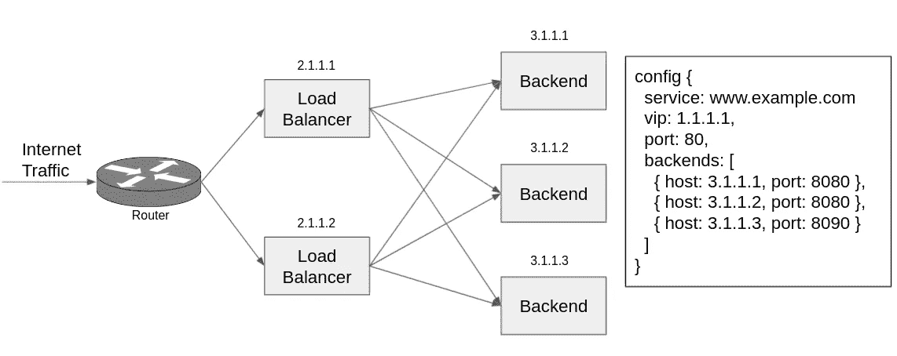
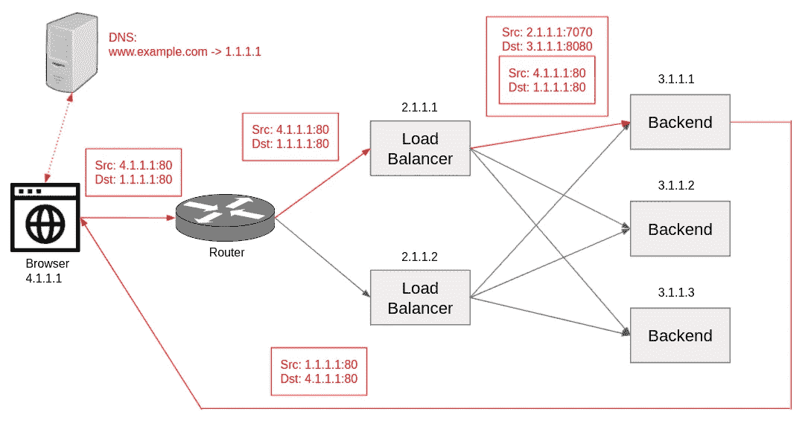

# 系统设计理念:云负载平衡器基础

> 原文：<https://levelup.gitconnected.com/system-design-idea-cloud-load-balancer-basics-bc6af8dd8084>

> **序言**

在之前的[博客文章](https://medium.com/swlh/system-design-interview-the-bare-minimum-you-need-to-know-about-load-balancers-fc0cbe1ac276)中，我们研究了各种类型的负载平衡器和一些有趣的领域，如路由算法、SSL 终端和单点故障。在这篇博客文章中，我们将在这个主题的基础上构建并放大云负载平衡器，它体现了一些值得注意的设计思想。这篇博文中的核心内容基于谷歌和微软发表的研究论文(参考文献部分的引文)。这些设计已经在谷歌云平台和微软 Azure 中得到了很好的测试。

> **架构**

云中有许多负载平衡层。我们今天要关注的负载平衡器是 L4 负载平衡器，这意味着它们运行在传输层(TCP、UDP 等)。).它们在当今云中广泛采用的软件定义网络(SDN)概念中扮演着重要角色，因为它们支持丰富的负载平衡逻辑、水平扩展和快速开发/部署迭代。相比之下，较低层和专门构建的硬件负载平衡器，尽管在某些情况下性能更高，但在规模上更难管理。

图 1 显示了云负载平衡器的简化架构。有一堆后端服务器为`www.example.com`网站提供服务。后端服务器都有自己的(可能是私有的)IP 地址— `3.1.1.x`。向服务前端的负载平衡器实例(地址:`2.1.1.x`)注册配置。配置实际上是在说:

1.  需要负载均衡的服务是`www.example.com`。
2.  它位于带有端口`80`的虚拟 IP `1.1.1.1`上。
3.  它由列出的地址和端口中的一组后端支持。

图 1:架构

一个服务可以由一个或多个负载平衡器实例提供。负载平衡器实例也可以是多租户的，并支持多种服务。为了简化讨论，让我们关注多个负载平衡器实例上的单个服务。如果名称空间隔离得当，这同样适用于多租户场景。通常还有多层负载平衡。为了简单起见，我们在这篇博文中假设一个单层 L4 负载平衡。这同样适用于递归设置。

每个负载均衡器实例通过[边界网关协议(BGP)](https://en.wikipedia.org/wiki/Border_Gateway_Protocol) 向路由器通告自己是 VIP `1.1.1.1`的目的地。[等价多路径路由(ECMP)](https://en.wikipedia.org/wiki/Equal-cost_multi-path_routing) 策略用于向路由器建议，当到达 VIP `1.1.1.1`的路由目的地时，负载平衡器实例是等价的。域名 www.example.com 也在 DNS 中注册了 VIP 地址`1.1.1.1`。

> **请求的生命周期**

当最终用户想要访问 www.example.com 时，他们的浏览器首先通过查询 DNS 来解析 IP。(可能缓存的)结果 IP 是`1.1.1.1`。然后浏览器发出一个请求，将源作为自己的 IP 地址`4.1.1.1`，目的地作为解析后的 IP 地址`1.1.1.1`，假设两端都使用端口`80`。

请求被路由到连接到已经通告了 IP `1.1.1.1`的负载平衡器实例的路由器。路由器选择一个负载平衡器实例。如上所述，由于 ECMP，所有负载平衡器实例都是等效的。接收请求的负载平衡器实例确定下一跳的后端。它使用[通用路由封装(GRE)](https://en.wikipedia.org/wiki/Generic_Routing_Encapsulation) 包装请求。外部源是负载平衡器实例本身`2.1.1.1:7070`，外部目的地是所选择的后端`3.1.1.1:8080`。原始请求保持不变，并完全封装为数据报。

后端在收到请求后，打开原始请求，提供服务，并通过直接服务器返回(DSR)返回一个响应。响应的来源是最初请求的 VIP `1.1.1.1`和端口`80`。响应的目的地是浏览器的位置`4.1.1.1:80`。后端从解包的请求中获得该信息。DSR 使响应能够通过互联网返回到浏览器，而不经过负载平衡器实例。这是期望的，因为响应通常很大，并且负载平衡器会简单地传递它们而没有任何附加值。从返回路径中删除负载平衡器可以减少负载平衡器上的工作负载。

有关端到端的图示，请参见图 2。

图 2:请求的生命周期

> **负载平衡器如何确定后端**

从系统设计的角度来看，最有趣的部分是给定请求时决定后端的逻辑。

先把容易的部分去掉，一旦负载均衡器选择了一个后端，它就应该努力坚持下去。原因有很多，其中最重要的一个是我们希望像 TCP 这样的传输层通信具有连接亲和性。因此，每个负载平衡器实例维护从 5 元组(源 IP、源端口、目的地 IP、目的地端口、IP 协议)到所选后端的本地映射。

显然，应该有一个健康检查机制来定期评估后端的活性。一些系统将健康检查内置到负载平衡器中。否则，负载平衡器可以参考独立的健康检查组件。在后端崩溃的情况下，负载平衡器将不得不选择另一个。当需要后端重启时，负载平衡器应该首先将请求排出到后端。

负载平衡器使用五元组的[一致散列](https://en.wikipedia.org/wiki/Consistent_hashing)来挑选后端。简而言之，一致散列将可能的散列值范围划分并分配给后端。对于给定的 5 元组，其哈希值所在的范围决定了目标后端。这允许路由到不同负载平衡器实例的相同 5 元组请求在相同的目标后端结束。在添加或删除后端服务器时，它还可以最大限度地减少分配混乱。参考文献[1]有一个更高级的分配算法，可以更均匀、更有效地在后端之间分配请求。有兴趣的读者可以参考论文了解详情。

> **如果负载均衡器出现故障怎么办**

云负载平衡器运行在商用机器上。所以他们肯定会在某个时候失败。事实上，我们还需要定期删除它们和/或进行更新。云负载平衡器恢复能力的关键在于我们在生产中提供的冗余。当负载平衡器实例出现故障时，路由器会检测到这一情况。可替换地/附加地，应该有一些监控系统可以检测负载平衡器的故障，并及时地将其报告给路由器。路由器简单地避免路由到失败的负载平衡器实例。

在这种情况下，我们丢失的是负载平衡器实例的内部状态，这不会影响流量路由的正确性和有效性。回想一下，我们使用一致散列(或其他尊重连接相似性的分发算法)，所以请求仍然会以正确的后端结束。由于丢失了缓存的哈希值，可能会有一点暂时的效率损失，但是重新计算应该是相当便宜的。

> **后记**

这篇博文到此为止。引用的页面有很多有趣的内容，我们没有时间去介绍。但我认为这足以作为一个系统设计理念的帖子。最后，不要脸的插一句，我收集了[的系统设计文章](https://github.com/eileen-code4fun/SystemDesignInterviews)，给喜欢这类讨论的读者。

> **参考**

[1]Daniel e . Eisenbud Cheng Yi Carlo Contavalli Cody Smith Roman Kononov Eric Mann-Hielscher Ardas Cilingiroglu Bin Cheyney Shang Jinnah Dylan Hosein 第 13 届 USENIX 网络系统设计和实施研讨会(NSDI 16)，加利福尼亚州圣克拉拉市 USENIX 协会(2016)，第 523–535 页

[2] P .帕特尔、d .班萨尔、l .袁、a .穆尔蒂、a .格林伯格、D. A .马尔茨、r .克恩、h .库马尔、、h .吴、c .金和 n .卡尔里。Ananta:云规模负载平衡。2013 年 SIGCOMM 会议录。