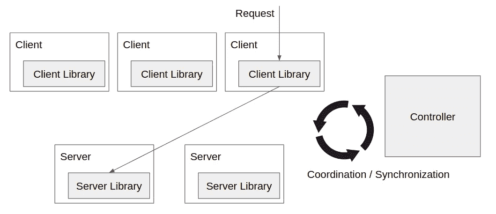
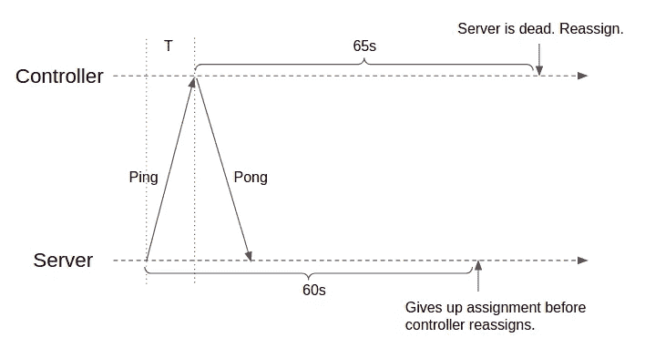

# 系统设计思想:一致地将请求队列路由到生产中的同一服务器

> 原文：<https://levelup.gitconnected.com/system-design-idea-consistently-route-request-cohort-to-the-same-server-in-production-a2c7edfd16f6>

资料来源:vectorified.com

> **激励范例**

假设您有一个托管在多台服务器上的分布式缓存服务。每个服务器负责密钥空间的一个分区。您将希望您的请求到达正确的服务器。或者，您可能希望跟踪移动用户的 IP 地址，并且希望扩展到多台服务器。当用户需要发起彼此之间的直接连接时，他们将向您的服务查询对等体的 IP 地址。您的服务需要为信息找到合适的服务器。或者，您的服务可能希望在分布式范围内为用户工作流建立一些“粘性”的短暂会话。您可能希望将来自同一用户工作流的请求路由到保存临时会话数据的同一服务器。

在静态环境中，上述内容毫无趣味，很容易完成。我们只需要对请求进行哈希运算，并调整服务器的数量，以便为请求确定性地选择一个服务器。但是在一个高度动态的生产环境中，服务器经常上下波动，我们必须投入更多的心思。例如，如果服务器崩溃/重启怎么办，如何适应负载变化，如何通知客户机/服务器进行密钥空间重新分区，如何推断数据的新鲜度，如何处理网络传输中的竞争情况，等等。

这篇博文将试图介绍在现实的生产环境中，将请求队列一致地路由到同一个服务器的设计。为了简单起见，复制的主题超出了范围。我们假设每个数据分区只有一个副本。这种简化通常是正确的，甚至在许多不需要高可用性的用例中是首选的——例如，缓存未命中代价很高，但即使很少也没关系。这里的许多想法来自微软的[离心机](https://www.microsoft.com/en-us/research/publication/centrifuge-integrated-lease-management-partitioning-cloud-services/)研究论文。

> **一致散列(无聊但必要)**

第一个古老但必要的话题是一致性散列。我们假设请求中有某种我们可以散列的键。它可能是请求的 IP 地址、请求中的用户 ID 或其他一些特殊字段。如果我们只是根据服务器的数量`n`来修改哈希值，那么在成员发生变化时就不会很好地工作。例如，如果散列值是`3`和`4`，而`n`是`2`，那么对于这些值(`3%2=1`、`4%2=0`)，服务器分配将分别是`1`和`0`。但是如果我们将`n`增加到`3`，新的服务器分配将被翻转到`0`和`1`。所有的任务都需要重新安排。

因此，我们将服务器放在哈希值的名称空间中。每个请求都被分配给紧接在名称空间中请求键的哈希值之后的服务器。作为一个改进，我们不只是把服务器放在一个地方。每个服务器都有“Kage Bunshin no Jutsu”，或者正式地说，在哈希值名称空间上有许多虚拟节点。这增加了值域分配的粒度。添加或移除`1`服务器时，仅需要更改现有的`O(1/n)`分配。这里不再赘述。更多信息，请参考[外部来源](https://en.wikipedia.org/wiki/Consistent_hashing#:~:text=In%20computer%20science%2C%20consistent%20hashing,is%20the%20number%20of%20slots.)。

> **系统架构**

系统中的第一个组件是客户端库，它知道如何一致地散列和路由请求。客户端库可以部署在最终用户的设备上或云负载平衡器内部。部署在负载平衡器内部可能更容易维护，因为这允许服务所有者有更多的控制权。系统中的下一个组件是连接在服务器中的服务器库。它帮助服务器管理其范围分配。因为我们在讨论动态生产环境，所以我们需要一个控制器，它可以在客户机库和服务器库之间进行协调，以便进行成员资格更改和密钥空间重新分区。

图一

概览见图 1。我们将首先讨论控制器，然后讨论它如何与客户端库和服务器库一起工作。最后，我们将研究一个 E2E 请求工作流，看看所有组件是如何协同工作的。

> **控制器**

控制器是逻辑上集中的服务。它决定了全局键空间划分和键空间范围的分配。客户端库定期查询控制器以获得分区和分配信息的最新副本。这样，客户机库就知道对于任何给定的键应该去哪个服务器。服务器库也定期与控制器通信。控制器跟踪所有服务器的状态，分配或指示它们在重启或负载改变时更新它们的密钥空间范围。

这里一个关键的可伸缩性考虑是不需要在每个请求上都咨询控制器。客户端库和服务器库每个时间间隔只与控制器对话一次。其结果是潜在的陈旧性，我们将在最后的 E2E 请求工作流部分解决这个问题。

控制器由多台机器支持，使用典型的复制状态机模式实现高可用性，在这种模式下，一个领导者提供所有功能，而一群追随者处于备用模式。要了解更多关于复制状态机的内部结构和使用什么协议，请查看这篇博文[ [链接](/raft-consensus-protocol-made-simpler-922c38675181) ]。这里不再赘述。

**客户端库**

客户端库每隔`30`秒向控制器查询最新的键空间分区和分配(只是一个数字，不要太在意；下面的数字也一样)，并将该信息存储在本地。每当它需要发送请求时，它使用该信息来确定连接到哪个服务器。键空间划分和分配可能不会经常改变。因此，值得跟踪该信息的版本号，以便客户端库只需要在发现其本地版本号和控制器版本号不匹配时更新其本地副本。

在客户端库与控制器同步的过程中，密钥空间的分区和分配可能会发生变化，在这种情况下，客户端库将根据过时的信息来路由请求。我们依靠服务器端来检测和拒绝这些请求，它向客户端库提供反馈信号。

**服务器库**

服务器库每隔`15`秒向控制器发送一次 pings，以证明它自己仍然活着。让我们来看看现实生产中的以下有趣场景。

如果服务器库未能在`X`秒内到达控制器，服务器本身和控制器都会将服务器视为丢失其密钥空间分配，这是一种防止僵尸服务器预防和检测崩溃的机制。在这种情况下，服务器将不再为请求提供服务，控制器将把密钥空间范围分配给另一台服务器。`X`的值相当微妙。在服务器端，我们将它设置为`60`秒。因此，在服务器丢失其分配之前，将需要几次连续的重试失败。如果 ping 成功，`60`秒倒计时从 ping 发出之前重新开始。在控制器端，我们将其设置为`65`秒，以添加一些填充来防止时钟漂移。底线是，服务器必须知道在控制器认为它应该放弃自己的分配之前放弃它自己的分配，因为在这之后，控制器将在其他地方分配键空间范围。参见图 2 中的图解。

图二。我们假设服务器端的`60`秒将在控制器端的 T+65 秒之前过去。依赖时钟同步不好。但是我们只是相信时钟不会在一分钟的间隔内偏离太多。

在实际生产中，还需要主动改变键空间范围分配。这可能是由于计划的维护和发布、流量模式的改变、密钥分发的改变等。为了适应这种变化，控制器需要能够添加/删除服务器并重新分配任务。控制器可以通过对服务器 ping 的响应来传达这一点。收到响应中的更新后，服务器会立即切换到新的分配。

这里有一个非常微妙的竞争条件。以下面的场景为例，控制器首先想要改变服务器的分配。它通过 ping 响应进行通信。但是随后控制者改变了主意，想要保持原来的分配。它会在下一个 ping 响应中告知。可能发生的情况是，第一响应到达服务器较晚，导致服务器认为分配改变是最新的消息，而控制器实际上想要维持原始分配。这种竞争情况可以通过跟踪双方之间的消息序列号来解决。在这种情况下，第一个响应将被标记为序列号`s`，下一个响应将被标记为`s+1`。然后，服务器可以检测无序到达并丢弃陈旧的消息。

**e2e 请求工作流程**

最后，让我们来看一个完整的 E2E 请求工作流。客户端使用客户端库来决定将请求路由到哪个服务器。当请求到达服务器时，服务器在本地检查它是否能满足请求——请求是否属于它的任务。如果是，服务器处理该请求。在发送回响应之前，服务器再次检查以确认请求是否仍然属于它的任务。如果是，服务器返回响应。如果请求不属于服务器的任务，无论是在第一次检查还是第二次检查期间，都会向客户机返回一个失败，由客户机决定下一步做什么。对于缓存用例，服务器端的双重检查可能不是必需的，因为即使在第二次检查之后，服务器的数据在响应返回给客户端之前仍然可能变得陈旧，换句话说，仍然不能保证新鲜。但是双重检查在一些其他场景中可能是有用的，因为它提供了类似语义的事务。如果服务器知道它的分配在请求处理期间丢失了，它可以决定丢弃响应或回滚一些操作。

**遗言**

这篇博文应该很容易阅读。我们在这里讨论的想法相当简单实用。更多的系统设计思路，请看这个 github 列表[ [链接](https://github.com/eileen-code4fun/SystemDesignInterviews) ]。