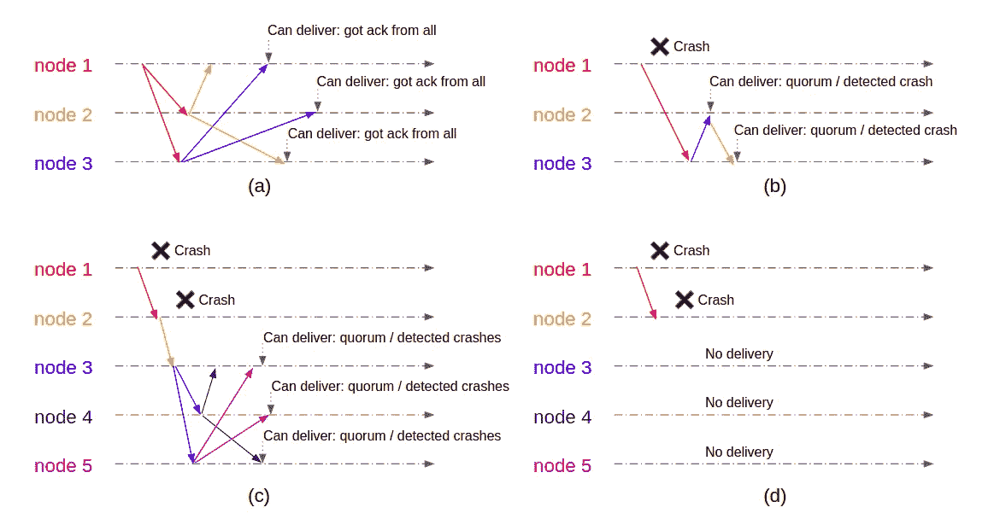
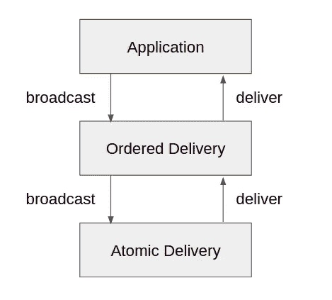
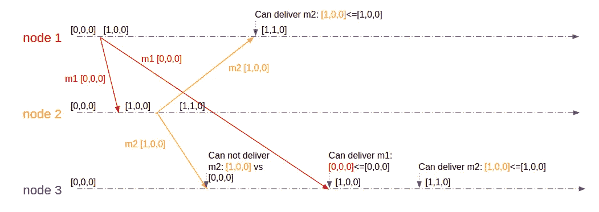

# 系统设计面试:全有或全无，有序点对点广播

> 原文：<https://levelup.gitconnected.com/system-design-interview-all-or-none-ordered-peer-to-peer-broadcast-45b33fb2f6be>

> **序幕**

我先声明，这不是一个简单的系统设计面试问题。如果你对分布式系统没有很好的理解，你可能甚至不知道从哪里开始。这无疑是困难的。但是除非你是在一个特定领域的面试中，否则面试官可能只是想测试你处理复杂系统设计问题的能力。所以我希望能准确地呈现这一点——一点一点地解决这个问题，看看我们能走多远。最后，我们不仅会得出一些解决方案，还会在系统设计面试的背景下练习解决问题。顺便说一下，如果你对更多的系统设计面试感兴趣，我有一些其他的[博客文章](https://github.com/eileen-code4fun/SystemDesignInterviews)你可以看看。

> **重构问题**

为了更好地表述这个问题，考虑一下我们要解决什么问题。这是一个点对点的消息广播系统。通常当我们说广播时，我们倾向于只考虑发送端。然而，这还不够。网络可能会丢弃和延迟消息。机器(出于习惯，以下使用“节点”)可能会崩溃。如果我们只控制发送端，就不可能保证期望的“全有或全无”和“有序”的交付语义。所以我们也必须控制接收端。

思考这个问题的一个更好的方法是想象构建一个通信中间件。中间件将重试、重复数据删除、排序和对等协调的复杂性隐藏在简单的接口之后，为上层应用程序提供了通信抽象。每当上层应用程序想要向所有对等体广播消息时，它都会调用中间件中的一个`broadcast`方法，然后将消息传输给对等体，并确保它们收到消息。当中间件接收到一条消息时，它会做任何必要的事情来保存交付语义，然后调用一个`deliver`回调将消息提交给上层应用程序。

这将问题转化为构建一个运行在所有节点上的通信中间件，公开`broadcast`和`deliver`接口，并提供交付语义保证。在系统设计面试中，我们需要与面试官确认，看看我们是否可以继续这个问题的重构。这里我们假设面试官同意，我们将继续讨论交付语义。

> **“全有或全无”交付语义**

**“全有或全无”的定义**

我们首先需要详细说明“全部或无”的含义:如果消息由任何节点传递，我们希望它由所有正确的节点传递。请注意，我们只对“正确”的节点提出“全有或全无”的要求，在分布式系统的上下文中，这实质上意味着它们没有崩溃。

值得强调的是，“全或无”是原子性的一种形式。消息要么不由任何人传递，要么最终由所有节点传递。“全有或全无”的方差是“多数或无”。由于任何节点都可能在任何时候发生故障，并且在分布式系统中没有可靠的方法来同步检测故障，所以我们经常用法定人数来凑合，而不是坚持“全部”。法定原子性的思想允许整个系统在部分失败的情况下取得进展。

**设计细节**

一个诱人但有缺陷的设计是让发送方重试，直到所有(或大多数)节点确认。这个设计似乎是有效的。然而，它不能经受住发送者在广播中间的崩溃。显而易见，我们不能依赖任何单一的发送者，因为他们总是会中途崩溃，使整个系统处于不一致的状态。因此，即使一个节点最初将开始广播，每个其他节点在接收到消息时，也应该参与帮助传播消息。

具体地说，每个节点保存一个可见消息 id 列表的记录(构造为唯一的),以便它可以判断入站消息是新的还是可见的。当一个节点收到一条新消息时，它会立即将该消息重新发送给所有对等节点。同时，每个节点维护一个映射`<message_id, acked_peer_ids>`。当节点收到来自对等节点的消息时，它会将对等节点 ID 添加到该`message_id`的`acked_peer_ids`中。一旦相应的`acked_peer_ids`增长到包括所有或大多数对等体，该节点就传送消息。整体示意图见图 1。

图一。(a):每个节点从所有对等节点获得 ack，因此可以传递消息。(b):节点 1 在向节点 2 发送消息后崩溃。节点 2 和节点 3 继续广播，并且可以传递消息，因为它们或者依赖于仲裁，或者它们检测到节点 1 的崩溃并因此将其排除。(c):节点 1 在向节点 2 发送消息后崩溃。节点 2 在向节点 3 发送消息后崩溃。节点 3、节点 4 和节点 5 继续广播。(d):节点 1 在向节点 2 发送消息后崩溃。节点 2 在将消息发送给任何对等方之前崩溃。任何节点都没有传递消息。

每条消息首先被发送给所有对等体，对等体再将消息发送给所有对等体。假设有`n`个节点，消息传输的总数为`O(n²)`。冗余是防止部分故障所必需的。熟悉分布式系统概念和算法的读者可能会认识到，这实际上是统一可靠的广播。

**设计的差异**

这种设计的缺点是，每个节点都需要处理与所有其他节点之间的消息发送和接收。大扇出产生的重负载可能是有害的，尤其是当`n`很大时。减轻影响的一种方法是将节点组织到重叠的集群中，以便扇出可以限制在集群成员内。但这带来了大量的操作负担。难以维护的设计可能不会给系统设计面试官留下深刻印象。不过，把它作为一种选择提一提也无妨。

另一种选择是将消息发送给几个随机选择的对等体，而不是所有对等体。这被称为概率广播。最初，消息只有一个节点知道，即原始发送方。在第一轮中，原始发送者将消息传播给`k`节点。在第二轮中，这些`k`节点中的每一个依次将消息透露给其他`k`节点。

这个过程还在继续。这将是徒劳的，因为一些节点已经从先前的回合中获得了消息。向这些节点散布消息不会增加节点的覆盖范围。此外，由于这些节点之前已经看到了该消息，所以它们不会在下一轮中将该消息传播给其他节点。禁止向其他人传播旧消息是故意的，否则广播无法终止。

假设在`*r*th`轮中准确获得消息的节点的预期数量是`g(r)`。我们有`g(0)=1`。在第`r`轮中，来自`g(r-1)`的每个节点随机地向`k`个对等节点传播消息，这些对等节点是从剩余的`n-1`个节点中抽取的。由于那些`n-1`对等点中的一些可能已经看到了这条消息，我们需要在计算中忽略它。将`E(r)`表示为第`r`、`E(r)=g(0)+g(1)+…+g(r)`轮后的总节点覆盖率。很容易看出，对于所有的`r>0`、`g(r)=g(r-1)*k*(n-E(r-1))/(n-1)`。你可以检查一下`g(1)=k`。随着`r`的增加，`E(r)`逐渐接近`n`。我们可以继续计算并分析`k`和`r`之间的权衡，但我认为这超出了典型系统设计面试的范围，因为我们还有其他重要的领域要涵盖。

> **沟通两种交付语义**

我们将利用“全有或全无/法定”交付语义来开发“有序”交付语义，这样“有序”交付语义就不需要担心消息的原子性，因此可以专注于难题的排序部分。这种分层抽象模型是处理计算机科学问题的典型方式，坦率地说，也是许多其他学科的典型方式。

图 2

如图-2 所示，从现在开始，当我们在“有序”交付语义设计中说“广播”时，我们指的是调用底层原子交付组件中的`broadcast`接口。同样，当我们在“有序”交付语义设计中说“接收”时，我们指的是从底层原子交付组件获得`deliver`回调。当我们在“有序”交付语义设计中说“交付”时，我们指的是将消息实际交付给上层应用程序。

> **“有序”交付语义**

**“有序”的定义**

在我们深入设计之前，澄清我们想要支持的订购保证是很重要的。考虑一下:如果一个节点广播一个消息`m1`，另一个节点广播一个消息`m2`，它们之间的顺序应该是什么？简单的回答是我们不知道。从绝对时钟的意义上来说，`m1`的播出是在`m2`的播出之前还是之后并不重要，从整个系统的角度来看，它们是并发的。

有三种方式可以认为在两个消息之间建立了顺序。首先，在同一节点上，`m1`的广播发生在`m2`的广播之前。其次，`m1`的传递发生在同一节点上`m2`的广播之前。在这两种情况下，我们说`m1`在`m2`之前。最后，顺序是可传递的。所以如果有一个`m’`，其中`m1`在`m’`之前，`m’`在`m2`之前，那么`m1`在`m2`之前。这在分布式系统中被称为因果顺序。这具有直观的意义，因为消息的广播很可能是同一节点上先前消息的广播或传递的结果(具有因果相关性)。

**天真的解决方案**

保持排序的一个简单方法是每当节点广播新消息时，总是捎带该节点广播或传递的消息的整个历史。这确保了接收节点将总是获得新消息之前的所有消息。每个接收节点将检查从开始到当前的接收历史，并按顺序传递未传递的消息。显然，这是非常昂贵的，因为历史会随着时间无限地线性增长。但在采访中提及它来展示我们的思考过程并无大碍。一个快速的优化是让每个节点在传递消息时单独或成批发送 ack。在从所有或法定数量的节点接收到对消息的 ack 时，该节点可以删除该消息及其历史中所有先前的消息。这有效地对历史进行了垃圾收集，因为节点得知消息已经由 all/quorum 正确地传递，因此通过归纳，其所有先前的消息也被传递。

**使用矢量时钟**

即使有了垃圾收集的历史，发送那些过去的消息可能仍然太昂贵，更不用说额外的 ack 所产生的成本了。相反，节点可以在本地缓冲收到的消息，并使用向量时钟来控制何时可以安全地传递消息。

具体来说，每个节点`i`维护一个本地向量`V`，使得`V[j]`表示节点`i`已经从节点`j`传递的消息的数量。当`i==j`时，`V[i]`表示节点`i`已经广播的消息数量。每当节点`i`广播新消息`m`，它总是搭载最新的本地向量`V`。节点`i`在广播后增加`V[i]`。当节点`i`从节点`j`接收到消息`m`时，它将消息`m`(以及相应的`V_m`)放入缓冲区。对于所有的`k`，只有在`V_m[k]<=V[k]`时才发送`m`。在`m`被传递之后，节点`i`增加其本地`V[j]`——因为它刚刚从消息发送者节点`j`传递了另一个消息。

乍一看，这种方法似乎有点武断。我们可以这样想。继续我们的外延，发送者是节点`j`，接收者是节点`i`。`V_m`是来自节点`j`的消息`m`的向量。`V`是节点`i`上的局部向量。一般来说，当`V_m[k]>V[k]`时，有来自节点`k`的消息，发送方节点`j`已经传递，而接收方节点`i`还没有传递。`k`有两种特殊情况。第一种情况是当`k==j` : `V_m[j]>V[j]`意味着发送方节点`j`先前已经广播了接收方节点`i`尚未传送的其他消息。第二种情况是当`k==i` : `V_m[i]`已经小于或等于`V[i]`时，因为当节点`i`广播消息时`V[i]`递增，而当节点`j`传递该消息时`V_m[i]`递增。总之，`V_m[k]`表示在新消息`m`之前来自节点`k`的消息的数量。因此，接收节点`i`需要首先等待那些消息。当节点`i`传递那些在前的消息时，它递增其本地向量`V`。当`V_m[k]<=V[k]`为所有`k`时，消息`m`可以安全发送。参见图 3 中的示例。

图三。由于矢量时钟条件，节点 3 在传送 m1 之前无法传送 m2。

您可能想知道为什么我们需要每个节点的细分数字，为什么我们不能将它们合并到每个节点上的一个计数器中，以存储新广播之前的消息总数。很容易构建一个反例，其中一个节点一直在广播新消息，但从未抽出时间来传递任何消息。它的本地计数器最终将变得足够大，以接受任何入站消息，即使该节点还没有传送单个所需的在前消息。

> **后记**

我应该重申，除非你参加的是专注于分布式系统的特定领域面试，否则面试官可能只是在挑战你如何解决一个复杂的问题。所以当你第一次看到这个问题时，如果你没有一点头绪，不要感到气馁。希望这篇博文能给你一点启发。更多系统设计面试博文，请参考此[列表](https://github.com/eileen-code4fun/SystemDesignInterviews)。