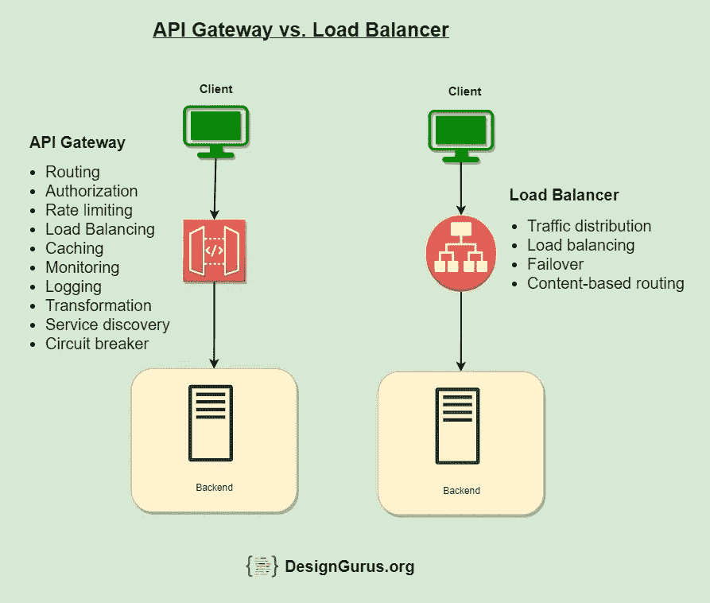
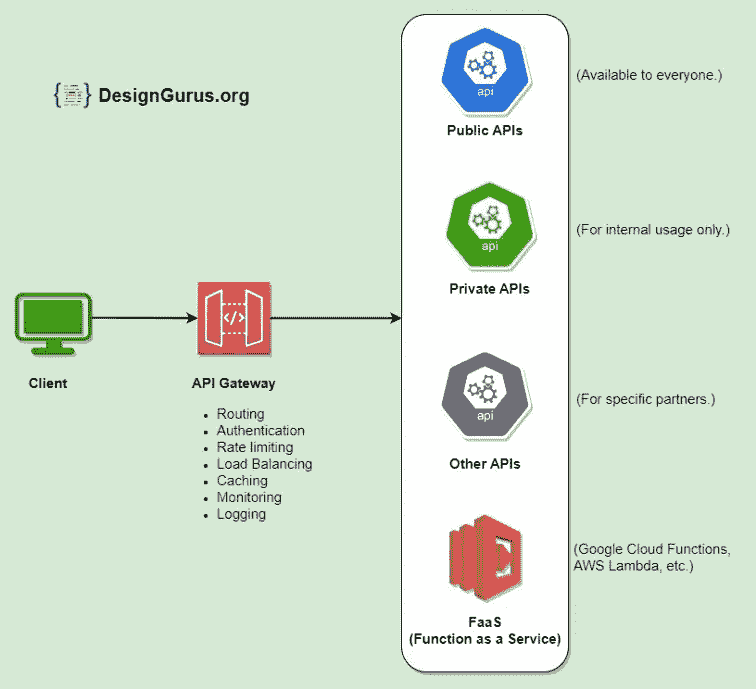
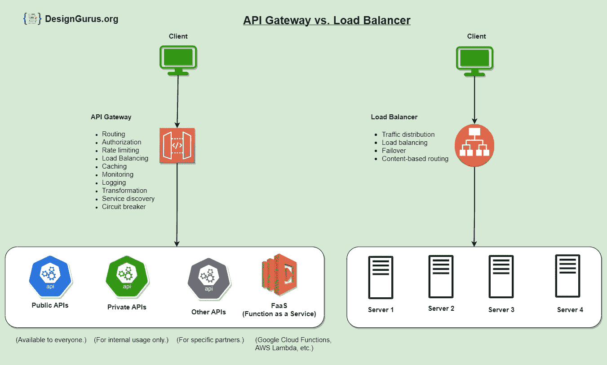

# 系统设计面试基础:API 网关和负载平衡器之间的区别

> 原文：<https://levelup.gitconnected.com/system-design-interview-basics-difference-between-api-gateway-and-load-balancer-60260b568121>

通常，我们会遇到软件架构组件，它们是每个[系统设计](/system-design-interview-survival-guide-2023-preparation-strategies-and-practical-tips-ba9314e6b9e3)的一部分，并且感觉好像我们对它们没有太多的理解。 **API 网关**和**负载均衡器**是我想到的几个例子。

大多数人没有使用负载平衡器或 API 网关的经验；这解释了为什么我们谈论它们会感到不舒服，尤其是在系统设计面试中。

在这篇文章中，让我解释一下这两个组件的基本知识以及它们的使用方法。

先说相关术语的定义。

# 什么是微服务？

微服务是一种软件架构设计模式，其中大型应用程序被构建为一套模块化组件或服务。每个微服务都是一个小的、独立的功能单元，使用定义明确的接口与其他微服务通信，通常通过网络。例如，在建立 Instagram 这样的服务时，我们可以有单独的微服务来存储照片、生成新闻订阅或通知用户。

# 什么是 API 网关？

API 网关是一个服务器，充当一组微服务的单一入口点。它接收客户机请求，将它们转发给适当的微服务，然后将服务器的响应返回给客户机。

API 网关

# 什么是负载平衡器？

负载平衡器是一种网络设备，它在多个后端服务器或服务之间分配传入的网络流量，以提高系统的性能和可用性。负载平衡器通常位于客户端和服务器之间，使用各种算法在可用的服务器之间分发传入的请求，以最大化性能并确保没有单个服务器不堪重负。这可以提高系统的整体可靠性和响应能力，因为这样可以更均匀地分配工作量，使系统能够处理更多的请求。

# API 网关和负载平衡器之间的区别？

API 网关专注于对适当微服务的𝗿𝗼𝘂𝘁𝗶𝗻𝗴请求，而负载平衡器则专注于跨一组后端服务器均匀分布的𝗱𝗶𝘀𝘁𝗿𝗶𝗯𝘂𝘁𝗶𝗻𝗴请求。

API 网关和负载平衡器都是可以在计算机网络中用来管理传入请求和增强系统性能的基础设施类型。然而，它们以不同的方式工作，服务于不同的目的。

API 网关与负载平衡器

API 网关:API 网关是一种中间件，位于客户端和一组微服务之间。它的主要目的是将来自客户端的请求路由到适当的微服务，然后将微服务的响应返回给客户端。API 网关还可以执行其他任务，如授权、速率限制和缓存。

**负载平衡器:**另一方面，负载平衡器是一种基础设施，它将传入的请求均匀地分布在一组后端服务器上，以提高系统的性能和可用性。负载平衡器通常用于处理发送到单个已知 IP 地址的请求，然后根据服务器性能和可用性等因素将这些请求路由到许多可能的后端服务器之一。

**两者的另一个区别**是它们通常处理的请求类型。API 网关通常用于处理对 API 的请求，API 是基于 web 的接口，允许应用程序通过 internet 相互交互。这些请求通常有一个特定的 URL，用于标识客户端试图访问的 API，API 网关基于该 URL 将请求路由到适当的微服务。另一方面，负载平衡器通常用于处理发送到单个已知 IP 地址的请求，然后根据服务器性能和可用性等因素将它们路由到许多可能的后端服务器之一。

# API 网关的使用

API 网关在微服务架构中有多种用途，包括:

1.  **路由:**API 网关接收来自客户端的请求，并将它们路由到适当的微服务。这使得客户端能够通过单个入口点访问各种微服务，从而简化整体系统设计。
2.  **速率限制:**您可以使用 API 网关对客户端访问微服务进行速率限制。这有助于防止拒绝服务攻击和其他类型的恶意行为。
3.  **缓存:**API 网关可以缓存来自微服务的响应，减少需要转发给微服务的请求数量，提高系统整体性能。
4.  **认证和授权:**API 网关可用于认证客户端，并对微服务实施访问控制策略。这有助于确保只有授权的客户端才能访问微服务，并有助于防止未经授权的访问。
5.  **负载均衡:**API gateway 可以将传入的请求分布在一个微服务的多个实例中，使系统能够处理更多的请求，提高整体性能和可伸缩性。
6.  **监控:**API 网关可以收集关于请求和响应的指标和其他数据，提供对微服务的性能和行为的有价值的见解。这有助于识别和诊断问题，并提高系统的整体可靠性和弹性。
7.  **转换**:API 网关可以将从微服务接收到的数据转换成更方便客户端使用的格式。这可能包括在不同数据格式(如 XML 和 JSON)之间转换，或者将来自多个微服务的数据聚合到单个响应中。
8.  **请求和响应验证:**API 网关可用于验证来自微服务的请求和响应，以确保它们符合预期的格式和结构。这有助于防止错误，并确保微服务正常运行。
9.  **断路器:**API 网关可用于实现断路器模式，这有助于防止单个微服务故障导致整个系统瘫痪。断路器可以监控微服务的健康状况，并在必要时自动故障转移到备用服务。
10.  **服务发现:**API 网关可用于发现可用的微服务及其位置，使客户端能够在不知道其具体地址的情况下访问它们。这可以更容易地添加新的微服务或对现有的微服务进行更改，而不会影响客户端。

# 使用 API 网关的优势

以下是使用 API Gateway 的一些优势:

1.  **提高性能:**通过处理路由和负载平衡等任务，API 网关可以提高系统的整体性能，使其能够处理更多的请求并更快地响应客户端。
2.  **简化的系统设计:**通过为客户端提供单一入口点，API 网关简化了整体系统设计，使客户端更容易访问各种微服务。
3.  **增强的安全性:**API 网关可用于实施认证和访问控制策略，有助于防止未经授权的访问并提高系统的安全性。
4.  **改进的可伸缩性:**API 网关可以在微服务的多个实例之间分配传入的请求，使系统更容易伸缩并处理更多的请求。
5.  **更好的监控和可见性:**API 网关可以收集关于请求和响应的指标和其他数据，从而提供对系统性能和行为的有价值的洞察。这有助于识别和诊断问题，并提高系统的整体可靠性和弹性。

# 使用 API 网关的缺点

使用 API 网关也有一些潜在的缺点，包括:

1.  **增加的复杂性:**API 网关的使用会给系统增加额外的复杂性，这使得管理和维护更加困难。
2.  **性能开销:**API 网关会引入一些性能开销，因为它向客户端必须经过的请求-响应路径添加了一个额外的层。
3.  **单点故障:**如果设计和实现不当，API 网关可能会成为单点故障。这可能会影响系统的整体可靠性和可用性。

# 结论

总之，API 网关提供了客户端和微服务之间的接口，而负载平衡器将传入的请求分布在多个服务器或服务之间，以提高性能和可用性。虽然它们的用途相似，但它们不可互换，通常在微服务架构中一起使用。它们都使微服务能够专注于各自的任务，并提高系统的整体性能、可伸缩性和可靠性。

➡在“ [**探索系统设计面试**](https://www.designgurus.io/course/grokking-the-system-design-interview)**”****[**探索高级系统设计面试**](https://www.designgurus.io/course/grokking-the-advanced-system-design-interview) 中了解更多关于系统设计面试的信息**

**➡在 Linkedin 上关注我，了解系统设计和编码面试的技巧。**

** [## 系统设计面试生存指南(2023):准备策略和实用技巧

### 2023 年系统设计面试剧本。

levelup.gitconnected.com](/system-design-interview-survival-guide-2023-preparation-strategies-and-practical-tips-ba9314e6b9e3)  [## 用这 20 个必须知道的算法模式在 2023 年成为一名编码面试专家！

### 大师级编码面试:探索编码面试模式如何帮助你聪明地准备。

levelup.gitconnected.com](/become-a-coding-interview-pro-in-2023-with-these-20-must-know-algorithmic-patterns-715643e493f5)**