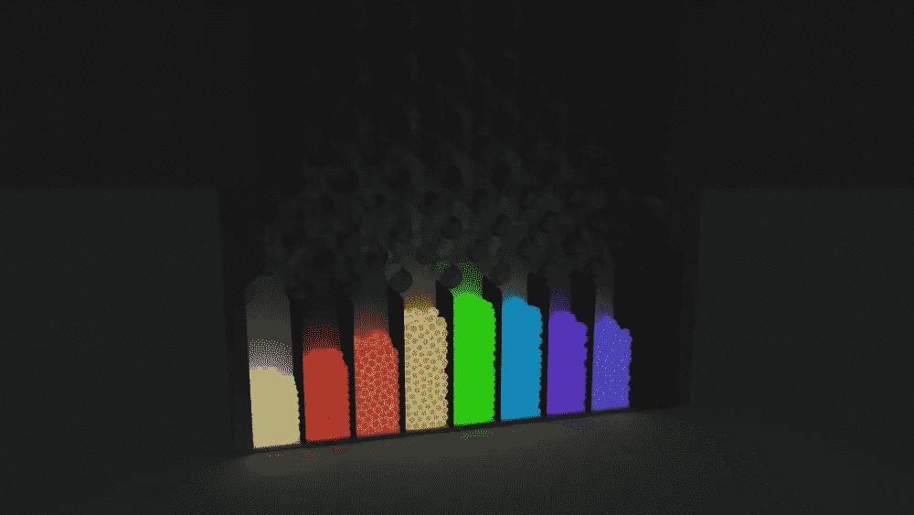
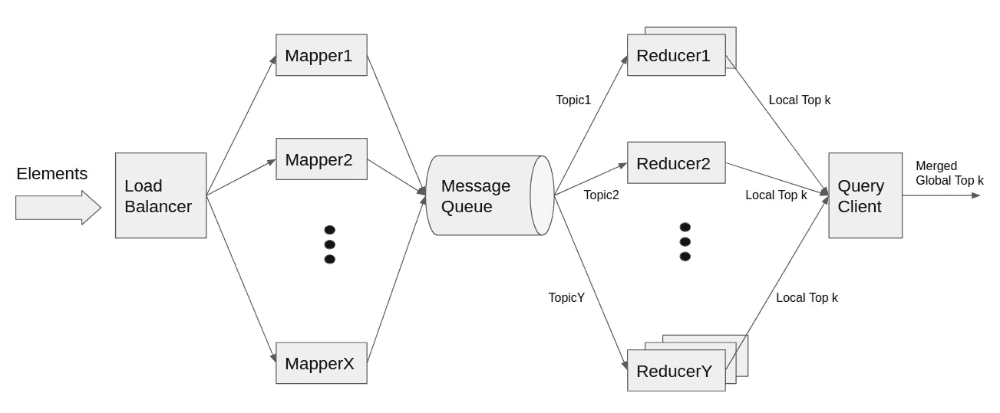

# 系统设计访谈:流中分布的前 K 个频繁元素

> 原文：<https://levelup.gitconnected.com/system-design-interview-distributed-top-k-frequent-elements-in-stream-2e92d63d777e>



塞缪尔·辛顿关于 cosmiccoding.com.au 的照片

> **背景**

前 k 个频繁元素问题是一个经典的编码面试问题。然而，通过系统设计面试的镜头来看，它突然有了一种特殊的吸引力。但是在我们开始通常的系统设计面试讨论之前，让我们快速地谈论一下它是如何在编码面试上下文中解决的，这将有助于后面的设计讨论。

在编码面试的情况下，问题通常是给定一组元素，找出 k 个出现频率最高的元素。我们首先遍历数组，计算每个元素的频率，创建一个分布图。

```
distribution := map<element, int>{}
for element in elements { distribution[element] += 1}
```

然后，我们遍历分布图中的键值对，并基于频率维护一个大小为`k`的最小堆。

```
minHeap := NewMinHeap()
for element, frequency in distribution {
  // O(logk) complexity to rearrange the min-heap by frequency
  minHeap.insertAndRearrange({element, frequency}
  if minHeap.size() > k { minHeap.popMin() }
}
```

最小堆中剩下的是前 k 个频繁元素。空间复杂度为`O(n)`，时间复杂度为`O(n) + O(nlogk)`。也有其他方法来解决这个问题。不过我就不进一步跑题了，还是潜心系统设计讨论吧。

> **透过系统设计的镜头**

有两个修改使得前 k 个频繁元素成为一个有趣的系统设计问题:

1.  元素的基数超出了单台机器的能力，这就需要一个分布式系统解决方案。
2.  总元素不再是静态的。有一股源源不断的元素高速涌入。这为问题增加了实时和不间断的处理维度。

如果只有第一次修改，MapReduce 就是答案。就像经典字数统计问题一样，我们在一组并行运行的映射器函数中处理输入，每个函数负责一大块输入。映射器为它们处理的每个元素发出一个`{element, 1}`条目。输出被混洗并发送到一组减速器。相同的元素出现在同一个 reducer 中，这个 reducer 聚集了该元素的总计数。每个缩减器仍然处理多个不同的元素，但是基数足够小，可以驻留在一台机器上。MapReduce 非常有名，有很多网上资料。你可以很容易地找到它。

另一方面，如果只有第二次修改，我们可以为每个不同的元素保留一个计数器，并在嗅探传入流时递增计数。如果我们关心持久性，我们可以以期望的节奏将结果刷新到磁盘。如果我们关心可用性，我们可以复制处理组件。在某种程度上，它只是一个美化的减速器。

然而，当我们结合这两种修改时，复杂性就出现了。它聚焦于我们的标题:流中分布的前 k 个频繁元素。

> **解决方案**

我们可以将我们描述的两种模式结合起来，以响应这两种修改:我们有一组永远在线的映射器，它们接受传入的元素，并将它们分布在一组永远在线的减少器中，减少器汇总计数。这在某种意义上就是热气腾腾的 MapReduce。

生产部署需要注意几个细节，这是本系统设计的核心:

首先，我们需要一种方法将元素传递给制图者。发送元素的客户机不想跟踪它们需要连接的映射器实例。因此，我们将在映射器前面放置一个负载平衡器，以提供单一入口点。负载平衡器中有一些细微的差别，我在另一篇系统设计访谈博客文章[1]中对此进行了详细介绍。如果这篇博文只有一个启示，那就是你最好知道在你的系统设计面试中使用负载平衡器的最低要求。

其次，根据同样的推理，映射器也不想跟踪单个的 reducer 实例。但是我们并没有在这里使用负载均衡器，而是想要一个更能感知上下文的东西。我们希望给每个 reducer 分配更少数量的不同元素，这样它们就不需要维护数百万不同元素的计数器。这就是消息队列(如 Kafka)的用武之地。我们可以划分元素空间，让一个消息队列主题代表一个分区。一个或多个 reducers 将订阅一个主题，以聚合落入相应元素空间的元素的计数。这种设计模式不仅解耦了映射器和还原器，还分割了元素空间，这是我们正在寻找的属性。

现在，如果我们需要根据工作量扩大或缩小主题，该怎么办呢？那很简单。我们只是添加或删除主题。但是在这样做的时候，我们希望保持 reducers 的元素空间分配基本不变。因为否则的话，赋值操作会破坏我们最初的分片目标，即每个 reducer 拥有更少的不同元素。为了实现这一点，我们将使用环哈希(有时称为一致哈希)[2]。简而言之，它分配元素的方式减少了添加或删除受让人时的麻烦。同样，这是一个在许多其他系统设计材料中被充分讨论的概念。你了解我。我不喜欢重复别人的工作。所以我必须向你推荐全能的互联网。

最后，我们必须从 reducers 中检索前 k 个频繁元素。这也是一个研究比较充分的问题:来自分布式服务器的 top k。本质上，每个缩减器将报告其本地前 k 个。由于元素空间划分，前 k 个缩减器报告应该与其他缩减器大部分不同。但是由于重新调整，可能会有重叠。查询客户端或主节点聚集来自每个缩减器的报告，并在最终的全局前 k 个频繁元素上得出结论。有关端到端的图示，请参见图 1。



图一

> **Twist:时间窗口中前 K 个频繁元素**

一个好的系统设计面试问题，坦率地说，一个好的系统设计面试对话不会没有转折就结束。事实上，如果你在一次系统设计面试中没有到达关键点，很可能意味着你解决问题的速度不够快。

到目前为止，我们一直在跟踪整个历史中出现频率最高的 k 个元素。这可能不是很有用，因为我们经常需要回答的问题是，在过去的一小时、一天、一周、一月和一年中，k 个最常见的元素是什么。事实上，一些元素在三年前爆发了，因此今天仍然赢得了前 k 名，这可能与我们的用例无关。

这要求我们对元素的聚合计数进行版本化。我们需要对去年、上个月、上周、昨天和最后一个小时的计数进行快照，而不是只存储当前状态的计数。这样，当我们需要计算过去的时间时，比如说过去的一个小时，我们可以通过`countCurrent — countUpToLastHour`得到。我们并不总是需要保持每小时的粒度。随着数据变老，我们可以对它们进行降采样。例如，一个月后，我们只在 00:00 保持每小时的计数，这有效地缩小到每天的粒度。

这里的架构类似于一个时间序列数据库，我在另一篇关于服务器监控的系统设计博文中提到过[3]。

> **更多转折**

根据用例的不同，我们可能会为了简单而做出一些妥协。例如，如果我们对近似值没问题，我们可以从最后一个小时的数据中取样，希望它能代表历史。如果我们不需要知道哪些确切的元素是最频繁的，我们可以量化这些元素，只保留一个压缩的直方图。也许不是所有的前 k 个频率，我们只想查询给定元素的频率，略有误差也没问题。在这种情况下，我们可以使用像 count-min sketch [4]这样的技术，它本质上是一个计数布隆过滤器，以减少资源消耗。这是一个活跃的研究领域。许多人已经从不同的角度探索了这种权衡。这里就不装专家了。

> **关闭**

我认为对于一个系统设计面试来说，这是很多的内容。我已经写了其他系统设计面试的博客文章，你可以在我的故事中随意查看[5]。我把它作为一种爱好，希望有时间的时候能写更多。

> **参考文献**

[1][https://medium . com/swlh/system-design-interview-the-bare-minimum-you-need-know-on-load-balancers-fc 0 CBE 1 AC 276](https://medium.com/swlh/system-design-interview-the-bare-minimum-you-need-to-know-about-load-balancers-fc0cbe1ac276)

[2][https://en.wikipedia.org/wiki/Consistent_hashing](https://en.wikipedia.org/wiki/Consistent_hashing)

[3][https://medium . com/better-programming/a-tricky-system-design-interview-question-explain-server-monitoring-C5 be 0 ce 54 a 30](https://medium.com/better-programming/a-tricky-system-design-interview-question-explain-server-monitoring-c5be0ce54a30)

[4]https://en.wikipedia.org/wiki/Count%E2%80%93min_sketch

[5][https://github.com/eileen-code4fun/SystemDesignInterviews](https://github.com/eileen-code4fun/SystemDesignInterviews)